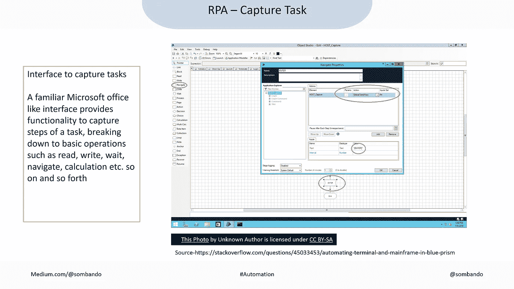

# 介绍机器人过程自动化的机器人

> 原文：<https://medium.com/hackernoon/meet-the-robots-of-robotic-process-automation-37f5864beaae>

## 了解 RPA 市场为何同比增长 100%

[This Photo](http://arduino.vn/tags/gioi-thieu-ve-nghanh-ky-thuat-dieu-khien-tu-dong) by Unknown Author is licensed under [CC BY-SA](https://creativecommons.org/licenses/by-sa/3.0/)

在机器人过程自动化(RPA)市场上，很多事情正在快速发生。就在上个月，三家领先的 RPA 公司[在几周内相继筹集了总计近 1，000 万美元的 1B 投资。在最近的](https://techcrunch.com/2018/11/15/rpa-startup-automation-anywhere-nabs-300m-from-softbank-at-a-2-6b-valuation/)[报告](https://www2.everestgrp.com/Files/previews/Everest%20Group%20-%20Robotic%20Process%20Automation%20(RPA)%20Annual%20Report%202018%20-%20CA.pdf)中，珠穆朗玛峰集团预测 2019 年 RPA 市场将翻一番。

“机器人过程自动化”这个词可能会让我们想起某种未知的机器人。我们周围的一切都变得越来越自动化，甚至自动驾驶汽车已经上路 Waymo One 刚刚[在凤凰城推出](https://techcrunch.com/2018/12/05/waymo-launches-self-driving-car-service-waymo-one/)商业服务。

> 自动驾驶汽车是机器人吗？对，就是，自动吸尘器也是机器人。

在过去的 50 多年里，数字技术已经越来越多地渗透到我们的日常生活中，软件已经被编程为我们做越来越多的事情。从根本上来说，RPA 旨在通过更好、更智能的软件实现自动化，因此是一种进步。

> 不——没有实体机器人到处跑。

这只是另一个软件，它将帮助我们在办公室里自动化许多日常工作。

## RPA 机器人就像做更多事情的 excel“宏”

RPA 可能会让您想起 excel 宏—我们大多数人在生活中的某个时候都使用过 excel，而“宏”是最有用的技巧—它允许记录重复的步骤，然后自动执行它们。

RPA 或这种新的“宏”不是在 excel 应用程序中操作，而是可以用来记录计算机上几乎所有的用户操作或步骤——几乎每一次鼠标点击、脚本、键入的文字等。然后，每次点击“运行”来自动执行任务。旨在主要用于包含可预测、基于规则和重复步骤的任务。

[This Photo](http://chasexppkyciwiv.wikidot.com/blog:_start/date/2015.11) by Unknown Author is licensed under [CC BY-SA](https://creativecommons.org/licenses/by-sa/3.0/)

举个简单的例子，让我们想想我们如何在网上订购披萨——每次都遵循几乎相同的步骤，包括——

*   打开网站或应用程序
*   选择多少比萨饼，什么类型
*   选择口味、配料等。
*   点击订购

我们可以在 RPA 平台中将这些步骤记录到“宏”中，或者称之为“机器人”或简称为“机器人”然后，下次我们点披萨的时候，我们需要做的就是“运行”这个机器人。

同样，我们可以在电脑上记录几乎每一个基于规则的重复性任务——记录到“机器人”中。然后，我们只需要执行“机器人”来替我们完成任务，而不是自己执行任务。

## 这是一个 Roomba——用于办公任务

它类似于真空机器人。我们仍然是控制它应该做什么和什么时候做的主人。机器人为我们工作，这样我们就可以坐下来放松或者做些别的事情。

因此，把我们——或者在这种情况下我们被称为“人类”——从重复的任务中解放出来，腾出时间来做更有价值的工作或事情，或者为社会做贡献。

> 这就是 RPA！好吧，那有什么大不了的？

## 它是一个 BPO——包含在软件中

从组织的角度来看，这可以带来巨大的好处。

从 20 世纪 90 年代开始，组织就开始寻求通过以下方式来减轻基于规则的重复性任务的负担

*   外包—被称为业务流程外包(或 BPO)，或
*   转移到低成本地区——称为离岸外包，或
*   与其他大型企业共享—称为共享服务

旨在降低执行此类重复性任务的成本，同时让员工能够专注于更有价值的任务。

> RPA 的另一个目标是使用软件“机器人”自动完成此类任务。

RPA 提出了一种软件替代方案，通过软件机器人实现业务流程自动化来替代外包和离岸外包行业。任何组织开展的大部分工作(包括后台职能，可以捕获到逻辑流程中)都可以使用这些软件机器人实现自动化。

让我们围绕 RPA 平台快速旋转一下，看看构建这些机器人有多简单。

# RPA 的软件机器人

根据提供商的不同，功能会有一些变化，但是，平台主要关注三个阶段来实现自动化——捕获任务、合并到工作流或“机器人”中，然后协调/安排何时执行。

## 1.捕获任务

我们在电脑上执行的大多数任务都可以通过界面捕获，包括打开电子邮件、浏览器或 ERP 系统等应用程序，键入人名、账号或网站，在线搜索公司网页等等。

任务的各个方面可以通过在用户友好界面中提供的附加功能层来明确地和上下文地定义。

[capturetask](https://flickr.com/photos/166102838@N03/31279464407) flickr photo by [sombando](https://flickr.com/people/166102838@N03) shared under a [Creative Commons (BY-SA) license](https://creativecommons.org/licenses/by-sa/2.0/)

## 2.将任务组合成工作流，即“机器人”

每一个动作都被安排在一个连续的工作流程中，定义它的每一个方面，从而模仿人类用户的行为。例如，工作流可能需要等待特定操作完成，或获取单个数据，或返回起点或等待点，直到其他事情完成，等等。

我们现在可以看到为什么早期采用主要是推荐用于可预测的基于规则的任务——这不涉及复杂的决策制定。

[taskworkflow](https://flickr.com/photos/166102838@N03/45494586134) flickr photo by [sombando](https://flickr.com/people/166102838@N03) shared under a [Creative Commons (BY-SA) license](https://creativecommons.org/licenses/by-sa/2.0/)

## 3.协调“机器人”

最后，一旦创建、测试并运行了机器人，就可以使用 orchestrator 来安排执行。根据确定的时间表，计划的执行可以随时、24X7 进行。

[orchestration](https://flickr.com/photos/166102838@N03/45305555295) flickr photo by [sombando](https://flickr.com/people/166102838@N03) shared under a [Creative Commons (BY-SA) license](https://creativecommons.org/licenses/by-sa/2.0/)

根据自动化程度的不同，可能有几种替代实现，例如

*   **RDA** —机器人桌面自动化，如其所称，是较低级别的自动化或较小的流程块，可能需要用户协助机器人在执行期间动态地提供特定的决策
*   **RPA** —机器人流程自动化，我们之前看到的自动化方法，大部分是在人工“无人值守”的情况下实施的
*   **数字化 RPA** —自动化程度更高，RPA 与自助服务功能相结合，或者与用户/客户端进行通信，例如通过 IVR、手机或网络进行通信，以实现更高的流程自主性

实施 RPA 后，可以使用更高级别的分析来进一步利用定期捕获的数据。

# 有什么好处？

对组织来说，有短期和长期的好处。令人痛苦、残酷而又没有抓住要点的是，这类机器人的表现优于人类。其价值在于越来越多的人可以很容易地设计、使用这些机器人，并将其集成到我们工作场所的日常任务中，以实现利益。我们的目标是让自己更有效率，腾出时间去做更有价值的事情——就像真空机器人一样。

## 结构数据

让我们考虑一下汽车和自动驾驶汽车——自动驾驶汽车运行的每一秒钟都会捕获大量数据。这是巨大的。通过分析这些数据，从长远来看，驾驶可以变得更加安全和高效。

同样，对于一个组织来说，来自各种日常流程的大量数据、逻辑和算法仍然被孤立和锁定在非结构化数据环境中。非常类似于汽车司机的技能——我们认为这些是经验丰富的员工的专业技能和特定任务的知识。现在，随着这些任务使用机器人来执行，结构化数据可以被收集并用于学习和受益——从长远来看，使用更高级别的分析，如机器学习或人工智能。

## 效率

一旦创建，机器人可以在很短的时间内执行任务。此外，机器人可以全天候运行，没有休息，假期或停机时间。

## 质量和安全

机器人会按照最初的设计和意图继续工作。他们永远不会犯错误或以某种方式腐败，或破坏或伤害他们所在的系统。

## 可量测性

机器人是一个软件，因此具有无限的可扩展性——它可以被复制很多次，可以被使用很多次，甚至可以同时使用。

## 员工满意度和创新

随着日常任务的自动化，员工可以专注于更有成就感和挑战性的任务，为组织增加更多价值。

## 不利方面？

失业，这也是之前其他几项承诺自动化和效率提升的技术所担心的。

**成本**当然是另一个不利因素。RPA 本身就是一个解决方案。然而，它也是智能自动化之旅的起点，因此是一个战略性的长期决策。

最后，**缺乏在 RPA 开发方面受过培训的人力资源**。每项新技术都是如此。尽管所有领先的供应商都提供培训，但情况正在好转。

# 领先的提供商

Forrester Wave Q2 2018 年[报告](https://www.uipath.com/company/rpa-analyst-reports/forrester-wave-2018-robotic-process-automation)排名的三大领先供应商是 UiPath、Automation Anywhere 和 BluePrism。几乎所有领先的咨询公司都在推荐这些和其他 RPA 平台，并与其客户合作实施它们。

source, [uipath.com](https://www.uipath.com/company/rpa-analyst-reports/forrester-wave-2018-robotic-process-automation)

快速浏览领先供应商的起源。

## UiPath

UiPath 由丹尼尔·迪内斯和马里乌斯·蒂尔卡于 2005 年创立。两位创始人都来自罗马尼亚，公司从罗马尼亚的布加勒斯特起步，后来在伦敦、纽约、孟加拉、新加坡和东京开设了办事处。2017 年，该公司报告称有 590 名员工，并将总部迁至纽约，以更接近其国际客户群，该客户群从 2016 年的 100 名增加到 700 名。

## 蓝色棱镜

[蓝棱镜](https://en.wikipedia.org/wiki/Blue_Prism)由 Alastair Bathgate 和 David MossIt 共同创立，总部位于英国，在美国和澳大利亚设有地区办事处。该公司由一群过程自动化专家于 2001 年在英国成立，被认为是 RPA 的先驱之一，最初的目标是为后台特定任务提供自动化。

## 自动化无处不在

最初由创始人 Ankur Kothari、Mihir Shukla、Neeti Mehta 和 Rushabh Parmani 在加利福尼亚州圣何塞创建，名为 Tethys Solutions。该公司于 2010 年更名为 [Automation Anywhere](https://en.wikipedia.org/wiki/Automation_Anywhere) ，在十多个国家开展业务，主要关注特定行业的领先公司。

# 摘要

RPA 机器人是类似“宏”的软件，它在计算机上的碎片化应用程序中工作，通过模仿人类动作来提供自动化。旨在自动化重复的基于规则的工作负载，并将组织置于与机器学习和人工智能集成的长期自动化之旅。

人们仍然担心机器人会接管工作；类似的担忧在之前的自动化浪潮中也有过。

伦敦经济学院教授 Leslie Willcocks 在关于“机器人和工作的未来”的演讲中分享了

> “135 年来，我们一直试图将人类转变为机器人……但现在我们有了可以扭转这一错误的技术(RPA)……自动化和人类是相辅相成的，它们不会相互取代。”

感谢阅读。你觉得怎么样？你对这项技术有什么看法？您的组织是否正在使用 RPA 或计划在未来使用它？

请随时分享您的观点，或者询问您是否需要任何澄清或更多信息。您可以通过[邮箱](mailto:som.bando@outlook.com)、 [LinkedIn](https://www.linkedin.com/in/sombando/) 或 [Twitter](https://twitter.com/sombando) 联系或关注我。

**感谢阅读。如果你喜欢这篇文章，请随意点赞或分享，这样其他人也能找到它。**