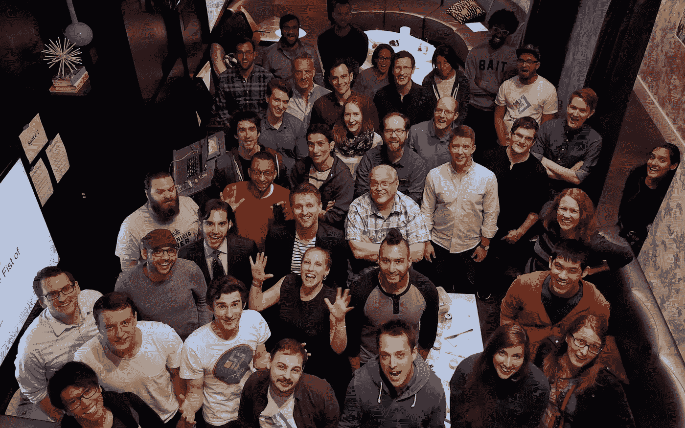
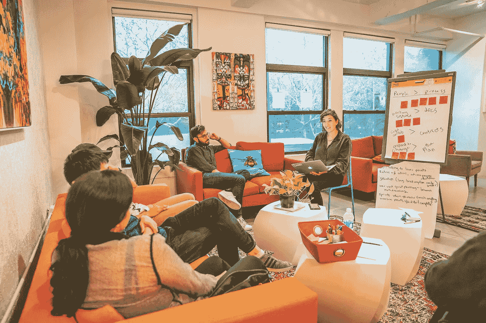
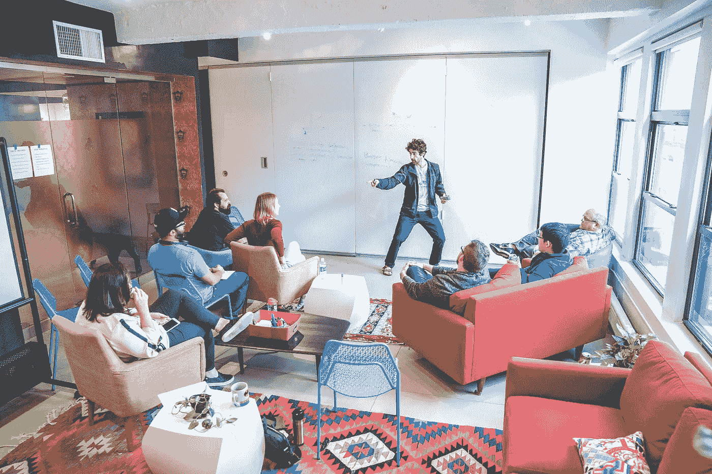
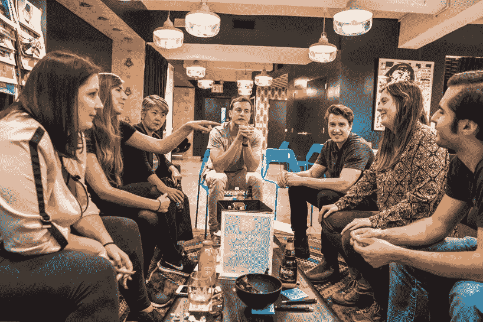
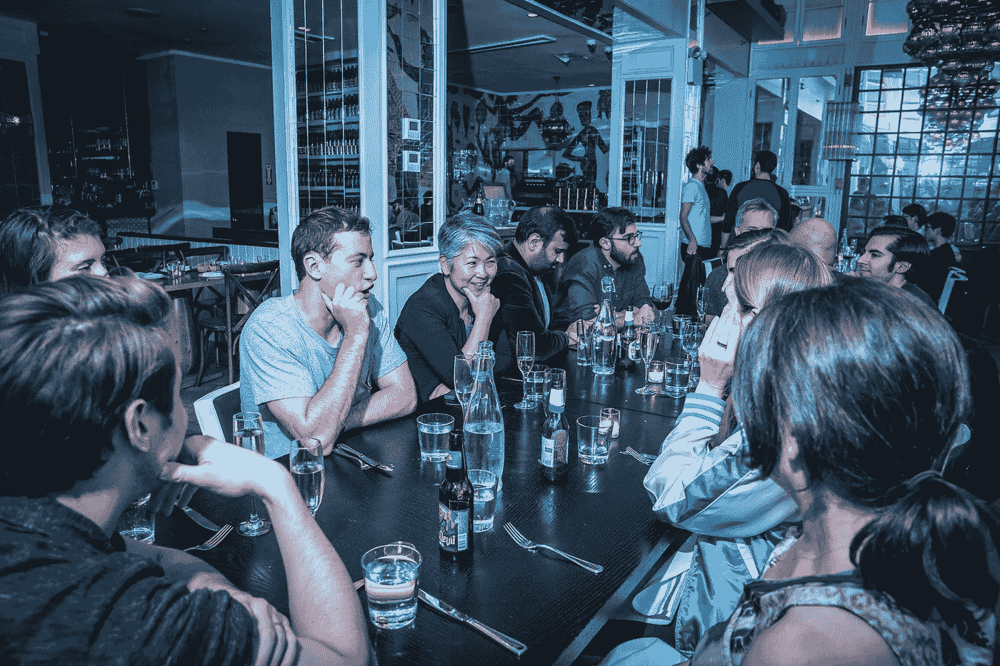
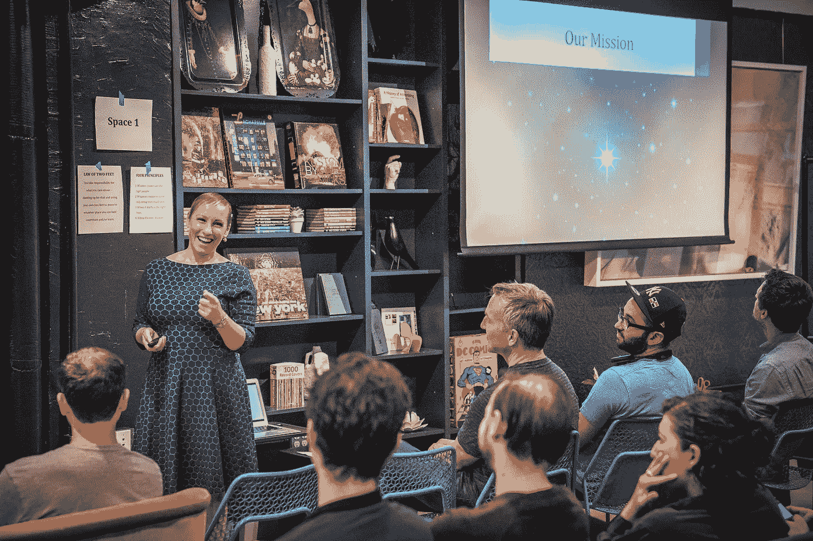
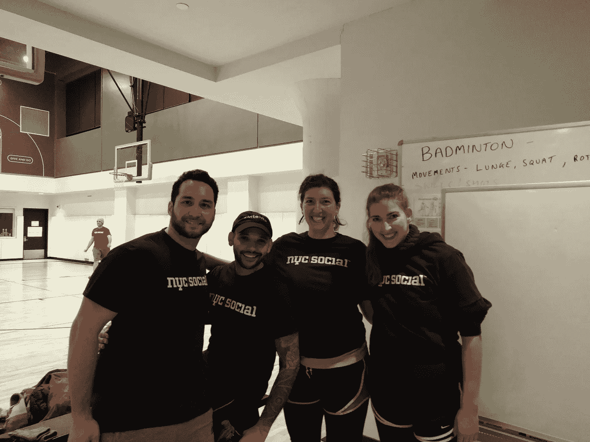
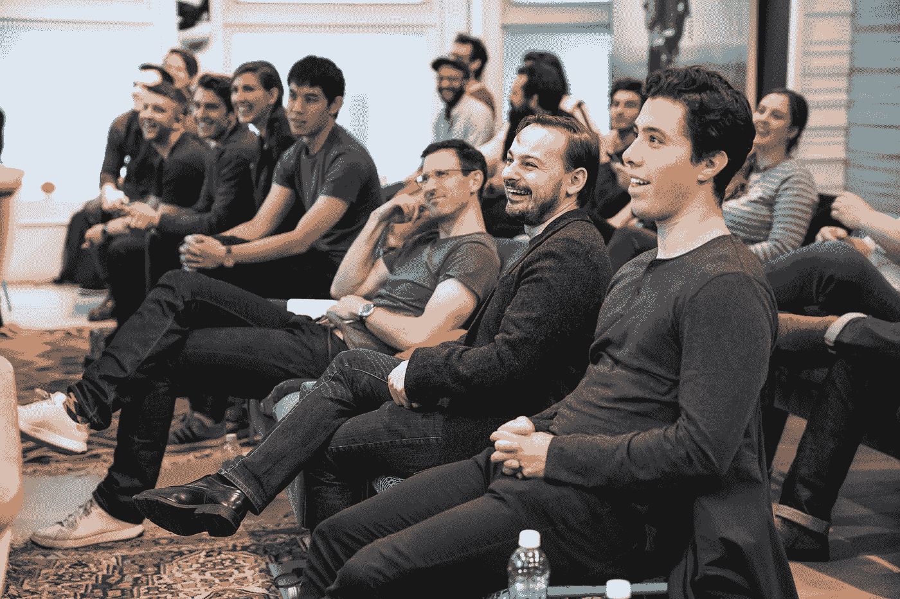
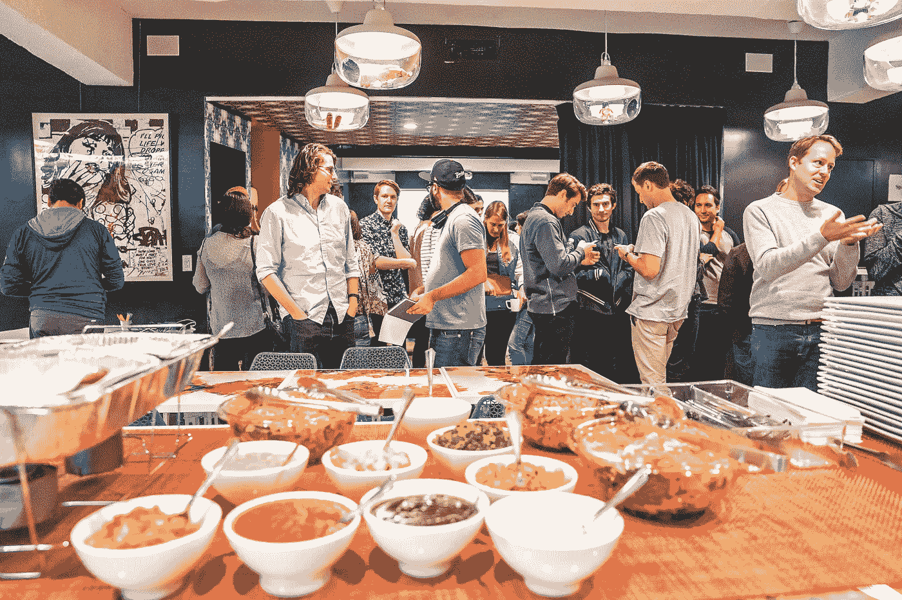

# 会议糟透了。以下是我们如何用不同的方式来应对这些挑战。

> 原文：<https://medium.com/hackernoon/meetings-suck-heres-how-we-do-them-differently-51b0639ee008>

加入 [Stride](https://www.stridenyc.com/careers) 之前，我讨厌开会。会议枯燥、耗时，而且毫无用处。不用说，当我在 Stride 的第一天是公司的季度全天会议时，我感到有点焦虑。然而，那一天改变了我对会议的整体看法。

以下是 Stride 的季度公司会议与众不同的原因:

# 1.学习新事物的机会

我期待着我们的季度会议，因为我总是学到一些新的东西。这一天的开始，我们的领导团队将分享公司的最新动态和政策更新，这通常会非常令人兴奋，因为公司中的每个人都可以在其中发挥巨大的影响力。

在过去的几次会议中，我们还邀请了一位来自我们的客户的客座演讲人，他们将分享与 Striders 合作的独特经验。这有助于深入了解客户对我们的看法，并为我们提供提高效率的建议。

最近还增加了“问我什么”环节，最后两位是首席执行官和总裁，他们会回答各种各样的问题，从严肃到可笑都有。这是在更私人的层面了解我们领导团队的一个好方法。

# **2 .参与式讨论**

这些会议的关键组成部分之一是开放空间会议。这些会议让我们有机会参与热门话题的讨论。首先，提出主题，然后进行投票，并留出 45 分钟的时间。每个时段都提供了一个机会，让您可以参加 5 场会议中的一场，讨论每个 Strider 最感兴趣的主题。每个开放空间讨论都以行动项目结束，以确保时间得到充分利用和采取行动。这些开放空间会议是 Stride 发展到今天的一个关键原因。它们让我们有机会充实自己，向公司传达我们的想法。它们确保每个人都有自己的声音，每个人都能听到自己的声音。

# **3 .有形结果**

开放空间行动项目将各自获得一个所有者。所有者将负责跟进并根据所产生的想法采取行动。因此，可能会组成多个小组来进一步探讨这些想法，这可能会导致公司的改进，如下所示:

*   去年成立的多元化委员会(Diversity Committee)是 Stride 公司女性开发者数量稳步增长的原因之一。

*   Monthly Socials —备受期待的活动，已成为 Stride 文化的一大特色！我们最近的一些户外活动包括在 MET 寻宝、逃离房间，以及去罗克韦海滩一日游。

*   精益咖啡——每月对一个热门话题进行深入讨论，产生了一些非常酷的东西，比如增加了一个新的 Mid3s 等级！更多关于瘦咖啡[的信息，请点击这里](https://www.stridenyc.com/blog/lean-coffee-at-stride)。

*   排球队——我们的第一支男女混合球队将于 2018 年 1 月开始比赛！

会后，我们每人拿出一个五分的拳头作为对会议的评价，一个手指表示“最浪费时间”，五个手指表示“有史以来最好的会议！”，并讨论如何才能达到 5 分。大约一周后，我们才华横溢的办公室经理(也是这些公司会议的主要组织者)发出了一份会议摘要。摘要对所有组织者、主持人和演示者进行了表彰，包括一个指向所有公开会议视频的共享驱动器的链接，并分发了会议调查。

# **4。结构化会议**

我过去讨厌开会的原因之一是缺乏结构。人们毫无准备地来了，浪费时间赶进度，所以会议会超时。在 Stride，由于我们的组织者和主持人，季度会议组织得非常有序和高效。这也有助于这些会议在专门为专业活动设计的场外空间举行。这些空间配备了一个厨房和一些房间，使它们成为会谈和公开会议讨论的理想场所。

# **5。社交时间**

尽管有这样的结构，我们仍然可以得到乐趣。Stride 季度会议备受期待的一部分是社交方面。咨询的一个不利之处是，我们没有机会像我们希望的那样与我们的同行一起工作。因此，这些全天的公司会议是一个很好的方式，尤其是在提供早餐、午餐和当地餐馆美味的会后晚餐的时候。

把这些会议组织在一起并使它们富有成效确实需要很多努力。一家公司需要投入时间和资源来实现这一切，我很高兴 Stride 做到了。因此，我们能够走到一起，相互学习，产生新的想法，不断改进公司。这听起来不像是你想为之工作的那种公司吗？

> 纽约市的高级、首席或主要开发人员？[跨步正在招人](https://www.stridenyc.com/careers)！想要提升你的技术团队？[看我们怎么做](https://www.stridenyc.com/our-work)！[www.stridenyc.com](http://www.stridenyc.com/)

*作者:*[坦尼娅 ](https://www.linkedin.com/in/tanyanew/)