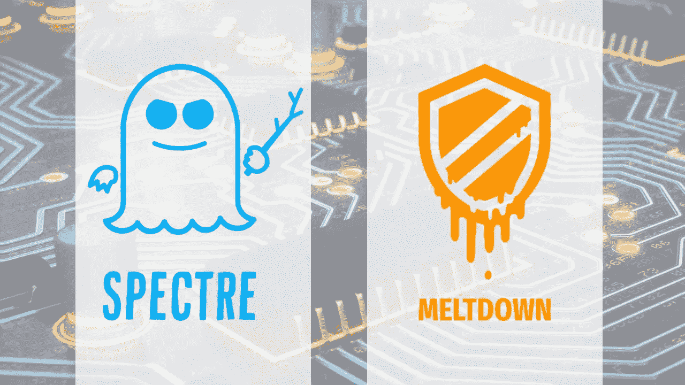

# 融化和幽灵

> 原文：<https://medium.com/hackernoon/meltdown-and-spectre-d983279dfac6>

需要通过操作系统补丁解决的严重 CPU 设计漏洞。救援自动更新！

哎哟。事情变得一团糟。

最初宣布为英特尔[设计](https://hackernoon.com/tagged/design)问题，三个新的类似 CVE——绰号[熔化和幽灵](https://spectreattack.com)——影响所有现代工艺设计。

这个硬件层面的问题必须在操作系统层面得到缓解，并最终作为下一代芯片的设计选择得到解决。

## **有什么问题？**

由来自谷歌零项目的 Jann Horn 和来自不同研究机构的不同研究团队发现的这些问题在技术上令人印象深刻。它们利用了现代处理器中的几个功能，这些功能都与预测下一步需要做什么有关。

他们通过复杂的计时攻击来利用这些特性，从非特权进程访问特权内存。简单地说，这些漏洞使得任何程序都有可能访问敏感的内存位置。

如果在野外被利用，攻击者可以绘制出受保护的内存空间，以发现密码、加密密钥、敏感知识产权等信息。或者——很有可能——你的奶酪通心粉食谱，最新的猫视频，或者你在迷你地铁里的高分。

基本上攻击发生时你的系统正在运行的东西。

这是一个高影响漏洞，您应该解决它。

## **我被黑的可能性有多大？**

没有办法确定这些漏洞被用来攻击特定系统的可能性有多大。

当这样的问题发生时，最合理的解决方法是通过一系列具体的问题。

**1。在野外有已知的攻击吗？**

现在不行。研究人员通过概念验证证明了这些问题，其他团队使用研究信息或类似方法复制了这些结果。

Mozilla 的团队发布了一个特别令人不安的结果,该结果使用这些类型的技术来利用 web 浏览器中的定时机制来访问浏览器本身的内存空间。这非常非常糟糕。

鉴于这些信息，网络罪犯极有可能立即大规模利用这些漏洞。官方的 CVSS 评分仍然悬而未决，并可能会改变给予关注。

因此，虽然目前在野外没有已知的攻击，但安全的假设是攻击迫在眉睫。

**2。如果攻击成功，会有什么影响？**

如果网络罪犯攻击了一个系统，并能够访问正确的内存空间，他们可能会窃取凭证(密码、密钥等)。)到敏感系统。

那很糟糕。

也不保证。Meltdown 和 Spectre 不是软件框架中的漏洞，也不是泄露凭证的应用程序。它类似于[的《心脏出血》](http://heartbleed.com)，但不是大海捞针；你在整个农场找。

**3。这能减轻吗？**

是的。针对所有主要操作系统的补丁即将发布，以缓解该问题。

注意，这不同于典型的循环。通常发生的情况是，存在一个可以通过安全控制(反恶意软件、入侵防御等)来缓解的操作系统错误。)直到操作系统的补丁修复漏洞。

有了 Meltdown 和 Spectre，中的漏洞就是硬件设计了。对现有芯片的更新不能解决这个问题(有时可以)，所以新的芯片设计必须解决这些问题。

与此同时，操作系统必须防止对该漏洞的利用。

安全控制也许能够阻止已知的攻击(一旦它们已经发生)和潜在的攻击，一旦有更多关于在现实世界中使用该技术的信息。

因为这种攻击操纵指令的时间。真的是在滥用“正当”的处事方式。这使得防止使用第三方安全控制变得特别困难。

**4。补丁还是测试？**

一旦修补程序可用，您应该等待并彻底测试修补程序，还是立即修补，接受它可能使您的系统崩溃的风险？

在这种情况下，我的建议是立即打补丁。但是你需要为你自己和你的环境做出决定。

我推荐打补丁的原因很简单。该漏洞具有很高的影响力，它在公众眼中越来越受关注。网络罪犯利用它来窃取您的数据和访问您的系统的机会大大增加了。

一旦有可用的补丁就推出，并为所有系统和设备打开自动更新。

## **披露时间**

这些问题的公开披露比预期的要快。本周早些时候消息走漏，在一些疯狂的猜测之后，全面的披露开始了。

我不知道所有的细节。但是，随着人们迅速获取信息，信息传递的语气背后有更多的紧迫性。

[SwiftOnSecurity](https://twitter.com/SwiftOnSecurity) 说的最好…

发布时，这些补丁将通过严格的测试(苹果[在 12 月](https://www.macrumors.com/2018/01/03/intel-design-flaw-fixed-macos-10-13-2/)悄悄修补了 macOS)。微软已经实现了一个注册表键系统来确保安全工具不会被不必要的破坏。其他厂商和组织将很快发布更多信息。

虽然消息可能看起来是被动的，有点疯狂，但代码不是。

## **接下来的步骤**

像任何这种规模的问题一样，更多的信息将在接下来的几天里不断流出。关键要点很简单:

*   Meltdown 和 Spectre 是“高影响”和“低->中概率”的漏洞，但这种概率正在稳步增加
*   当补丁可用时，修补您的操作系统(自动更新是您的朋友)
*   关注您的操作系统和云服务提供商的通信渠道；更多的信息即将到来

您是如何处理这些漏洞的？这种程度的公众关注会改变你与组织中其他团队的对话吗？

请在下面的评论中或在 Twitter 上告诉我，我是@marknca 。