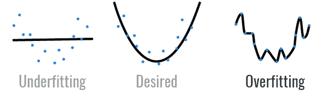
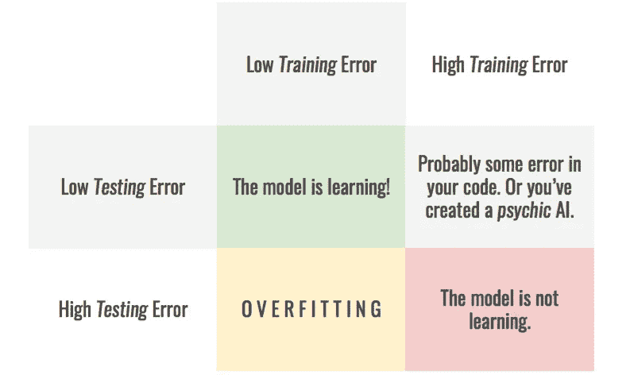
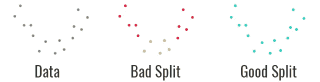
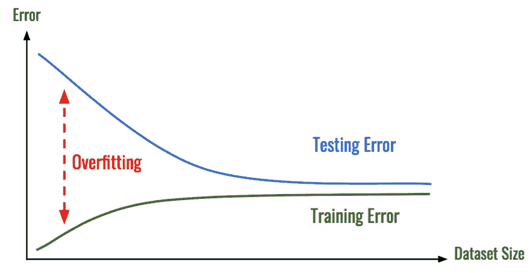
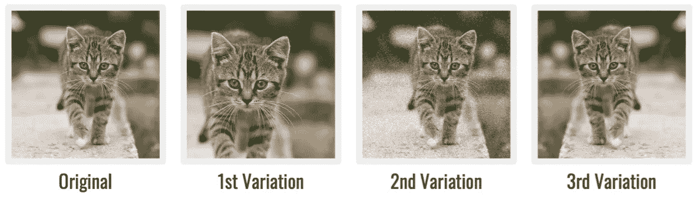
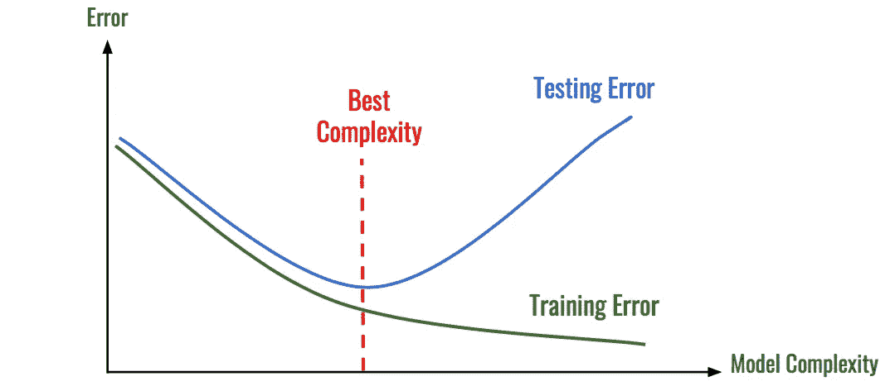
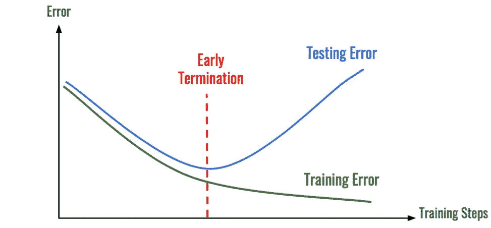
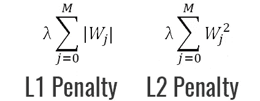
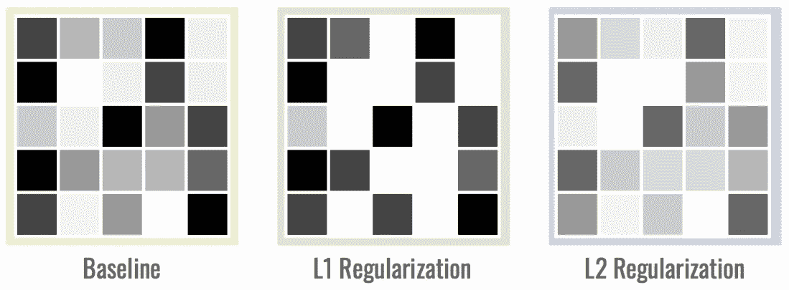
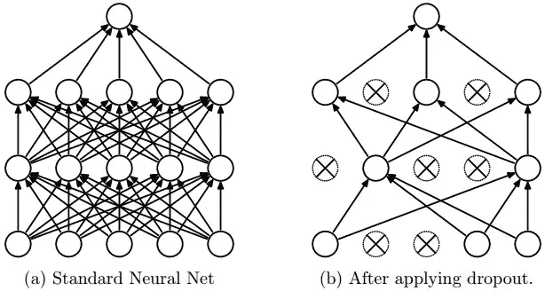

# 死记硬背不是学习！—防止机器学习中过拟合的 6 招。

> 原文：<https://medium.com/hackernoon/memorizing-is-not-learning-6-tricks-to-prevent-overfitting-in-machine-learning-820b091dc42>

# 介绍

**过拟合**可能是*机器学习最令人沮丧的问题。*在本文中，我们将看到**什么** **it** **是**，**如何发现** **it** ，以及最重要的**如何** **防止** **it 发生**。

# 什么是过度拟合？

**过度拟合**这个词指的是对训练数据建模太好的模型。该模型不是学习数据的一般**分布**，而是学习每个数据点的*预期* *输出*。

这和**记忆** **数学测验的答案**而不是**知道******公式**是一样的。正因为如此，模型不能*一般化*。只要你在*熟悉的* *领地*里，一切都是好的，但是一旦你走出去，你就迷失了。**

****

**Looks like this little guy **doesn’t know how** to do a multiplication. He only **remembers** the answers to the questions he has already seen.**

**棘手的部分是，乍一看，**可能看起来**你的模型表现良好，因为它在*训练*数据上有一个非常**小的** **误差**。然而，一旦你要求它**预测** **新的数据点，**它就会**失败**。**

# **如何检测过度拟合**

**如上所述，过拟合的特征是模型**的**不能**到** **的一般化**。为了测试这种能力，一个简单的方法是将数据集分成两部分:训练集****和测试集****。** *选择模型时，你可能想把数据集一分为三，* [*我在这里解释一下为什么*](https://hackernoon.com/stop-feeding-garbage-to-your-model-the-6-biggest-mistakes-with-datasets-and-how-to-avoid-them-3cb7532ad3b7) *。*********

1.  *****训练*集合代表了大约**的 80%** 的*可用*数据，并且用于训练模型(你不会说吧？！).****
2.  *****测试*集合由数据集剩余的 **20%** 组成，用于*测试*模型在之前**从未** **见过** **的数据上的**精度**。******

**通过这种分割，我们可以检查模型在**每套**上的表现，以深入了解**如何进行**训练过程，并在发生时发现*过度配合*。*此表*显示了不同的情况。**

****

**Overfitting can be seen as the **difference** between the **training** and **testing** error.**

*****注意:*** 为了让这种技术工作，你需要确保两个部分都代表你的数据。一个*好的做法*是在*拆分*之前**打乱**数据集的顺序。**

****

**过度拟合可能会非常令人沮丧，因为它会在*残酷地击败*你的**希望**之前**提升**你的**希望**。幸运的是，有一些技巧可以防止这种情况发生。**

# **如何防止过度拟合模型和数据**

***首先是*，我们可以试着看看我们系统的*组件*来寻找解决方案。这意味着改变我们正在使用的*数据*，或者哪个*型号*。**

****

## **收集更多数据**

**你的模型只能*储存*这么多信息。这就意味着**多了** **训练数据**你就喂它，少了****很可能**它就给**过量了。原因是，随着你**添加**更多的**数据**，模型变得**无法**到**过拟合**所有样本，并且是**迫使**到**泛化**取得进展。******

****收集更多的示例应该是每个数据科学任务的第一步，因为更多的数据将导致*增加模型的* *准确性*，同时减少*过度拟合*的机会。****

********

****The **more data** you get, the **less** likely the model is to **overfit.******

********

## ****数据增强和噪声****

****收集更多的数据是一个*繁琐*和**昂贵**的过程。如果做不到，就尽量让你的数据*显得*好像是**更** **多样**。为此，使用[数据扩充技术](https://hackernoon.com/stop-feeding-garbage-to-your-model-the-6-biggest-mistakes-with-datasets-and-how-to-avoid-them-3cb7532ad3b7),这样每次模型处理样本时，都会与前一次略有不同。这将使模型**更难**为每个样本*学习* *参数*。****

********

******Each** **iteration** sees as **different** **variation** of the original sample.****

****另一个好的做法是添加**噪声:******

*   ******到输入**:这与数据扩充的目的相同，但也有助于使**模型** **对**到*自然扰动*具有鲁棒性，它可能会在野外遇到**。******
*   ********到输出**:同样，这样会让训练更加多样化。******

*******注意:*** 在这两种情况下，你都需要确保**的噪音**的幅度不要太*大*。否则，你可能会分别结束*淹没*输入的信息在噪声*中，或者*使输出*不正确。*两者都会阻碍训练进程。****

********

## ****简化模型****

****如果，即使你现在有了所有的数据，你的模型*仍然*设法过拟合你的训练数据集，可能是模型**太** **强大**。然后你可以尝试**降低模型的复杂度**。****

****如前所述，一个模型只能过度拟合*到*到*多的*数据。通过逐步降低其复杂性——****参数*** *在一个* ***神经网络*** *等。* —你可以使模型*足够简单*使其*不会过度拟合，*但*足够复杂*以便*从你的数据中学习*。要做到这一点，根据模型的复杂性，查看两个数据集**上的**错误**是很方便的。*******

***这样做还有一个好处，就是让车型**更轻**、**训练更快**、**跑**、**更快**。***

******

***On the left, the model is too simple. On the right it overfits.***

# ***如何防止过度适应训练过程***

***第二种可能性是改变 T2 训练 T3 的方式。这包括改变**损失函数、**或者模型*在训练期间的作用方式*。***

******

## ***提前终止***

***在大多数情况下，模型**通过学习数据的正确分布来开始**，并且在某一点上，开始过度拟合数据。通过识别此****发生**的*时刻*，您可以在过拟合发生之前**停止学习过程** *。和以前一样，这是通过查看随着时间推移的*训练误差*来完成的。******

**********

*****When the **testing error** starts to **increase**, it’s time to stop!*****

# *****如何防止过度拟合—正则化*****

*******正则化**是模型的**约束**学习**到*减少* **过拟合**的过程。它可以有许多不同的形式，我们将会看到其中的几种。*******

******

## ***L1 和 L2 正规化***

***最*强大的*和众所周知的正则化技术之一是**向**损失函数**添加一个惩罚**。最常见的叫做**:*****

1.  *******L1** **罚值**旨在最小化权重的**绝对值** **值*******
2.  *******L2 罚值**旨在最小化权重的**平方**和**大小**。*****

**********

*****由于处罚，该模型被迫*使* *在其重量上妥协*，因为它不能再任意使****大**。这使得模型**更加** **通用**，有助于打击过拟合。*******

*******L1* 惩罚具有额外的优点，它强制执行 [**特征选择**](http://www.chioka.in/differences-between-l1-and-l2-as-loss-function-and-regularization/)**其中意味着它倾向于将*较少的* *有用的*参数设置为 0。这有助于识别*数据集*中**最相关的特征**。不利的一面是，通常**不如**计算效率高**不如 *L2* 罚。**********

****这是权重矩阵的样子。注意 **L1** 矩阵是如何**稀疏**有很多零， **L2** 矩阵有*略* **较小** **权重**。****

********

****(The darker the color, the bigger the weight. White cases basically mean that the weight is 0)****

******另一种**可能是[在训练过程中给*参数*](https://arxiv.org/abs/1505.05424) 添加噪声，这有助于**泛化**。****

********

## ****深度学习:辍学和 Dropconnect****

****这种**极其有效的**技术是专门针对**深度学习的，**因为它依赖于这样一个事实，即*神经网络*处理从一个**层**到下一层的信息。想法是在训练期间随机停用**神经元** ( [*脱落*](http://jmlr.org/papers/volume15/srivastava14a.old/srivastava14a.pdf) )或**连接** ( *脱落连接*)。****

********

****这迫使网络成为**冗余**，因为它不再能够**依赖*特定* **神经元**或**连接**来提取*特定* **特征**。一旦训练完成，所有的神经元和连接都恢复了。已经表明，这种技术*在某种程度上* *相当于*具有 [**集合**方法](https://arxiv.org/abs/1706.06859)，这**有利于** **一般化，**从而减少过拟合。******

# ****结论****

****如你所知，过度拟合是数据科学家必须面对的主要问题之一。如果你不知道如何让*停止*它，这可能是一个*真正的痛苦*去处理。使用本文介绍的技术，您现在应该能够*防止*您的模型在**学习过程中作弊**，并获得您应得的**结果**！****

****🎉你已经到达终点了！我希望你喜欢这篇文章。如果你做了，请随意喜欢它，分享它，向你的猫解释它，在 medium 上跟随我，或者做任何你想做的事情！🎉****

> ******如果你喜欢数据科学和人工智能，** [**订阅时事通讯**](http://eepurl.com/cATXvT) **接收文章更新和更多内容！******