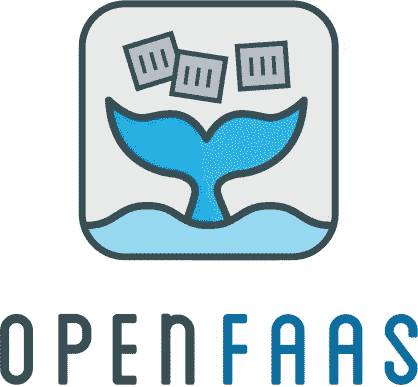
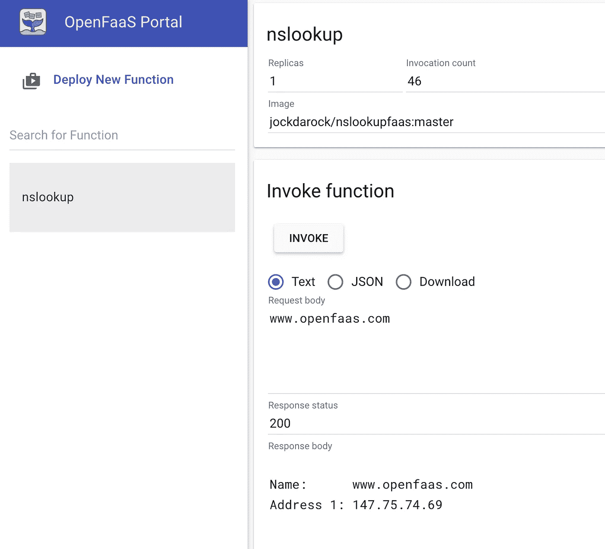
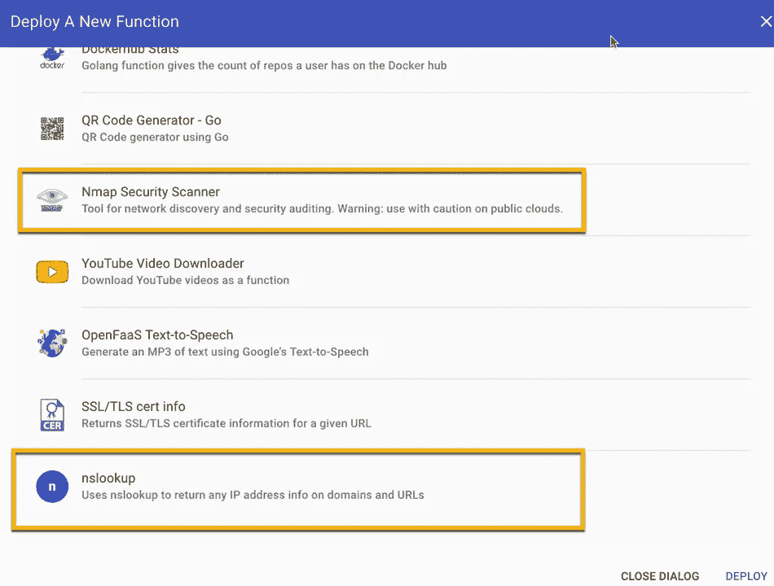

# 合并了！我第一次提交到 OpenFaaS 函数商店

> 原文：<https://medium.com/hackernoon/merged-my-first-submission-to-the-openfaas-function-store-4a35b5cd366c>

*Copyright* © *OpenFaaS Ltd*

如果你没有听说过 [OpenFaas 无服务器平台](https://www.openfaas.com)以及它如何改变无服务器游戏，你需要今天就尝试一下。

最近，OpenFaaS 通过发布[功能商店](https://blog.alexellis.io/announcing-function-store/)，让无服务器入门变得更加简单。功能商店允许一键部署社区构建的功能，向您展示您可以在无服务器堆栈中构建的功能。今天，我将我的第一次提交添加到这个函数库中，它是一组可以无服务器使用的网络工具中的第一个，nslookup 函数。

还可以尝试一下[Alex Ellis](https://medium.com/u/89b4ba5a32ff?source=post_page-----4a35b5cd366c--------------------------------)‘nmap 功能来满足你的网络需求，以及功能商店中的其他社区功能。

查看这些视频和指南，开始使用 OpenFaaS。

*   《FaaS 与愤怒的库比康》2017:[https://youtu.be/XgsxqHQvMnM](https://youtu.be/XgsxqHQvMnM)
*   在带有 Cisco DevNet 的 Kubernetes 沙盒环境上部署 open FAAS:[https://blogs . Cisco . com/developer/open FAAS-at-the-helm-w-Kubernetes-in-the-DevNet-Sandbox](https://blogs.cisco.com/developer/openfaas-at-the-helm-w-kubernetes-in-the-devnet-sandbox)

还有别忘了在 Github 上 [**星 OpenFaaS**](https://github.com/openfaas/faas) 和**加入社区**。