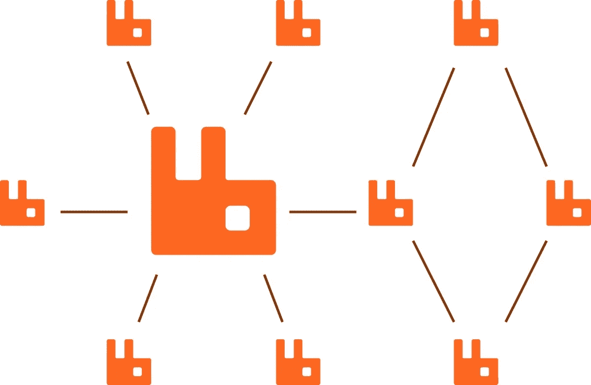
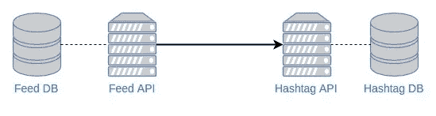
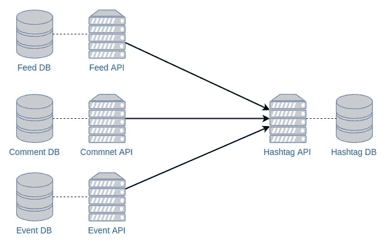
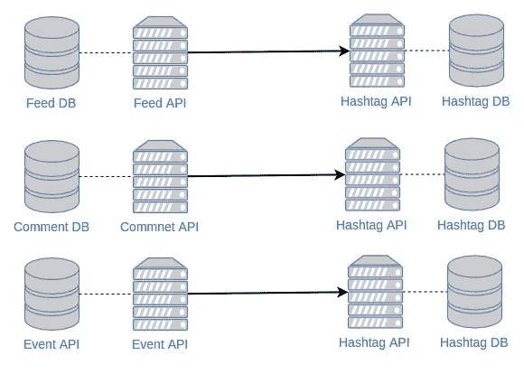
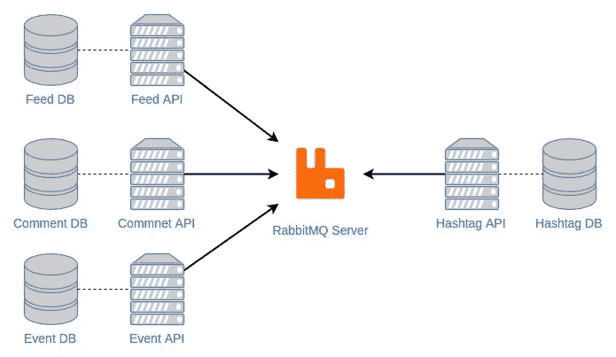

# 消息传递系统—动手操作！

> 原文：<https://medium.com/hackernoon/messaging-system-hands-on-7dda1afded37>

## 所以，我才了解到微服务。这是我得到的。



Took from [https://sub.watchmecode.net/guides/microservices-with-rabbitmq/](https://sub.watchmecode.net/guides/microservices-with-rabbitmq/)

微服务的主要概念之一是分离每个服务。为了分离服务，我们可以应用领域驱动的开发概念，这意味着我们需要按照服务的领域来分离服务。在按服务的域分离服务之后，我们知道应该在每个服务之间建立一个通信机制。所以现在我想实现它。

之前我已经创建了一个整体系统。该系统的主要目的是用户可以上传提要，如果在提要的标题上发现一些标签，它们应该与提要的 ID 一起存储到数据库中。基于微服务的概念，我应该在我的系统上分离服务。我可以创建的服务是处理提要的服务和处理标签的服务。所以，这里的问题陈述

> 用户可以通过提要服务创建新的提要，提要包含位置和标题。Hashtag API 应该处理来自提要标题的 Hashtag。每个服务可以用不同的语言编写。

因为我想保持简单，所以我决定使用 Lumen 构建 Feed 服务，使用 Golang 构建 Hashtag 服务。所以这个系统看起来会像这样



First Design

直到这一步，一切看起来都没问题。当用户创建新的提要时，提要服务将处理它。下面是用户创建新提要时 JSON 数据的样子

```
{
  "location": "Sitoluama",
  "caption" : "Today is a beautiful day #sunset #beach #love"
}
```

在新的提要被存储后，`feed_id`和`feed_caption`将发送到 hashtag 服务，从提要的标题中获取所有的 Hashtag，并将它们存储到 Hashtag DB 中。提要服务将通过 REST API 调用将提要数据作为 JSON 发送给 Hashtag 服务。有效载荷将是这样的

```
{
  "feed_id": 23,
  "feed_caption": "Today is a beautiful day #sunset #beach #love"
}
```

Hashtag 服务收到请求后，将从标题中过滤所有 hashtag。extract hashtag 函数很简单，只需迭代标题中的每个字符，并将它们存储到一个数组中。数组中的每个 hashtag 都将与`feed_id`配对，并将它们存储到 Hashtag DB 中。所以，这里提取的标签

```
[
  {
    "feed_id" : 23,
    "name" : "#sunset"
  },
  {
    "feed_id" : 23,
    "name" : "#beach"
  },
  {
    "feed_id" : 23,
    "name" : "#love"
  },
]
```

直到这一步，一切都很好，从技术上来说是可行的。但是现在我添加了这个案例。

> 使用微服务架构的一个优势是服务的可重用性。一个服务可以被多个服务使用。当我们扩展我们系统时，现在我们的用户可以在我们的应用程序中创建评论和事件。所以我们需要创建评论服务和事件服务。因此，我们可以重用 hashtag 服务来处理来自评论服务和事件服务的 Hashtag

根据上面的问题陈述，我们可以重新设计我们的系统。这里看起来会像。



Second Design

从技术上讲，它仍然有效。但是如果有很多来自 Feed 服务、评论服务和事件服务的请求要发送给 Hashtag 服务，该怎么办呢？单一 Hashtag 服务如何处理所有请求？**记住，我们尽可能不想错过哪怕一个标签**。所以我们需要确保每个标签都得到处理。

简单的解决方案是将 Hashtag 服务与其他服务配对。如果有三个不同的服务使用 Hashtag 服务，我们需要为三个实例创建 Hashtag 服务。



Naive Solution

从技术上讲，这是可行的。但这种设计正在打破可重复使用的概念。从设计中，我们知道我们不是重用 Hashtag 服务，而是创建新的。那么还有什么其他解决方案可以帮助我们呢？

# 信息系统，你是什么？

这里我不解释什么是消息系统，但是你可以在这里找到它，[这里](https://www.techopedia.com/definition/16959/message-broker)，还有[这里](https://www.cloudamqp.com/blog/2014-12-03-what-is-message-queuing.html)。一些流行的消息系统有 [Apache Kafka](https://kafka.apache.org/) 、 [Google Pub/Sub](https://cloud.google.com/pubsub/docs/overview) 和 [RabbitMQ](https://www.rabbitmq.com/) 。

在阅读了什么是消息传递系统之后，也许您还阅读了发布-订阅模式。简单地说，发布-订阅模式是指系统将消息发布到主题中，而订阅该主题的其他系统将接收到消息。在理解了什么是消息传递系统之后，现在我将在我的设计中实现它。

# 让我们摇滚吧，我可爱的兔子！

这是我的新系统设计。这里我尝试使用 RabbitMQ。



RabbitMQ Applied

播种交流将如何进行？让我解释一下。在一个提要、一条评论或一个事件存储到数据库中之后，处理它的服务将发送一个有效负载，其中包含 ID 和包含 hashtag 的字段。

这里是 Feed 服务的有效负载

```
{
  "feed_id": 23,
  "feed_caption": "Today is a beautiful day #sunset #beach #love"
}
```

这里是来自评论服务的有效负载

```
{
  "commnet_id": 1,
  "comment_body": "Hi Jude, don't make it bad #keepfighting"
}
```

这里是来自事件服务的有效负载

```
{
  "event_id": 97,
  "event_description": "We are always welcome for every body that want to learn togerher with us. So don't miss the tutorail session. #tutorail #bootcamp #rabbitmq #microservices"
}
```

但是在这里，有效载荷没有直接发送给 Hashtag 服务。来自每个服务的有效负载将被发布到 RabbitMQ 服务器中的一个主题上。Hashtag 服务将从 RabbitMQ 服务器接收发布的消息——当然，Hashtag 服务应该订阅相同的主题。

实际上，这就够了。但是我们需要修改我们的有效负载，以便 Hashtag 服务知道哪个服务发布了消息。我们还需要修改有效负载，使所有的有效负载都具有相同的结构——就像 Hashtag 服务的契约一样。以下是新的有效载荷示例。

```
{
  "message_type": "feed"
  "message_id": 23,
  "message": "Today is a beautiful day #sunset #beach #love"
}
```

# 其他人有什么优点？

## 消息持久性

发布到 RabbitMQ 服务器上的消息将一直保留在那里，直到有订阅者取走。即使有一条消息没有被完全处理，这条消息也不会直接从队列中删除。RabbitMQ 服务器收到[消息确认](https://www.rabbitmq.com/tutorials/tutorial-two-go.html)——*后会删除，我们需要在*之前配置好。在订户可用之后，RabbitQM 服务器将从其队列中向订户发送消息。

但是如果 RabbitMQ 服务器瘫痪了呢？我们也会丢失数据。阅读[此处](https://www.rabbitmq.com/reliability.html)了解更多详细信息。

```
Marking messages as persistent doesn't fully guarantee that a message won't be lost. Although it tells RabbitMQ to save the message to disk, there is still a short time window when RabbitMQ has accepted a message and hasn't saved it yet. Also, RabbitMQ doesn't do fsync(2) for every message -- it may be just saved to cache and not really written to the disk. The persistence guarantees aren't strong, but it's more than enough for our simple task queue. If you need a stronger guarantee then you can use [publisher confirms](https://www.rabbitmq.com/confirms.html).- [RabbitMQ-Tutorial Two](https://www.rabbitmq.com/tutorials/tutorial-two-python.html)
```

## 易于扩展

实现消息代理，我们可以很容易地扩展我们的系统设计。如上所述，我们向系统添加了另外两个服务，并重用了现有的服务。如果稍后我们添加 Place Service，Place 有一个包含 hashtags 的描述，我们只需将有效负载发布到 RabbitQM 服务器。

## 灵活的技术堆栈

另一个优点是我们可以使用不同的编程语言和不同的数据库，就像我以前做的那样。我们可以灵活地选择我们想要使用的堆栈，因此我们可以获得所有技术堆栈的优势。例如，我们可以考虑使用 NoSQL 实现速度性能，使用 SQL 实现数据完整性，使用 Node JS 实现动态类型，使用 Java 实现静态类型。

我想这就是我能为你分享的一切。我自己仍然需要探索更多关于消息系统和微服务的知识。如果有任何批评或反馈，请随时回复本文或通过`ecojuntak@gmail.com`联系我。哦对了，你也可以在这里找到完整的标签服务代码。

卡皮·霍丁！💻