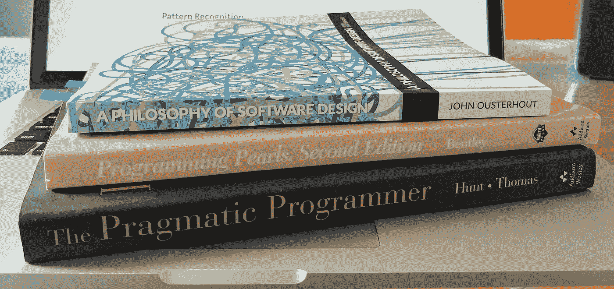

# 软件工程师的元技能

> 原文：<https://medium.com/hackernoon/meta-skills-of-a-software-engineer-bed411f6685e>

## 通过书籍学习正确性和模式识别

Above, some books on meta on how to craft software well.

最近，一个朋友问了一个关于软件工程师所拥有的特殊技能的问题。

> 软件工程师修炼的绝活有哪些？

根据我的经验，我得出了一个意见。我享受编程的乐趣。学习*元*的技能，或者如何做我们做得更好，包括在上下文中阅读许多知名书籍。我把这些年来我读到的具体例子，应用到我在实地实践的观察中，并以我认为最务实的方式回答。

> 我:在我看来，如果放之四海而皆准，我会说是 ***正确性*** 和 ***模式识别**** 的实践。这些是软件工程师独有的一些技能。

让我们检查一下这些技能来增加上下文。

# 正确性

正确性与**如何**和**为什么**我们[以我们的方式](/hackernoon/software-is-unlike-construction-c0284ee4b723)构建事物有很大关系。在组织中，它与企业必须为其客户解决的问题的准确性最密切相关。写得好的软件遵循这种思想。

正确性就是*多正确就有多正确*以便业务解决方案能够高可靠性地持续下去。这是战略(设计)和战术(执行)的平衡。考试的*如何如何*在真空中显得井第四章[编程的珍珠](https://www.pearson.com/us/higher-education/program/Bentley-Programming-Pearls-2nd-Edition/PGM203056.html)——*编写正确的程序*。

> …保持代码简单通常是正确性的关键。
> 
> —乔恩·本特利

# 模式识别

通过创建必要的抽象和组件边界，模式识别与正确性的组织紧密相连。模式识别引出了模块化和隔离代码的重用概念。我们监控复制，找到可以重用的区域，并重构系统的复杂部分。这是软件工程师做得好的事情。我们对细节的关注是警惕的。我们认识到知识是一遍又一遍创造出来的。然后我们简化。

社区中对模式识别进行了详细的讨论，并且有许多关于其技术的资料可以阅读。我学习这种技能的起源在于[实用程序员](https://pragprog.com/titles/tpp20/the-pragmatic-programmer-20th-anniversary-edition/) — *复制的罪恶*的第二章。

> 使其易于重用。干——不要重复自己。
> 
> ——安德鲁·亨特&迪夫·托马斯

# 可传授的时刻

一旦我给出了这个回答，我的朋友接着问了另一个问题。

> 如果正确性和模式识别是这些技能，你是怎么教的？

当然，我的答案很简单。

> 我:找到这些书，设置环境，并通过展示例子来完成。设定学习和实践这些元技能的期望，同时为企业创造价值。为什么？复杂。据我所知，这是学习平衡复杂性技能的最佳投资。随着时间的推移，这也会让工程师变得更加自信。

我的指导集中在这些书和这些特殊技能上。但这让我意识到，除了在没有意识到的情况下做工作之外，很少有人在 meta 上投入大量资金。元词汇是我感兴趣的东西。我写的关于现实世界中的[问题分解](/hackernoon/no-description-provided-8d9e0f3a3abb)(正确性)和[组织](/hackernoon/the-decision-hypothesis-aa512e0113)(模式识别)的文章在交付最激烈的时候很难看到。

几乎在我写这篇关于这些技能的简介的同时，我收到了一本书的推荐。斯坦福大学的一位教授一直在教授一门关于元的课程。他的研究产生了他的课程发现的一个版本。当我发现他和我有同样的抱怨时，我震惊了。我买了这本书，狼吞虎咽地阅读了第十三章，系统设计的哲学。

> 工程师往往非常注重细节。我们喜欢细节，并且善于管理大量的细节；这是成为一名优秀工程师的必备条件。但是，伟大的软件设计师也可以从细节上退一步，在更高的层次上考虑系统。
> 
> —约翰·奥斯特胡特**

# 结论

在我看来，正确性和模式识别是软件工程师应该努力理解并擅长的技能。结果是*更高质量的软件*。所有其他独特的技能，如果有其他分类，很可能是基于这些。我邀请其他人分享他们长期实践元技能的例子。

从根本上说，正确性和模式识别与复杂性的结果(也称为认知负荷)有联系。需要有一种方法来智能地平衡这两者，以便我们降低复杂性。本质上，在我看来，这就是为什么这些技能是我们工作的精华。

关于正确性和模式识别有趣的是，它们也与机器学习的实践有很强的联系。

***如果你想更多地了解约翰在做什么，看看* [*他的视频*](https://www.youtube.com/watch?v=ajFq31OV9Bk) *。*

****工程师也要练习高水平的* ***学习*** *和* ***沟通。*** *这些概念并不是软件独有的，而是与科学有着密切的联系。*