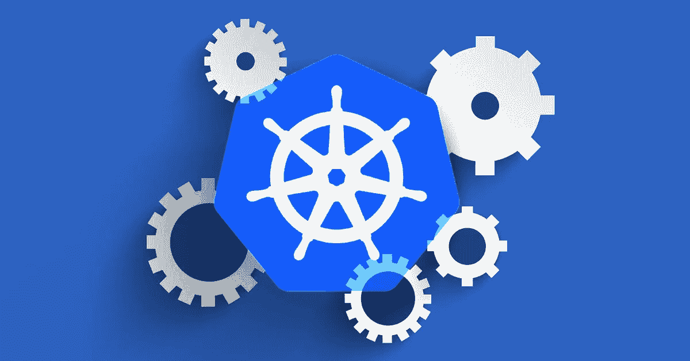

# MetalLB:裸机 Kubernetes 集群的负载平衡器

> 原文：<https://medium.com/hackernoon/metallb-a-load-balancer-for-bare-metal-kubernetes-clusters-f7320fde52f2>

直到最近，Kubernetes 还没有对裸机集群负载平衡的本地支持。MetalLB 是新的解决方案，目前处于 alpha 版本，旨在缩小这一差距。



截至目前，Kubernetes 自带网络 LB 解决方案，实际上是调用各种 IaaS 云平台(AWS、Azure、GCP 等)的胶水代码。).然而，将 Kubernetes 部署在除受支持的平台(如私有云或裸机集群)之外的任何平台上会导致服务对象

```
spec.type=LoadBalancer
```

永远处于待定状态。

因此，选择裸机集群让 Kubernetes 管理员在 Nodeport 和 ExternalIPs 之间进行选择，没有一个是完美的解决方案。MetalLB 是一种新的负载平衡器，它提供了一种基于标准网络设备的网络 LB 实现。

# MetalLB 先决条件和要求

MetalLB 稳定运行的先决条件包括:

*   一个干净的 [Kubernetes](https://kubernetes.io/) 集群版本 1.8.0 或以上，没有安装任何其他负载平衡解决方案
*   一个或多个使用 4 字节 AS 号的 [BGP](https://en.wikipedia.org/wiki/Border_Gateway_Protocol) 路由器( [RFC 6793](https://tools.ietf.org/html/rfc6793)
*   供路由器分配的一组 IPv4 地址

下面是[要求](https://metallb.universe.tf/installation/#requirements)的更多细节。由于 MetalLB 项目肯定会发展，请参考[成熟度页面](https://metallb.universe.tf/maturity/)进行解释。

您可以按照本[教程](https://metallb.universe.tf/tutorial/)测试独立的 minikube MetalLB 功能。要将该工具部署到生产集群，请参阅[安装](https://metallb.universe.tf/installation/)和[使用](https://metallb.universe.tf/usage/)指南。这份详细的[设计文档](https://metallb.universe.tf/design/)将帮助您立即启动并运行该工具。

如果您希望参与项目进展，请遵循本[黑客指南](https://metallb.universe.tf/hacking/)获取技术信息。任何[使用反馈和建议](https://github.com/google/metallb/issues/5)都会让 MetalLB 开发者非常高兴，所以请随意分享你的想法和创意！

之前我在我公司的博客上发布过这篇文章:[https://its vit . com/blog/metal lb-load-balancer-bare-metal-kubernetes-clusters/](https://itsvit.com/blog/metallb-load-balancer-bare-metal-kubernetes-clusters/)