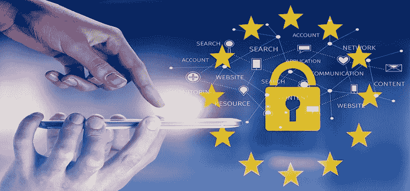

# 元宇宙数字身份(Avatar)简化了数字身份识别中的低效问题

> 原文：<https://medium.com/hackernoon/metaverse-digital-identity-avatar-to-streamline-the-inefficiencies-in-digital-identification-ded80e4450c5>

数字身份是这个技术时代要解决的最古老、最复杂的问题之一。因此，一个主要的问题是:你如何相信一个人，而不相信他/她未经证实的说法？

这符合那些想开设银行账户但必须经过繁琐的了解客户程序(KYC)的客户的要求。因此，需要提供这种数据的不可变存储，以防止不准确。

传统上，这些证明通常由政府身份证明、信用卡、信件等提供。这种信息容易被捏造甚至伪造。由于银行对了解谁是该计划的最终受益人非常敏感，他们会假设:如果你没有洗钱，那么你就没有做任何非法的事情，所以你在填写手续和表格以及向相应的银行证明你的身份方面应该没有问题。最令人沮丧的部分是发证机关提出的问题，因为他们想确保他们没有帮助或教唆任何非法行为。

在世界银行集团成员国际金融公司进行的金融部门去风险报告中，他们报告说，一个主要的活动是“合规成本增加”,这大大增加了贸易融资的下行压力。银行确定的最大贸易融资障碍是反洗钱(反洗钱)/ KYC(了解您的客户)成本，在 2016 年国际商会全球贸易融资调查中，该成本占 93%(据受访者报告)。

此外，在世界银行集团关于 DLT 和区块链的[报告](http://documents.worldbank.org/curated/en/177911513714062215/pdf/122140-WP-PUBLIC-Distributed-Ledger-Technology-and-Blockchain-Fintech-Notes.pdf)中，强调了要采用分布式账本技术，系统应符合 KYC 和 CDD 反洗钱/CFT 法规的要求。

**利用区块链实现数字身份的突破。**

[元宇宙](https://mvs.org/)，一个开源的公共区块链旨在提供与个人现实生活身份相关联的数字身份证(DID)。一个人必须在银行(通过元宇宙)通过简单的 KYC 程序，但如果这个人的身份存在，并且已经由区块链上的第三方/甲骨文验证，银行就不需要验证这个人的身份。例如，B 填写需要证明的可定制字段。Oracle 必须使用主私钥对信息进行有效签名。因此，A(银行机构)可以请求包括 Oracle 背书在内的字段信息。如果 A 确信 B 的信息有效，则可以向 B 提供服务。该功能旨在为用户和银行节省时间，从而超越上述繁琐的过程。

**阿凡达 KYC 是如何实时进行的？**

元宇宙的数字身份是唯一的，可以由用户自主控制，因此不需要依赖任何中央实体或第三方进行身份验证。元宇宙可以与各种银行合作，用户将完成如下所示的 KYC 程序:

(1)核实寻求开户的任何人的身份

(2)保留用于核实个人身份的信息记录。

(3)根据[金融行动特别工作组(FATF)](https://www.sfc.hk/web/EN/rules-and-standards/anti-money-laundering-and-counter-terrorist-financing/) 制定的反洗钱和反恐融资国际标准，确定该人是否出现在政府提供的任何已知或可疑恐怖分子或[恐怖组织](https://www.law.cornell.edu/uscode/text/31/5318)名单上。

完成此程序有两个阶段。在阶段 1 中，可以选择启用数字身份证，并且将颁发一个令牌并附加到数字身份证上。这是一个无需亲自查看数据就能验证某件事是否真实的概念(零知识证明)。验证的结果可以直接呈现给银行，而不是原始数据本身呈现。在第二阶段，详细的 KYC 信息将存储在区块链中，用户可以使用自己的私钥授权银行在需要时访问证书。

数字身份将允许人们表明 ID 已经过**验证**，而不是**实际上向各自的权威机构表明**他们的 ID 以进行验证。

**数字识别的未来近在眼前**

区块链技术将通过为银行、政府和金融利益相关者提供透明、可靠的解决方案来彼此共享可靠的证书，从而解决数字身份识别中的许多低效问题。一个透明和无缝的新领域即将到来，用户最终可以保护自己的数据，而机构可以安全有效地识别用户。