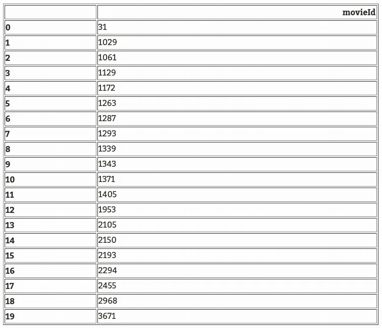

# 因为你看了 X

> 原文：<https://medium.com/hackernoon/metflix-because-you-watched-x-26fe9bdfca7f>


Netflix because you watched feature

# 我们在哪里？

这是我们到目前为止所做的

*   在[第 0 部分](/all-things-ai/metflix-how-to-recommend-movies-part-0-f128bc4fcccc)，我们从 [MovieLens](https://grouplens.org/datasets/movielens/) 下载了我们的数据，做了一些 EDA 并创建了我们的用户项目矩阵。矩阵有 671 个独立用户，9066 部独立电影，稀疏度为 98.35%
*   在[第一部分](/all-things-ai/metflix-how-to-recommend-movies-part-1-98ae30127033)中，我们描述了 3 种最常见的推荐方法:基于用户的协同过滤、基于项目的协同过滤和矩阵分解
*   在 [part 2](https://hackernoon.com/metflix-how-to-recommend-movies-part-2-54d2b6cfed13) 中，我们通过 ALS 实现了矩阵分解，找到了类似的电影
*   在第 3 部分中，我们根据用户对电影的评价向他们推荐电影。我们还试图复制网飞的“因为你看了 X”功能，并为热门电影做一个完整的页面推荐

# 向用户推荐电影

我们从*隐式*库中获取我们训练 ALS 模型的代码。以前加载和处理数据的代码可以在本系列以前的文章中找到，或者在我的 [Github](https://github.com/maviator/metflix) 上找到。

```
model = implicit.als.AlternatingLeastSquares(factors=10,
                                             iterations=20,
                                             regularization=0.1,
                                             num_threads=4)model.fit(user_item.T)
```

首先，让我们编写一个函数，返回特定用户评价过的电影

```
def get_rated_movies_ids(user_id, user_item, users, movies):
   “””
   Input
   ----- user_id: int
      User ID user_item: scipy.Sparse Matrix
      User item interaction matrix users: np.array
      Mapping array between user ID and index in the user item       matrix movies: np.array
      Mapping array between movie ID and index in the user item matrix Output
  ----- movieTableIDs: python list
      List of movie IDs that the user had rated “””
  user_id = users.index(user_id)
  # Get matrix ids of rated movies by selected user
  ids = user_item[user_id].nonzero()[1]
  # Convert matrix ids to movies IDs
  movieTableIDs = [movies[item] for item in ids] return movieTableIDsmovieTableIDs = get_rated_movies_ids(1, user_item, users, movies)
rated_movies = pd.DataFrame(movieTableIDs, columns=[‘movieId’])
rated_movies
```



```
def get_movies(movieTableIDs, movies_table):
   “””
   Input
   ----- movieTableIDs: python list
      List of movie IDs that the user had rated movies_table: pd.DataFrame
      DataFrame of movies info Output
   ----- rated_movies: pd.DataFrame
      DataFrame of rated movies “”” rated_movies = pd.DataFrame(movieTableIDs, columns=[‘movieId’]) rated_movies = pd.merge(rated_movies, movies_table, on=’movieId’, how=’left’) return rated_movies movieTableIDs = get_rated_movies_ids(1, user_item, users, movies)
df = get_movies(movieTableIDs, movies_table)
df
```


现在，让我们根据用户对电影的评价，为特定的用户 ID 推荐电影 ID。

```
def recommend_movie_ids(user_id, model, user_item, users, movies, N=5):
   “””
   Input
   ----- user_id: int
      User ID model: ALS model
      Trained ALS model user_item: sp.Sparse Matrix
      User item interaction matrix so that we do not recommend already rated movies users: np.array
      Mapping array between User ID and user item index movies: np.array
      Mapping array between Movie ID and user item index N: int (default =5)
      Number of recommendations Output
   ----- movies_ids: python list
      List of movie IDs
   “”” user_id = users.index(user_id) recommendations = model.recommend(user_id, user_item, N=N) recommendations = [item[0] for item in recommendations] movies_ids = [movies[ids] for ids in recommendations] return movies_idsmovies_ids = recommend_movie_ids(1, model, user_item, users, movies, N=5)
movies_ids> [1374, 1127, 1214, 1356, 1376]movies_rec = get_movies(movies_ids, movies_table)
movies_rec
```


```
display_posters(movies_rec)
```


```
movies_ids = recommend_movie_ids(100, model, user_item, users, movies, N=7)
movies_rec = get_movies(movies_ids, movies_table)
display_posters(movies_rec)
```


# 因为你看了

让我们实现网飞的“因为你看了”功能。而是根据你看过的内容推荐电影。这类似于我们已经做的，但这一次，它更有选择性。我们将这样做:我们将随机选择用户看过的 5 部电影，并为每部电影推荐相似的电影。最后，我们将它们全部显示在一个页面布局中

```
def similar_items(item_id, movies_table, movies, N=5):
     “””
     Input
     -----
     item_id: int
       MovieID in the movies table movies_table: DataFrame
       DataFrame with movie ids, movie title and genre movies: np.array
       Mapping between movieID in the movies_table and id in the item user matrix N: int
       Number of similar movies to return Output
     -----
     df: DataFrame
       DataFrame with selected movie in first row and similar movies for N next rows
     “”” # Get movie user index from the mapping array
    user_item_id = movies.index(item_id)
    # Get similar movies from the ALS model
    similars = model.similar_items(user_item_id, N=N+1) 
    # ALS similar_items provides (id, score), we extract a list of ids
    l = [item[0] for item in similars[1:]]
    # Convert those ids to movieID from the mapping array
    ids = [movies[ids] for ids in l]
    # Make a dataFrame of the movieIds
    ids = pd.DataFrame(ids, columns=[‘movieId’])
    # Add movie title and genres by joining with the movies table
    recommendation = pd.merge(ids, movies_table, on=’movieId’, how=’left’) return recommendationdef similar_and_display(item_id, movies_table, movies, N=5): df = similar_items(item_id, movies_table, movies, N=N) df.dropna(inplace=True) display_posters(df)def because_you_watched(user, user_item, users, movies, k=5, N=5):
     “””
     Input
     -----
     user: int
       User ID user_item: scipy sparse matrix
       User item interaction matrix users: np.array
       Mapping array between User ID and user item index movies: np.array
       Mapping array between Movie ID and user item index k: int
       Number of recommendations per movie N: int
       Number of movies already watched chosen “”” movieTableIDs = get_rated_movies_ids(user, user_item, users, movies)

     df = get_movies(movieTableIDs, movies_table) movieIDs = random.sample(df.movieId, N) for movieID in movieIDs:
        title = df[df.movieId == movieID].iloc[0].title
        print(“Because you’ve watched “, title)
        similar_and_display(movieID, movies_table, movies, k)because_you_watched(500, user_item, users, movies, k=5, N=5)
```

**《因为你看了》《肯定，也许(2008)》**


**《因为你看了》《风中奇缘》(1995)**


**“因为你看了”，《辛普森一家电影》(2007)**


**《因为你看了》《有本事你来抓我》(2002)**


**《因为你看了》，《冒险的事业》(1983)**


# 热门电影

让我们也实现趋势电影。在我们的上下文中，趋势电影是用户评价最高的电影

```
def get_trending(user_item, movies, movies_table, N=5):
   “””
   Input
   ----- user_item: scipy sparse matrix
     User item interaction matrix to use to extract popular movies movies: np.array
     Mapping array between movieId and ID in the user_item matrix movies_table: pd.DataFrame
     DataFrame for movies information N: int
     Top N most popular movies to return “”” binary = user_item.copy()
   binary[binary !=0] = 1 populars = np.array(binary.sum(axis=0)).reshape(-1) movieIDs = populars.argsort()[::-1][:N] movies_rec = get_movies(movieIDs, movies_table) movies_rec.dropna(inplace=True) print(“Trending Now”) display_posters(movies_rec)get_trending(user_item, movies, movies_table, N=6)
```

当前趋势


# 页面推荐

让我们把一切都放在一个时间轴方法中。时间线方法将获取用户 ID，并根据用户观看过的类似电影显示热门电影和推荐。

```
def my_timeline(user, user_item, users, movies, movies_table, k=5, N=5): get_trending(user_item, movies, movies_table, N=N) because_you_watched(user, user_item, users, movies, k=k, N=N)my_timeline(500, user_item, users, movies, movies_table, k=5, N=5)
```

**当前趋势**


**《因为你看了》、‘肯定，也许(2008)’**


**《因为你看了》，《风中奇缘》(1995)**


**《因为你看了》，《辛普森一家电影》(2007)**


**《因为你看了》《有本事你来抓我》(2002)**


**《因为你看了》，《冒险事业(1983)》**


# 导出用于生产的训练模型

此时，我们希望将我们的模型投入生产。我们希望创建一个 web 服务，其中用户将向服务提供一个用户 id，服务将返回所有的推荐，包括趋势和“因为你看过”。

为此，我们首先导出训练好的模型和使用过的数据，以便在 web 服务中使用。

```
import scipy.sparsescipy.sparse.save_npz(‘model/user_item.npz’, user_item)np.save(‘model/movies.npy’, movies)
np.save(‘model/users.npy’, users)
movies_table.to_csv(‘model/movies_table.csv’, index=False)from sklearn.externals import joblib
joblib.dump(model, ‘model/model.pkl’)
```

# 结论

在本帖中，我们根据用户的电影评级历史向他们推荐电影。从那里，我们试图克隆网飞的“因为你看了”功能，并显示热门电影作为被评为次数最多的电影。在下一篇文章中，我们将尝试把我们的工作放在一个 web 服务中，用户通过提供其用户 ID 来请求电影推荐。

敬请期待！