# Metflix:如何推荐电影——第二部分

> 原文：<https://medium.com/hackernoon/metflix-how-to-recommend-movies-part-2-54d2b6cfed13>


[https://unsplash.com/photos/ngMtsE5r9eI](https://unsplash.com/photos/ngMtsE5r9eI)

# 我们在哪里？

这是我们到目前为止所做的

*   在[第 0 部分](/all-things-ai/metflix-how-to-recommend-movies-part-0-f128bc4fcccc)，我们从 [MovieLens](https://grouplens.org/datasets/movielens/) 下载了我们的数据，做了一些 EDA 并创建了我们的用户项目矩阵。矩阵有 671 个独立用户，9066 部独立电影，稀疏度为 98.35%
*   在[第一部分](/all-things-ai/metflix-how-to-recommend-movies-part-1-98ae30127033)中，我们描述了 3 种最常见的推荐方法:**U**ser**B**as**C**o laboratory**F**filtering、**I**tem**B**as**C**o laboratory**F**filtering 和**M**atrix**F**actor
*   在第二部，这一部分，我们将通过 ALS 实现 **M** 心房 **F** 动作化，并寻找类似的电影

# 矩阵分解

我们希望将用户项目交互矩阵分解为用户矩阵和项目矩阵。为此，我们将使用 **A** 交替 **L** 东 **S** 方(ALS)算法来分解矩阵。我们可以编写我们自己的 ALS 实现，就像在[这篇文章](http://blog.ethanrosenthal.com/2016/01/09/explicit-matrix-factorization-sgd-als/)或[这篇文章](https://jessesw.com/Rec-System/)中是如何实现的，或者我们可以使用已经可用的、由 [Ben Frederickson](http://www.benfrederickson.com/blog/) 实现的快速实现。这里的 ALS 模型来自 [*隐式*](https://github.com/benfred/implicit) ，可以很容易地用 **pip** 或者用 **conda** 的 Anaconda 包管理器添加到你的 Python 包中。

```
import implicitmodel = implicit.als.AlternatingLeastSquares(factors=10,
                                             iterations=20,
                                             regularization=0.1,
                                             num_threads=4)
model.fit(user_item.T)
```

这里，我们用以下参数调用 ALS:

*   10 个因素。要使用的潜在因子的数量
*   20 次迭代
*   0.1 正规化。这个正则项是损失函数中的λ
*   4 个线程。这段代码可以并行化，这使得它非常快。训练大约需要 5 秒钟。

需要注意的一点是，ALS 模型的输入是一个电影用户交互矩阵，因此我们只需将项目电影矩阵的转置传递给模型拟合函数

# 推荐类似电影

是时候出点成绩了。我们想找到一个选定的标题类似的电影。隐式模块提供了一个现成的方法，通过在电影用户矩阵中提供电影索引来返回类似的项目。但是，我们需要将该索引转换为 movies 表中的电影 ID

```
movies_table = pd.read_csv(“data/ml-latest-small/movies.csv”)
movies_table.head()
```

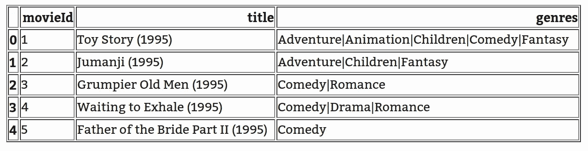

```
def similar_items(item_id, movies_table, movies, N=5):
 “””
 Input
 ----- item_id: int
    MovieID in the movies table movies_table: DataFrame
    DataFrame with movie ids, movie title and genre movies: np.array
    Mapping between movieID in the movies_table and id in the item user matrix N: int
    Number of similar movies to return Output
 ----- recommendation: DataFrame
      DataFrame with selected movie in first row and similar movies for N next rows“””
 # Get movie user index from the mapping array
 user_item_id = movies.index(item_id)

 # Get similar movies from the ALS model
 similars = model.similar_items(user_item_id, N=N+1) 

 # ALS similar_items provides (id, score), we extract a list of ids
 l = [item[0] for item in similars]

 # Convert those ids to movieID from the mapping array
 ids = [movies[ids] for ids in l]

 # Make a dataFrame of the movieIds
 ids = pd.DataFrame(ids, columns=[‘movieId’])

 # Add movie title and genres by joining with the movies table
 recommendation = pd.merge(ids, movies_table, on=’movieId’, how=’left’) return recommendation
```

我们试试吧！

让我们看看詹姆斯·邦德电影《黄金眼》有哪些类似的电影

```
df = similar_items(10, movies_table, movies, 5)
df
```

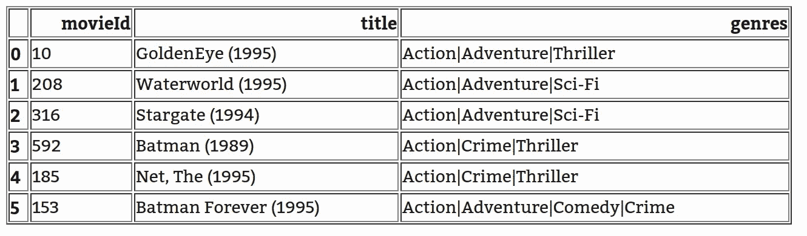

有趣的推荐。有一点需要注意的是，所有推荐的电影也都是动作片。请记住，ALS 算法中没有关于电影类型的指示。让我们试试另一个例子

```
df = similar_items(500, movies_table, movies, 5)
df
```

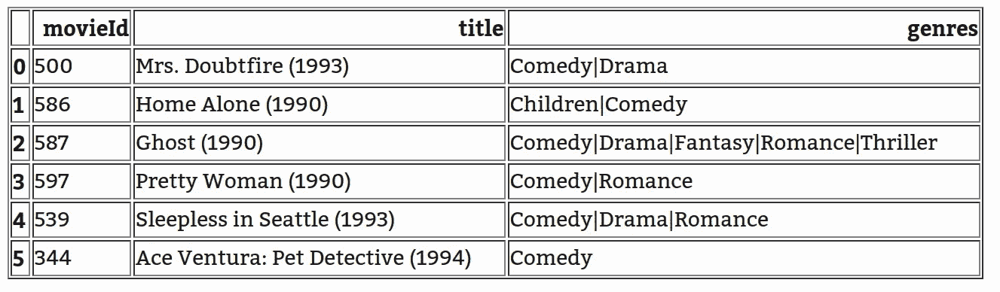

所选电影是一部喜剧电影，所以推荐。还有一个有趣的需要注意的是，推荐的电影都是在同一个时间段(90 后)。

```
df = similar_items(1, movies_table, movies, 5)
df
```

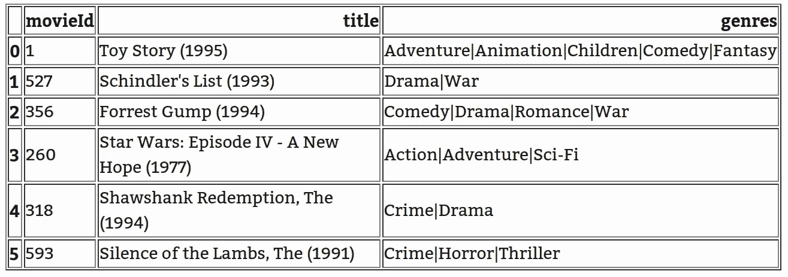

在这种情况下，建议是不相关的。向刚看完《玩具总动员》的用户推荐《沉默的羔羊》似乎不是一个好主意。

# 让它变得新奇

到目前为止，这些建议都显示在数据框中。让我们通过展示电影海报而不仅仅是标题来让它变得更有趣。这可能有助于我们稍后部署模型，并将工作分为前端和后端。为此，我们将下载我在 Kaggle 上找到的电影元数据。我们需要以下数据:

*   电影 _ 元数据. csv
*   links.csv

```
metadata = pd.read_csv(‘data/movies_metadata.csv’)
metadata.head(2)
```

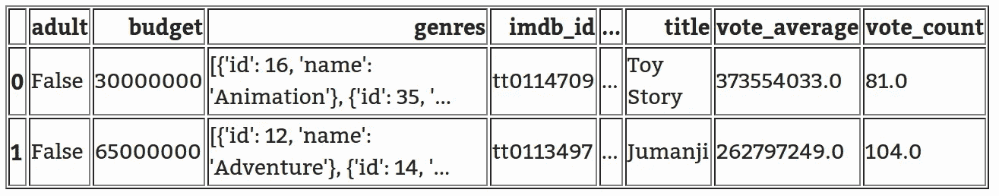

从这个元数据文件中，我们只需要 **imdb_id** 和 **poster_path** 列。

```
image_data = metadata[[‘imdb_id’, ‘poster_path’]]
image_data.head()
```

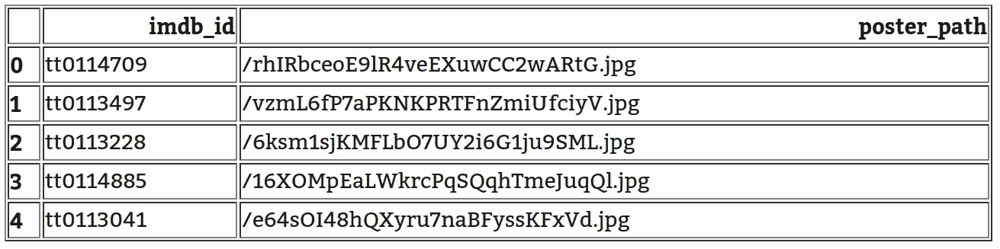

我们希望将该列与电影表合并。因此，我们需要链接文件来映射 imdb id 和 movieId

```
links = pd.read_csv(“data/links.csv”)
links.head()
```

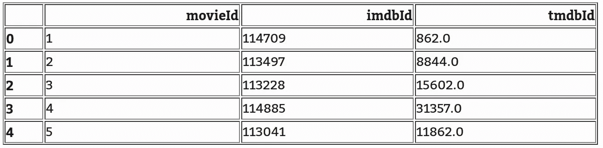

```
links = links[[‘movieId’, ‘imdbId’]]
```

id 合并将分两步完成:

*   首先合并海报路径和贴图链接
*   然后与 movies_table 合并

但是首先我们需要删除缺失的 imdb ids 并提取整数 ID

```
image_data = image_data[~ image_data.imdb_id.isnull()]def app(x):
 try:
    return int(x[2:])
 except ValueError:
    print ximage_data[‘imdbId’] = image_data.imdb_id.apply(app)image_data = image_data[~ image_data.imdbId.isnull()]image_data.imdbId = image_data.imdbId.astype(int)image_data = image_data[[‘imdbId’, ‘poster_path’]]image_data.head()
```

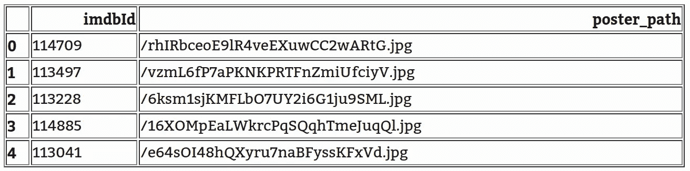

```
posters = pd.merge(image_data, links, on=’imdbId’, how=’left’)posters = posters[[‘movieId’, ‘poster_path’]]posters = posters[~ posters.movieId.isnull()]posters.movieId = posters.movieId.astype(int)posters.head()
```

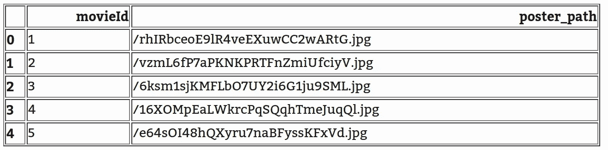

```
movies_table = pd.merge(movies_table, posters, on=’movieId’, how=’left’)
movies_table.head()
```

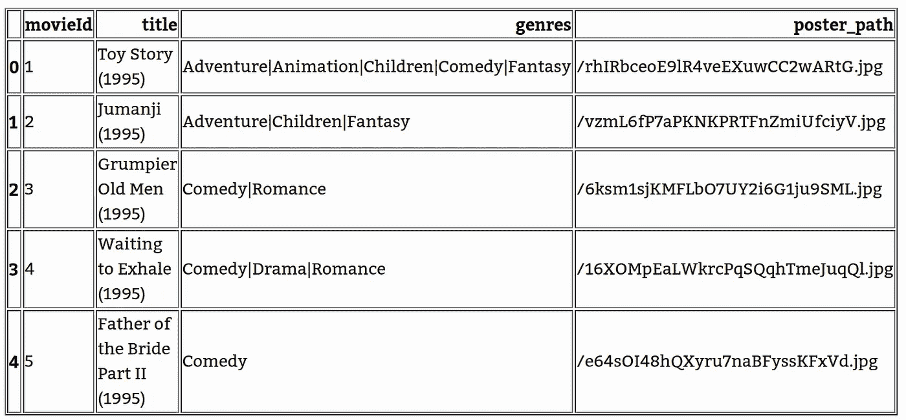

现在我们有了海报路径，我们需要从网站上下载它们。一种方法是使用 [TMDB API](https://www.themoviedb.org/documentation/api) 获取电影海报。但是，我们必须在网站上创建一个帐户，申请使用 API，并等待批准以获得令牌 ID。我们没时间了，所以我们要随机应变。

所有的电影海报都可以通过一个基本 URL 加上我们得到的电影海报路径来访问，并且使用 Python 的 HTML 模块，我们可以直接在 Jupyter Notebook 中显示它们。

```
from IPython.display import HTML
from IPython.display import displaydef display_recommendations(df): images = ‘’
   for ref in df.poster_path:
     if ref != ‘’:
       link = ‘[http://image.tmdb.org/t/p/w185/'](http://image.tmdb.org/t/p/w185/') + ref
       images += “” \
       % link
   display(HTML(images)) df = similar_items(500, movies_table, movies, 5)
display_recommendations(df)
```


Recommendations for `Mrs Doubtfire`

将所有这些放入一个小方法中

```
def similar_and_display(item_id, movies_table, movies, N=5): df = similar_items(item_id, movies_table, movies, N=N) display_recommendations(df)similar_and_display(10, movies_table, movies, 5)
```

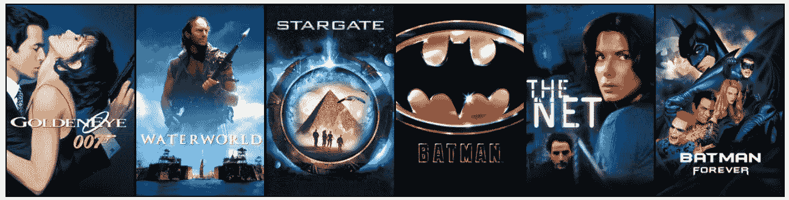

Recommendations for `Golden Eye`

# 结论

在这篇文章中，我们通过隐式模块实现了 ALS 来查找相似的电影。此外，我们做了一些黑客来显示电影海报，而不仅仅是数据帧。在下一篇文章中，我们将看到如何根据用户看过的电影为他们提供推荐。我们还将了解如何建立评估方案并优化 ALS 参数。

敬请期待！