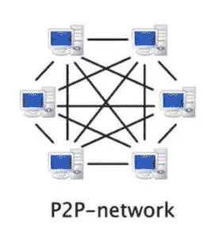
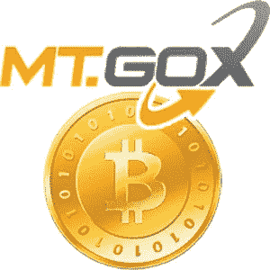

# 古往今来获取加密货币的方法和途径

> 原文：<https://medium.com/hackernoon/methods-and-ways-to-obtain-cryptocurrency-through-the-ages-324befd5f6b8>

多年来，获取加密货币的方法已经发生了变化。为了获得加密货币，你首先必须自己挖掘或者认识拥有加密货币的人。幸运的是，这些年来获得加密货币变得越来越容易。目前，有多种方法可以获得加密货币。在本文中，我们将解释获得加密货币的不同方法，同时也解释交易的陷阱，以及为什么您可能应该使用替代方法来获得加密货币。

**目前有几种方法可以获得加密货币。目前，你可以通过交易所购买加密货币，从朋友那里获得加密货币，出售自己的东西来换取加密货币，或者与他人交换加密货币。本文解释了获得加密货币**的不同方法

获得加密货币的最新方式是在 [Forra.io](https://market.forra.io) 上出售物品

# 通过挖掘获取比特币和密码——开始

九年多前，在加密货币行业诞生之初，寻找比特币的用户只有一个选择，那就是将他们的计算哈希能力贡献给网络。但随着空间开始发展，交易网络也发展起来，点对点交易成为菲亚特和密码世界之间的主要桥梁。

现在，有多种方法可以获得任何加密货币。我们想创造一种新的替代方法来获得加密货币。我们想出了将你拥有的东西转换成加密货币的主意。

有了 Forra，获得加密货币的新方法是通过出售你的物品来换取你选择的加密货币。与获取比特币和加密货币的旧方式相比，从电子商务市场获取加密货币的风险和门槛要低得多。

“比特币披萨”事件是用户收到比特币购买实物的第一个例子，一位名为 Laszlo 的用户用 1 万比特币购买了两个棒约翰披萨。这一事件现在已经成为加密货币历史上最臭名昭著的事件之一，因为 1 万比特币的价值现在超过 6000 万美元。

但是，随着零售量开始流入，投资者开始涌入这个行业，很快就发现需要更高效、更强大的系统。这种需求在第一个集中式加密货币交易所，即现在臭名昭著的 Mt.Gox 交易所中受到欢迎。

# 为什么你不能总是依靠交易所来获得密码

Mt.Gox 是一家位于日本东京的比特币和莱特币交易所，于 2010 年 7 月推出。该交易所在加密货币社区中广受欢迎，高峰时处理了 70%的比特币交易量。Mt.Gox 是今天的比特币基地。Mt. Gox 是当时为数不多的比特币交易所之一。绝大多数人是通过交易所获得比特币的。

然而，作为获取密码的一种方式，这种日本交易所从来不是 100%可靠或安全的，因为它开始遭受一系列故障、错误和黑客攻击。第一个问题出现在 Mt.Gox 推出一年后，当时一名黑客涉嫌侵入一个审计员账户，非法将比特币转移到该黑客的个人账户。黑客随后设法将比特币在交易所的价格降至 1 美分，影响了相当于 870 多万美元比特币的账户。这破坏了获取比特币的 go to 方法，并最终催生了大量更好的替代方法来获取任何加密货币。

尽管这个问题很快得到了纠正，但对该交易所声誉的损害依然存在。在一系列负面事件，即 85 万比特币被黑后，Mt.Gox 终于对交易员关上了大门，于 2014 年 4 月进入破产和清算程序。该交易所成为交易所众多问题的第一个例子，这些问题至今仍然存在。

Mt. Gox 教会了加密货币社区很多东西。你不能把你的全部信任放在一个交易所里。通过交易所购买加密货币的最佳替代方案是将其作为一种货币使用。有很多其他的好方法来赚取密码。

# 如今加密货币交易所的问题

# KYC/反洗钱的烦恼

尽管自 Mt.Gox 崩溃以来，交易所变得更加可靠，但这种可靠性是有代价的，特别是在 KYC/反洗钱规则方面。为加密货币转账提供法定许可的交易所受到极其严格的 KYC 规则的限制，通常需要数周时间来处理。幸运的是，有其他方法可以获得加密货币。

# 买入/卖出限额

即使你获得了 KYC 验证，许多交易所也会对你可以买卖的加密货币数量进行限制，不允许大额转账。这惹恼了不少客户，许多愤怒的消费者在交易所的社交媒体页面上表达他们的沮丧。

# 交换黑客

尽管估值高达数十亿美元，但对加密货币行业如此重要的加密货币交易所对黑客和安全漏洞并不陌生。以最近的 Bithumb、Coinrail 和 CoinCheck 为例，它们都损失了价值数百万美元的消费者资金，通常是由于疏忽。

分散式交易所(DEX)虽然被誉为“未来”，但仍然容易受到黑客攻击。Bancor 是一家顶级的 DEX 公司，最近遭受了智能合约安全漏洞，使得黑客能够耗尽 Bancor 智能合约，窃取了超过 2400 万美元的加密货币。

# 获取加密货币的艰难途径

虽然技术娴熟的用户可能会发现使用交易所是小菜一碟，但外行人可能会发现获得加密货币很难。事实上，许多消费者将易访问性问题作为他们避免投资该行业的主要原因。获得加密货币的新方法层出不穷，让获得你最喜欢的硬币变得前所未有的容易。

# 传统上获取密码所涉及的费用

费用已经成为加密货币行业的“热门话题”，因为随着时间的推移，交易费用可能会从你的库存中拿走很大一部分。尽管传统市场经常受到加密货币爱好者的指责，但 E*Trade 和 Robinhood 等平台的费用(或缺乏费用)与加密交易所的费用相比相形见绌。

在顶级交易所，退出费加上交易费往往可以达到 0.1%-0.2%。虽然 0.1%或 0.2%听起来可能是一个微不足道的数字，但它可以很快积累起来，一个用户在交易中赚了 100 万美元，需要支付 1000 美元的费用。

从法定货币到加密货币的交易费用可能更高，许多平台，如比特币基地，对每笔法定货币支持的买卖订单收取 3-4%的费用。3-4%的费用绝对是 ludacris，一些人因为费用而拒绝为 fiat 购买加密货币。采用即将到来，很快就会有服务允许人们获得加密货币，而不是直接购买它。

很明显，许多交易商开始质疑交易所的收费结构，试图转向其他选择来获得加密货币。

# 购买加密货币的替代方案

**出售物品换取加密货币**

Forra 是一个基于加密货币的在线市场 DApp(分散式应用程序)，试图消除 EBay 等经典服务的障碍和问题。此外，Forra 希望成为消费者在不花费法定货币的情况下获得加密货币的绝佳选择。

# “菲亚特障碍”

自 2017-2018 年牛市以来，对加密货币的需求绝对飙升。然而，像你我这样的普通人可能没有投资金融领域所需的法定资金，更不用说投资加密货币了。需要有获得加密货币的替代方案。

Forra 已经开始证明自己是潜在投资者在这个快速扩张的领域寻求投资的完美平台。就像你找到自己不需要的东西，却觉得别人会发现有价值一样容易。从你出售的物品中赚取密码是购买密码的最佳选择之一

# 一种获取加密货币的简单方法

DApp 目前正在开发中，有望成为一个设计良好、易于使用的获取密码的平台。Forra 允许你用加密货币出售你的物品。你可以在我们的市场上出售你的物品，或直接卖给我们。两者都是购买加密货币的绝佳选择。如前所述，这将像在平台上注册一样简单，并对你认为不再有用的产品说再见。

# 免费获得加密货币

传统的在线市场，如易贝和亚马逊，向卖家收取高昂的费用，偶尔会收取 14%以上，如果你想通过广告推广你的商品，甚至会更多。另一方面，Forra 计划为“创业者提供一个免费的市场来建立业务”，唯一的费用是以太坊燃气费，以促进和验证智能合同的功能。

我们认为，通过创建一种零费用的方式来获得加密货币，整个行业的采用率将会更高。

*最初发表于* [*forra.io*](https://forra.io/obtaining-cryptocurrency/) *。*