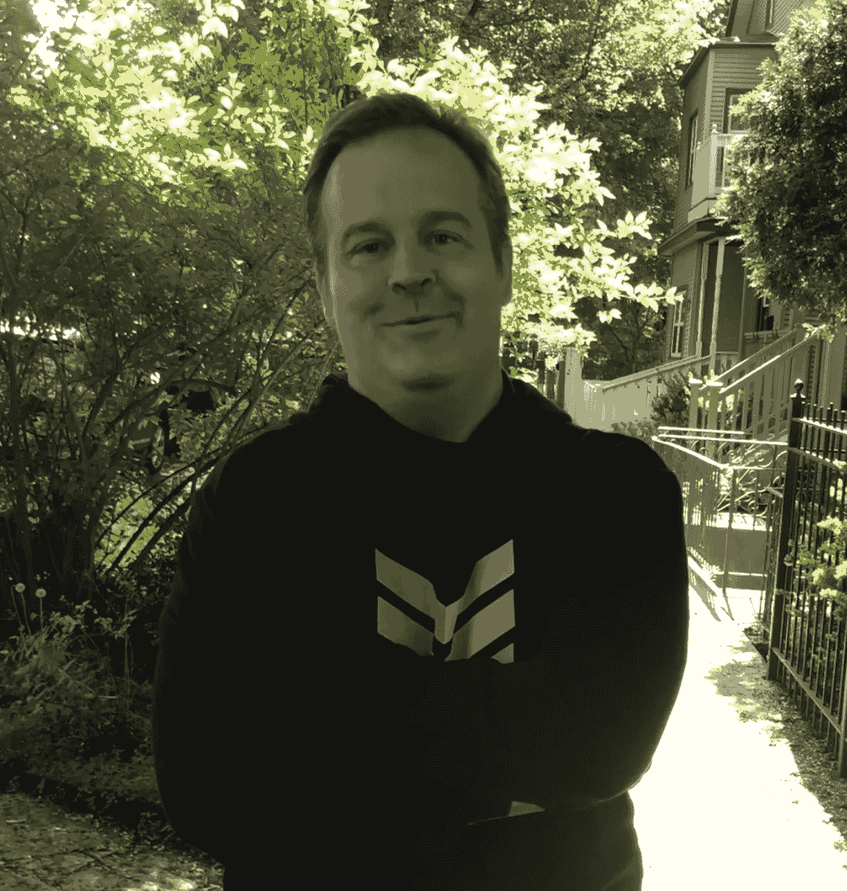

# 迈克尔·克里登:这是一个艰难的时期，只有最好的项目才能存活下来

> 原文：<https://medium.com/hackernoon/michael-creadon-its-a-tough-period-and-only-the-best-projects-will-survive-da52c73cc31d>

迈克尔·克里登(Michael Creadon)是金融市场领域的专业人士，他带来了丰富的知识和对交易行业的见解。二十年来，他一直是芝加哥贸易公司 Traditum 的首席执行官。

这说明他的经历不仅仅局限于一个领域:曾在彭博、时代杂志和美国之音电台担任记者，还在美国驻纳米比亚和平队服役。如今，迈克尔是全球加密研究博客 4Rev 的首席执行官。

**也在今天** [**迈克尔**](https://www.linkedin.com/in/michael-creadon-31404a30) **是 MBN 平台的新团队成员！我们欢迎他加入我们的团队，并问他几个问题。**

你有全球新闻从业经验。你为什么把重点转向金融市场？你今天为什么研究加密货币？

*我曾在芝加哥商品交易所做了 20 年的债券交易员。在那之前，我是彭博和时代杂志的记者。当我在 2017 年离开交易时，我很快就迷上了 cryptos。但是我很惊讶媒体报道如此之少。银行不会谈论密码，主流媒体也很少报道。所以我创建了一个网站，并开始在 LinkedIn 上发帖。我喜欢写作。我的网站不收费，也没有赞助广告。所以我想写什么就写什么。我坚持公开我所有的付费客户，事实上，我是 MBN Global 的首席业务开发官。我觉得能加入这个团队很幸运。我非常喜欢他们正在做的事情。*

**请告诉我们关于 4Rev 的情况。这是这个项目的主要任务？**

4Rev 是一个网站，上面有关于区块链和 cryptos 的文章。我们也有加密引用，允许作家使用我们的平台在区块链上发表他们的作品。这是一次有趣的经历，但老实说，我的大部分时间都花在了 LinkedIn 上。LinkedIn 平台真的令人难以置信。我的作品得到的回应让我感到非常谦卑和荣幸。人们并不总是同意我的观点，这当然没什么，但典型的反应都很有礼貌。我对自己能接触到如此多的观众感到震惊，尤其是在这些人工作的地方。我的帖子最常被高盛、Citadel、JP 摩根、德勤、亚马逊、彭博、摩根士丹利、IBM 等公司的员工阅读。对我来说，这只是证明了一个事实，即网上缺乏高质量的内容。作为一名现代新闻记者，我非常认真地对待自己的责任，并试图在任何时候都保持客观，包括披露信息。事实上，我并没有使用我的平台以一种明确的方式来推广我正在做的项目。我觉得这很不真诚。

**密码市场和 ICO 项目的未来如何？今天，什么样的机制对项目的成功起作用？**

*对于 cryptos 和 BTC 来说，2018 年是艰难的一年。替代硬币也是。BTC 的价格崩溃削弱了这一领域的投资。XLM、BCH 和长期国库券等主要硬币的一系列高调骗局和深度抛售进一步削弱了信心。我长期看好该行业，但我们所处的时期就像雷曼兄弟(Lehman Brothers)倒闭后的时期。我不知道市场还会如此艰难多久。记住，我们也没有央行在一旁等着救我们。这是一个艰难的时期，只有最好的项目才能存活下来。ICO 项目的首席执行官需要足智多谋和创造力，以保持公司的活力。我现在看到一种趋势，即项目在投资上进行合作，分享员工的才能和成本，等等。如果你想留在游戏中，这些步骤是必不可少的。*

**你对数字资产的信任管理有什么看法？你对这个领域的相关性有什么预测？**

我们生活在“共享经济”中。世界上最大的运输公司没有任何汽车(优步)；世界上最大的酒店经营者没有任何酒店(AirBnB)。MBN 平台将把投资者和投资组合经理团结在一个无摩擦、无信任的环境中。这是一个很棒的概念。像任何企业一样，挑战在于获得客户的“认同”。有一天这将是信任管理的未来，但是很难预测何时会被采用。我认为，随着精明的投资者意识到他们可以省去中间人，许多金融顾问将在未来几年失去工作。当然，这种新模式不会是每个人都需要或正在寻求的解决方案，但我相信，随着时间的推移，越来越多的投资者会希望在没有中介的情况下完全控制自己的投资决策。然而，这仍然是一个新概念，不会在一夜之间发生。

**我们很荣幸能和你合作，迈可！你为什么选择 MBN 平台？**

*我选择与 MBN Platform 合作，因为我热爱交易，我看到了他们所做的事情的价值。我还想说，能与如此出色的俄罗斯同行一起参与这个项目，是一种难以置信的荣誉和快乐。我从未访问过俄罗斯，也没有直接与俄罗斯人做生意，我不得不说，整个团队的专业精神和独创性给我留下了深刻的印象。我期待着我们两个伟大国家之间的商业关系得到恢复的那一天，我也非常期待着不久在俄罗斯与你们大家见面。*

谢谢你，迈克尔！

欢迎加入 MBN 团队！