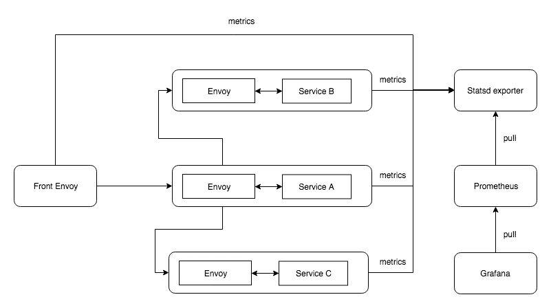
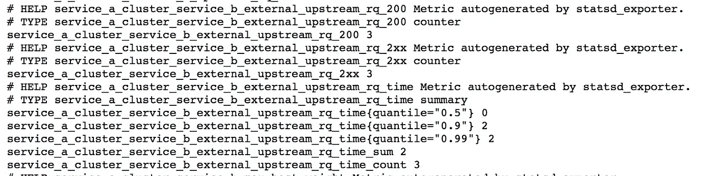
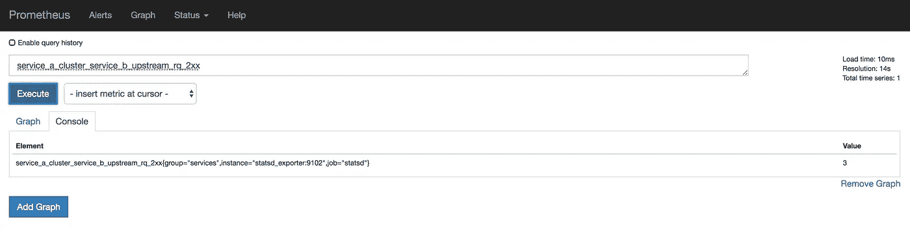
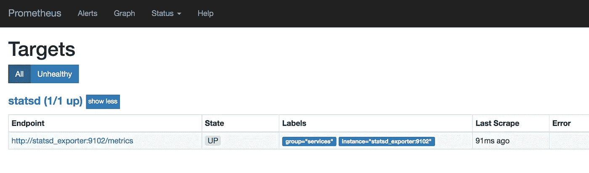
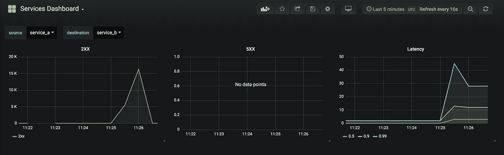

# Prometheus & Grafana 使用 Envoy service mesh 进行微服务监控

> 原文：<https://medium.com/hackernoon/microservices-monitoring-with-envoy-service-mesh-prometheus-grafana-a1c26a8595fc>

如果你是“服务网格”和“特使”的新手，我有一篇文章解释这两者[在这里](/@dnivra26/service-mesh-with-envoy-101-e6b2131ee30b)。

这是**观察特使服务网格**系列的第二篇文章，你可以在这里阅读关于分布式追踪[的第一篇文章。](/@dnivra26/distributed-tracing-with-envoy-service-mesh-jaeger-c365b6191592)

对于微服务，在监控方面你不可能一无所知，你至少需要知道有什么地方出错了。

让我们看看 Envoy 如何帮助我们获得一些关于我们的服务的信息。对于服务网格，所有流量都通过网格，这意味着没有服务直接与其他服务对话，服务调用特使，特使将调用路由到目标服务，因此特使将有关于传入和传出流量的上下文。特使通常提供关于[传入](https://www.envoyproxy.io/docs/envoy/latest/configuration/http_conn_man/stats)请求、[传出](https://www.envoyproxy.io/docs/envoy/latest/configuration/cluster_manager/cluster_stats)请求和特使实例的[状态的度量。](https://www.envoyproxy.io/docs/envoy/latest/configuration/statistics)

## 设置

这是我们试图构建的内容的概述



overall setup

## Statsd

Envoy 支持以 2 或 3 种格式发布指标，但是对于这篇文章，我们将使用 [statsd](https://github.com/b/statsd_spec) 格式。

也就是说，流程将是，Envoy 将指标推送到 statsd，我们将使用 [prometheus](https://github.com/prometheus) (一个时间序列数据库)从 statsd 提取指标，然后我们将使用 [grafana](https://github.com/grafana/grafana) 可视化指标。

在我们的设置图中，我提到了 statsd exporter 而不是 statsd，这是有原因的，我们不会有这样的 statsd，我们将有一个转换器(服务),它将接受 statsd 格式的数据并以 prometheus 格式公开它。帮我们完成任务。

特使的衡量标准主要可以分为两类

1.  计数器:一个不断增长的度量。例如:请求总数
2.  度量:可以上升或下降的度量，就像即时值一样。例如:当前 CPU 利用率

让我们来看一个带有 stats sink 的特使配置

Envoy configuration with stats sink

第 8–13 行告诉 Envoy 我们需要 statsd 格式的指标，我们的 stats 的前缀是什么(通常是您的服务名)以及我们的 statsd 接收器所在的位置

第 55–63 行在我们的环境中配置 statsd 接收器

这就是从 Envoy 获取统计数据所需的全部配置。现在，如果您查看第 2–7 行，有两件事情正在发生

1.  Envoy 在端口 9901 上公开了一个管理端点，您可以使用它来动态更改日志级别、查看当前配置、统计信息等..
2.  Envoy 还可以生成类似 nginx 的访问日志，你可以用它来了解你的流量。访问日志的格式也是可配置的，第 29–33 行就是这样做的

您需要将相同的 stats 配置添加到我们系统中服务的另一个侧车特使(是的，每个服务都有自己的特使侧车)。

服务本身是用 go 编写的，除了通过 Envoy 调用其他服务之外，它们不做太多事情。你可以在这里查看服务和特使配置。

因此，现在我们只有 statsd exporter，这样，如果我们运行 docker 容器(docker-compose build & docker-compose up)并向前端 Envoy(localhost:8080)发送一些流量，Envoy 将开始向我们的 statsd exporter 发送有关流量的指标，后者会将指标转换为 prometheus 格式并在端口 9102 中公开。

这是 statsd exporter 中的统计信息



metrics from statsd exporter in prometheus format

将有数百个统计数据，在上面的屏幕截图中，我们看到了服务 A 和服务 b 之间通信的延迟指标。上图中的指标采用了普罗米修斯格式

```
metric_name ["{" label_name "=" `"` label_value `"` { "," label_name "=" `"` label_value `"` } [ "," ] "}"] value [ timestamp ]
```

你可以在这里了解更多关于[的信息。](https://github.com/prometheus/docs/blob/master/content/docs/instrumenting/exposition_formats.md)

## 普罗米修斯

我们将使用[普罗米修斯](https://prometheus.io/)作为我们的时间序列数据库来存储我们的指标。Prometheus 不仅仅是一个时间序列数据库，它本身也是一个监控系统，但是在我们的设置中，我们将使用它作为度量的数据存储。需要注意的一件重要事情是，prometheus 是一个基于拉动的系统，这意味着您必须告诉 prometheus 从哪里获取指标，在我们的情况下，它将是我们的 statsd 导出器。

将 prometheus 添加到等式中非常简单，我们只需要将 scrape 目标(statsd exporter)作为配置文件传递给 prometheus。这是配置的样子

prometheus configuration to scrape from statsd exporter

scrape_interval 是 prometheus 从目标获取配置的频率。

所以现在我们应该有普罗米修斯了，也有一些数据在普罗米修斯里。让我们启动 locahost:9090，看看它有什么



prometheus query page

如我们所见，我们的指标是可用的。你可以做的不仅仅是选择现有的指标，你可以在这里阅读普罗米修斯查询语言。它还可以根据我们的查询绘制图表。还有一个警报系统。

如果我们在 prometheus 中加载目标页面，我们会看到所有的刮擦目标以及这些目标的健康状况



prometheus targets

## 格拉夫纳

Grafana 是一个很棒的可视化和监控解决方案，支持很多后端，如 Prometheus，Graphite，InfluxDB，ElasticSearch 等...

Grafana 有两个我们需要配置的主要组件

1.  data source:grafana 将从中获取指标的后端。您可以使用如下所示的配置文件来配置数据源

configuring prometheus as a datasource in grafana

2.仪表板:这是您可视化来自数据源的指标的地方。Grafana 支持各种各样的可视化元素，如图表、单个统计数据、热图等……你可以扩展它，并使用插件构建自己的元素。

我对 Grafana 的唯一问题是，没有将这些仪表板开发成代码的标准方法。有一些第三方库支持这个，我们将使用来自 weaveworks 的一个名为[的 grafanalib](https://github.com/weaveworks/grafanalib) 。

这是我们试图构建的用 python 代码表示的仪表板

Grafana dashboard as code using grafanalib

我们正在构建 2xx、5xx 和延迟的图表。第 5–22 行很重要，它提取我们的设置中可用的服务名作为 grafana 变量，它使我们的仪表板动态化，这意味着我们将能够选择我们想要查看这些统计数据的源和目标服务。更多关于变量[这里](http://docs.grafana.org/reference/templating/)。

您必须使用 grafanalib 命令从上面的 python 文件生成仪表盘

```
 generate-dashboard -o dashboard.json service-dashboard.py
```

当心生成的 dashboard.json 不容易阅读。

所以我们只需要在启动 Grafana 时传递仪表板和数据源。当你访问 http:localhost:3000 时，你会看到:



grafana dashboard

这就是您的 2xx、5xx 和延迟图表，您还可以看到下拉菜单，从中可以选择源和目标服务。grafana 有比我们讨论的更多的功能，它有一个强大的查询编辑器，一个警报系统。更重要的是，使用插件和应用程序，一切都是可扩展的，在这里查看一个例子。如果您正在可视化 redis、rabbitmq 等常见服务的指标..Grafana 有一个[公共仪表盘](https://grafana.com/dashboards)库，你可以从那里导入并使用它们。Grafana 的另一个好处是，您可以用配置文件和代码创建和管理一切，而无需过多地使用 UI。

我强烈建议你和普罗米修斯和格拉夫纳一起玩，找出更多的答案。谢谢你的时间。请留下您的反馈意见。

你可以在这里找到所有的代码、配置文件。

[](https://github.com/dnivra26/envoy_monitoring/) [## dnivra26/envoy_monitoring

### 使用 envoy 服务网格监控微服务的演示，Prometheus & grafana-dni vra 26/envoy _ monitoring

github.com](https://github.com/dnivra26/envoy_monitoring/)