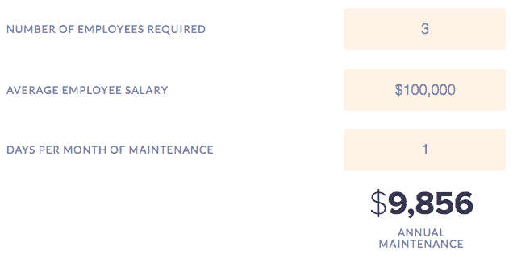
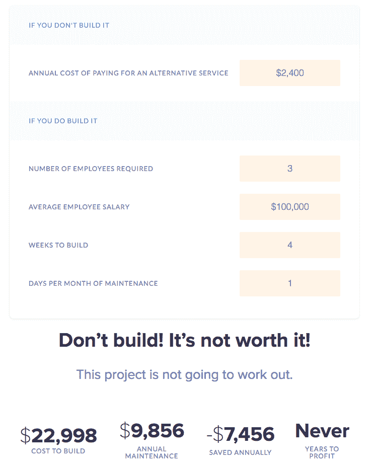

# 微服务:应该自建还是购买？

> 原文：<https://medium.com/hackernoon/microservices-should-you-build-or-buy-319ec17f5573>

当投资微服务架构时，需要考虑很多事情，从你的阵营中的[文化](https://buttercms.com/books/microservices-for-startups/designing-a-successful-microservices-engineering-culture)到要采用的[微服务测试策略](https://buttercms.com/books/microservices-for-startups/five-microservice-testing-strategies-for-startups)。另一个很容易被忽视的根本问题不是你 ***能否*** 构建微服务，而是从商业角度看你 ***是否应该*** 。简而言之:

**你应该构建微服务还是购买它？**

因为这是一个涉及公司所有利益相关者的重大决策，所以我为 CTO 们写了这篇文章，这些 CTO 们不仅要带领一个工程师团队实现他们的技术愿景，还要与业务的其他部分进行交互。这是一个多方面的问题，所以让我们深入研究一下。

# 构建还是购买:传统的决策框架

在设计微服务架构的初始阶段，您将确定项目成功所需的不同组件和功能。其中一些组件将有自己的生命周期，并以不同的速度发展，而其他组件将基本保持不变。在这个过程中，你必须做出选择:建造还是购买？

对于大多数开发者来说，建造的冲动是压倒一切的。我和其他人一样对此感到内疚。

我们对自己克服复杂障碍和项目的能力深感自豪。我们可以通过编码摆脱一切，只是需要多一点时间。因此，当购买基础设施的前景出现时，典型的开发人员会嗤之以鼻。

像这样的陈述，“不管怎样，我最多能在几周内完成！”“既然我可以自己建造，为什么要花那么多钱？”经常被扔在办公室里。

事情是这样的，在某些情况下，那些顽固的开发者实际上是对的。他们可以从零开始建立一个可靠的解决方案。但在其他时候，他们可能高估了自己的能力，或者它将花费的时间，或者它将产生的成本。例如，一群有才华的开发人员可能会在周末的黑客马拉松中构建一个微服务，但他们可能会花一个月左右的时间来完成它。这就像一个稍加修改的邓宁-克鲁格效应:你有一个才华横溢的团队，但他们可能很难客观地确定从头开始构建某个东西的成本(时间和美元)。

即使您的开发团队可以构建微服务架构，您也必须考虑全局，预见构建或购买能否帮助您的企业高效、谨慎地向客户交付价值。

# 构建微服务时要考虑的因素

如果你决定从头开始构建微服务，在冒险之前你需要考虑相关的成本。

## 开发成本

作为一名 CTO，你知道开发人员并不便宜，开发成本会很快增加。你需要委托开发人员来创建和测试新的微服务。您还需要考虑开发时间比最初预期的时间长的可能性。无论估计的工作量是多少，都要加上 2-3 倍的模糊系数。

例如，假设您的团队由 3 名工程师组成，他们的年薪都是 100，000 美元，他们估计需要 2 周时间来构建一个新的微服务。实际上，在生产准备就绪之前，当所有的事情都完成后，假设需要 4 周时间(2 倍蒙混因素)。构建这种微服务需要花费 23，000 美元的开发时间。

此外，我们还要考虑在构建新的微服务时，需要给多大的技术自由度。如果你让一个精通出血边缘框架的开发人员独自构建新服务，而他们离开了。这将导致在解决知识差距方面的一些令人头疼的实际成本。

## 维修费用

一旦您的团队创建了微服务，现在它就是您的宝贝了。照看和维护它是你的责任。与任何软件一样，您需要解决出现的任何错误和问题。

除了维护系统，你的团队也有责任在需要的时候添加任何必要的改进。如果您的服务执行营销功能，营销团队将希望在服务中添加特定的功能，以便能够实现他们的目标。

但是，继续履行这些责任是一个是否有足够能力这样做的问题。根据 [Galrath](http://galorath.com/software_maintenance_cost) 的说法，软件维护占总拥有成本的 75 %,这意味着开发人员的大部分时间都花在了服务上。

继续上面的例子，让我们保守地假设你的团队每个月会花 1 天的时间来维护(bug 修复)和改进(新特性)这个微服务。这看起来成本合理吗？

## 缩放成本

随着您的业务增长，您的微服务将面临更多需求，并且需要随着时间的推移进行扩展。当你有 100 个客户时，你的微服务的 V1 可能工作得很好，但是当你有 1000 或 10000 个客户时会发生什么呢？您的微服务将需要扩展以满足该需求，这意味着在最少的开发运维时间内找出如何进行水平扩展。

## 上市时间更慢

把让你的团队构建它的美元成本放在一边，让我们考虑构建而不是购买的声誉成本。

首先，从零开始构建您的微服务架构需要更长的上市时间。更慢的上市时间意味着你的产品或服务更晚的发布日期——这反过来推迟了任何收入的到来。

更糟糕的是，随着竞争对手更快地进入你的目标市场，你的品牌本身可能会受损，让你在市场上处于劣势——当你最终到达那里时。如果它不是你核心功能的一部分，当你可以购买它的时候，你为什么还要花时间去做呢？

## 声誉成本

坦率地说，增加新的能力——特别是当你试图在预算和严格的时间框架内完成时——可能是困难的。更糟糕的是，不管你的团队多么努力地工作，如果最终它的功能就像一个匆忙的时间表的产品，这对你的公司来说是一个坏消息。如果它不工作或者不完善，客户不会在乎花了多少个深夜来构建它。

# 购买微服务时要考虑的因素

购买可以帮助你跨越大部分(如果不是全部)与构建微服务相关的负面因素。然而，在决定购买功能而不是建筑之前，仍有许多问题需要考虑:

## 供应商声誉

有许多工具和产品可供您直接插入堆栈。但是在一个理想的世界里，你想要的是久经考验的、已经建立了声誉的东西。

确认服务可靠性的一个好方法是通过社会证明。留意评价、评论、评级和推荐。社交验证越积极可信，你就知道这是一项可靠的服务。

## 支持

如果服务出现任何问题，您希望确保在发生任何情况时，您可以随时获得支持。查看支持是否容易获得也是明智的。查看该服务是否通过网络聊天、电子邮件或电话提供支持。理想情况下，您需要全天候紧急支持。

## 集成

您需要一种可以轻松插入堆栈的服务。选购微服务时，请检查兼容性。随着技术的发展，你还应该尽可能地寻找一些经得起未来考验的东西。

# 当建造有意义的时候

在两种情况下，选择构建是最佳解决方案。

首先，如果您的微服务构成了您组织的核心功能，并且是您业务的关键优势。当涉及到技术时，保持你的产品或服务的核心是最好的。

其次，如果你根本无法在市场上找到适合你需求的产品，那么构建更有意义。这在今天的市场上很少见，但并非不可能。

# 当购买有意义时

如果你需要的功能不是你产品核心的一部分，因此不是市场中的一个关键区别点——比如身份验证或内容管理软件——那么购买就更有意义了。如果您遇到一家能够轻松与您的现有堆栈集成的高质量供应商，那就更是如此。

如果你发现一个高质量的第三方服务或 API 可以为你的产品增加功能，购买它也是更明智的。

最后，完美是足够好的敌人。并不是你公司的每个方面都需要完全定制的功能——有时候，最好是从货架上拿一些做得很好的东西，而不是花费时间和金钱来试图构建一些“完美”的东西

# 市场正在揭示

现在原料药和 SaaS 产品的市场正在蓬勃发展，因为它们有效。他们填补了顽固的开发人员试图用良好的意图、人才——对公司来说很不幸——大量的时间和金钱来填补的空白。

但是不要相信我的话。2018 [MarTech Supergraphic](https://chiefmartec.com/2018/04/marketing-technology-landscape-supergraphic-2018/) 记录了 6829 个营销技术解决方案，比上一年增长了 27%。很明显，寻求购买而非制造的公司的需求在不断增长，尤其是在涉及非关键竞争优势的技术时。

CMS 是一个微服务(或一组微服务)的完美例子，对于大多数企业来说，它不是一个差异化因素。它是一个内部工具，用于帮助您创建、管理和发布内容，因此尽管它会影响客户体验，但 CMS 永远不会让您在竞争中脱颖而出。

因此，CMS 是一种应该购买而不是建造的技术，尤其是如果你能找到一种既能满足今天的需求，又能满足明天需求的 CMS。例如，ButterCMS 是一个无头 CMS，它通过将内容与前端交付层分离，使品牌能够将[内容用作微服务](https://buttercms.com/blog/buttercms-vs-wordpress-headless-cms-vs-traditional-cms)。此外，由于 ButterCMS 是 SaaS，并利用 cdn 和 API，因此随着您的客户和流量的增长，所有的内容扩展都会为您处理。

对于其他例子，我们可以看看本书中介绍的公司，包括用于搜索的 [Algolia](https://www.algolia.com/) ，用于日志管理的 [Scalyr](https://www.scalyr.com/) 和 [Sumo Logic](https://www.sumologic.com/) ，用于实时数据流的 [Pusher](https://pusher.com/) 和 [PubNub](https://www.pubnub.com/) 等。

# 重新发明轮子从来都不划算

简单回顾一下，让我们快速回顾一下构建更好的两个场景，以及购买微服务更有意义的三个场景:

# 何时构建微服务

1.  微服务构成了您的产品、服务或组织的核心功能，因此是您业务的一个关键优势
2.  你无法在市场上找到满足你需求的产品

# 何时购买微服务

1.  你所需要的功能不是你产品核心的一部分，因此也不是市场上的一个关键区别点
2.  你会发现一个高质量的第三方服务或 API 可以增加你的产品或服务的功能和深度
3.  你想逃避对完美的追求，需要一个今天就能完成工作的解决方案，而不是一个抽象的“完美”想法，需要几个月的时间来构建和维护

虽然技术能力在这个决定中发挥了作用，但它实际上归结为成本和效率，让你的团队专注于公司最擅长的事情，让其他人处理你不感兴趣的事情。

回到我们早先的构建经济学的例子，让我们假设你发现了一个每月花费 200 美元的 SaaS 服务，你正考虑购买它作为你自己构建它的替代方案。诚然，如果你是一家初创公司，每月 200 美元足以让你停下来思考一下，因为这似乎是一大笔钱。让我们来看看它与建筑相比如何:

当你归结起来，看看宏观的真实成本，建造与购买的问题可以很简单。作为首席技术官，我们需要始终从战略角度看待什么对业务最有利，即使我们内心深处的软件开发人员(和/或我们的团队)已经迫不及待地想要证明我们能够构建它。

*感谢以下个人对本文的贡献:* [*本·柯蒂斯*](https://twitter.com/stympy?lang=en)*[*斯蒂芬·布鲁姆*](https://twitter.com/stephenlb?lang=en)*[*达比·弗雷*](https://twitter.com/darbyfrey)*[*克里斯蒂安·比根*](https://twitter.com/raychaser)*[*斯蒂芬·齐尔*](https://twitter.com/stefanzier)****

***如果你喜欢这篇文章，请在下面鼓掌帮助它传播！更多类似内容，请关注我们的[*Twitter*](https://twitter.com/ButterCMS)*和* [*订阅我们的博客*](https://buttercms.com/blog/) *。****

**如果你想在你的网站上添加一个博客或者内容管理系统，而又不想在 Wordpress、 [*上浪费时间，你应该试试黄油内容管理系统*](https://buttercms.com/) *。* [ButterCMS](https://buttercms.com/) 是一个无头的 CMS，让你使用任何编程语言构建 CMS 驱动的应用，包括 [Ruby](https://buttercms.com/ruby-cms/) 、 [Rails](https://buttercms.com/rails-cms/) 、 [Node.js](https://buttercms.com/nodejs-cms/) 、 [Python](https://buttercms.com/python-cms/) 、[ASP.NET](https://buttercms.com/asp-net-cms/)、[烧瓶](https://buttercms.com/flask-cms/)、 [Django](https://buttercms.com/django-cms/) 、 [Go](https://buttercms.com/golang-cms/) 、 [PHP](https://buttercms.com/php-cms/) 、**