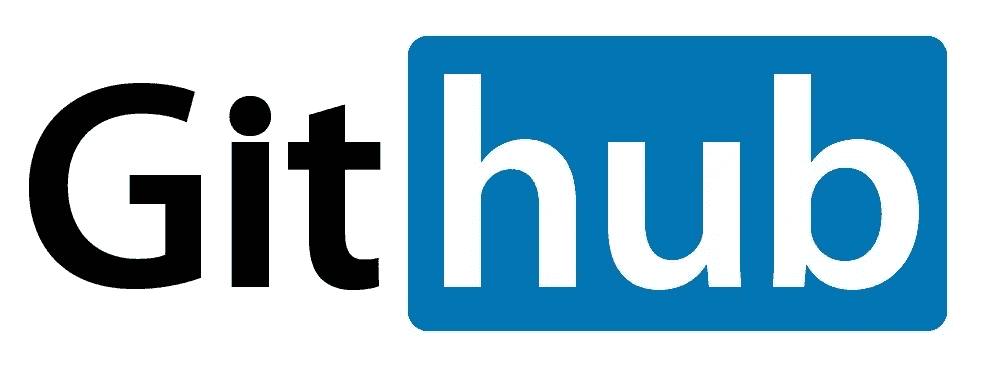

# 微软和 Octosition

> 原文：<https://medium.com/hackernoon/microsoft-and-the-octosition-d3eebcabdc71>

正如大多数人所知，GitHub 是一个卓越的基于网络的软件协作和社交网络，受到全球 2800 万开发者的尊敬，最近被微软收购。虽然对于这样一项收购的后果存在大量的担忧和不确定性，但鉴于微软刚刚花费 75 亿美元购买了一个每年产生约 1.3 亿美元收入的平台，并立即更换了其领导地位，有两件事是肯定的，即微软不能为了有机增长而让 GitHub 自行其是，他们也不打算这样做，所有这些都立即证明了开发社区产生的担忧。

首先，重要的是要认识到，上市公司的每一个举动都是权力的攫取，仅此而已，微软收购 GitHub 也不例外。一旦任何一家公司都是由寻求个人财富而不承担任何个人责任的情感无知的人资助的，就像这样，我们看到的空洞的东西是战略性的，而不是内在的，他们声明的价值观往往更符合宣传，而不是准确描述他们真正代表的东西。因此，不管匿名的泰勒·斯威夫特粉丝账户和其他狂热分子对此次收购有什么看法，并购也不例外，如果不是标准的话，投资回报(ROI)、未来收入潜力和内在风险等指标往往主导这些讨论，而不是公司有多关心；在这方面，越少越好。显然，可能会有一些上市公司能够一往无前，但不会误把异常值当成平均值；我们可以在另一篇文章中探究这背后的科学。

How about no? Advertisements, Azuretisements, same thing.

虽然许多人嘲笑微软为 LinkedIn 支付的价格过高，LinkedIn 以大约 300 亿美元(60 美元/用户)的价格被收购，但其年收入仍是 GitHub 的大约 10 倍，GitHub 每年约 10 亿美元，他们以 75 亿美元的价格收购 GitHub，每用户支付 267 美元，而 GitHub 每年仅产生 1.3 亿美元的收入。如果他们为 LinkedIn 支付这么多，他们将不得不支付超过 1200 亿美元。此外，LinkedIn 的年回报率也是 4%，远低于投资者通常希望在上市公司看到的 7%的最低回报率，但仍是 GitHub 的两倍多，目前 GitHub 的回报率约为 1.7%。从数字上看，微软对 GitHub 的收购让 LinkedIn 的收购看起来像登月一样辉煌，而没有将其大量货币化的意图。

虽然 7%看起来有些武断，但在某一点上，如果预期的投资回报率低于 7%，你的钱放在银行收利息或风险较低的投资上会更好。然而，如果他们让 GitHub 保持不变，他们的年回报率将只有 1.7%，比 LinkedIn 的最低投资回报率低大约 4 倍，微软需要 57 年才能看到投资回报，而 LinkedIn 需要 30 年才能看到回报。不用说，从投资者的角度来看，如果没有带来更多收入的重大变化，这是完全站不住脚的；不管是直接的还是间接的。不幸的是，有更多的方法使这些产品变得更差，而不是变得更好，微软已经证明，他们甚至不能改进自己的产品，更不用说别人的了，过去失败的收购和挥霍的公司是这种无能的鲜明提醒；因此引起了发展界的关注。

Source: [https://twitter.com/TobozoTagada/status/1003613402735013890](https://twitter.com/TobozoTagada/status/1003613402735013890)

简而言之，从投资回报率的角度来看，微软必须做出重大改变，才能将 GitHubs 的收入至少提高到与 LinkedIn 相当的水平，大概从每年 1.3 亿美元提高到每年 3 亿美元，以对冲投资者要求管理层流失的呼声，但理想情况下，这些收入应该在 5.25 亿美元左右，即 7%。然而，为了实现这一点，微软最有可能尝试将 GitHub 用作 Azure 的销售渠道，但即使这样也不能保证 Azure 和微软的大多数其他产品在不是由合作伙伴主导的市场上是无效的，这些合作伙伴占了他们商业收入的 95%,并且往往会在自由市场上受到上述合作伙伴的影响。更糟糕的是，随着营销对象的智力增加或对策略的认识增加，营销变得不那么有效，如果他们很好地意识到正在利用的策略，这一点尤其如此，因为这个行业中的许多人在构建用于采用所述策略的工具时就是如此。不用说，这样的方法可能不会在 GitHub 用户中很好地工作，你不应该期望你的普通广告。

相反，微软最有可能试图改变 GitHub，使其在 Azure 中测试 GitHub 的代码和沙盒变得非常容易，同时简化他们的上线能力，并为他们提供一个大规模的工作平台；这就是为什么他们在过去的一年里一直对 Linux 穷追不舍。然而，当考虑到微软的既定目标是寻找机会巩固他们的解决方案并增加转换成本，而不是生产力时，如果开发人员不上当，不要感到震惊，因为他们痛苦地意识到这一点，甚至因为这样的原因不再为微软平台开发。由于这种开发方法，Azure 也被设计成以同样的方式运行，因此从长远来看比其竞争对手要昂贵得多，并且构建这些解决方案的人会因为很好地意识到这一点而得到很多报酬；开发人员和工程师所做的就是为人们节省金钱、质量和时间。

然而，人们似乎忘记了开源运动是出于对像微软这样的公司和他们所代表的东西的怨恨而创立的。因此，为了让微软在 GitHub 上取得成功，为积极增加收入而做出的改变也必须以不疏远用户的方式推出，这些用户在历史上和哲学上反对微软作为唱片公司和工作人员，并说服他们作为一个公司而不仅仅是 GitHub 花更多的钱。如果他们让 GitHub 有机增长，同时用工具来构建令人敬畏的东西，这一切都很好，但当他们已经易手并被 Xamarin 的主要销售者领导时，谁又能理性地期待这一点呢？这几乎是不言而喻的，但首席执行官职位的易手并没有让公司保持不变，所以我们可以在这个节骨眼上放弃微软不去管它的想法。

如果每个用户的成本，投资回报率，或者微软把所有东西都变成垃圾的倾向还不够危险的话，那么当如上所述对他们的用户群进行更仔细的检查时，购买这样一个巨大的平台所涉及的风险是天文数字。作为一项网络服务，GitHub 的价值几乎完全取决于它的用户群，而这个用户群又是一个围绕开源而建立的社区，它往往与微软等公司竞争。因此，平台减少的风险是巨大的，GitHub 的主要竞争对手 GitLab 已经看到了项目、存储库和从 GitHub 迁移的请求的巨大峰值，这仅仅是因为这次收购的谣言，更不用说它的声明了。对微软来说更糟糕的是，我们甚至可以预期在不久的将来这个市场会有更多的竞争。因此，他们的单位用户成本和风险应该会增加，而潜在的投资回报率甚至会下降到比上面所说的还要低，这在这笔交易的墨迹还没有干透的时候，并不是一个好兆头。

不过，如果用户为了 GitLab 或其他尚未发明的服务而中断，不管微软仅仅因为他们是谁而对 GitHub 做了什么，这些都无关紧要；而且理由很充分。尽管微软在收购方面有着糟糕的记录，但几十年来，可怕的称职开发人员和拙劣的伟大想法一直是他们的惯用手法，与他们最近收购 GitHub 相关的内在风险可能只是一种绝望的行为，他们在他们无法有机吸引的生态系统的噩梦中购买开发支持。基于这一点和对 Gitlab 的最初迁移，我不认为一些疲惫的 Ballmerite 尽他最大的努力模仿一个时髦的大师和一些免费的东西足以动摇开发者坚持下去，并忽视微软每天都在失去相关性的事实，或者它只是一个真正的垄断(根据法律的法律定义)试图采取与任何垄断一致的行动。

延伸阅读:

 [## 本·汤普森的《开发者的成本》

### 昨天看到了三个开发者相关的公告，两个来自苹果，一个来自微软。前者是…的一部分

stratechery.com](https://stratechery.com)  [## 为什么微软愿意花这么多钱买 GitHub

### 执行摘要微软以 75 亿美元收购 GitHub 是如何确定价值的完美例证…

hbr.org](https://hbr.org/2018/06/why-microsoft-is-willing-to-pay-so-much-for-github)  [## 15 年前，一名法官命令微软拆分

### 垄断裁决从未导致“婴儿账单”公司的诞生

time.com](http://time.com/3553242/microsoft-monopoly/)