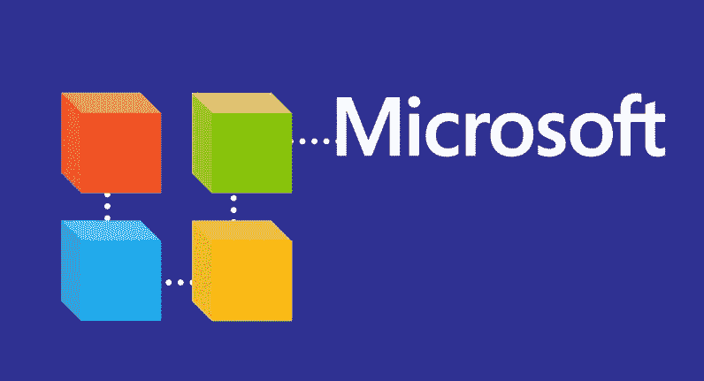

# 微软正在构建区块链来管理数字身份

> 原文：<https://medium.com/hackernoon/microsofts-building-on-the-blockchain-to-manage-digital-identities-1864af02f68b>

微软要证明区块链的反对者是错的。为了展示这项技术在加密货币应用之外的潜力，雷德蒙德巨头宣布计划使用区块链理工大学作为存储和处理数字身份数据的基础。

在与分散身份基金会( [DIF](http://identity.foundation/) )合作后，微软透露了其依靠区块链技术解决我们在数字化管理身份和个人数据时面临的一些挑战的计划，例如改善物理和数字世界的隐私和安全。

该公司在[的一篇博客文章](https://cloudblogs.microsoft.com/enterprisemobility/2018/02/12/decentralized-digital-identities-and-blockchain-the-future-as-we-see-it/)中表示:“我们认为，个人拥有并控制其数字身份的所有元素是至关重要的。”。“个人需要一个安全、加密的数字中枢来存储他们的身份数据并轻松控制对这些数据的访问，而不是向无数应用和服务授予广泛的许可，并将他们的身份数据分散在众多提供商中。”

为此，该公司正在开发一种链外解决方案——类似于闪电网络——这将使其能够处理大量的身份数据，而不会使区块链网络拥塞。

虽然该公司尚未展示其解决方案的工作原型，但它已经分享了与 DIF 联合研究的一些发现。除了用于像[比特币](https://thenextweb.com/topic/bitcoin/)和以太坊这样的加密货币之外，Windows 的制造商认为区块链理工大学非常适合许多其他应用。

一个关键要点是，区块链可以证明在将控制权交还给客户以及安全存储个人数据方面发挥了重要作用，而不是依赖第三方服务和解决方案。

“今天，用户广泛同意无数的应用程序和服务收集和保留他们的数据，用于超出他们控制的用途，”帖子写道。“随着数据泄露和身份盗窃变得越来越复杂和频繁，用户需要一种方法来掌控自己的身份。”

# 它实际上是如何工作的

为此，该公司提出了几项新服务:

*   [分散标识符(did)](https://w3c-ccg.github.io/did-spec/)—W3C 规范，定义了描述分散标识符状态的通用文档格式
*   [身份中枢](https://github.com/decentralized-identity/hubs/blob/master/explainer.md) —一种加密的身份数据存储，具有消息/意图中继、证明处理和特定于身份的计算端点
*   [Universal DID Resolver](/decentralized-identity/a-universal-resolver-for-self-sovereign-identifiers-48e6b4a5cc3c) —一个解析区块链各地 DID 的服务器
*   [可验证的凭证](https://w3c.github.io/vc-data-model/) —一个 W3C 规范，定义了一种用于编码基于 DID 的凭证的文档格式

“在研究了分散存储系统、共识协议、区块链和各种新兴标准后，我们认为区块链技术和协议非常适合实现分散标识符(did)，”该公司写道。

根据微软的说法，这些解决方案“可以使开发人员获得更精确的证明集，同时通过处理此类信息而不是代表用户控制信息来降低法律和合规性风险(如 GDPR、KYC/反洗钱)。”

这家传奇的软件提供商很快指出，尽管区块链确实适合此类应用，但以太坊、比特币和莱特币等当前解决方案仍落后于标准的集中式替代方案——特别是在速度、便利性和网络稳定性方面。

“为了克服这些技术障碍，我们正在合作开发运行在这些公共区块链之上的分散式第 2 层协议，以实现全球规模，同时保留世界级 DID 系统的属性，”微软表示。

Redmond 巨兽表示，它将在一系列即将发布的帖子中分享更多的技术细节和概念实现证明。

分散身份应用程序将登陆微软认证应用程序，该应用程序已经被数百万人用来证明他们的身份。

“在同意的情况下，Microsoft Authenticator 将能够作为您的用户代理来管理身份数据和签署证明，”博客帖子解释道。“在这个设计中，只有 ID 是以 chain 为根的。身份数据存储在用户拥有完全控制权的离线加密数据存储中。”

长期以来，微软一直在多个场合表示支持区块链理工大学。

事实上，这家科技巨头是几家公司和银行中的一员，他们展示了在以太坊网络上开发商业应用的雄心。

最近，据说微软正与 IOTA 基金会就其“下一代区块链”解决方案进行合作。这种合作关系最终被证明是[，只不过是客户和软件提供商之间的非正式合作。](https://thenextweb.com/hardfork/2017/12/12/iota-partnership-microsoft-marketplace/)

*这个故事由* [*Mix*](https://thenextweb.com/hardfork/2018/02/12/microsoft-digital-identity-blockchain/) *撰写，最初发表在*[*Next Web 上。*](https://thenextweb.com/shareables/2017/12/07/smart-urinal-ads-toilet/)