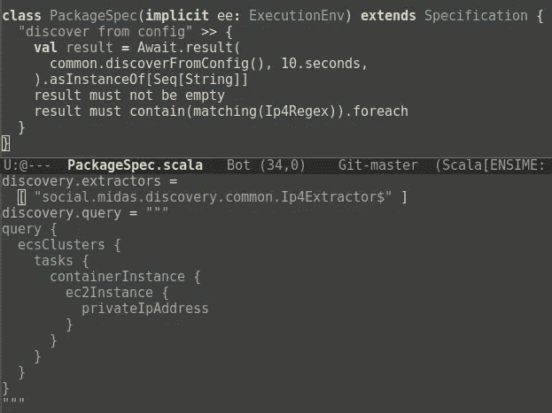

# Midas 开源其服务发现库

> 原文：<https://medium.com/hackernoon/midas-open-sources-its-service-discovery-library-6796c57053e2>



我们的大部分代码目前运行在 [AWS](https://hackernoon.com/tagged/aws) 上。在推广微服务架构的过程中，我们和其他许多人一样，很快就面临了服务发现的问题。当其他人也面临这些问题时，你可能会认为用你选择的搜索引擎搜索`aws service discovery`会给你很多好的解决方案。嗯，我们很失望。这就是为什么我们编写了我们自己的服务发现库，并以开源为荣。这篇文章解释了动机和为什么我们认为我们的方法实际上是最好的。

## 找到真相的唯一点

服务发现的核心是向单一事实点提出正确的问题。了解您的所有服务以及如何获得这些服务的点。让我们考虑几个显而易见的解决方案。

第一步是宣布网络本身为单点真理。您可以使用一种通常涉及发送多播或广播消息的协议。由于 AWS VPC 不支持这些功能，因此我们的用例排除了这种可能性。

第二个选择是建立一个额外的服务，像 [Apache Zookeeper](https://zookeeper.apache.org/) ，你的服务在启动时注册。发现一个服务只是对这个附加服务的一个查询。但是等等，你原来的服务是怎么知道 Zookeeper 在哪里的？我们在这里面对的是一个古老的好问题:先有鸡还是先有蛋。虽然肯定有办法解决这个问题，但它们并不能让我们满意。此外，Zookeeper 成为该解决方案中的单点故障。

在 AWS 领域，还有第三种选择:使用 AWS 本身进行服务发现。AWS 实际上是*知道你的哪个服务/机器/lambdas/你的名字-它正在运行的唯一事实点。有了 [AWS SDK](https://aws.amazon.com/sdk-for-java/) ，我们可以轻松地询问如何到达这些实例。此外，不存在单点故障。当然，AWS 可能会停机(或者至少是它们的 API 查询端点)。但是不管怎样，我们可能不得不逃到另一个地区。*

虽然仔细想想这个解决方案似乎很明显。你很难在栈溢出文献中找到这个建议。

## 配置地狱

所以我们的想法是围绕 AWS SDK 写一个薄薄的层。但是我们应该如何向我们的客户公开这个功能呢？一个好的 API 总是好的，但是当涉及到服务发现的时候就不是很有用了。您通常不希望在代码中直接硬编码带有所有过滤器的组件。您的发现在您的本地开发环境中可能与在您的 CI 测试环境中非常不同。这反过来又不同于筹备和生产。

因此，服务发现本身应该可以通过一个简单的配置文件进行配置。现在，配置语法通常会以某种方式出错。除非您自己是库的维护者，否则您要么有太多的选项使整个东西不可用。或者你只有少数几个选项，可以让你很容易地完成简单的任务，但是一旦它变得更复杂，库就会达到极限。

服务发现尤其棘手。您需要某种特定于领域的语言(DSL ),这种语言使得定义您想要发现的对象、它们应该满足的约束以及您实际需要的对象的属性变得容易。不管怎样，开发好的 DSL 是一项艰巨的任务。所以我们四处寻找现有的解决方案来填补这个空白。我们找到的答案可能会令人惊讶: [GraphQL](https://graphql.org/) 。

GraphQL 最初由脸书开发，并于 2015 年公开发布。大量语言有几种实现 Scala 有 [Sangria](https://sangria-graphql.org/) 。GraphQL 是一种简单的查询语言，倾向于 JSON 风格的语法。在开发 HTTP APIs 时，您可能更愿意将它作为 REST 的替代方案。我们用它来做不同的事情。

## 请举例！

为了了解 GraphQL 是如何工作的，让我们直接看一个例子。假设您想要发现 EC2 实例及其 id 和私有 IP 地址:

```
query {
    ec2Instances {
        id
        privateIpAddress
    }
}
```

这一切都非常清楚明了。JSON 格式的答案如下所示:

```
{
    "data" : {
        "ec2Instances" : [
            {
                "id" : "i-5bc9450cebf76ff90",
                "privateIpAddress" : "172.18.42.252"
            },
            {
                "id" : "i-48eb0089ee2cf0324",
                "privateIpAddress" : "172.18.17.226"
            },
            {
                "id" : "i-f54ee382cf9e1f773",
                "privateIpAddress" : "172.12.57.132"
            }
        }
    }
}
```

看看如何只返回我们请求的属性(即`id`和`privateIpAddress`)?这实际上是 GraphQL 的突出特点和优雅之处。

添加一个过滤器怎么样，因为您只想要名为`midas-rocks`和`midas-is-awsome`的机器:

```
query {
    ec2Instances(
        filters: [{
            name: "tag:Name",
            values: ["midas-rocks", "midas-is-awsome"]
        }]
    ) {
        id
        privateIpAddress
    }
}
```

这不会变得太复杂，对吧？过滤器被简单地映射到 [AWS 的过滤器](http://aws-java-sdk-javadoc.s3-website-us-west-2.amazonaws.com/latest/software/amazon/awssdk/services/ec2/model/Filter.html)参数。因此，你实际上可以使用所有的[过滤器](https://docs.aws.amazon.com/AWSEC2/latest/APIReference/API_DescribeInstances.html)。该查询的输出将类似于上面列出的输出，但是只包含具有正确名称的机器。

现在，对于更复杂的东西:ECS。如果您想发现您的服务在 ECS 上的什么地方运行，您必须发现它运行的 EC2 实例。(不知道这是否会随着 Fargate 而改变。)要获得属于 ECS 集群的所有 EC2 实例，您可以使用:

```
query {
    ecsClusters {
        tasks {
            containerInstance {
                ec2Instance {
                    privateIpAddress
                }
            }
        }
    }
}
```

同样，几乎每个查询级别都有一个过滤器。例如，如果您只想获取 ARN 以`cluster/my-test-cluster`结尾的集群，而在这个集群中，您只想运行属于`foobar`家族的任务的实例:

```
query {
    ecsClusters(filterArn: ".*cluster/my-test-cluster") {
        tasks(family: "foobar") {
            // ...
        }
    }
}
```

前一个查询将产生如下结果:

```
{
  "data" : {
    "ecsClusters" : [
      {
        "tasks" : [
          {
            "containerInstance" : {
              "ec2Instance" : {
                "privateIpAddress" : "172.18.42.252"
              }
            }
          },
          {
            "containerInstance" : {
              "ec2Instance" : {
                "privateIpAddress" : "172.18.17.226"
              }
            }
          }
        ]
      }
    ]
  }
}
```

这里事情变得有点复杂，如果你想从这个例子中提取有趣的部分，需要做很多工作。此外，如上所述，查询将在配置文件中定义。所以，在你的代码中，你没有任何线索来映射到这个结构中，以便得到有趣的部分。这就是提取者进入游戏的地方。

提取器挂钩到 Sangrias [查询缩减器](https://sangria-graphql.org/learn/#query-reducers)机制，该机制提供了一种在早期准备步骤中遍历查询的方法。我们使用它来生成一个定制的查询函数，该函数只从查询结果中提取字段。让我们看看它是如何交互工作的:

```
scala> import scala.concurrent.Await
scala> import scala.concurrent.duration._
scala> import scala.concurrent.ExecutionContext.Implicits.global
scala> import sangria.macros._
scala> val query = graphql"""
     | query {
     |   ecsClusters {
     |     tasks {
     |       containerInstance {
     |         ec2Instance {
     |           privateIpAddress
     |         }
     |       }
     |     }
     |   }
     | }
     | """
query: sangria.ast.Document = // [...]

scala> import social.midas.discovery.common
scala> val fut = common.prepareQuery(
     |   query, extractors=List(common.Ip4Extractor),
     | )
fut: scala.concurrent.Future // [...]

scala> val prepared = Await.result(fut, 10.seconds)
prepared: sangria.execution.PreparedQuery // [...]

scala> val extractor = prepared.userContext.extractor.get
extractor: Any => Seq[Any] = // [...]

scala> val result = Await.result(prepared.execute(), 10.seconds)
result: Any = // [...]

scala> extractor(result).asInstanceOf[Seq[String]]
res0: Seq[String] = Vector(172.18.42.252, 172.18.17.226)
```

## “哥们，这太复杂了！”

当然，这太复杂了。因此有一个总体总结函数，它从配置文件中读取查询和提取器，并在一个`Future`中交付最终结果:

```
scala> Await.result(common.discoverFromConfig(), 2.seconds)
     | .asInstanceOf[Seq[String]]
res3: Seq[String] = Vector(172.18.42.252, 172.18.17.226)
```

我们使用 Lightbend 的[配置库。配置文件如下所示:](https://github.com/lightbend/config)

```
discovery.aws.region = "eu-central-1"
discovery.extractors = [ "social.midas.discovery.common.Ip4Extractor$" ]
discovery.query = """
query {
  ecsClusters {
    tasks {
      containerInstance {
        ec2Instance {
          privateIpAddress
        }
      }
    }
  }
}
"""
```

在我们的主例程中，我们简单地调用`discoverFromConfig`并获取作为 ECS 集群一部分的 EC2 实例的所有 IP 地址。

## 它是什么，不是什么。

不要期望一个完全成熟的库会在 AWS 上发现所有类型的服务！在撰写本文时，这个库只支持在 EC2 和 ECS 上发现 IP4 地址。然而，它正在大力发展。虽然我们不指望 API 会有显著的变化，但肯定有改进的空间。主要是你可以预期发现服务和提取器在不久的将来会快速增长。

毕竟，我们开源这个软件是为了得到你的反馈。我们认为将 AWS SDK 包装在 GraphQL 等查询语言中的建议解决方案在服务发现任务方面非常优秀。告诉我们你对它的看法。我们希望收到您的来信！