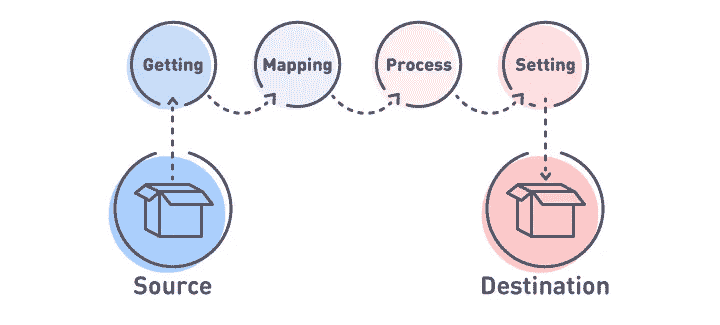

# 迁移 API:自定义 Drupal 到 Drupal 的迁移

> 原文：<https://medium.com/hackernoon/migrate-api-custom-drupal-to-drupal-migration-5c3b86816ece>

[By ADCI Solutions](https://goo.gl/1H4EkN)

每个开发人员迟早都会面临这个被称为“迁移”的可怕(实际上不是)过程。如果您是其中之一，那么您一定听说过 Drupal 7 最优秀和最可靠的模块之一: [Migrate](https://www.drupal.org/project/migrate) 。实际上，这甚至都不是模块，它是一个迁移框架，为从各种来源到 Drupal 的数据迁移提供了极好的 API 和各种强大的工具。在我看来，这种模块的存在对于 Drupal 社区和 Drupal 生态系统非常重要，因为它提供了一种将项目从另一个 CMS 或任何其他框架迁移到 Drupal 的简单方法。因此，我们可以为我们的客户提供一种相对便宜的方式来改变他们的系统，使之支持 Drupal。在本文中，您将了解如何在 Drupal 8 中使用**迁移 API** ，我们将构建一个简单的模块来执行从 Drupal 7 到 **Drupal 8** 的迁移。

# 一点理论

此图中显示了迁移过程。

这是一种常见的迁移方法，没有任何特定的 Drupal 方面。我们有一个源数据库(这不是必要的应该是一个数据库，它可以是 CSV，XML 等。)我们有一个目标数据库，当然是 Drupal 8 **数据库**。正如您在这两个数据库(源和目标)之间的图表上看到的，我们有一个有序操作的列表。

第一个是数据获取，它是一个查询系统，让你从源数据库中获取数据。然后是映射，您可以设置源数据库中的哪个字段应该放在目标数据库的哪个源中。下一步是处理，在这个操作中，我们可以更改来自源数据库的数据。例如，我们需要改变获取数据的格式，以适应 Drupal 8 中的新结构。最后一个是设置，它是目标对象的一部分，设置目标数据库结构中的数据(Drupal 8 数据库结构)。

# Drupal 8 中的迁移 API

让我们看看 Drupal 8 和**迁移模块**的进展。我们在 drupal.org 没有 Drupal 8 版本的迁移项目，因为它的大部分特性都被移植到了 Drupal 核心中:主迁移模块“Migrate”和用于 D6 和 D7 迁移的模块“migrate_drupal”。我说过并不是 Migrate 模块的所有特性都移植到了内核中，但这并不意味着与 Drupal 7 版本相比，我们受到了这种情况的限制，一点也不。所有这些熟悉的特性都存在于 contrib 项目中。下面是为 Drupal 8 提供 Drupal 7 模块所具有的特性的模块列表:

1.  [迁移工具](https://www.drupal.org/project/migrate_tools):这个模块提供了通用的 Drush 命令和管理迁移的基本 UI。
2.  [迁移升级](https://www.drupal.org/project/migrate_upgrade):这里我们可以找到 Drupal 到 Drupal 迁移的 Drush 命令。
3.  [Migrate Plus](https://www.drupal.org/project/migrate_plus) :非常有用的模块。提供 API 扩展，例如，PREPARE_ROW 事件、一个附加的源和目标插件、一个记录良好的示例模块和一个组功能。
4.  [迁移源 CSV](https://www.drupal.org/project/migrate_source_csv) ，[迁移电子表格](https://www.drupal.org/project/migrate_spreadsheet?utm_source=medium&utm_medium=social&utm_campaign=MigrateAPI8&utm_term=-&utm_content=medium-story-MigrateAPI8):两个提供特定源插件的有用模块。

从逻辑上讲，迁移 API 的结构在 Drupal 7 中没有太大的不同:例如，我们有源，然后我们处理来自这些源的数据，之后，所有的数据都到达目的地。在第 8 版中，我们有 3 个主要部分，通过一个插件系统实现:源、过程和目的地。

默认情况下，Drupal 8 包含三个迁移模块(migrate、migrate_drupal、migrate_drupal_ui ),可以帮助您从第 6 版或第 7 版进行简单的升级。此外，它需要 Drupal 8 的一个干净的空安装。我不得不承认，core 的升级对于简单的网站来说非常合适。但这不是我们的案子。

假设我们必须将内容从 Drupal 7 中的一种内容类型“Blog”迁移到 Drupal 8 中的另一种内容类型——也称为“Blog ”,并迁移到现有的站点中。我们的第一次迁移很简单，所以不会有任何复杂的操作，所以数据将按原样迁移。

# 如何为 Drupal 7 到 Drupal 8 的迁移开发一个迁移模块

让我们开始创建我们的第一个迁移模块。首先，我们需要建立一个到 D7 数据库的数据库连接，下面是 settings.php 的一个例子:

一旦建立了到旧站点的数据库连接，我们就可以启用必要的 contrib 模块并开始:

*drush dl migrate_plus，migrate_tools*

*drush en migrate_plus，migrate_tools*

像任何其他 Drupal 8 模块一样，我们需要添加 yml.info 文件，没什么特别的。

下一步，我们需要定义我们的映射。与 D7 不同，在 D8 中，映射是在中定义的配置实体。yml 配置文件。与 D7 相比，它是建筑类的一个很好的替代品。我们将创建 2 个配置文件:迁移组配置和迁移本身配置。所有的配置文件都应该放在下面的“config/install”目录中，以便在安装模块的同时创建配置实体。

# 迁移组的定义

迁移组的配置文件的名称如下:“migrate _ plus . migration _ group . my MIG . yml”。我想注意到 D8 中的迁移组是由 contrib 模块“migrate_plus”提供的，所以我们所有的配置名称都以“migrate_plus”开头。“migrate_plus”表示这是一个组配置,“mymig”表示这是一个 id。以下是带有注释的文件内容:

一旦此配置将被安装并导入到数据库中，我们将在“管理/结构/迁移”页面上看到一个新的迁移组。

# 迁移和映射的定义

正如我所说，迁移也是一个配置文件。这是 yml“migrate _ plus . migration . blog _ my MIG . yml”文件的第一部分，其中定义了 id、迁移组等基本设置:

在下面的部分，我们将设置一个源和一个目的地。Drupal core 提供了一个用于源代码迁移的插件 d7_node。此外，我们设置了需要从 D7 迁移的内容类型，在我们的例子中，它是“blog”。目标插件将是“实体:节点”:

当所有基本设置(如源和目的地)都设置好后，我们就可以进行映射了(定义过程)。这是基本节点属性迁移的简单映射。正如你所注意到的，它很容易阅读和理解。(当然，应该在 D8 中创建“博客”内容类型):

这就是编码部分，现在我们可以安装我们的模块，并将博客文章迁移到 D8 站点。在这里可以查看迁移状态:admin/structure/migrate/manage/my MIG/migrations。我通常使用 Drush 命令来运行迁移过程:

或者

# 充当故障检修员

有时，您可以在完成迁移过程后看到以下消息:0 已处理(0 已创建，等等)。这条消息可能会让你困惑，但是有快速解释和解决方案。发生这种情况是因为您的迁移执行了一次，而您错过了它，所以您只需要使用以下命令回滚迁移:

# 结论

现在我们已经了解了迁移 API 在 Drupal 8 中是如何工作的。您已经看到，在 Drupal 8 中没有 Migrate 模块的发行版并不是什么大事。首先，一些模块的特性被放入了 Drupal core，而其他的在 contrib 项目中是可用的。

此外，我们还有一个如何构建迁移模块的示例。在以后的文章中，我们将更深入地了解如何构建复杂的定制迁移。

*原载于*[*ADCI 解决方案网站*](https://goo.gl/66X6oE) *。*

**作者是** [**丹尼斯·乌索夫**](/@usdv) **，ADCI 方案小组组长**

深入参与客户的业务流程让丹尼斯掌握了构建项目架构的技能。此外，他是一个非常多样化的性格，有几个爱好:拳击，弹低音吉他和口琴，看书。

**在社交网络上关注我们:** [Twitter](https://twitter.com/ADCISolutions) | [脸书](https://www.facebook.com/adcisolutions/) | [LinkedIn](https://www.linkedin.com/company/adci-solutions/)

 [## Drupal 8 核心和 Symfony 组件

### 距离 Drupal 8 发布已经过去了很多时间。而不是仅仅使用面向钩子的范例和…

medium.com](/drupal-stories-an-insiders-view/drupal-8-core-and-symfony-components-1de86638942b)