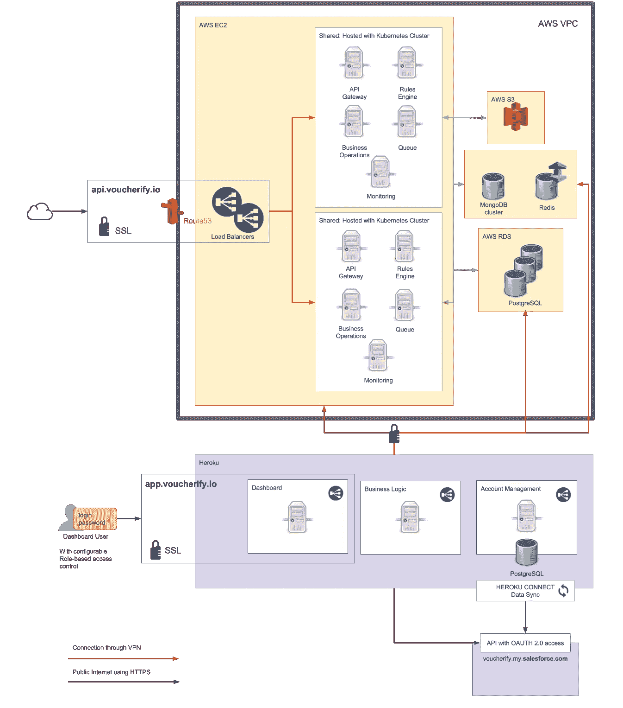

# 在不停止生产的情况下，使用 kubernetes 从 Heroku 迁移到 AWS

> 原文：<https://medium.com/hackernoon/migrating-from-heroku-to-aws-with-kubernates-and-without-stopping-production-4ff6346cccf8>

几个月前，我们成功地将大部分基础设施从 Heroku 迁移到 AWS。现在，当尘埃落定(或者我应该说是云)时，我们想分享我们决定背后的主要驱动力是什么，以及我们如何在不停止 Voucherify API 的情况下进行转移，哪怕是一分钟。

# 架构摘要

为了更好地理解我们这里的推理，让我们快速地看一下什么是 Voucherify 以及这个架构是什么样子的。

Voucherify 提供可编程的构建模块来构建优惠券、推荐和忠诚度活动。它基本上是一个 API 优先的平台，开发者可以用它来建立复杂和个性化的促销活动，比如当客户加入“高级”细分市场时，向他或她发送一封带有特定优惠券代码的电子邮件。它还允许公司跟踪优惠券的兑现，以找出什么样的促销效果最好。最后，它为营销人员提供了一个仪表板，以减轻开发人员维护和监控促销活动的负担。

该平台基本上由 3 个组件组成:

*   公开 API 的核心应用程序
*   服务于仪表板的网站
*   支持非 API 相关作业的微服务

说到数据存储，我们使用 Postgres、Mongo 和 redis trio。

这是它在迁移后的样子:

**负载:**我们服务于 100 多个客户，他们每月发送几百万个 API 调用，包括常规请求和一些更耗电的请求，如批量导入/导出或与第三方集成的同步。‍

# 为什么首先是 Heroku？

当我们在 2015 年启动 Voucherify 时，Heroku 是一个完美的解决方案。它为我们提供了经济高效的托管和出色的持续部署工作流。任何以前使用过 [Heroku](https://hackernoon.com/tagged/heroku) 的人都知道将其与 [Github](https://hackernoon.com/tagged/github) 集成起来有多简单，以及部署起来有多快。最重要的是，Heroku 是有据可查的，社区也非常活跃。

所有这些都让你可以专注于迭代你的产品，而不必在相当长的时间里指派一个专门的人来开发运维；我们的情况是大约 16 个月。在 Heroku 上托管实际上是速度的问题。您只需构建、交付和扩展，无需基础架构(部署脚本、扩展或安全性)的困扰。但这种速度也体现在 Heroku 遍布世界各地的数据中心所确保的低延迟上。这对我们来说非常重要，因为我们的 API 优先平台的主要重点是开发人员的体验——我不知道有哪个开发人员喜欢缓慢的响应。

# 转换点

Heroku 很好，但我们的平台已经开始更有活力地增长。希望每天处理成千上万个 API 调用的新企业客户。我们用游击的方式来攀登 dynos 变得越来越昂贵。我们知道，从长远来看，这在财务上是不可行的。由于我们是一个自举企业，我们必须做出反应。

我们的账单是这样的:

*   API 服务——750 美元(只有处理流量的 Dynos，没有数据库)
*   网络仪表板——50 美元
*   下一个 Dyno 用于处理额外的 API 流量，至少 50 美元
*   在大规模操作(导入、导出)的情况下，我们需要更大的容器和额外的内存。因此，每个 web Dyno 的成本上升到了 250 美元。

但是价格并不是我们离开 Heroku 的唯一原因。

**首先是**，我们开始面临奇怪且难以调试的基础设施问题。有几次我们注意到我们的平台有问题，并不确定地回应。我们去找问题，却发现(很久很久以后)问题出在赫罗库身上。状态页面没有立即更新。有时他们反应很快，有时我们不得不自己解决问题，因为修复需要几个小时。

**其次**，Heroku(或者我猜任何其他 PaaS)在资源利用上很差。Heroku 计划对机器的资源结构非常严格。正如我们所知，这种资源限制策略是重要且合理的，我们应该记住，每个应用程序都是不同的，因此它需要一个适当的 CPU/内存利用率配置文件。实际上，当我们升级计划以获得更多内存时，我们为额外未使用的 CPU 能力付出了代价。当你需要扩展你的应用时，它变得越来越明显和昂贵。让我们来看看我们的情况。[我们的基础设施工程师汤姆](http://twitter.com/frakti)说:

> 现在，对于完全相同的月价格(750 美元—只有服务，没有数据库)，我们在管理批量操作方面没有问题，因为我们合理地利用了资源。此外，我们可以处理 600%以上的流量。

**第三，**缺少私有 IP 地址——我们收到通知说我们的应用程序正在生成垃圾邮件流量，但事实并非如此。此外，我们的一些企业客户有控制出站流量的安全策略，他们要求我们提供他们防火墙的 IP 地址——使用 Heroku 我们无法满足这一要求。

**最后，**有限插件—一些 Heroku 插件与 Voucherify 集成的软件的最新版本不兼容。例如，Compose 插件只能在其 2.6 版本中使用。

总的来说，赫罗库变得既费钱又费时。

# AWS 来拯救

为什么是 AWS？嗯，我想这是一个令人失望的答案，但它是最受欢迎的云提供商，我们从以前的项目中积累了丰富的经验。我们没有进行彻底的研究。另外，我们的数据库实例已经托管在相同地区的 AWS 上。

## 迁移流程—或者说如何保持所有系统 100%正常运行

我们的 API 处理全球成千上万的优惠券兑换请求。如果 API 下降，在世界的某个地方，当他们的拿铁折扣在结账时变得无效时，一群人会感到尴尬和沮丧。或者，有人不能用生日礼品卡来支付他们梦寐以求的新无人机。这种不愉快的情况很快升级到我们的客户，他们感到失望，这是我们最不希望的事情。

这就是为什么我们想出了一个循序渐进的可用性优先迁移策略。我们是这样做的。

1.  我们用 bash 脚本迁移了一个应用程序。但是一旦我们进入细节(依赖关系，安全补丁等)。)脚本开始变得很难维护。我们转向集装箱。由于我们的 API 将在一组服务器上运行，并且需要负载平衡、自动伸缩和故障转移(Heroku 提供了开箱即用的功能)，我们利用 kubernetes 来协调这一点。与 Mesos 和 Docker Swarm 相比，他们似乎拥有最大的社区
2.  Kubernetes 支持开箱即用的谷歌云平台，但 AWS 不支持，这就是为什么我们使用[堆栈点](https://stackpoint.io/)来简化 k8s 的配置。通过这种方式，我们不必花费大量时间在 AWS 上配置集群。StackPoint 最大的优点是，不管有多少个节点，它们都提供统一的费率。使用 k8s 的额外价值是，我们可以在需要时将集群移动到另一个云提供商。这是一个令人惊讶的有效观点，因为我们最近被要求选择在 AWS 之外托管。最后，使用这个设置，我们总是可以在 15 分钟内在另一个区域创建一个集群。
3.  介绍 k8s 监控平台— Prometheus + Grafana。我们在文章中描述了这个设置，你可以订阅我们的博客来获得通知。
4.  计算 Heroku 上的当前资源利用率，以设置容器资源的参考点，并在 EC2 上选择合适的工作节点
5.  使用路由 53 递增地重新路由流量:

*   10% AWS — 90% Heroku
*   25% — 75%
*   50% — 50%
*   100% AWS

# 结果

最终，我们得到了一个更可预测的平台，并在接下来的几个月里针对不断增长的流量对其进行了保护。我们仍然将 Heroku 用于一些服务，比如我们的 dashboard，因为它更容易部署，而且毕竟不需要那么多资源。Heroku Connect 也值得一提。我们喜欢它，因为它减轻了 Salesforce sync 的工作量。

最后，我们还从 Heroku 迁移了 postgres 实例。在不停止生产的情况下做到这一点需要我们运用一些有趣的技巧。我们将在下一篇文章中描述它们。敬请期待！

*原载于*[*www . voucherify . io*](https://www.voucherify.io/blog/migrating-from-heroku-to-aws-with-kubernates-and-without-stopping-production)*。*