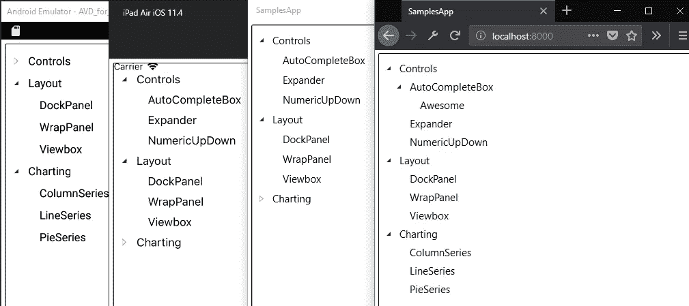

# 将 Silverlight Toolkit TreeView 控件迁移到 UWP 和 Uno 平台

> 原文：<https://medium.com/hackernoon/migrating-the-silverlight-toolkit-treeview-control-into-the-uwp-and-the-uno-platform-25db9b175fec>



> 你可以在 [Uno 中找到这篇文章的](https://github.com/nventive/Uno.UI.Toolkit.SL) `[TreeView](https://github.com/nventive/Uno.UI.Toolkit.SL/tree/master/Uno.UI.Toolkit.SL/Controls/TreeView)`的代码[。UI.Toolkit.SL](https://github.com/nventive/Uno.UI.Toolkit.SL/tree/master/Uno.UI.Toolkit.SL/Controls/TreeView) 存储库，我们将在其中添加新的控件，并在控件可用时接受它们的贡献。

在这个博客系列文章中，我们将讨论[Silverlight Toolkit TreeView control](https://github.com/MicrosoftArchive/SilverlightToolkit)[TreeView control](https://github.com/MicrosoftArchive/SilverlightToolkit/tree/master/Release/Silverlight4/Source/Controls/TreeView)到 UWP 和 [Uno Platform](https://github.com/nventive/Uno) 的代码迁移，这是一个广泛应用于许多商业应用程序的控件，至今仍在使用。

这包括最初可能工作也可能不工作的部分功能，以及在必要时必须在 Uno 平台中进行的修改，以符合 UWP。虽然 Uno 平台包含了 Spring Creators Update (17134)的所有 API，但是这些 API 中有许多还没有实现，可能还有一些被 Silverlight `TreeView`控件使用。

此外，这个练习的重点是从 Silverlight 代码库完成一个迁移过程，因为在 UWP 已经有一个现有的`TreeView`控件 API。在撰写本文时，UWP `TreeView`还没有在 Uno 平台上实现，迁移这个 Silverlight 控件也不是一个选项，因为这些 API 有很大的不同，而且不直接兼容。

# 导入 Silverlight TreeView 控件源

要从 Silverlight 迁移控件，需要做一些事情:

*   使用来自 [Uno 平台 VS Addin](https://marketplace.visualstudio.com/items?itemName=nventivecorp.uno-platform-addin) 的跨平台库模板创建一个跨目标项目
*   用 UWP 名称空间替换 Silverlight 名称空间，并有选择地导入`TreeView`源文件和依赖项
*   为略有变化的 API 调整代码
*   暂时注释掉发生重大变化的 API 的代码。
*   调整 XAML

## 跨目标项目创建

为了能够以可重用的方式构建控件，在 NuGet 包中，我们需要使用 Uno Platform VS Addin 创建一个跨平台的库，它可以针对 Windows (uap10.0)、iOS、Android 和 WebAssembly 进行所有配置。

这个项目将包含`TreeView`正常运行所需的所有 XAML 文件和 C#源文件。它使用了优秀的 [MSBuild。Sdk.Extras](https://github.com/onovotny/MSBuildSdkExtras) msbuild 扩展使用新的和改进的 *sdk 风格的*项目格式，以最少的努力跨越目标库，并简化 NuGet 包的创建。

然后可以使用项目的上下文菜单 [Pack 选项](https://docs.microsoft.com/en-us/nuget/quickstart/create-and-publish-a-package-using-visual-studio#run-the-pack-command)创建一个可安装的 NuGet 包。

## 导入源

导入源代码的过程有些简单。微软，在其所有的 XAML 版本中，保持了许多 API 的签名兼容。这意味着在大多数情况下，[简单地将名称空间](https://github.com/nventive/Uno.UI.Toolkit.SL/commit/d4da7a8ff33da6c9d45bebafa8c8ca65f6182612#diff-b35234eeeb3bdb81d82b850985bf37b3L9)从`System.Windows`更改为`Windows.UI`就能使代码与 UWP 兼容。

以下是一些例子:

*   `System.Windows.Controls`->-`Windows.UI.Xaml.Controls`
*   `System.Windows.Input`->-`Windows.Devices.Input`
*   `System.Windows.Media`->-`Windows.UI.Xaml.Media`

这里简化迁移的一个技巧是临时删除交叉目标项目中的所有非 windows 目标，只保留`uap10.0`。这有助于将编译错误限制在 UWP API 中，并避免可能发生的一些 API 差异，包括 iOS/Android/Wasm 目标。一旦构建了 Windows 目标，添加回其他目标将允许进行特殊的调整(如果有的话)。

代码导入的大部分练习是关于通过逐个导入文件来大量使用智能感知，从`TreeView.cs`开始并删除所有红色的曲线。`TreeView`控件使用`TreeViewItem`，后者使用`HeaderedItemsControl`等...

在第一次更改名称空间并导入相关文件之后，我们得到了一组自包含的 C#源文件，但还没有编译。

## 针对略有变化的 API 进行调整

当试图解决从 UWP 迁移时的 API 差异时，在调整名称空间之后，第一个低悬挂点是稍微不同的那些。例如，可能是成员可见性差异，或者只是名称更新。

一些例子:

*   `FrameworkElement.OnApplyTemplate`已从`public`移至`protected`
*   `PropertyMetadata`没有只包含一个`PropertyChangedCallback`参数的构造函数
*   `GeneralTransform.Transform`称为`GeneralTransform.TransformPoint`
*   `Binding`不包含将字符串路径作为参数的构造函数
*   `Control.Focus`现在需要一个`FocusState`参数

这些都很容易调整，UWP 的运行时行为有了很大的改变，与 Silverlight 的相同。

## ItemsControl 的情况。OnItemsChanged

`ItemsControl.OnItemsChanged`有一个显著的变化，方法不再存在了。这是控件行为的一个非常重要的部分，用于创建操纵`TreeViewItem`实例并将它们链接到`TreeView`实例。移除此方法的代码会使控件不可用。

这个方法可以被`ItemsControl.Items.VectorChanged`事件替代，但不能完全替代。Silverlight 中的`ItemsControl`基于提供`NotifyCollectionChangedAction`属性的`ObservableCollection`，而 UWP 中的`ItemsCollection`基于`ObservableVector`。这个新的实现明显没有提供`Replace`动作，而是先提高`ItemRemoved`再提高`ItemInserted`。

在这种情况下，我们必须删除处理`NotifyCollectionChangedAction.Replace`的部分，只保留`Remove`、`Reset`和`Insert`。新的 API 也不提供被通知的项目，这意味着我们必须直接使用`Items`属性。

## 暂时注释掉不兼容的功能

在其他情况下，API 有很大的不同，为了更好地理解代码，我们现在将把它们注释掉。其中包括键盘支持、部分鼠标支持、本地化和对等自动化相关支持。

UWP 提供对这些特性的支持，不是作为虚拟方法，而是作为不直接与 Silverlight 实现兼容的事件。我们将在本系列的后面部分研究这些特性。

## 调整 XAML

向 UWP 迁移的另一部分是为了适应 XAML。语法是相同的，但部分不同:

*   自定义名称空间语法现在使用`using:`而不是`clr-namespace:`，在许多情况下，简单地用另一个替换一个就足够了
*   与`VisualStateManager`相关的类现在位于默认的 xml 名称空间中，这意味着不再需要`vsm:`名称空间。
*   `system`名称空间现在是`x:`名称空间的一部分

我们还将注释掉对`Cursor`调整的支持，因为属性没有直接映射到 UWP。

# 创建示例应用程序

为了能够测试导入的代码，我们可以使用[Uno 平台 VS Addin](https://github.com/nventive/Uno/blob/908f302660569bcc9f7065bb6fea5e9b9c62e141/doc/blog) 创建一个示例应用程序，引用我们导入的项目并添加一个简单的示例，如下所示:

```
<controls:TreeView Margin="5">
	<controls:TreeViewItem Header="Controls">
	<controls:TreeViewItem Header="AutoCompleteBox">
		<controls:TreeViewItem Header="Properties" />
	</controls:TreeViewItem>
	<controls:TreeViewItem Header="Expander" />
		<controls:TreeViewItem Header="NumericUpDown" />
	</controls:TreeViewItem>
	<controls:TreeViewItem Header="Layout">
		<controls:TreeViewItem Header="DockPanel" />
		<controls:TreeViewItem Header="WrapPanel" />
		<controls:TreeViewItem Header="Viewbox" />
	</controls:TreeViewItem>
	<controls:TreeViewItem Header="Charting">
		<controls:TreeViewItem Header="ColumnSeries" />
		<controls:TreeViewItem Header="LineSeries" />
		<controls:TreeViewItem Header="PieSeries" />
	</controls:TreeViewItem>
</controls:TreeView>
```

并且先在 Windows 上测试，然后是 iOS、Android 和 WebAssembly。

# 后续步骤

运行该示例时，有几件事很突出:

*   `TreeView`正在正确显示内容
*   节点可以适当地展开和折叠
*   节点旁边的图示符会改变一次状态，但不会以动画形式返回
*   关于在 UWP 已经被废弃的`ItemContainerGenerator`有一些例外。

我们将在本系列的下一部分中讨论这些内容。

