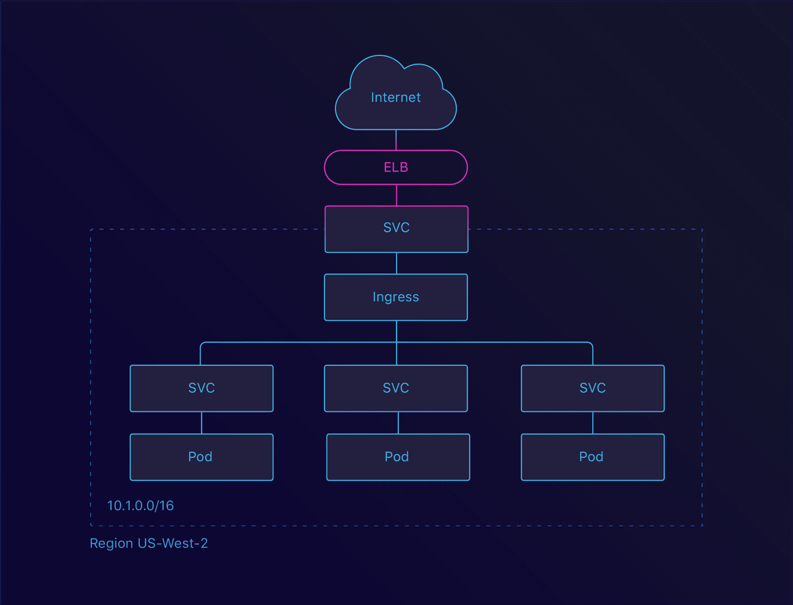

# 零停机时间迁移到 Kubernetes:原因和方法

> 原文：<https://medium.com/hackernoon/migrating-to-kubernetes-with-zero-downtime-the-why-and-how-2c9a1b04de78>

> *披露:* [Manifold](https://goo.gl/Sm26zK) ，独立开发者服务市场*，之前赞助过黑客正午。* [使用 code HACKERNOON2018 获得任何服务 10 美元优惠。](https://goo.gl/Sm26zK)

我们在 [Manifold](https://www.manifold.co/) 总是努力从我们所做的每件事情中获得最大收益。为此，我们不断评估我们所做的事情，看它是否仍然符合我们的标准。不久前，我们决定深入研究我们的基础设施设置。

在这篇博客文章中，我们将看看我们搬到 Kubernetes 的原因以及我们问自己的问题。然后，我们将看看我们必须做出的一些妥协，以及为什么我们必须做出这些妥协。我们还将了解如何配置我们的集群来实现我们的目标。

当我们开始多元化时，我们做了我们知道行之有效的事情。使用[平台](https://www.terraform.io/)将容器部署在 [AWS EC2](https://aws.amazon.com/ec2/) 上，并通过 [ELBs](https://aws.amazon.com/elasticloadbalancing/) 将其暴露。我们发现自己处于这样一个位置，我们可以花一些额外的时间来构建一个更成熟的平台。最初的实施开始时非常简单，但是我们开始发现一些棘手的问题:

*   部署缓慢(大约 15 分钟)
*   不[连续交付](https://continuousdelivery.com/)意味着只有运营人员知道如何部署
*   为每个实例运行一个容器会变得非常昂贵。通过增加集装箱密度，我们可以降低成本

在过去的一年里， [Kubernetes 变得非常受欢迎](https://trends.google.com/trends/explore?date=today%205-y&q=kubernetes)。凭借团队的经验，我们坚信这项新技术的未来。为此，我们创建了第一个 [Kubernetes 集成](https://github.com/manifoldco/kubernetes-credentials)。我们也开始考虑集成，这将使 [Kubernetes](https://hackernoon.com/tagged/kubernetes) 更容易访问。这就是建造[Heighliner](https://heighliner.com/)的想法诞生的地方。

这让我们想到了另一个我们赖以生存的原则:狗食。通过使用 Manifold 来构建 Manifold，我们可以确切地知道我们的用户需要什么。

# 选择集群

我们问自己的第一个问题是“我们将在哪里运行这个集群？”。AWS 还没有提供 Kubernetes 解决方案，但是 Azure 和 Google 云平台会提供。我们需要留在 AWS 内管理我们自己的集群，还是希望将一切都转移到另一家云提供商？

我们想要回答的关键问题是:

*   我们能否在 AWS 上创建一个高可用性集群，管理起来有多容易？
*   我们如何连接到我们的 [RDS](https://aws.amazon.com/rds/) 实例，延迟是多少？
*   我们该如何处理我们的 KMS 加密？

# 通过 kops 实现高可用性(HA)

如果我们可以在 AWS 中轻松地创建和管理集群，那么移动提供商的必要性就会降低。我们用 kops 做的最初测试看起来很有希望，我们决定更进一步。是时候建立一个高可用性集群了。

为了理解 HA 对 Kubernetes 的意义，我们需要首先理解它的一般意义。

> 高可用性解决方案的核心基础是冗余、可靠的存储层。高可用性的首要原则是保护数据。不管发生什么，不管着火了，如果你有数据，你可以重建。如果你丢失了数据，你就完了。
> 
> - [Kubernetes 文档](https://kubernetes.io/docs/admin/high-availability/building/)

Kubernetes components in a High Availability configuration

在 Kubernetes 集群中，这个存储层是 [etcd](https://coreos.com/etcd/) ，运行在主实例上。etcd 是一个分布式的键/值存储，它遵循 [Raft 共识算法](https://raft.github.io/)来实现仲裁。达到法定人数意味着让一组服务器在一组值上达成一致。要达成这个共识，需要*下级(n/2)+1* 各方同意。因此，我们总是需要奇数个实例，至少 3 个。

下面，我们将看看几个可能的中断案例。

# 容忍实例失败

我们要看的第一个场景是当单个实例终止时会发生什么。我们能从中恢复吗？

Tolerating instance failure

通过指定我们想要的节点数量，kops 为每个实例组创建了一个[自动缩放组](https://docs.aws.amazon.com/autoscaling/ec2/userguide/AutoScalingGroup.html)。这确保了当一个实例终止时，会创建一个新的实例。这允许我们在丢失一个实例时在集群中保持一致。

# 容忍区域故障

设置实例故障允许我们容忍单台机器的故障。但是，当整个数据中心因为断电而出现问题时，会发生什么情况呢？这就是 [*区域*和*可用性区域*](https://buildazure.com/2017/09/22/azure-regions-and-availability-zones/) 发挥作用的地方。

再来看看我们的共识公式: *lower(n/2)+1 个实例至少有 3 个实例*。我们可以将其转化为区域，这将导致*较低的(n/2)+1 个区域，其中至少有 3 个区域*。

3 master nodes spread across 2 zones

3 master nodes spread across 3 zones

对于 kops，这也很简单。通过指定我们希望在其中运行主节点和节点的区域，我们可以在区域级别配置 HA。然而，这是我们遇到的第一个障碍。出于任意的原因，当我们启动 Manifold 时，我们决定使用 *us-west-1* 地区。事实证明，这个区域只有两个区域可用。这意味着我们必须找到另一种解决方案来容忍区域故障。

# 容忍区域故障(及其他)

主要目标是复制现有的基础架构。我们的旧设置没有跨多个地区运行，所以新设置也不需要。我们相信，在 Kubernetes 联合会的帮助下，这将更容易实现。

# 具有对等功能的内部网络

由于我们的区域限制，我们不得不寻找其他方法来容忍区域故障。一种选择是在一个单独的区域创建我们的集群。

每个地区都有自己独立的网络。这意味着我们不能只在一个地区使用另一个地区的资源。为此，我们研究了[地区间 VPC 对等](https://docs.aws.amazon.com/AmazonVPC/latest/PeeringGuide/Welcome.html)。这将允许我们连接到我们的 us-west-1 地区，并访问 [RDS](https://aws.amazon.com/rds/) 和 [KMS](https://aws.amazon.com/kms/) 。

Inter Region peering between us-west-1 and us-west-2

这也使我们受到挫折。事实证明， *us-west-1* 地区并不是你可以使用的最佳地区。在我们对此进行调查时， *us-west-1* 不支持区域间 VPC 对等。这意味着我们也不能使用这个解决方案。

# 决定和妥协

有了这些新知识，是时候做决定了。我们是继续使用 AWS 还是转向另一家提供商？

值得注意的是，转移到另一个提供商也会带来很多额外的开销。我们必须暴露我们的数据库，迁移我们的 KMS，重新加密我们所有的数据。

最后，我们决定**继续使用 AWS** 并运行容忍节点故障解决方案。随着亚马逊 EKS 的宣布和地区间对等的即将到来，我们觉得这是足够好的第一步。

管理您自己的集群可能非常耗时。到目前为止，我们已经看到了最小的影响，但我们肯定**考虑到了集群维护**。最耗时的是**集群更新**。

从财务角度来看，我们也妥协了。是的，它会比传统系统便宜，但是会比竞争对手贵。Azure 和 GCP 都免费提供主节点，这大大降低了成本。

# kops 提示

对我们来说，kops 工作得很好。它确实有一组缺省值，您应该知道并覆盖这些缺省值。要做的关键事情之一是**启用 etcd 加密**。这是通过提供 *—加密-etcd-存储*标志来完成的。

默认情况下，kops 也不会启用 RBAC。RBAC 是限制集群中应用程序范围的一个很好的机制。我们强烈建议启用此功能并设置适当的角色。

出于安全原因，我们在实例中禁用了 SSH。这确保了没有人能够访问这些盒子，即使我们使用**私有网络拓扑**运行。

# 配置集群

集群启动并运行后，就该开始工作了。下一步是配置它，以便我们可以开始在其中部署应用程序。

之前用 [Terraform](https://www.terraform.io/) 管理我们的服务意味着我们在如何设置方面有相当多的控制权。我们管理我们的 elb、DNS、日志等。通过我们的地形结构。我们需要确保我们的 Kubernetes 设置也能做到这一点。

# 负载平衡

Kubernetes 有[服务](https://kubernetes.io/docs/concepts/services-networking/service/)和[入口](https://kubernetes.io/docs/concepts/services-networking/ingress/)的概念。有了服务，就有可能将 pod 分组——通常由[部署](https://kubernetes.io/docs/concepts/workloads/controllers/deployment/)管理——并在同一个端点下公开它们。该端点可以是内部的，也可以是外部的。当将服务配置为[负载平衡器](https://en.wikipedia.org/wiki/Load_balancing_%28computing%29)时，Kubernetes 将生成一个 ELB。这个 ELB 然后被链接到配置的服务。

Service LoadBalancer

这很好，但是你可以拥有的 elb 数量是有限制的。通过使用入口，我们可以创建单个 ELB，并在集群内路由流量。有几个入口可用，但是我们使用默认的 [Nginx 入口](https://github.com/kubernetes/ingress-nginx)。

Ingress LoadBalancer

既然我们可以将流量路由到服务，那么是时候通过域来公开这些流量了。为此，我们使用了[外部 DNS](https://github.com/kubernetes-incubator/external-dns) 项目。这是将配置的域名放在您的应用程序附近的好方法。

公开服务的最后一步是确保我们通过 SSL 提供流量。这被证明是很容易的，而且已经有了解决方案。我们选定了[证书管理器](https://github.com/jetstack/cert-manager)，它集成了我们的 Nginx 入口。

# 服务配置

服务配置对我们来说轻而易举。我们已经开始用我们的 [Terraform Integration](https://github.com/manifoldco/terraform-provider-manifold/) 在流形的顶部构建流形。因此，我们需要的所有凭证都已经配置好了。

我们在设计 [Kubernetes 集成](https://github.com/manifoldco/kubernetes-credentials)时考虑到了我们的 Terraform 集成。我们保持底层语义不变，这意味着迁移凭证轻而易举。

我们还增加了自定义秘密类型的[选项。这允许我们配置一个](https://github.com/manifoldco/kubernetes-credentials/pull/20) [Docker](https://hackernoon.com/tagged/docker) Auth secret。当[从私有注册表](https://kubernetes.io/docs/tasks/configure-pod-container/pull-image-private-registry/)中提取 Docker 图像时，您需要这个秘密。

# 遥感勘测

运行分布式系统最重要的事情之一是了解系统内部发生了什么。为此，您需要设置集中的日志记录和指标。我们的传统平台中有这一功能，因此我们的新平台中肯定需要这一功能。

对于日志记录，我们扩展了我们的 dogfooding，并设置了我们的 LogDNA Integration 来收集日志。 [LogDNA](https://logdna.com/) 本身提供了一个 [DaemonSet](https://kubernetes.io/docs/concepts/workloads/controllers/daemonset/) 配置[。这允许您将日志从集群传送到它们的平台。](https://docs.logdna.com/docs/kubernetes)

对于指标，我们依赖于 [Datadog](https://www.datadoghq.com/lpg/?utm_source=Advertisement&utm_medium=GoogleAdsNon1stTierBrand&utm_campaign=GoogleAdsNon1stTierBrand-Non1st&utm_content=Datadog&utm_keyword=%7Bkeyword%7D&utm_matchtype=%7Bmatchtype%7D&gclid=EAIaIQobChMIyviblJDO2QIVFzobCh2sdQtzEAAYASAAEgLUA_D_BwE) ，到目前为止，它对我们来说工作得很好。和 LogDNA 一样，Datadog 也[提供了一个 DaemonSet 配置](https://docs.datadoghq.com/agent/basic_agent_usage/kubernetes/)。他们甚至有一篇关于如何设置的很棒的博客文章。

# 移民

随着集群的配置和应用程序的部署，是时候进行迁移了。为了**确保零停机时间**，我们必须分几个阶段进行。

第一阶段是在一个**单独的域**上运行集群。通过连接这两个系统，我们可以在不干扰任何人的情况下进行测试。这有助于我们发现并修复一些早期问题。

在下一阶段，我们将**将一些流量路由到 Kubernetes 集群**。为此，我们设置了[循环赛](https://en.wikipedia.org/wiki/Round-robin_DNS)。这是查看您的集群如何处理实际流量的好方法。大约一周后，我们有足够的信心进入下一阶段。

DNS round-robin between the Legacy infrastructure and our Kubernetes cluster

第三阶段涉及**移除遗留 DNS 记录**。移除适当的地形配置后，我们所有的流量都将流经 Kubernetes！

因为 DNS 缓存，我们决定让这个遗留系统再运行几天。这样，拥有缓存 DNS 条目的用户就不会遇到错误。这也为我们提供了回滚的可能性，以防出现问题。

# 结论

既然我们已经迁移了，我们可以回顾过去。我们的团队和公司称这次迁移是成功的。我们**将部署时间从大约 15 分钟减少到大约 1.5 分钟**，并通过这样做成功**削减了运营成本**。

我们还没有完成我们的持续交付渠道，但我们正在努力。我们已经开始研究 Heighliner，它首先会帮助我们自己，但希望也能帮助其他人。

我们遇到了一个重大挫折:没有 3 个可用区域。这**阻止了我们跨区域运行高可用性**。这是我们为了让系统正常运行而做出的妥协，我们将很快解决这个问题。

哦，还有一件事。**如此。很多。YAML** 。这就是 Heighliner 将帮助我们的地方。

对梅格·史密斯为这篇博文制作的图片大加赞赏。