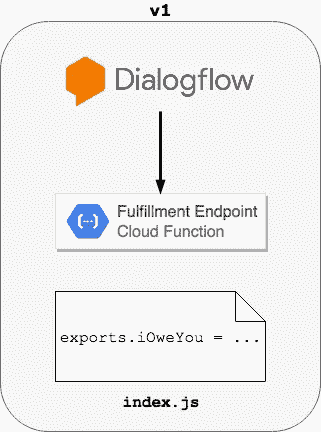
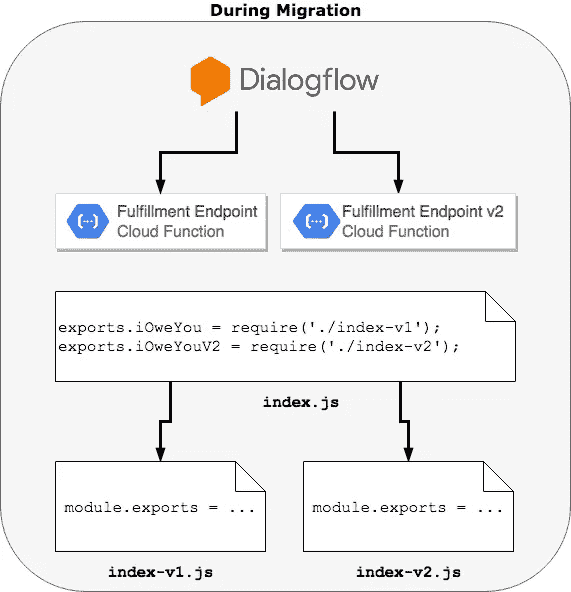
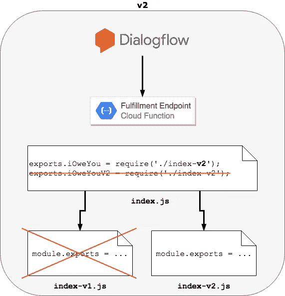

# 迁移到 Dialogflow API v2

> 原文：<https://medium.com/hackernoon/migrating-to-the-dialogflow-api-v2-a65265b9e27f>

**访问**[**【https://www.mikenikles.com】**](https://www.mikenikles.com)**获取我的最新博文。**

2018 年 4 月 17 日， [Dialogflow](https://dialogflow.com/) API [的第 2 版正式发布](https://blog.dialogflow.com/post/v2-and-enterprise-edition-generally-available/)。这标志着始于 2017 年 11 月的测试阶段的结束。

> 我们的 API V2 现在作为所有新的 Dialogflow 代理的默认 API，所有新功能升级将只针对 API V2 发布。

我记得在公告博客帖子中看到了上面的内容，告诉自己升级我的“[我欠你的](http://iou.mikenikles.com)”Google Assistant bot，作为了解新 API 的一种方式。上周末，我正是这样做的，这篇博文解释了我的方法。

# 目标受众

这篇文章的重点是从使用 API v2 的现有 Dialogflow 项目迁移到新的 API v2。

如果你是 Dialogflow 的新手，我推荐你从[https://dialogflow.com/docs/getting-started/basics,](https://dialogflow.com/docs/getting-started/basics)开始，它包含了创建 Dialogflow 项目的必要步骤。您不需要阅读本文的其余部分，因为 v2 现在是默认的 API 版本。

# API V1

我最初从一个“[对 Google](https://developers.google.com/actions/extending-the-assistant) 的操作”项目开始，这意味着我的项目目录结构看起来像这样:

```
.firebaserc
functions
├── index.js
└── package.json
```

`index.js`文件包含我的机器人的实现逻辑，如下所示:

```
// index.js
const App = require("actions-on-google").DialogflowApp;const welcome = app => {
  app.ask('Welcome! How can I help you today?');
}exports.iOweYou = functions.https.onRequest((request, response) => {
  const app = new App({ request, response }); // Create the action map
  let actionMap = new Map();
  actionMap.set('input.welcome', welcome);
  // ... custom actions added here app.handleRequest(actionMap);
});
```

作为一个可视化的例子，API v1 的设置如下所示:



# 迁移指南

如果你和我情况相似，想升级到 v2，我强烈推荐你阅读 https://dialogflow.com/docs/reference/v1-v2-migration-guide 的官方迁移指南。

我的机器人没有集成 Slack、Skype 或 Dialogflow 支持的任何其他集成。我需要迁移的只是实现端点。在迁移指南中有一章是专门针对这个用例的，并且列出了必要的步骤。如果您的 bot 启用了集成，请参考官方迁移指南了解详细信息。

总之，迁移实现端点需要您创建一个新的代理，导入 v1 代理(这样您就不必创建意图、实体等。从头开始)，在新代理上启用 v2，升级您的实现代码，全部测试，发布到生产环境。

在 v2 测试代理中，fulfillment webhook URL 需要指向一个新的端点，也就是我们将要迁移到 v2 的端点。打开 Dialogflow，选择您的 v2 测试代理，然后单击导航中的“实现”。在 webhook 的 URL 字段中，将`V2`追加到已经填充的 URL。

到目前为止，我们已经有了一个 v2 代理，可以用来测试 v2 实现端点。少了什么？履行端点的实际 v2。让我们从一个图表开始:



主`index.js`文件导出两个函数。一个是服务于生产流量的原始`iOweYou`，另一个是由我们升级到 Dialogflow API v2 的新测试代理使用的`iOweYouV2`版本。

为了保持条理，我建议您将 v1 代码提取到一个单独的`index-v1.js`文件中，并为新代码创建一个`index-v2.js`文件。

## Dialogflow 实现库测试版

作为迁移的一部分，我决定利用这个新的 Node.js 实现库。你可以在 https://github.com/dialogflow/dialogflow-fulfillment-nodejs[阅读更多相关内容并查看示例。](https://github.com/dialogflow/dialogflow-fulfillment-nodejs)

虽然“我欠你”机器人目前只支持谷歌助手，但使用履行库是一个很好的起点，可以集成到 8 个聊天和语音平台。

# API V2

一旦`index-v2.js`准备就绪并经过良好测试，就该将生产流量迁移到新的 API 了。鉴于 v1 和 v2 实现代码在单个文件中的分离，将生产流量迁移到 v2 是很简单的。下图概述了所需的内容:



这些步骤包括:

1.  确保导出的`iOweYou`属性加载了`-v2`索引文件。
2.  在 Dialogflow 中，打开生产代理并切换到 API v2。
3.  **此时，生产中的 bot 运行在 Dialogflow API v2 上。**我建议您像这样运行一段时间，监控日志，如果出现任何问题，恢复上面的步骤 1 和 2，回滚到 v1 实现。
4.  一旦您感到满意，并且在您的对话中没有看到错误或遗漏，就可以安全地清理代码并删除`index-v1.js`文件了。此时，您还可以在 Dialogflow 中删除您的测试代理。

很简单，不是吗？

如果您有任何问题或建议，请留下评论，我会尽快回复您。