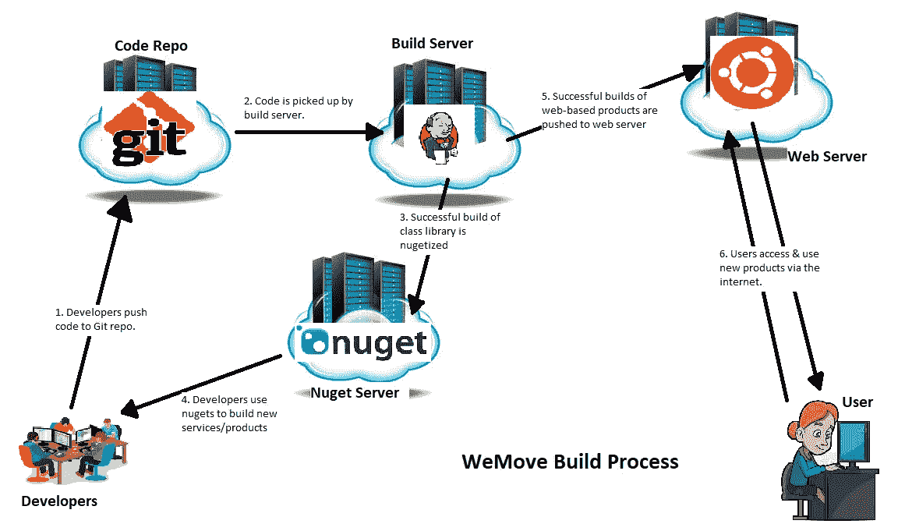
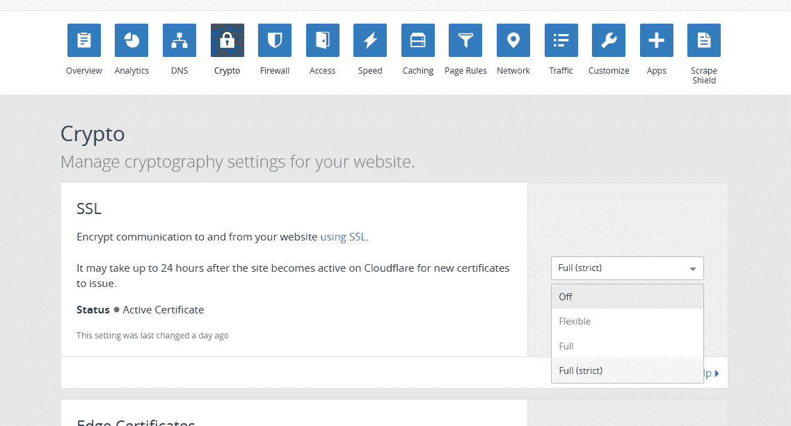

# 在数字海洋上将 WeMove.co 从 Azure 迁移到 Ubuntu 虚拟机

> 原文：<https://medium.com/hackernoon/migrating-wemove-co-from-azure-to-ubuntu-vm-on-digital-ocean-96280ce24777>

早在 2016 年 7 月，当我开始编写将成为 WeMove.co 的代码时，我选择了使用 ASP.NET 核心，因为 C#是我的首选静态语言(我在这里写了关于我是如何做出这个选择的博客:[http://ezoekoyecelestine . blogspot . com . ng/2016/07/microsofts-fumbling-dilemma-with . html](http://ezeokoyecelestine.blogspot.com.ng/2016/07/microsofts-confusing-dilemma-with.html))。ASP.NET 核心是新的，当时非常前卫，我在 1.0 版本中使用它，我面临一些非常有趣的问题。正如我在帖子中提到的，微软确实解决了问题，昨天，我成功地将我们的网站从 Azure 迁移到了位于[数字海洋](https://hackernoon.com/tagged/digital-ocean)上的 Ubutu VM。

# 我们为什么迁移？

长话短说:削减开支。

1 月 2 日，WeMove Technologies 搬进了位于 Bode Thomas Surulere 的新办公室，这是拉各斯一个繁荣的业务部门。在拉各斯做生意，我们必须尽可能降低成本。因此，我认为中期内我们如何固定成本是很重要的。对我来说，一个主要的策略是要么加入微软的 BizSpark 计划，要么放弃 Azure，因为成本已经开始堆积。

我从 11 月份开始申请 BizSpark，没有得到任何回应，我决定开始购买替代云服务。Azure 的 PaaS 是我的首选托管服务，因为它易于设置和部署，直接来自我的 BitBucket repo。放手意味着我必须在移动的同时建立一个构建管道。

尽管主要驱动力是降低业务成本，但迁移的第二大原因是减少未来的错误。

*   我们将很快开始招聘，我需要开发人员只是写和推动代码回购，没有破坏任何东西。我不得不在圣诞节那天与网站宕机做斗争，因为一次错误地应用于生产的迁移，而我正在尝试一些东西。我不想重复那个错误。

Christmas day woes 😭

*   我需要关注点分开。目前，WeMove 代码是一个 C#类库(内置。NET Core)，它包含所有的业务逻辑和一个 ASP.NET 汽车租赁核心 web 应用程序。我一个人编码的时候，在 webapp 里面做了一个类库的 VS 项目参考。这意味着代码驻留在同一个解决方案中，开发人员不能只专注于类库的工作，而不能在他们的 PC 上拥有所有的代码。这就增加了错误修改一些东西，推到回购的可能性。因此增加了出错的可能性。我不希望这种事发生。

# 我们是如何迁移的？



A rough sketch of our build process (made with MS Paint)

## 设置代码回购

对于所有过去的项目和 WeMove.co，我更喜欢在 BitBucket 托管代码。主要是因为我有很多免费的私有库，而且我的开发团队没有超过 5 个。然而，在我们为新员工制定计划时，我认为我们需要升级我们的 BitBucket 计划。

然后我发现了 GitLab。

我去 GitLab 签了免费的 CI/CD，但最终还是用了，因为可用的团队成员数量没有限制(抱歉 BitBucket，我还是❤️你)。最终没有使用他们的 CI/CD，而是推出了我自己的构建服务器。

## 设置构建和获取服务器

对于构建服务器，我们在 Interswitch Cloud(【https://cloud.interswitch.com】T4)得到了一个 Windows 服务器盒子。我选择 Jenkins 作为构建服务器，因为这是我最有经验和最信任的。

我花了 1 周的时间(在编码和运营业务之间切换)，71 次构建&将一个文件夹从我的开发 PC 复制到服务器，成功地让 Jenkins 按照我的要求部署了我的 nuget 服务器。主要问题是让 Jenkins 让 MSBuild 与 Web Deploy 一起工作(Nuget 服务器是 ASP.NET 的 4.5 项目)。我甚至不确定我是否记得所有相关的步骤，所以我为没有做一步一步的指导而道歉。

成功完成后，为车辆租赁 ASP.NET 核心应用程序设置脚本就容易多了。

1.  提交后从回购中提取代码。
2.  要在 Jenkins 中进行构建和部署，请运行以下 Windows 批处理命令:

```
dotnet restoredotnet publish -c Release -r ubuntu.16.04-x64 -o “%WORKSPACE%\deploy\path”jar -cMf ZipPackage.zip %WORKSPACE%\deploy\path\* curl http://<ubuntu-server-ip>:<hidden-port>/deploy-handler.php?tasktoperform=deploy_wemove --upload-file ZipPackage.zip
```

*注意，在第 2 行，我告诉* `*dotnet*` *使用* `-r ubuntu.16.04-x64`选项发布 ubuntu。*是的，我使用 JDK 的“jar”工具在第三行创建了一个 zip 文件。你看到我在那里做了什么吗？还有，第 4 行的 curl 命令只有在你从*[*https://dl . uxnr . de/build/curl/curl _ winssl _ msys 2 _ mingw 64 _ STC/curl-7 . 57 . 0/curl-7 . 57 . 0 . zip*](https://dl.uxnr.de/build/curl/curl_winssl_msys2_mingw64_stc/curl-7.57.0/curl-7.57.0.zip)下载了 curl for windows 之后才起作用

现在我需要去 [Ubuntu](https://hackernoon.com/tagged/ubuntu) 服务器并设置它接受 ZipPackage.zip。这意味着编写一个小的 PHP 脚本，它接受请求并将 zip 文件解压缩到指定的`/var/www/`路径，这取决于为`?tasktoperform=<action>`指定的动作。

## 设置 Ubuntu web 服务器来托管 ASP.NET 核心

对于 web 服务器，我们从 Digital Ocean 获得了一台虚拟机。从注册到设置 SSH 密钥花了 10 多分钟。老实说，我印象非常深刻。

我创建了一个 PHP 脚本，它从构建服务器接收 zip 文件。它运行的端口只对构建服务器的 IP 地址开放，使用`ufw`防火墙实用程序配置。它获取文件并将其解压缩到适当的目录中。它还为 ASP.NET 核心复制适当的 appsettings.json 文件。我会在下面的**问题**中解释原因。

下面的链接包含了如何为 Ubuntu 设置 ASP.NET 核心并配置它与 Nginx 一起工作的深入的分步指南。然后作为服务安装，因此它与服务器一起启动。所以我不会重复这些内容让你厌烦，只需点击链接:

[](https://docs.microsoft.com/en-us/aspnet/core/host-and-deploy/linux-nginx?tabs=aspnetcore2x) [## 使用 Nginx 在 Linux 上托管 ASP.NET 核心

### 本指南解释了如何在 Ubuntu 16.04 上建立一个生产就绪的 ASP.NET 核心环境…

docs.microsoft.com](https://docs.microsoft.com/en-us/aspnet/core/host-and-deploy/linux-nginx?tabs=aspnetcore2x) [](http://blog.bobbyallen.me/2017/05/01/deploying-and-hosting-asp-net-core-applications-on-ubuntu-linux/) [## 在 Ubuntu Linux 上部署和托管 ASP.NET 核心应用程序

### 如果你读过我的其他博客帖子或者在我的 GitHub 个人资料上看过我的一些项目，你会发现我是一个真正的 Linux…

blog.bobbyallen.me](http://blog.bobbyallen.me/2017/05/01/deploying-and-hosting-asp-net-core-applications-on-ubuntu-linux/) 

— —

此外，我继续将 Let's Encrypt 设置为 WeMove 的 SSL 提供者。下面的链接告诉你怎么做:

[](https://www.digitalocean.com/community/tutorials/how-to-secure-nginx-with-let-s-encrypt-on-ubuntu-16-04) [## 如何在 Ubuntu 16.04 上用 Let's Encrypt 保护 Nginx | digital ocean

### 在本教程中，我们将向您展示如何使用 Let's Encrypt 获得一个免费的 SSL 证书，并在 Nginx 上使用它…

www.digitalocean.com](https://www.digitalocean.com/community/tutorials/how-to-secure-nginx-with-let-s-encrypt-on-ubuntu-16-04) 

## 逮到你了

如果你决定按照这些设置让 ASP.NET 核心在你的 Ubuntu 服务器上运行，这些事情可能会消磨你的时间。

*   **ASP.NET 核心拒绝接收环境变量** —这对我来说是个大问题，因为我不知道如何告诉 ASP.NET 核心使用我在环境变量中指定的数据库连接。它完全忽略了它们，只处理应用程序文件夹中的 appsettings.json。作为一种变通方法，我必须在不同的位置创建 appsettings.json 的副本(它具有所有正确的设置)。然后我把它复制到应用程序文件夹里。这作为构建过程的一部分执行，由 PHP 脚本完成。
*   **Cloudflare 循环 HTTPS 重定向** —设置 Let's Encrypt SSL 过程的一部分是告诉 web 服务器将所有 HTTP 请求重定向到 HTTPS。如果您在 Cloudflare 上配置 DNS/域代理，HTTPS 将被剥离，每个请求都将作为 HTTP 发送到您的服务器。这将在您的服务器上导致无限重定向循环。要修复它，请转到您的 Cloudflare 控制面板，在 crypto > SSL 下，选择“完全(严格)”(如下所示)。这将强制 Cloudflare 仅向您的服务器发送 SSL 请求。



Cloudflare settings for default SSL/strict

*   **对/var/www/app-dir 目录以及您的 web 用户使用的其他目录的权限** —不要忘记为 www-data 用户和组设置对所有目录的适当权限。这让我非常头疼。通过执行`chmod -R 775`使其只对公众写入。

# 从中长期来看，这如何为我们节省了成本？

你可能想知道，在这种复杂的设置下，我们如何比仅仅推出 BitBucket 并让 Azure PaaS 将其构建为应用服务节省更多的钱。答案如下:

它不仅可以监听多个端口，还可以服务于多个(子)域。这意味着，如果它没有被最大化或以任何方式损坏，我不会设置另一台服务器来服务 WeMove 子域。

对于我们部署到 Azure 的每个 ASP.NET 核心应用程序，我们需要设置一个新的应用程序服务。要获得 SSL，它必须比入门支付层高一层(或两层)。美国每层应用服务的月平均使用费用在 25 美元到 30 美元之间。SQL Azure 等其他服务的成本会更高，尤其是当您有多个数据库用于暂存和生产时。

运行 Nginx 的数字海洋水滴让我们可以使用同一个服务器运行所有的网络应用程序，收费 20 美元。Nginx 允许我们根据收到的请求，反向代理每个 ASP.NET Kestrel 服务器。

我们的数据库仍在 Azure 中，我计划长期保持这种状态。

感谢您抽出时间阅读本文。

下周我们将推出一项新服务，敬请关注。

如果您想在尼日利亚拉各斯租用任何车辆，请使用我们的服务[https://wemove.co。](https://wemove.co.)在社交媒体上关注我们:@WeMoveCo

[](https://twitter.com/WeMoveCo) [## WeMove.co(@ WeMoveCo)|推特

### 来自 WeMoveCo 的最新推文(@WeMoveCo)。在拉各斯需要车吗？在线预订。或者拨打 0808-651-4565。或电子邮件…

twitter.com](https://twitter.com/WeMoveCo) [](https://www.instagram.com/WeMoveCo/) [## WeMove.co(@ wemoveco)* insta gram 照片和视频

### 77 个关注者，110 个关注者，18 个帖子-见来自 wemoveco 的 Instagram 照片和视频(@wemoveco)

www.instagram.com](https://www.instagram.com/WeMoveCo/) [](https://www.facebook.com/WeMoveCo/) [## WeMove.co

### WeMove.co。177 喜欢 11 谈论这个。租用您需要的车辆来运送您、您的客人或您的货物…

www.facebook.com](https://www.facebook.com/WeMoveCo/)