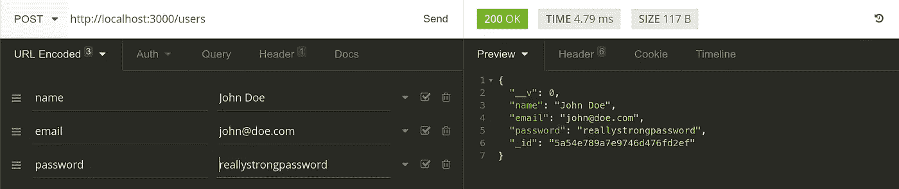
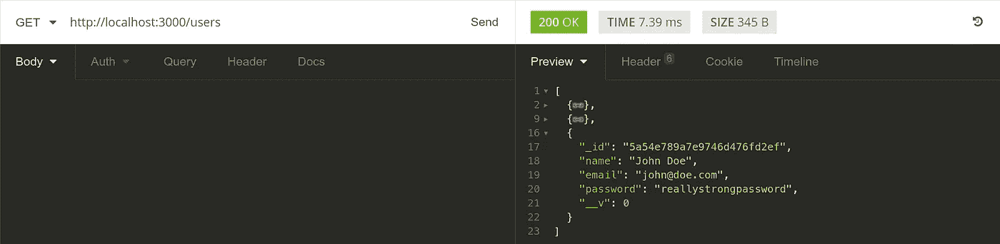
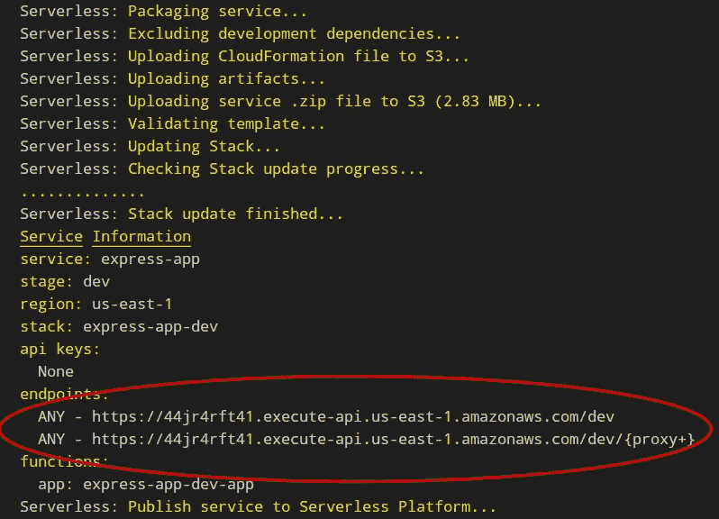
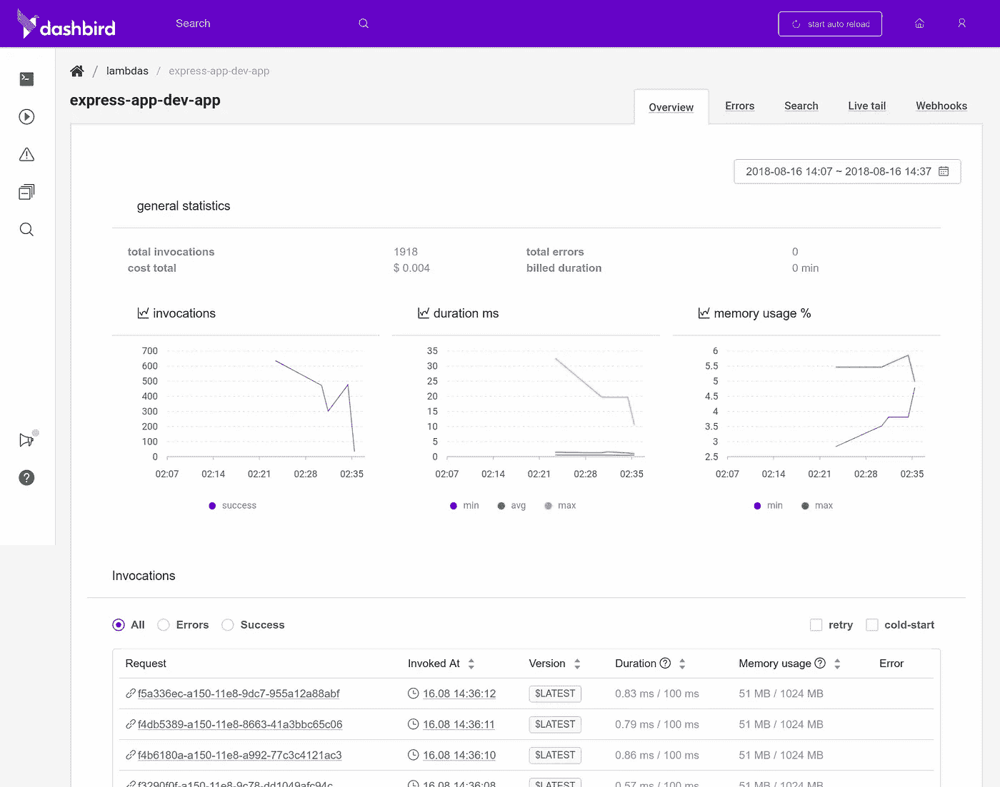

# 将 Node.js REST API 迁移到无服务器

> 原文：<https://medium.com/hackernoon/migrating-your-node-js-rest-api-to-serverless-d2a170e0856c>


我已经涉足了相当一部分无服务器的黑暗艺术。深入探讨没有专用服务器或您可以称之为自己的实例的各种利弊。即使严格来说他们不是。他们只是在漂浮在*云端*的某个秘密服务器农场里。

许多用例让云提供商处理服务器管理、扩展和运行时间是有意义的。你是一个开发人员，为什么你需要用命令行来弄脏你的手。恶，终端！如何再次退出 Vim？**颤抖**

相信我，学习新事物并不容易。我绝不是一个高于平均水平的开发者。学习是困难的，即使你是一个开发者，并且习惯于学习新事物。将您的思维模式转变为使用无服务器架构是一项不小的壮举。以下是我对慢慢开始的看法。我将向您展示如何使用您已经熟悉的代码，并将其应用于无服务器环境。

如果你有一个应用程序在生产，你可以大幅削减成本。由于使用无服务器架构的自动伸缩特性，您可以放心，它将始终为访问您的 API 的所有用户提供服务。所以，如果你成功了，并且成为了 Tech Crunch 的主角，用户的涌入不会破坏你所有的服务器，让你的用户无所事事。双关语。

# 从服务器到无服务器

我们的目标是利用现有的 Express API，对其稍加编辑，通过无服务器框架部署到 AWS。我希望你已经有了一个 AWS 帐户，并且已经在你的机器上安装了无服务器框架。如果没有，请检查[这个](https://hackernoon.com/a-crash-course-on-serverless-with-node-js-632b37d58b44)并按照步骤设置无服务器框架的安装。否则，如果你更喜欢屏幕投射，[这里有](https://www.packtpub.com/web-development/serverless-javascript-example-video)一个课程，我通过视频解释它。

## 让我们建立一个老派的服务器

我冒昧地用 Express REST API 创建了一个小的 repo。这是我以前的一篇文章[中的一篇，你可能读过。我使用现有的 Express API 的目的是为了展示将它移植到无服务器是多么容易。](https://hackernoon.com/restful-api-design-with-node-js-26ccf66eab09)

首先，让我们将回购克隆到我们的机器上。我们正在抓`dev`分支，在那里我已经设置了所有必要的模块和配置。

```
$ git clone -b dev https://github.com/adnanrahic/nodejs-restful-api.git
```

这将把回购克隆到一个名为`nodejs-restful-api`的目录中。在您选择的代码编辑器中打开它。我们有些工作要做。

最重要的是。安装节点模块。

```
$ npm install
```

运行`npm install`将安装来自 **package.json** 文件的所有模块。不会超过几秒钟。

完成后，我们需要配置数据库连接。我们将它保存在 **db.js** 文件中。打开它，你会看到**mongose**正在连接到一个数据库连接 URL，我们将它保存在一个环境变量中。

```
// db.jsvar mongoose = require('mongoose');
mongoose.connect(**process.env.DB**, { useMongoClient: true });
```

我们在一个**中设置这个环境变量。env** 文件。存在一个名为 **sample.variables.env** 的样本文件。让我们打开它，并将其重命名为 **variables.env** 。

```
// variables.envDB=mongodb://localhost:27017/test
```

默认连接被设置为 MongoDB 的本地实例。您可以使用任何想要的连接 URL。 [MongoDB Atlas](https://www.mongodb.com/cloud/atlas) 或者 [mLab](https://mlab.com/) 都可以。

***注意*** *:如果您想按照本教程中的代码进行操作，请创建一个 MongoDB Atlas 数据库集群。一旦我们将应用程序部署到 AWS，就会用到它。你可以跟随教程* [*这里的*](https://hackernoon.com/building-a-serverless-rest-api-with-node-js-and-mongodb-2e0ed0638f47) *来学习如何创建一个 Atlas 集群或者* [*这个*](https://hackernoon.com/restful-api-design-with-node-js-26ccf66eab09) *教程来创建一个 mLab 实例。*

剩下要做的就是运行服务器。跳回终点。

```
$ node server.js
```

如果您添加了一个有效的数据库连接 URL，它应该将`Express server listening on port 3000`返回到命令行。

使用失眠症，我将快速地向数据库添加一个新用户。



不要忘记选择**“表单 URL 编码”**作为内容类型。更改方法以获取和移除请求正文。现在检查用户添加是否正确。



似乎是对的。约翰活得好好的。

在服务器和运行的 Express API 上使用这种传统方法非常适合各种用例。但是，即使你没有任何真正的用户吞吐量，你也必须为此付费。但危险的是，如果你突然有大量用户涌入，你就必须手动调整规模。那一点也不好玩。无服务器自动为您做到这一点！

## 迁移到无服务器

您猜怎么着，您可以使用上面的代码，通过无服务器框架将它部署到 AWS，只需做一些小的改动。实际上，您只是替换了 **server.js** 文件中的几行，并安装了一个模块。最后，添加一个名为 **serverless.yml** 的无服务器配置文件。就是这样！

```
// server.js// beforerequire('dotenv').config({ path: './variables.env' });
var app = require('./app');var port = process.env.PORT || 3000;
var server = app.listen(port, function() {
  console.log('Express server listening on port ' + port);
}); // afterrequire('dotenv').config({ path: './variables.env' });
var app = require('./app');var serverless = require('serverless-http');
module.exports.handler = serverless(app);
```

我们正在用[无服务器 http](https://github.com/dougmoscrop/serverless-http) 模块替换服务器。然后，这个模块被赋予整个 Express app 对象，并通过一个处理程序导出。我们将在 **serverless.yml** 文件中配置这个处理程序。但是首先要安装模块。

```
$ npm install --save serverless-http
```

我们走吧。在项目目录的根目录下创建新的 **serverless.yml** 文件，并将该代码粘贴到。保持缩进正确是非常重要的，因此我把它作为一个要点添加进来。

这里发生的事情是，您将处理函数从 **server.js** 文件挂钩到`/`端点。在 AWS 上，这意味着整个 app 对象将被创建为一个 Lambda 函数，具有一个主 API 网关路径。这多酷啊！？

## 测试和部署

您可能已经注意到了 **serverless.yml** 文件中的插件部分。它声明了一个名为`serverless-offline`的插件。我们需要这个来运行 Lambda 和 API Gateway 的本地仿真。

```
$ npm install --save-dev serverless-offline
```

我们找到了。现在开始模拟。

```
$ sls offline start --skipCacheInvalidation
```

像我们上面做的那样测试相同的端点，您应该看到它们完全一样地工作。现在有趣的部分来了。部署所有这些都轻而易举。一个命令就够了。

```
$ sls deploy
```

deploy 命令将向您返回一个端点。这是您部署的 API 的根路径。



你会相信我这就是所需要的一切吗？的确如此。请随意尝试这个端点。它的行为就像本地实例一样。更酷的是，这一切都被打包成一个单一的功能。让我展示给你看。

# 你有记录兄弟吗？

这是什么意思，它只是一个λ函数？对我们来说最重要的是我们只有一次冷启动。也就是说让 Lambda 保持温暖要容易得多。无论它得到哪个请求方法，它都会命中同一个函数。对于一个小项目来说，这很好，但是对于更大的项目来说就不那么好了。但问题是。您可以在微服务级别上构建它。`/users`路线可以有一个专用的 Lambda，而其他功能可以有自己的。所有这些都可以用您已经熟悉的代码和模块来完成！

看看这个。我用 Dashbird 监控我的 Lambdas 已经有一段时间了，我非常高兴。我永远无法单独通过 CloudWatch 看到这一切。另一个好处是 Dashbird 有一个[免费层](https://dashbird.io/pricing/)，不需要信用卡注册。在我看来这是双赢。



即使方法不同，所有的请求都是向同一个函数发出的。有些是帖子，有些是 get。但它们都发射相同的λ。我不是唯一一个在这里大肆宣传你可以写所有你已经习惯的代码，而是把它部署到 Lambda 的人。

# 包扎

今天我们已经看到学习无服务器并不是什么大不了的事情。迁移现有的应用程序相当容易。我是说你为什么不呢？如果你不想一直为你的服务器付费，而只为你所使用的付费，这是非常合理的。我的意思是，用无服务器架构运行一个小型到中等规模的 REST API 几乎是免费的。只有这样它才是可行的，更不用说自动缩放了。也许是时候让你重新考虑下一个项目的技术了。我希望我已经让你相信了。

如果你想看看我们上面写的所有代码，[这里是资源库](https://github.com/adnanrahic/nodejs-restful-api/tree/sls-express-app)。或者如果你想看我最新的文章，请到这里来。

[](https://medium.com/@adnanrahic/latest) [## 阿德南·拉希奇写的最新故事

### 阅读 Adnan Rahi 在 Medium 上写的最新故事。软件工程师@bookvar_co .编码教育家@ACADEMY387…

medium.com](https://medium.com/@adnanrahic/latest) 

如果我想让你了解更多关于无服务器的知识，请随意浏览我写的关于这个主题的课程。

[](https://www.packtpub.com/web-development/serverless-javascript-example-video) [## 无服务器 JavaScript 示例[视频] -视频|现在只需 5 美元

### 通过无服务器 web 开发的实时演示变得更加熟练

www.packtpub.com](https://www.packtpub.com/web-development/serverless-javascript-example-video) 

或者，加入我的时事通讯，获得直接送到您家门口的关于无服务器的精选内容！

希望你们喜欢读这篇文章，就像我喜欢写这篇文章一样。
*你觉得这个教程会对某个人有帮助吗？不要犹豫分享。如果你喜欢，击碎下面的* ***拍手*** *这样其他人会在媒体上看到这个。*