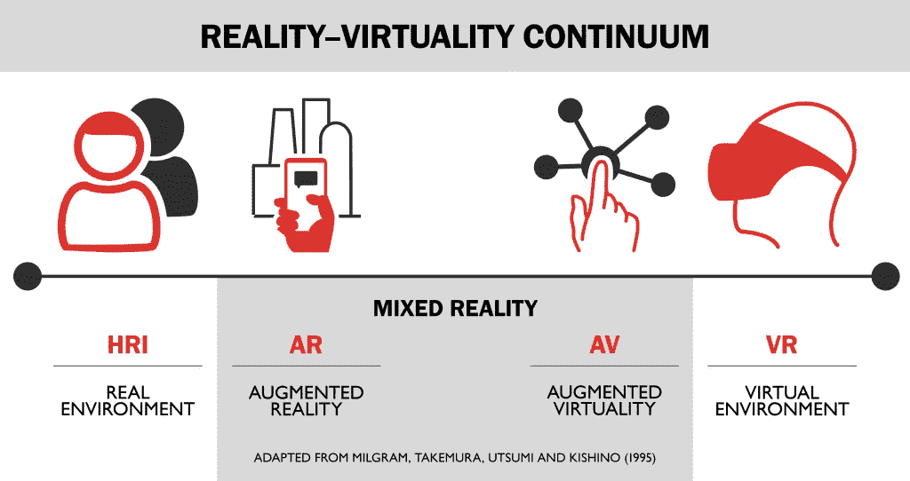

# 米尔格拉姆的连续体:有史以来最好的搭讪台词

> 原文：<https://medium.com/hackernoon/milgrams-continuum-best-pick-up-line-ever-cf9e335ea813>

The Milgram Continuum at a glance

1994 年，保罗·米尔格拉姆在一篇科学论文中首次构想了*现实虚拟连续统*，也称为*米尔格拉姆连续统*，他(和其他同事一起)试图描述 hud 中现实和计算机生成图像的所有可能组合。

在最左边，是真实环境*，正如我们所见，没有经过修改。在这个统一体的另一端，我们可以找到虚拟环境，在这里我们看到的一切都是由计算机生成的。像 Oculus Rift、三星 Gear VR、HTC Vive 等 VR 头戴设备都是这种情况。*

*现实环境和虚拟环境之间的区域代表*混合现实*，现实和虚拟之间有不同程度的重叠。*

*像 Vuzix、Epson Moverio 或 [Glassup F4](http://www.glassup.com/en/f4/) 这样的设备属于*增强现实*的情况，其中虚拟性*增强了*现实(即虚拟性不如现实相关)，而*增强虚拟性*由像微软 Hololens 或 Daqri 头盔这样的设备代表。*

*现在，想象你在一个俱乐部里，你看到一个非常好的男孩(或女孩——嘿，我们这里欢迎多样性！)但是你不知道什么是完美的第一种方法:现在你知道米尔格拉姆连续统了。*

*不客气。*