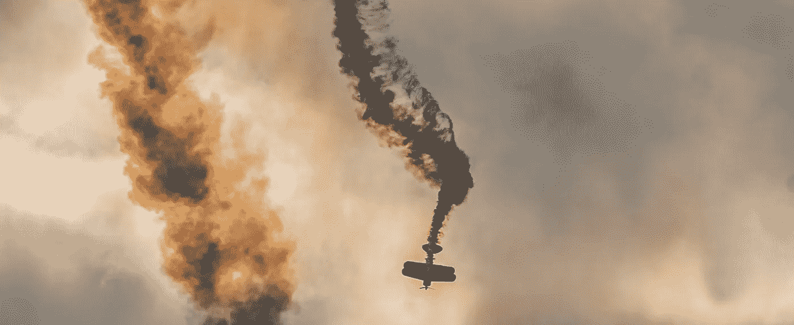
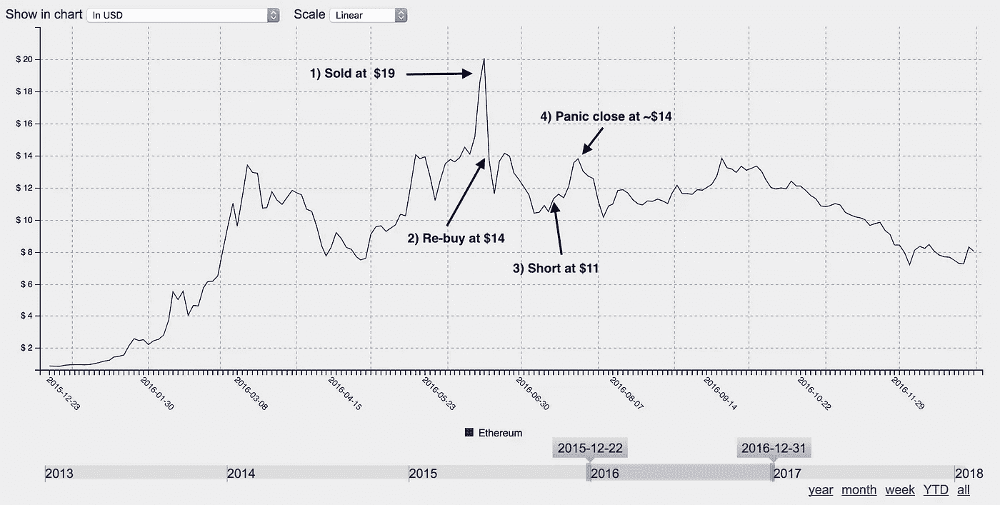
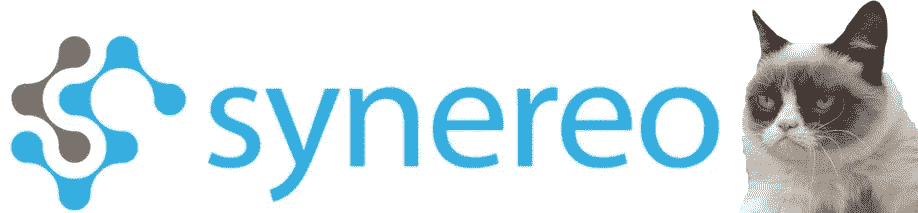
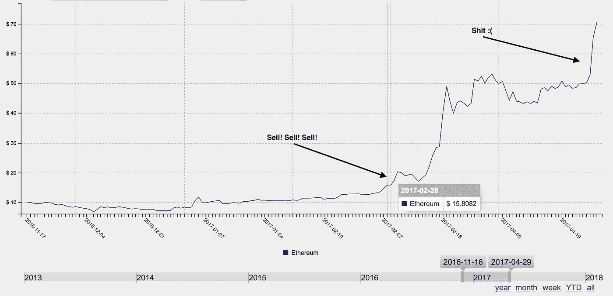
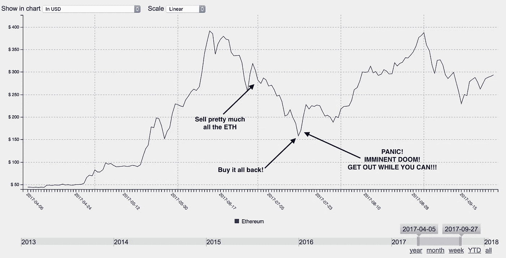
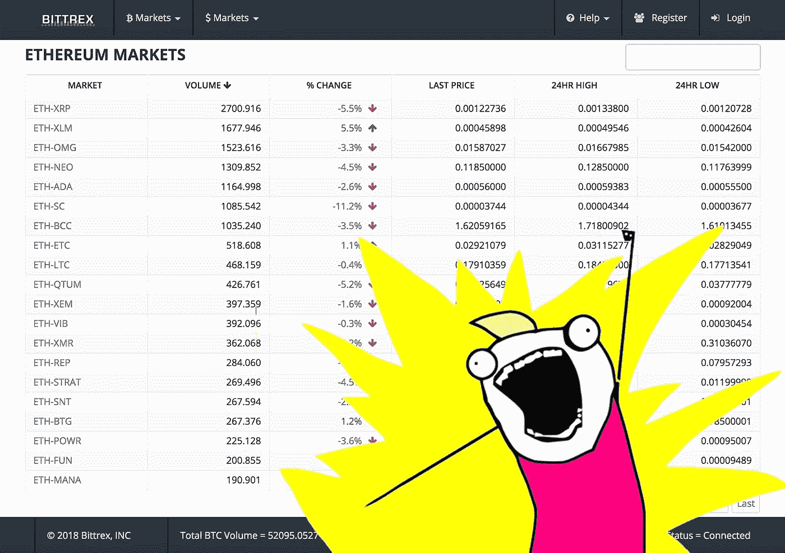
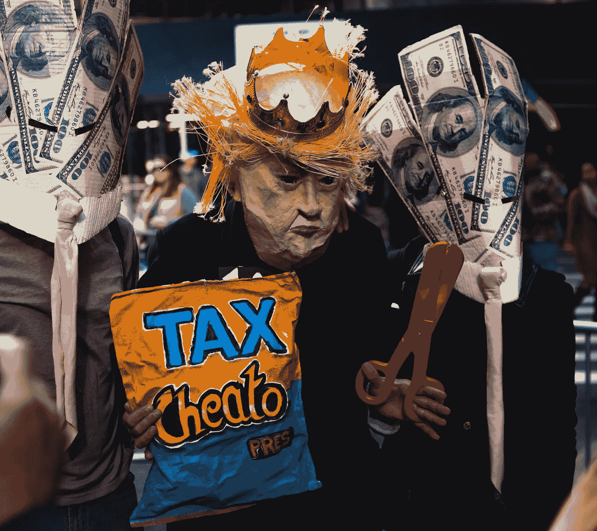

# 百万美元的交易错误，供您娱乐和启迪

> 原文：<https://medium.com/hackernoon/million-dollar-trading-mistakes-for-your-entertainment-and-edification-e9bbf9675a8b>

## 我的秘密交易和一些经验教训。

Photo by [Rob Potter](https://unsplash.com/photos/NBaMypSYZ-c?utm_source=unsplash&utm_medium=referral&utm_content=creditCopyText) on [Unsplash](https://unsplash.com/search/photos/sad?utm_source=unsplash&utm_medium=referral&utm_content=creditCopyText)

2015 年，在我以大约 0.97 美元的价格购买 11，700 个以太之前，我的名下大约有 9 万美元，几个月后，我积累了 21 个比特币(总投资约为 1.7 万美元)。

今天，我有 120 万美元的退休金和传统投资账户，650 个以太网和 21 个比特币。

现在，在这一点上，大多数人会说，“天哪！t，你是百万富翁！！!"

没错。 [Crypto](https://hackernoon.com/tagged/crypto) 让我变得富有。但是……但是……先算一下。乙醚目前的交易价格超过 1000 美元。如果我采用买入并持有的策略，这相当于今天的 1100 万美元。

不用说，我没有买入并持有。下面是我犯的一些错误，这些错误让我损失了大约 900 万美元，试图战胜市场。在我们开始之前，有一个重要的区别…这些是**而不是**我们都经历过的通常错过的机会(例如，“哦，伙计，我*知道在 2010 年购买 bitcoing 是个好主意。我搞砸了！).这些都是活跃的交易失误——在*做点什么*(做一笔‘聪明’的交易)和*什么都不做* (hodl)之间做出决定。*

享受我苦难的果实。我意识到我非常幸运能取得现在的成就，我每天都感谢我的幸运星。希望通过把这个放在那里，一些人可能会避免我犯的同样的错误，并获得更多。

# 错误 1:刀和裸体短裤

任何在 2016 年初参与[以太坊](https://hackernoon.com/tagged/ethereum)的人都会将字母 D.A.O .永远烙在他们的脑海里。我是道的贡献者，贡献了 2000 以太的曲调。最后，我把它都拿了回来(加上分叉链上的一些 ETC)，但这不是我失败的地方。事实上，我一开始还挺幸运的，碰巧在 DAO hack 的前一天卖出了大量 ETH *！！*

随着 DAO 贡献期的临近，ETH 的价格稳步增长，最终飙升至 21 美元(创历史新高)。我在 6 月 16 日以 19 美元卖出了一大堆 ETH。6 月 18 日凌晨，DAO 被黑客攻击，资金被冻结，ETH 的价格在几个小时内暴跌至 12 美元。我有一个 14 美元的买入订单，因此我的 ETH 堆栈增加了大约 800 个 ETH。

到目前为止还不错，对吧？嗯，在 2016 年的大辩论期间，有很多人感到绝望。如果硬叉会怎么样？如果不是硬叉子呢？这是 ETH 的末日吗？没有人知道，但有大量的强硬派人士预测，一旦在分叉发生后每个人都拿到了他们的钱，就会发生崩溃。我认为这似乎是合理的，所以在 hard fork 之后大约 12 个小时(但在 ETC 发布之前)，我决定在 ETH 上建立一个空头头寸，这是有史以来第一次。

哎呦。事实证明，市场本身是支持分叉的，因为 ETH 几乎在一夜之间从 11 美元飙升至 14 美元。我告诉自己，我会熬到 16 美元(我的清算价格是 18 美元左右)。没有。我惊恐地看着那支卑鄙的绿色蜡烛向上蔓延。我热泪盈眶，双手颤抖，按下“平仓”键，接受了 30000 美元。在我短暂的交易生涯中，这是我经历过的最大的损失。

Short selling on margin is for hedge funds and idiots.

我觉得胃不舒服，有几天非常沮丧。尤其是在两天后看到价格回落到 10.50 美元(这会让我重新盈利)。在 reddit 上看了一堆其他人的故事后，我的决心慢慢回来了，这些故事在整个磨难中失去了更多，然后被以太坊经典戏剧分散了注意力。生活在继续。

**这个故事的寓意:**永远不会缺乙醚。或任何东西。“裸体短裤”简直太蠢了。[问这个家伙](https://www.marketwatch.com/story/help-my-short-position-got-crushed-and-now-i-owe-e-trade-10644556-2015-11-19)。

# 错误 2:部落思维和情感交易

在 [*TheDAO 事件*](https://www.cryptocompare.com/coins/guides/the-dao-the-hack-the-soft-fork-and-the-hard-fork/)*以太坊经典诞生*。作为一个真正的以太坊粉丝，我被它的存在深深地触怒了，出于忠诚、骄傲，是的，道德上的需要，我有责任尽快抛弃我所有的以太坊以获得更多的以太坊。**

*我照做了。三天后，ETC 的价格因其主要支持者有组织的“营销”运动而上涨了五倍。该死的。我对一个不欠我任何东西的项目的盲目投入让我付出了沉重的代价。*

*那年夏天晚些时候，Monero 因成为一个受欢迎的暗网市场网站(你知道，在那里你可以以“自由”的名义通过 Tor 网站购买邪恶的物品)的可接受货币而声名狼藉。隐私硬币风靡一时，Monero 和 Dash 开始看到每天的收益在 30%到 70%左右。*

*这肯定是个错误，因为与 BTC 和瑞士法郎相比，这些是狗屎硬币，对吗？对吗？！？我想，有升必有降。所以我重新打开我的波洛涅克斯账户，点击保证金交易标签，去镇上卖 Monero 和 Dash。*

**

*I forgot that short selling is a bad idea.*

*又呜呜了。$10k 之后，我舔着伤口，想知道这个世界到底怎么了。结果一无所获。市场就是市场，交易者就是交易者。再一次，我的 BTC 和 ETH maximalism 部落主义心态把我推入了一些非常糟糕的交易。*

*这个故事的寓意是:不要做一个部落主义者。市场不在乎你喜欢的球队。*

# *错误 3:购买炒作*

*任何谨慎的投资者都会告诉你，分散投资是个好主意。事实上，我听说如果你试图买几只股票，意图战胜市场，沃伦·巴菲特本人会去你家，因为你没有买指数基金而扇你耳光。*

*但是，唉，crypto 中没有指数基金。因此，在 2016 年末，我认为拿一点以太和比特币并将其传播到其他加密项目是一个好主意。*

*但是买什么呢？嗯，这一次，维塔利克·布特林自己说他喜欢 Synereo 团队所做的工作。所以我买了一些 Synereo 放大器。就像区块链的脸书，或者别的什么。而且……而且……他们刚好在进行(另一次)大甩卖。我真幸运！贡献 10 BTC 或更多还有一份不错的奖金。是的，这是一个肯定的赢家，为什么不呢？*

**

*Synereo? More like Synere-NO!*

*然后，Synereo 团队内部发生了一系列戏剧性的事情，首席开发人员离开去启动一个新的区块链项目。AMP 触底反弹，而其他一切都在 2017 年初开始复苏。我为了区区 3 BTC 卖掉了我所有的东西。*

***故事的寓意:**不要因为别人说某样东西很酷就去买。至少先看看网站。*

# *错误 4:摇摆交易*

*尽管 2016 年发生了许多糟糕的事情，但我仍然设法带着 9500 ETH、一些 ICO 代币和我的比特币离开了这一年。还不错，但是我的包 ETH 坐 10k 以下开始困扰我了。我想要一个 5 位数的余额。我*需要*它。*

*因此，在 2017 年 3 月，当乙醚从 10 美元左右飙升至 13 美元，然后是 14 美元时，我心想，“这些价格上涨很好，但它们不会持久。以太总是在破 14 美元后撤退。”所以我卖了。然后价格就上去了。我又卖了一些。然后价格又涨了。我又卖了一些。最后，我们坐在 20 年代中期，我开始恐慌。我以 16 美元的均价卖掉了 4500 个 ETH。😑*

*“它会纠正回来的。别担心，它会纠正，我会买蘸酱。”*

*当价格涨到 30 美元以上时，我一遍又一遍地告诉自己，然后是 40 美元，最后是 50 美元！索诺法根。有一些小的下滑，但没有任何东西能让我再次接近 10000 米。我最终投降，并在 85 美元时重新买入。*

**

*Selling at $16 did not help achieve my goals of making millions.*

*你可能会认为我已经从那次事件中吸取了教训，但事实并非如此。每跳 20 美元到 30 美元左右，我的手指就会停留在卖出按钮上，希望抓住波峰并把它压下来。我赢过几次，也输过几次。截至 6 月底，我的投资组合中约 80%是现金，其余是瑞士联邦理工学院和 BTC，两者都达到了历史最高水平。*

*故事的寓意:你无法预知未来。只在你达到目标或需要钱的时候卖出，而不是因为你认为你能把握市场时机(因为你不能)。*

# *错误 5:恐慌“不买”*

*随着 2017 年 7 月的到来，以太和比特币正在从历史高点回落。“我的机会来了，”我想。“Imma 为 ETH 设定了一个非常非常低的限价单(比如 140 美元),我在等待时机。实际上，我设置了从 155 美元到 135 美元的一系列限价买入，并就此打住。*

*一个灾难性的周六晚上，随着 ETH 的价格缓慢下跌，我上床睡觉，沉沉睡去。第二天一大早，我妻子就把我摇醒了，因为她觉得可能有什么紧急情况。我的电话整晚都在响，她以为我收到了疯狂的短信。原来是我的购买订单被满足的通知。*

*恐慌造成的。在我沉闷的无咖啡状态下，我抓起手机，看到巨大的红色蜡烛向下刺去。匆忙中，我登录并取消了剩余的购买订单。这场血战似乎不会结束，但为了以防出现快速反弹，我对我刚刚买入的所有 ETH 设置了卖出指令，比当前价格高出约 5%。*

**

*好吧，那些卖单几小时后就成交了。价格持续上涨。事实上，一天后，ETH 实现了 80%的恢复(几乎达到 240 美元)。不幸的是，我没有参与，因为我的 160 美元卖单只剩下现金。*

*如果我坚持这个计划，留下我最初的买入订单，然后在一个糟糕的日子持有**，我就已经完全收回了我的 10k ETH 头寸。我相信[卡尼曼和特沃斯基](http://www.sjsu.edu/faculty/watkins/prospect.htm)对此会有很多话要说。***

*这个故事的寓意:制定一个计划并坚持下去。吃点球。永远不要在喝咖啡前做交易。*

# *错误 6:无意义的进场和冲动交易*

*啊，2017 年夏天，当 ICO 热如火如荼的时候，扔代币是必须的。我用我能找到的安全帽向每一个被炒作的 ICO 扔 ETH。是的，我是那种为了插队而提前安排 BAT ICO 交易的混蛋之一，天然气价格被设定为天文数字(抱歉，不是抱歉)。*

*大约在同一时间，Bittrex 上的交易量激增，最终像币安、Liqui 和 KuCoin 这样的新交易所在稍晚一些时候开始活跃起来。这么多东西要买！我照做了，直到花了大约 5 分钟才浏览完我在 Blockfolio 中的所有头寸。*

*这里出现的问题与其说是经济上的，不如说是心理上的。要跟上价格变动、新闻、产品发布、技术指标，甚至每枚硬币在哪个交易所交易，这实在是太耗费脑力了。*

**

*“Yeah, I’ll buy that. What could possibly go wrong?”*

*所以有一段时间我只是即兴发挥。我会买一些被炒作的东西，在价格上涨时卖出，也许会回购我之前卖出的东西，在这里交易，在那里交易，跳到另一个 ICO 上，卖出前一周的 ICO，通常会在整个地图上不停地点击交易所的按钮。*

*这是愚蠢的，它几乎让我的头爆炸。此外，我在 BTC 和瑞士联邦理工学院支付了很多这样的交易，所以这又一次削弱了我的供应。出于某种原因，我很高兴看到任何硬币对美元的价格上涨，但没有考虑到它正在输给 BTC 和瑞士联邦理工学院。总而言之，我不知道所有的交易是否有利可图。这是明智的反义词。*

***故事的士气:**没有计划，就不要交易。如果不知道是什么，就不要买。另外，请参见上面关于“购买炒作”的故事。*

# *错误 7:税务员来了*

*2017 年 8 月，我的妻子处于怀孕后期，所以我整个晚上盯着加密图表、Twitter 和 Reddit 的空闲时间很快就要结束了。我还有 100 多万美元分散在几个交易所，是我出售 ETH 的收入，但我不知道该怎么处理。所以我套现了。我的 ETH 和 BTC 剩下的东西被冷藏了，所有的美元都转到了我的普通储蓄账户上。是时候拍拍自己的背，放松一下，养个孩子了。*

*但是等等……你知道这些东西实际上是要交税的吗？我是说，真的吗？！？Crytpo 应该把我们从过度扩张的政府和盗贼政权的暴政中拯救出来！*

*也许有一天，但今年山姆大叔想分一杯羹。我不仅完全没有报告 2016 年的任何事情，而且 2017 年正在形成一个巨大的混乱，包括近 12 个交易所的随意交易、ico 和转让。*

*我打电话给各种会计公司，询问比特币和加密货币的交易利润，遇到了许多尴尬的停顿和让我回到你身边。只有一家公司回复了我。它们的价格是每小时 250 美元。哎哟。*

**

*Photo by [Capturing the human heart.](https://unsplash.com/photos/YI5DzUUFvqQ?utm_source=unsplash&utm_medium=referral&utm_content=creditCopyText) on [Unsplash](https://unsplash.com/search/photos/taxes?utm_source=unsplash&utm_medium=referral&utm_content=creditCopyText)*

*2500 美元的会计师费之后，我还有大约 35000 美元的欠税要补，我 2017 年的账单接近 40 万美元。不用说，我对自己做一个诚实的美国纳税人的决定并不感到兴奋。再说一次，如果我只是持有一年零一天，而不是积极交易，由于长期和短期资本利得税率之间的差异，账单就会*低得多*。*

***故事的士气**:交税。不要取消你的公民身份，从圣基茨买一本护照，然后移居日本。*

# *如何成为一个谨慎的投资者，始终做出正确的决定，并在长期内赚很多钱…*

## *lol/jk🤣*

*通常这将是文章的一部分，我会谈论我翻开的新的一页，与投资组合理论的链接，以及关于如何购买和持有是最好的论文，设定目标和记日记是好主意，投资建议应该来自本杰明·格拉哈姆，而不是 Reddit……但没有。我累了，我的手指很酸。*

*晚安。*

**编辑:哇！这篇文章有腿！感谢互联网！如果你想要更多，给我关注一下* [*推特*](https://twitter.com/Edward_Giraffe) 🦒*