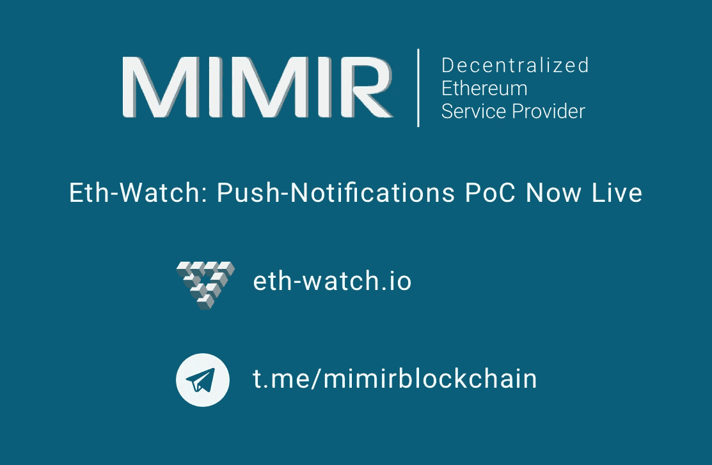

# MIMIR 区块链解决方案宣布推出区块链推送通知服务

> 原文：<https://medium.com/hackernoon/mimir-blockchain-solutions-announces-blockchain-push-notification-offering-1160996fe211>

分散以太坊服务提供商(DESP)，MIMIR [区块链](https://hackernoon.com/tagged/blockchain)解决方案，很高兴地宣布了其名为 [Eth-Watch](https://eth-watch.io/) 的概念验证服务产品的第一次迭代。Eth-Watch 是一项针对公共以太坊主网的服务，它将使消费者能够在他们感兴趣的交易被写入区块链或被挖掘到他们的帐户或从他们的帐户中提取时，立即接收移动和/或桌面推送通知。

这些推送通知将与大多数浏览器和移动设备兼容。遗憾的是，目前版本的 Eth-Watch 与 iOS 不兼容。然而，[未来](https://hackernoon.com/tagged/future)的 Eth-Watch 产品将会支持 iOS。

MIMIR Blockchain Solutions 向消费者提供免费的 Eth-Watch 概念验证服务。MIMIR Blockchain Solutions 首席执行官兼前以太坊基金会开发者 Nicolas Fierro 表示:“我们计划提供编程 API，允许其他分散式应用程序(Dapps)及其开发者将这一新的推送通知功能无缝集成到他们自己的产品和服务中。该产品仍处于早期阶段，但我们希望这项服务将为现有的区块链服务以及我们尚未设想的服务增加更多的便利性和可访问性。由于该产品正在持续开发和测试中，我们建议目前不要将 Eth-Watch 用于任何关键任务应用。”

关于 MIMIR 区块链解决方案

为了最大限度地降低运营成本，提高传统 web APIs 提供的安全性，总部位于佐治亚州亚特兰大的 MIMIR Blockchain Solutions 公司正在创建世界上第一个去中心化以太坊服务提供商(DESP)，这是一个超越云的新行业类别，将区块链作为服务(BaaS)。该公司的旗舰产品 MIMIR block chain to Internet(B2i)Bridge 通过允许从任何联网设备直接访问基于以太坊的去中心化应用生态系统，无需第三方信任，从而将区块链带到了那些“链外”用户。

MIMIR block chain to Internet Bridge 将允许那些拥有现有节点的个人通过托管区块链访问那些“离线”节点来获得报酬。

MIMIR 正在积极寻求与 Dapp 开发者和 web APIs 的案例研究合作伙伴。这些市场需要基础设施解决方案来满足现有的节点需求。

[MIMIR 区块链解决方案网站](https://www.mimirblockchain.solutions/)

[官方 MIMIR 电报](https://t.me/mimirblockchain)

免责声明:本网站提供的内容是关于区块链世界相关主题的观点和评论。出于任何原因，您不打算也不应该依赖它，它是按“原样”提供的，没有任何类型的保证。您对自己的决定负责，并对任何内容进行正确的分析和验证。