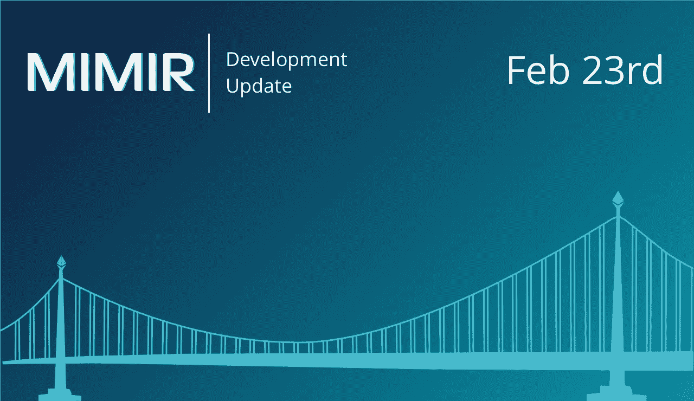

# MIMIR 区块链解决方案开发更新(2 月 26 日)；推送通知产品和电报通知

> 原文：<https://medium.com/hackernoon/mimir-blockchain-solutions-development-update-feb-26-push-notification-product-and-telegram-5b26b3c90a5b>

这又是多事的一周！我们要为关闭公共 alpha 产品的管理服务器道歉。我们目前正在修改传输层协议的大部分内容，以增加吞吐量和提供更高的可用性。我们会让每个人都知道我们的进展。

别担心，我们还有好玩的东西给你玩呢！在我们进行这一迁移的同时，我们自豪地宣布我们名为 [Eth-Watch](https://eth-watch.io/) 的概念验证服务产品。Eth-Watch 是一项针对公共以太坊主网的服务，将允许消费者在他们感兴趣的交易被写入[区块链](https://hackernoon.com/tagged/blockchain)或从他们的账户中取出或取出时，能够立即接收移动和/或桌面推送通知。

这些推送通知将与大多数浏览器和
移动设备兼容。遗憾的是，目前版本的 Eth-Watch 并不
兼容 iOS。然而，Eth-Watch
产品的[未来](https://hackernoon.com/tagged/future)版本将为 iOS 做好准备。

MIMIR 区块链解决方案正在向消费者提供 Eth-Watch 作为免费的
概念验证服务。我们的首席执行官 Nicolas Fierro 说:“我们计划
提供编程 API，这将允许其他分散的
应用程序(Dapps)及其开发人员将这种
新推送通知功能无缝集成到他们自己的产品和
服务中。该产品仍处于早期阶段，但我们希望
这项服务将为现有的
区块链服务以及我们尚未设想的服务增加更多便利和可访问性。由于
该产品仍在持续开发和测试中，我们
建议目前不要将 Eth-Watch 用于任何关键任务应用
。”

下面是我们为帮助您使用 Eth-Watch 而制作的演示。

如果你已经是我们社区的一员，或者想加入讨论，我们已经从 Rocket.chat 转到了 Telegram。在那里，您可以与其他开发人员和 MIMIR 团队的成员交流。您也可以提问和报告错误。花些时间来探索我们的新产品， [Eth-Watch，](https://eth-watch.io/)并继续关注后续的迭代。

祝一切顺利，

米米尔团队

免责声明:本网站提供的内容是关于区块链世界相关主题的观点和评论。出于任何原因，您不打算也不应该依赖它，它是按“原样”提供的，没有任何类型的保证。您对自己的决定负责，并对任何内容进行正确的分析和验证。