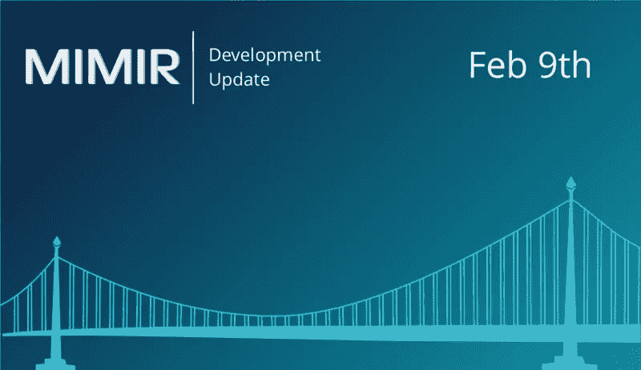
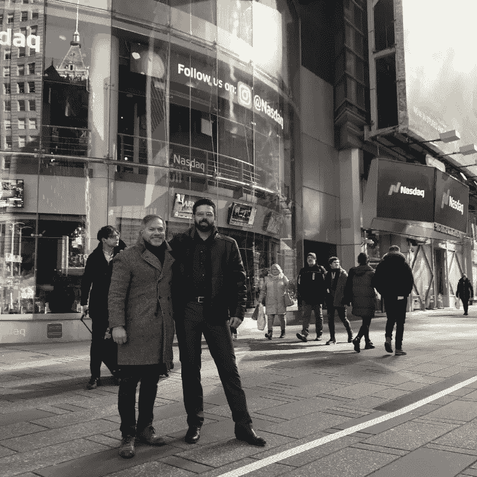
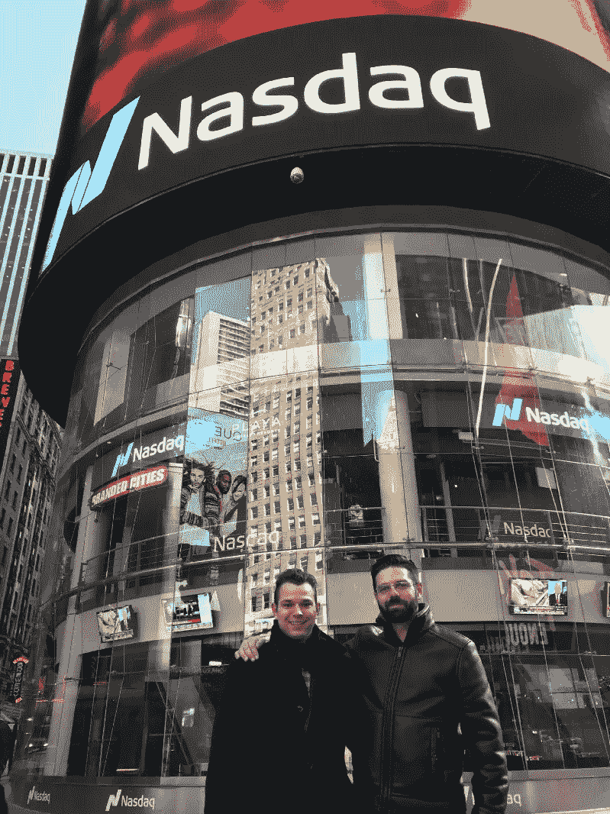

# MIMIR 区块链解决方案开发更新(2 月 9 日)

> 原文：<https://medium.com/hackernoon/mimir-blockchain-solutions-development-update-feb-9-ff81f19a3b22>

本周的主题是让系统更可靠，更容易启动和关闭不同的服务和客户端。我们为简化客户端部署提供了 Docker 文件。希望这能帮助那些测试我们系统的人。

随着我们的验证器获得更多的功能，我们正在稳定我们的服务器。我们也一直致力于进一步推广客户端 rpc 处理，为扩展 jsonrpc 方法家族之外的支持做准备。

我们还处于整合推送通知的初级阶段。小心点！这些将在未来几周内准备好。

本周，我们的首席技术官亨特·普伦德加斯特在[纳斯达克](http://business.nasdaq.com/discover/Nasdaq-at-Times-Square/index.html)市场与 [BNN](http://bnn.ca) 就[区块链](https://hackernoon.com/tagged/blockchain)技术的[未来](https://hackernoon.com/tagged/future)进行了现场直播。

 [## 为什么区块链可能很快成为下一个脸书的潜在力量

### 下一个大型科技巨头会采用区块链技术吗？亨特·普伦德加斯特，MIMIR 的联合创始人兼首席技术官…

www.bnn.ca](https://www.bnn.ca/video/time-to-buy-an-etf-or-fixed-income~1319436) 

LEFT IMAGE From left: John Licata (CMO), Hunter Prendergast (CTO) RIGHT IMAGE From left: Nicolas Fierro (CEO), Hunter Prendergast (CTO)

下周，我们的首席执行官 Nicolas Fierro 和首席技术官 Hunter Prendergast 都将出席在德克萨斯州达拉斯举行的[比特币、以太坊&区块链超级大会](https://www.bitcoinsuperconference.com/)。如果您打算参加，请联系我们。如果能亲自见面就太好了。

要了解 MIMIR 和我们的区块链互联网(B2i)桥，[请访问我们的网站。](https://mimirblockchain.solutions/#/)如果你有兴趣报名成为 alpha 测试员，可以[在这里报名](https://alpha.mimirblockchain.solutions/)。为了在我们继续推出功能和说明时保持了解，[加入 rocket.chat 上的社区。](https://mimir.rocket.chat)在那里，您可以与其他开发人员和 MIMIR 团队的成员交流。您也可以提问和报告错误。我们欢迎任何愿意参与测试我们系统的人。

免责声明:本网站提供的内容是关于区块链世界相关主题的观点和评论。出于任何原因，您不打算也不应该依赖它，它是按“原样”提供的，没有任何类型的保证。您对自己的决定负责，并对任何内容进行正确的分析和验证。