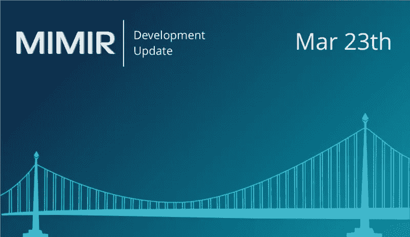
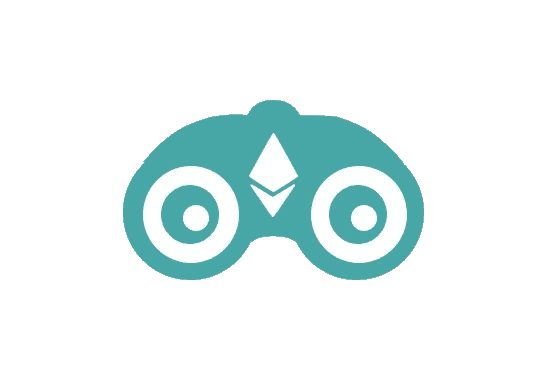

# MIMIR 区块链解决方案开发更新 3 月 23 日(Alpha 更新)

> 原文：<https://medium.com/hackernoon/mimir-blockchain-solutions-development-update-march-23-1d05f8cec7b5>

## Alpha 更新:

我们很高兴地宣布，我们已经完成了向新后端系统的过渡。在过去的几个星期里，有许多漫长的不眠之夜来到这里，但它已经准备好了。

在我们的 GitHub 上有一个 Python 用户客户端。安装和运行这段代码的文档也在 repo 中。我们已经对 Meta Mask 进行了测试，以验证它的行为就像一个本地零客户端。

您还可以从任何绑定到本地 loop back 的 Web 3 接口注入命令。这个客户机是一个 http 服务器，它接受 http 请求并将它们转发到我们的系统中。

我们正在努力使其行为与本地节点完全一样。当我们第一次打开系统时，我们将在云中运行工作节点。这是一个临时的解决方案，直到我们有足够的测试人员来关闭我们自己的工人。

我们将在未来几天发布 Rust worker 客户端的新版本。如果您有需要我们优先考虑的具体功能，请联系我们[。](http://t.me/mimirblockchain)

## Eth-Watch 更新:

我们的[区块链](https://hackernoon.com/tagged/blockchain)推送通知概念验证 [Eth-Watch](https://eth-watch.io/) 现在用它的新 logo 变得更时尚了一点(见下文)。请关注近期[的更多设计更新](https://hackernoon.com/tagged/future)。

## 最近的出版物:

我们最近刚刚在 Buzzfeed 上发布了一个新的测试，[“你对以太坊了解多少？”](http://bit.ly/Ethknowledgequiz)检查一下，让我们知道你做得怎么样！

## 即将举办的活动:

**2018 年 3 月 24 日** > [区块链数字资产论坛，NYU 斯特恩商学院 EMBA 项目的一部分](http://www.stern.nyu.edu/programs-admissions/emba-programs)；NYC
T5 2018 年 3 月 27 日–28 日 > [区块链西部，峰会&贸易展](http://blockchainwest.com/san-francisco-2018)；加州旧金山
**2018 年 4 月 9 日** > [圣彼得大学加密货币资产类别的出现与区块链的未来](https://www.saintpeters.edu/academics/graduate-programs/master-of-science-in-cyber-security/)；纽约市
**4 月 29 日。2018** > [福特汉姆大学](https://www.fordham.edu/)；纽约市

## 请通过以下方式联系我们:

[推特](https://twitter.com/MimirBlockchain) || [脸书](https://www.facebook.com/MimirBlockchain/) || [电报](https://t.me/mimirblockchain)

免责声明:本网站提供的内容是关于区块链世界相关主题的观点和评论。出于任何原因，您不打算也不应该依赖它，它是按“原样”提供的，没有任何类型的保证。您对自己的决定负责，并对任何内容进行正确的分析和验证。