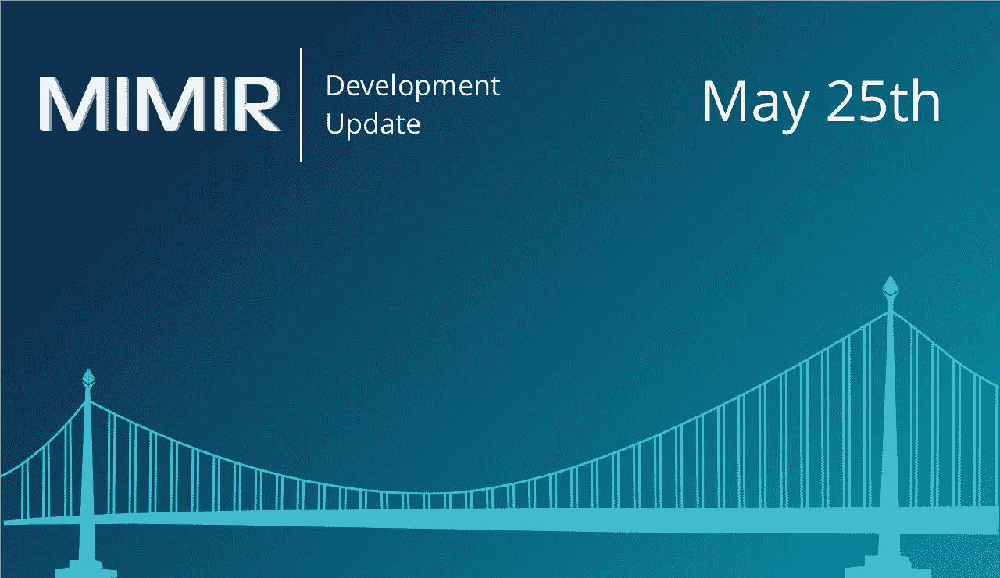
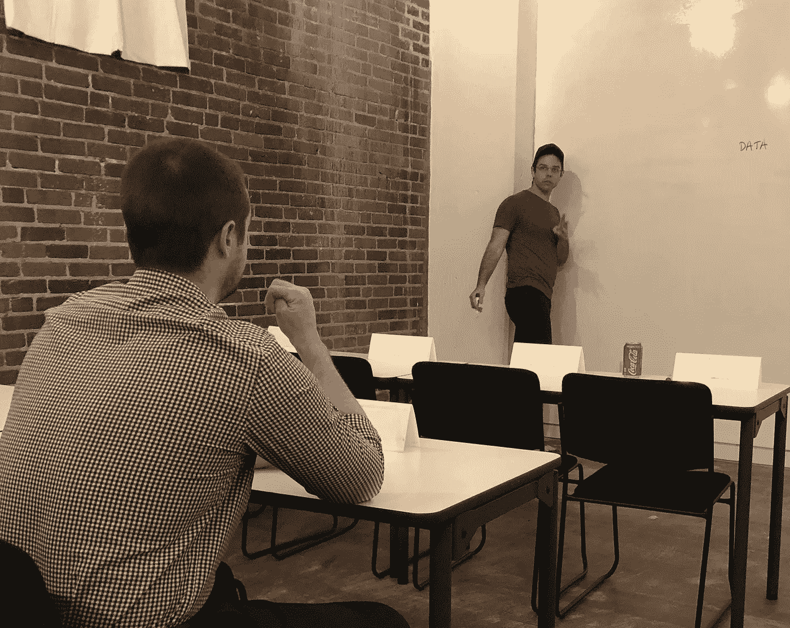
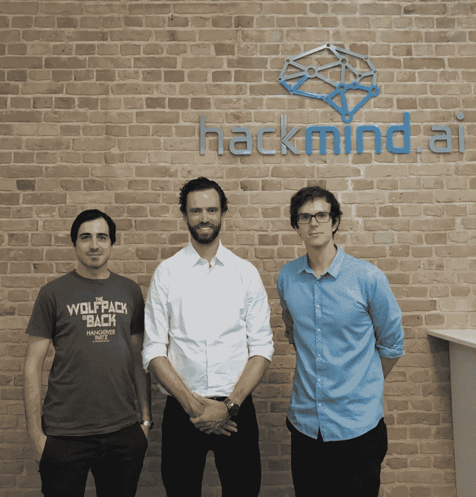
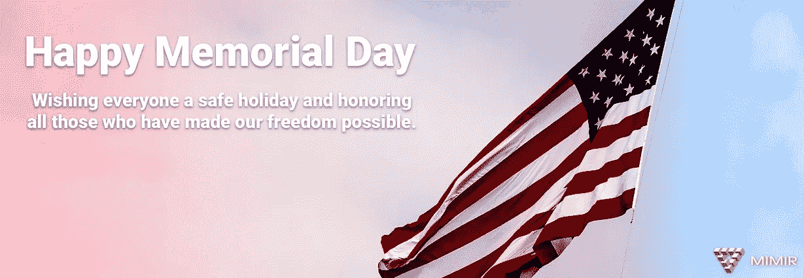

# MIMIR 区块链解决方案开发更新 5 月 25 日

> 原文：<https://medium.com/hackernoon/mimir-blockchain-solutions-development-update-may-25-ec610fd637ca>

## 发展更新:

本周的[开发](https://hackernoon.com/tagged/development)专注于稳定最新一轮的功能添加，并为我们的下一组改进奠定基础。工作客户机将很快能够缓存某些通常被请求的[区块链](https://hackernoon.com/tagged/blockchain)状态的组件，这将提高查询的速度和效率。对该协议的一个轻量级版本的明确支持也在进行中，该版本适用于联盟链。最后，我们正致力于重组主要的 alpha 代码库，这将使新手探索代码库不那么令人生畏。

## 创建了新的 MIMIR 视频:

博客[《MIMIR B2i 桥:Web API 的易用性，节点的力量](/mimir-blockchain/the-mimir-b2i-bridge-the-ease-of-a-web-api-the-power-of-a-node-d438b1334184)》于上周发表。我们为喜欢视频或者更喜欢视觉学习的人创建了这个博客的视频版本。看一看，如果您有任何意见或问题，请告诉我们。

## 本周:

星期二，22 日，我们的首席技术官，亨特·普伦德加斯特，在亚特兰大大会上讲授了当地的一个可靠性研讨会。那些与会者很快就明白了，并提出了很好的问题。我们在那里，直到我们最终被告知这个地方要关闭了！再次感谢那些参加的人，我们期待着下一堂课。

Hunter continuing with questions with a Solidity workshop attendant after class

我们的一位软件工程师 Johannes 上周在柏林。在那里，他有机会见到了 AnyLedger 的创始人。遇到志同道合的工程师总是很棒，他们喜欢谈论区块链，并试图改变这个领域。再次感谢大家本周与我们见面！

Johannes (middle) with Lorenzo Pieri (left) and Bogdan Djukic (right)

## 即将举办的活动:

6 月 15–16 日>[费城区块链大会](http://www.blockchainbash.co)
Hunter 将在 6 月费城的区块链大会上讲授一个可靠性研讨会。如果您计划参加并想了解更多关于课程的信息，请告诉我们。

## GDPR 最新消息:

在 MIMIR，我们非常重视 GDPR，因此我们希望以身作则。作为一家区块链初创公司，我们正在更新我们的隐私政策(敬请关注)。我们还想与我们的读者分享，我们的每周时事通讯“The Chain”是通过我们的合作伙伴 MailChimp 公司发送的，MailChimp 公司也是 GDPR 隐私政策前沿的领导者。另外，你正在阅读的网站 Medium 也更新了他们自己的[隐私政策](/policy/medium-privacy-policy-f03bf92035c9)

## 其他新闻:

我们希望每个人都有一个安全放松的长假周末。我们想特别感谢所有那些让我们所有人享受自由成为可能的人。我们感谢你们所有人！

## 请通过以下方式联系我们:

[电报](https://t.me/mimirblockchain) || [推特](https://twitter.com/MimirBlockchain) || [网站](http://mimirblockchain.solutions) || [脸书](https://www.facebook.com/MimirBlockchain/)

免责声明:本网站提供的内容是关于区块链世界相关主题的观点和评论。出于任何原因，您不打算也不应该依赖它，它是按“原样”提供的，没有任何类型的保证。您对自己的决定负责，并对任何内容进行正确的分析和验证。