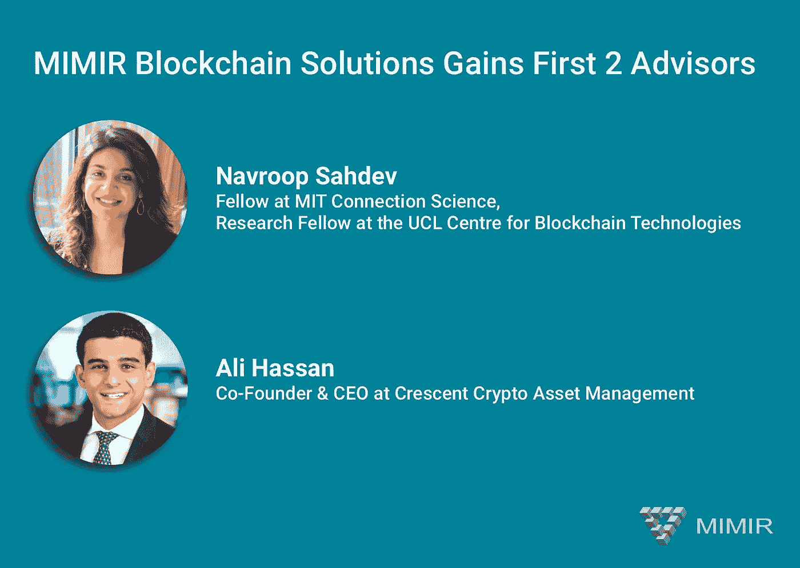

# MIMIR 区块链解决方案任命第一顾问

> 原文：<https://medium.com/hackernoon/mimir-blockchain-solutions-names-first-advisors-70f9c5680356>

MIMIR[block chain](https://hackernoon.com/tagged/blockchain)Solutions，全球首家去中心化以太坊服务提供商(DESP)，很荣幸地欢迎 [Navroop Sahdev](http://linkedin.com/in/navroopsahdev/) 和 [Ali Hassan](http://linkedin.com/in/alihassan91/) 成为公司的首批顾问。

着眼于使用中间件层基础设施解决方案来解决当今区块链技术中最突出的问题(可扩展性、[安全性](https://hackernoon.com/tagged/security)、可访问性)，首席执行官 Nicolas Fierro 表示，“现在是 MIMIR 利用顶级行业专业知识的时候了”。Fierro 补充说:“Navroop 从学术界给 MIMIR 带来了对区块链深刻而独特的见解，加上阿里在加密货币领域拥有的巨大金融敏锐度，这将是 MIMIR 进入下一个增长周期的宝贵财富。”

Sahdev 女士曾在哈佛大学和联合国环境规划署工作，目前是麻省理工学院连接科学的研究员。作为一名实践者和研究者，她在 DLT 领域担任了几个领导角色。Navroop 是一名经济学家，拥有三个硕士学位，包括:知识产权管理、创新经济学和应用经济学。她还是 UCL 区块链技术中心的研究员，专注于分布式账本技术的前沿研究和设计思维，以及对社会经济结构的影响。除了与人合著 Hyperledger 的 Blockchain for Business online 课程之外，Navroop 还定期在金融科技和区块链会议上发表演讲。

在被任命为 MIMIR 的首批顾问之一时，Sahdev 透露:“我很荣幸成为 MIMIR 大家庭和这个不可思议的团队的一员，他们在实现分布式账本技术的潜力以及它们如何改变我们的经济、经济关系和我们做生意的方式方面取得了巨大进展。我认为这项技术是几乎每个主要行业的游戏规则改变者，构建协议层的团队将是未来的赢家。”

哈桑是 Crescent Crypto Asset Management 的首席执行官，他联合创立了这家公司，以满足加密货币市场对机构质量被动投资工具的需求。阿里的职业生涯始于在高盛(Goldman Sachs)担任投资分析师，他的职责包括为投资银行的 IPO 和后续发行执行辛迪加销售，管理价值 45 亿美元的私人资产组合，以及交易流动性极低的公开交易小型股证券。他还曾是 Fairview Capital Partners 的风险分析师，也是投资团队的一员，主要负责公司风险资本和联合投资组合的交易采购、尽职调查、估值和投资监控。

Hassan 评论道:“MIMIR 是我们在 Crescent Crypto 看到的少有的超越任何特定智能合同协议的项目之一。MIMIR 提供的区块链即服务应用套件确实非常出色。MIMIR 有可能触及生态系统中的每一个发行者、投资者、采矿者和企业。我很自豪现在有机会与这个才华横溢的团队密切合作。”

**关于 MIMIR 区块链解决方案**

为了最大限度地降低运营成本，提高传统 web APIs 提供的安全性，总部位于佐治亚州亚特兰大的 MIMIR Blockchain Solutions 公司正在创建世界上第一个去中心化以太坊服务提供商(DESP)，这是一个超越云的新行业类别，将区块链作为服务(BaaS)。该公司的旗舰产品 MIMIR block chain to Internet(B2i)Bridge 通过允许从任何联网设备直接访问基于以太坊的去中心化应用生态系统，无需第三方信任，从而将区块链带到了那些“链外”用户。

MIMIR block chain to Internet Bridge 将允许那些拥有现有节点的个人通过托管区块链访问那些“离线”节点来获得报酬。

MIMIR 正在积极寻求与 Dapp 开发者和 web APIs 的案例研究合作伙伴。这些市场需要基础设施解决方案来满足现有的节点需求。

[MIMIR 区块链解决方案网站](https://www.mimirblockchain.solutions/)

[官方米米尔电报](https://t.me/mimirblockchain)

来源:MIMIR 区块链解决方案