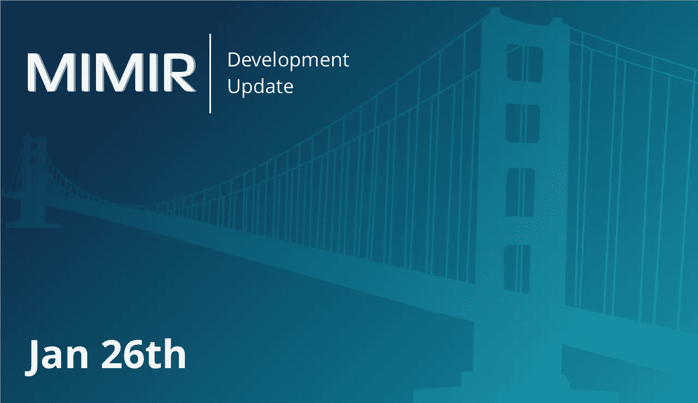

# MIMIR 区块链解决方案每周开发更新(1 月 26 日)

> 原文：<https://medium.com/hackernoon/mimir-blockchain-solutions-weekly-development-update-jan-26-723db28b081b>

米米尔度过了激动人心的一周。我们在 github 上发布了 rust 用户客户端和
rust validator 客户端。我们还为
Ropsten Testnet 构建了一个龙头，它将自动资助任何下载并执行
的验证器客户端。我们现在已经准备好让世界通过 MIMIR [区块链](https://hackernoon.com/tagged/blockchain)到[互联网](https://hackernoon.com/tagged/internet)桥梁来玩
。这个发布的版本是最终实现的一个有限子集，它包括下面的 RPC 方法:eth_estimateGas、eth_call、eth_gasPrice、
eth_getTransactionCount 和 eth_submitRawTransaction。

这个 API 仍在经历大的变化，但我们希望在未来几天内稳定下来。该系统将在未来一周内为简单的 Dapps 做好准备。我们已经度过了瀑布最糟糕的阶段，我们正在
切换到持续集成流程，这将允许快速的
改进。如果你想玩这个系统，请下载并
破解。如果您想先添加任何特定功能，请告诉我们！

既然有了供 alpha 测试者玩的东西，如果你还没有注册成为测试者，请一定要注册成为测试者。可以在这里报名[。我们的 rocket.chat 社区继续发展。无论你已经是一名测试员还是打算成为一名测试员，请点击这里](https://alpha.mimirblockchain.solutions/)加入我们的社区[。如果你在系统中需要帮助，或者发现一个错误，你可以和我们的开发人员以及其他测试人员聊天。](https://mimir.rocket.chat)

别忘了，我们的首席执行官尼古拉斯·菲耶罗和首席技术官亨特·普伦德加斯特都将出席 2 月 16 日至 18 日在德克萨斯州达拉斯举行的[比特币、以太坊&区块链超级大会](https://www.bitcoinsuperconference.com/)。如果您打算参加，请联系我们。如果能亲自见面就太好了。

我们 MIMIR 的所有人，感谢我们的测试人员和那些打算注册的人。

免责声明:本网站提供的内容是关于区块链世界相关主题的观点和评论。出于任何原因，您不打算也不应该依赖它，它是按“原样”提供的，没有任何类型的保证。您对自己的决定负责，并对任何内容进行正确的分析和验证。