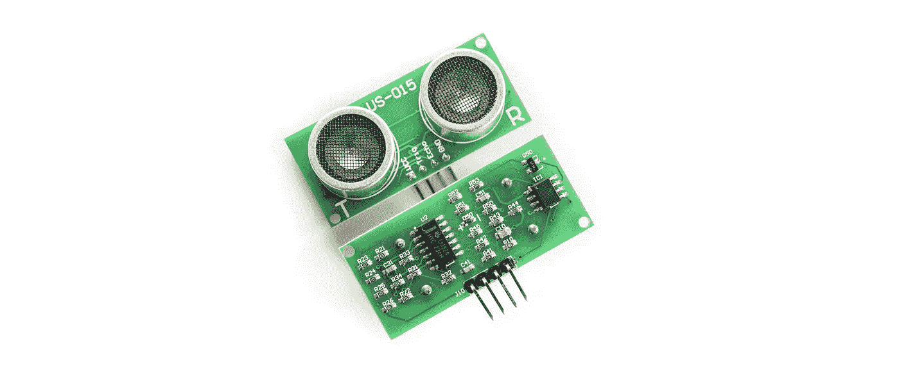
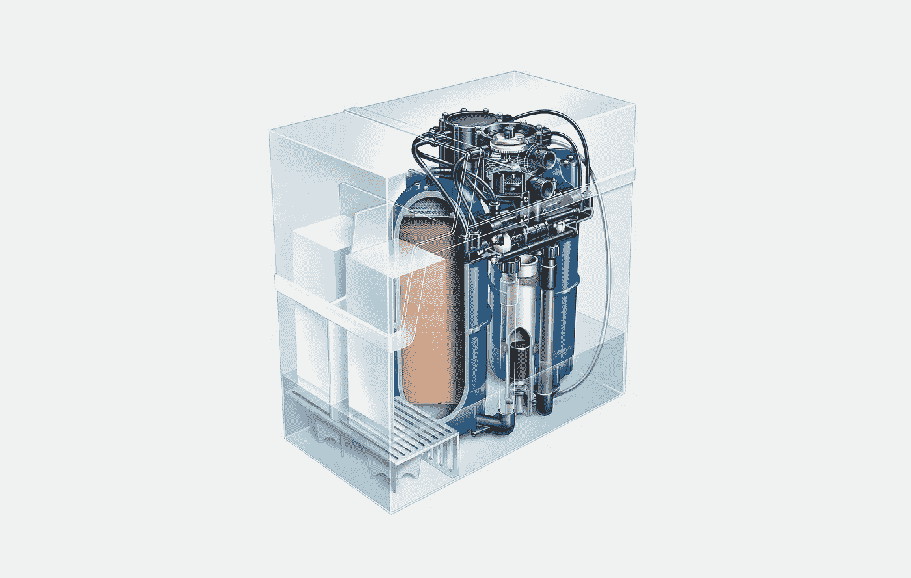
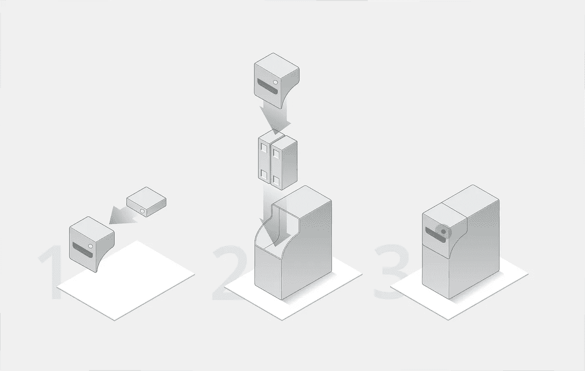
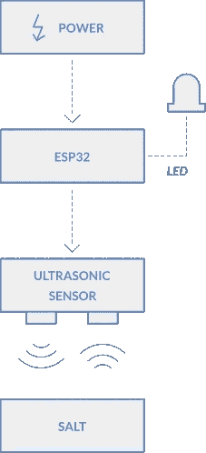
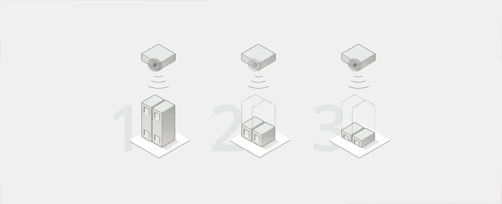

# Minimax 盐指示剂物联网原型

> 原文：<https://medium.com/hackernoon/minimax-salt-indicator-iot-prototype-68dbc65eb1ee>

**对于我们的一个客户，我们为他们的软水机制作了一个联网监控设备的原型:**[**【Minimax】**](https://www.minimax.be/)**。它会检查您的盐含量，以确保您的柔顺剂永远不会用完，并能每天全天持续为您提供软水。**

The Minimax water softener

## 硬水

硬水是由于水中矿物质含量高造成的。它会影响水的味道和气味，但也会影响电器的功能。为了解决这个问题，Minimax 打造了一款软水机。它使用盐块减少水中的矿物质含量，而无需连接电源。这样你就可以把软水机放在最合适的地方，通常是在地下室，而不必担心电源或确保电池充电。

## 为什么？

虽然这种设备在软化水方面很棒，但它没有为你提供监控工具来监视它。如果你想知道你什么时候必须重新加盐，你必须亲自走到 Minimax，并查看设备，看看是否还有盐剩下。包括我自己在内的许多人都喜欢随手可得的信息，但是对于 Minimax 来说这是不可能的。这让我们开始构建原型，并为这个问题构建一个解决方案。

The salt indicator is a small device which slides into the cover of the Minimax. A LED shows the status of the salt level.

## 怎么会？

原型的最重要的特征是测量设备中的盐水平。为了解决这个问题，我们使用了超声波距离传感器。传感器触发声音并监听其回声。利用它们之间的间隔，它可以计算到物体的距离。当盐水平降低时，盐和传感器之间的距离增加。该传感器由 ESP32 读取。ESP32 是一个内置 Wifi 和蓝牙的微控制器，允许我们向用户发送数据。

除了显示盐水平的应用程序，该设备还包含一个你盐水平的物理指示。绿色、橙色或红色的灯指示盐是否足够、是否需要补充或几乎耗尽。这可以让你看到，每当你走过它的时候，你是否需要重新加盐。

A green, orange or red light indicates if the salt is sufficient, needs to be refilled or is almost depleted.

## 后续步骤

作为基本原型，该设备符合标准。然而，它不仅限于测量盐水平。通过添加额外的传感器，如水硬度或 pH 值传感器，它可以提供对设备运行效率的深入了解。Minimax 可以利用这些信息不断改进他们的产品。

By Rick. As a developer at El Niño, he loves to make the life of users a bit better by building IoT prototypes and creating optimal user experiences.