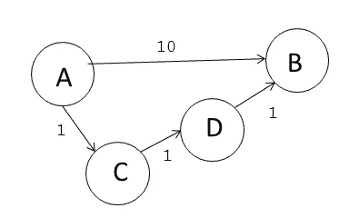
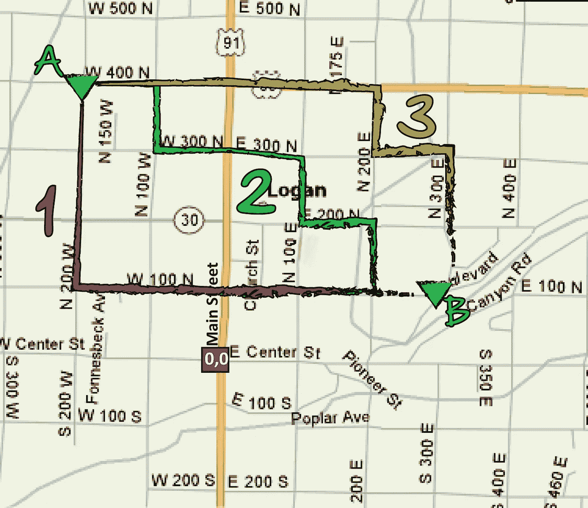
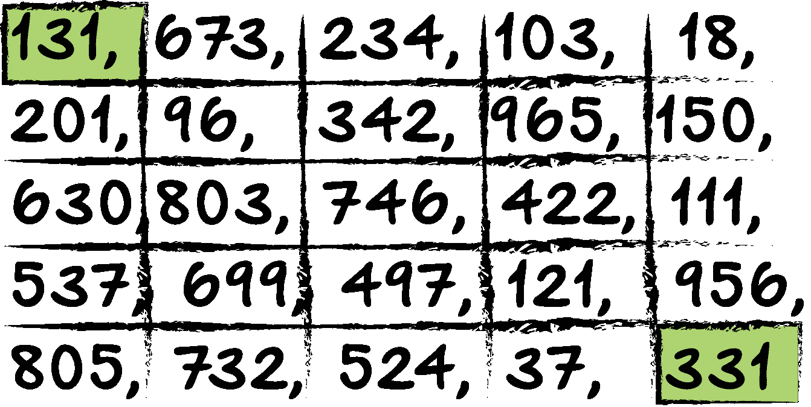
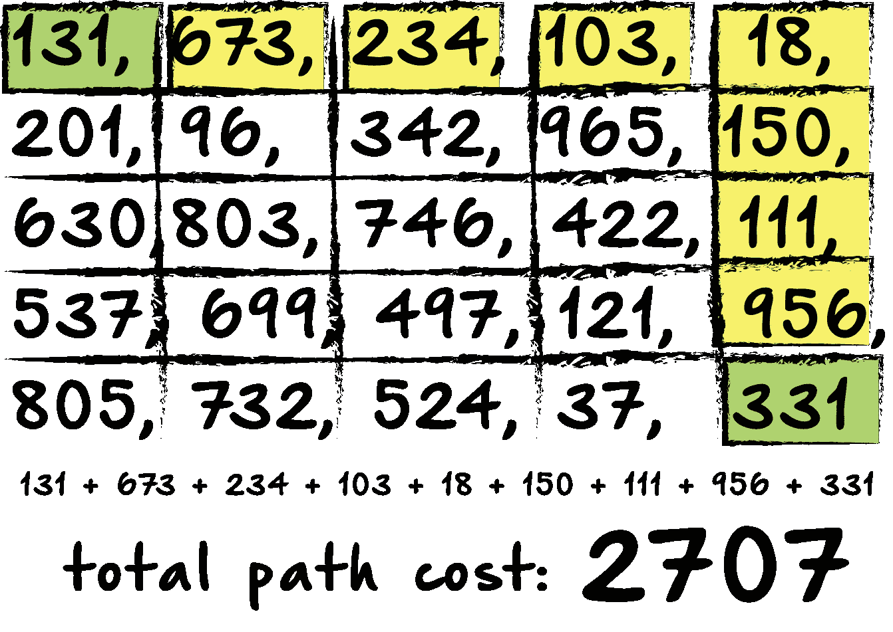
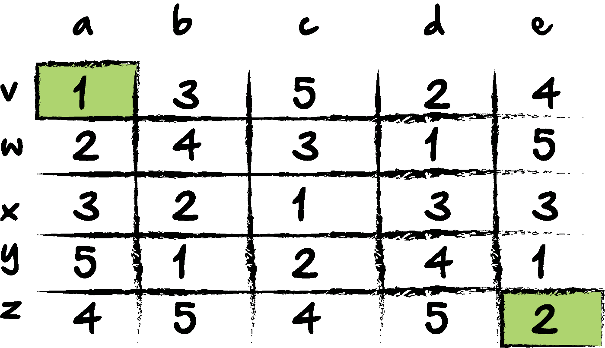
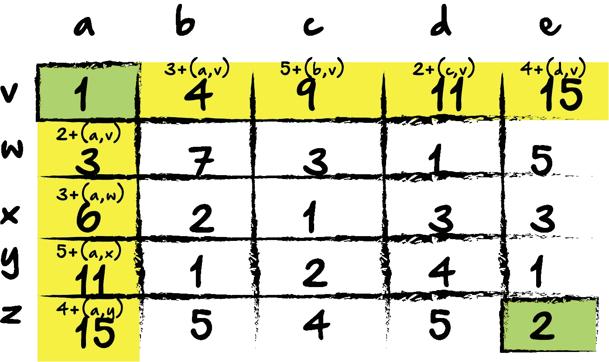
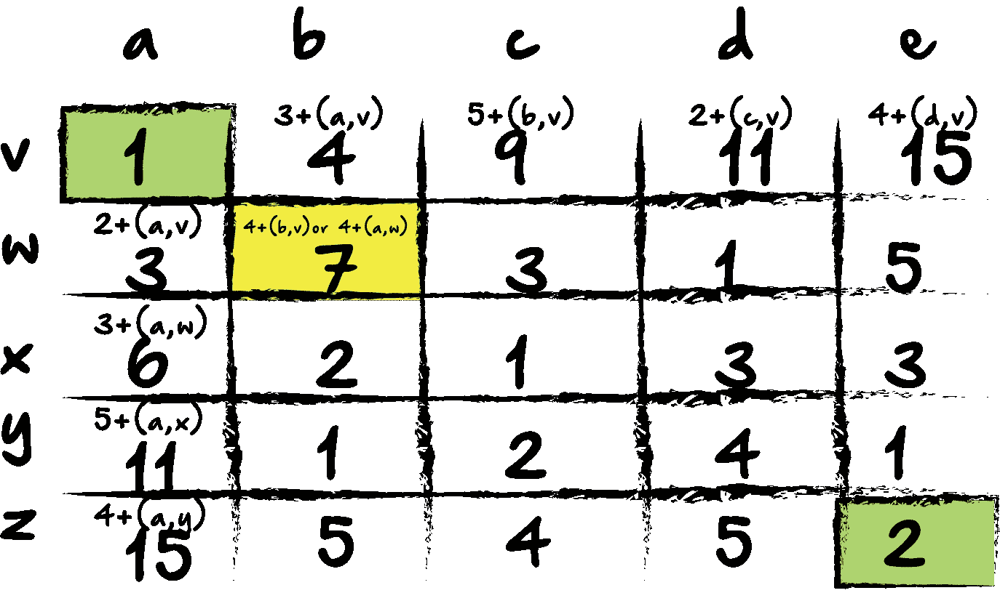
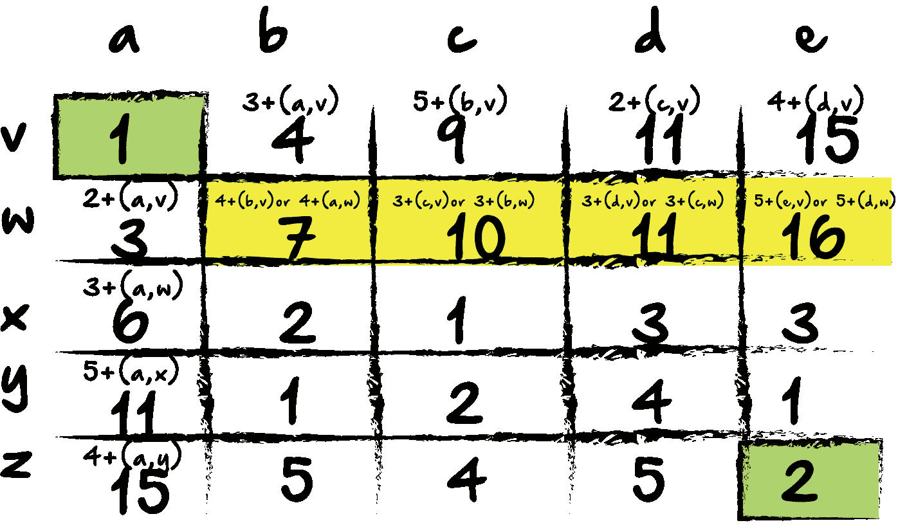
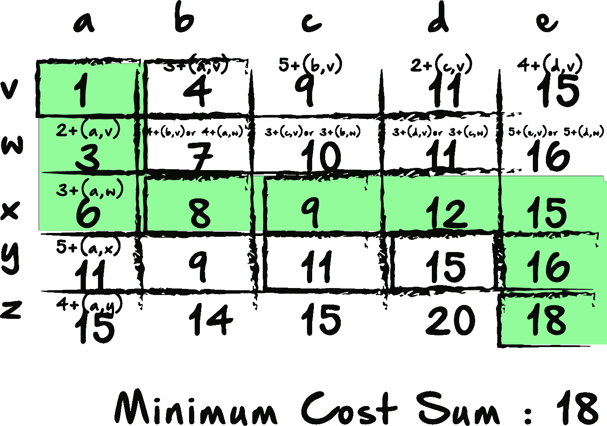

# 最小成本路径分析(Python)

> 原文：<https://medium.com/hackernoon/minimum-cost-path-analysis-python-47ad79a54519>



多维数组和矩阵是编程技术面试中很受欢迎的面试题目。虽然这类问题的实际应用有时可能会有些困难，但这类问题确实会测试受访者处理不同数据类型的能力，以及将代码整合成简洁代码块的能力。这一组中我特别喜欢的一个问题是关于最小成本路径的。



以上面的地图和网格格式的道路为例。如果你试图从 A 点到 B 点，你可能会认为每条街道的距离或时间。因此，根据你从 A 点到 B 点的路线，你的旅行时间和旅行距离可能会有所不同。让事情变得复杂的是，如果每条路都是单行道，那么当你发现你选择的路线上有很多车辆时，你就不能往回走了。在本例中，确定最小成本路径需要检查每一段的距离值或时间值，并计算得出最小总和值的路径。

这非常类似于在这些技术访谈中经常被问到的最小成本路径问题背后的想法。将上面的例子转换成看起来更熟悉的东西，考虑这个例子:



你通常会看到类似这样的东西，而不是地图。一个数字网格。作为开发人员，我们的工作是找到从左上角到右下角的路径，这将为我们提供最小成本路径，或最小路径和。通常，我们只能选择相邻的数字，并且只能向下移动，或者正好穿过网格。这可能是这样的:



在本例中，如果我们选择了一条直接穿过然后向下的路径，我们会将路径上的每个值相加，得出总路径开销为 2707。然而，最小成本路径可能要小得多。让我们看另一个简化的例子:



在这个画面中，我减少了每个数字的值，并给出了每个网格值的参考点。例如，坐标(a，v)可以引用第一个网格项。这将帮助我们确定我们引用的是哪个值。当我们从伪代码转移到实代码时，我们可能会使用数组，并且可以通过索引来引用值。

在这个例子中，显然我们可以在几分钟内简单地计算出最短路径，因为总路径是有限的。然而，想象一个 20×20，甚至 100×100 的网格。可能的路径数量会很快变得太大而无法计算，即使使用程序也是如此。即使我们可以计算每条路径的值，并使用蛮力进行比较，以确定最小路径，这种操作通常是相当内存密集型的，并且远不如其他方法有效。让我们用这个简单的例子来看看一个更有效的方法来确定最小成本路径。



首先，我们将查看网格中的第一行和第一列。记住，我们只能向右或向下移动到最终值。这里，我已经更新了第一行和第一列中的新值，并给出了给出该值的等式。在第一行中，我们通过将当前网格值与前一个网格块的值相加来获得新值。在第一列中，我们通过将当前值与它上面的块的值相加来获得该块的新值。



现在，我们为 block (b，w)做一些稍微不同的事情。因为它的上方和左侧都有一个块，所以我们可以添加任何一个块。因为我们想要最终的最小成本路径，所以我们选择较小值的块是有意义的。在这种情况下，它是值为 3 的块(a，w)。更新后的值是 7，(3+4)。现在，让我们对当前行做同样的事情:



这里，我们已经更新了行中的每个值，选择了每个选项的最低值。如果当前块上面的值更低，我们将得到两个块的和。但是，如果左边的块是一个较小的值，我们将使用该总和作为更新后的值。让我们用更新后的值填充网格的剩余部分。



通过将每个块的所有最小和相加，我们的结束块的值为 18。如果我们回溯历史，我们可以确定 18 确实是我们的最小成本总和。对于这个小例子来说，这似乎有点微不足道，但是再想象一下，这种方法有多简单，特别是如果我们的数字更大，或者我们的网格有更多的值。更不用说，这种方法远比计算和比较每一条可能的路径效率高。

现在，让我们来看看这是如何翻译成实际代码的。我的目标不是写一个硬编码的脚本来解决这个问题，而是写一个函数来解决任何大小的网格。为了测试我的程序，我将从之前的网格开始，但是在这里，我将它转换为一个单独的数组:

```
arr = [131, 673, 234, 103, 18, 201, 96, 342, 965, 150, 630, 803,
       746, 422, 111, 537, 699, 497, 121, 956, 805, 732, 524, 37, 331]
```

接下来，我要定义一些变量。这些变量对于以后在不同大小的网格上重用这些代码非常重要。

```
rows = 5
columns = 5
length = len(arr)
l = range(length)
firstColumn = l[5::rows]
firstRow = range(1, columns)
```

rows 变量定义了这个网格的行数。我的数组中有 25 个数字，但是我可以按照行和列的不同来分解它。这将有助于我保持条理。columns 变量做同样的事情。现在，如果我有一个不同的数组，比如 100 或 1000 个数字，我可以更改我的行和列变量，以反映我的新网格基于数组长度的新的行数和列数。

我的长度变量将帮助我设置以下变量。由于第一行和第一列的数学与所有其他网格块不同，我无法分别选择它们，知道数组的长度将有助于我做到这一点。

我定义了第一个列变量。因为变量' l '现在是一个列表，包含一个表示数组长度的数字范围，所以我用这个范围来确定这个变量。在这个例子中，因为我有 5 行，所以我想要的索引值是 5、10、15 和 20。这将是我的第一篇专栏文章。基本上，从 5 开始，跳过这些数字，抓取每第 5 个后续值，给出我需要的索引。如果我后来使用了一个更大的网格，我可能会从一个不同的值开始，这取决于我的行和列有多大。

我的第一个行变量是一个范围。我可以简单地说‘T1’，因为这些是我需要的索引。但是，我希望这些代码在将来尽可能地可重用。因为我不想要第一个值，`index 0`，我从‘1’开始，不管网格大小，它都是一样的，我将以变量列结束，它保持不变。如果我有一个更大的网格，一旦我更新了变量`column`和`row`，那么这一行代码将自动反映这一变化，我不必在其他地方更新它。

变量就位后，我现在将使用 for 循环遍历数组/列表:

```
for idx, val in enumerate(arr):
```

通常 python 中的 for 循环语法看起来像`for i in x:`，但是 Python 有一个名为 enumerate 的内置方法。这真的很方便，因为如果没有它，如果我抓取变量`i`，它给我的是当前值，而不是那个值的索引。这可能会让一些人感到困惑，因为在 JavaScript 中，调用 I 得到的是索引而不是值。不过，使用这种语法，我可以做到以下几点:

`print (idx, arr)`

Python 将返回一个包含索引和该索引处的值的数组。索引在这里非常重要，因为我主要是通过索引来控制列表中发生的事情。我们从第一个指标开始，0:

```
if idx == 0:  # Targets first list value
        val == val  # Leaves first value the same
```

第一个值不会改变，我们只是把它设置成它自己。

接下来，我们将选择并修改列表/数组的第一行和第一列中的值，就像我们在前面的可视化示例中所做的那样。

```
if idx in firstRow:  # Targets values in first row after first value
        arr[idx] = arr[idx] + arr[idx-1]  # Adds all values in first row to the previous list value
    if idx in firstColumn:  # Targets all values in first column
        arr[idx] = arr[idx] + arr[idx-rows]  # adds value to the value above in previous row
```

`idx in firstRow`主要检查当前索引是否在变量 firstRow 中。请记住，firstRow 包含的不是一个数字，而是一个数字范围，代表数组中除第一个以外的所有第一个索引值。如果我们正在循环的当前索引包含在列表/数组中，那么我们只需将它添加到先前的索引值中。`idx in`方法可以与 JavaScript includes 方法相媲美。

我们对我们的列做同样的事情，我们使用`in firstColumn`来检查索引是否也在列表中。如果是这样，我们使用变量`rows`进行回溯，而不是将其添加到先前的索引值中。这样做是为了回顾前一行，然后得到这两个值的和。我可以在这里使用[idx-5],但是[idx-rows]同样允许我的代码在将来更加可重用，因为如果我的网格更大，我需要更改的唯一变量将是 rows 和 columns 变量。

现在我们已经处理了网格中的第一行和第一列，剩下的就是剩下的数字了。我不需要指定行或列。我可以简单地说，“如果当前的索引不在其他列表中，那么做点别的”。

```
if idx not in firstColumn and idx not in firstRow:  # targes any other values not in first row or first column
        if arr[idx] + arr[idx-1] < arr[idx] + arr[idx-rows]:  # determine if value above or previous is smaller
            arr[idx] = arr[idx] + arr[idx-1]  # sets value
        else:
            arr[idx] = arr[idx] + arr[idx-rows]  # sets value
```

在前面的例子中，我们取前一个索引的值，或者上一行的索引的值，这取决于我们是在网格的第一行还是第一列。在这些指标值中，我们可以选择任意一个。所以我们使用 if 语句来确定是当前值左边的值小，还是当前值上面的索引值小。我们得到两者之和，并将当前数组值设置为新值。

如果我们打印数组/列表，那么我们想要的值将是数组末尾的第二个值。我们可以看到，本例中的最小开销路径是 2427，比我们开始时的路径要小得多，后者的总和是 2707。

下面是完整代码块的外观:

```
arr = [131, 673, 234, 103, 18, 201, 96, 342, 965, 150, 630, 803,
       746, 422, 111, 537, 699, 497, 121, 956, 805, 732, 524, 37, 331]rows = 5
columns = 5
length = len(arr)
l = range(length)
firstColumn = l[5::rows]
firstRow = range(1, columns)
for idx, val in enumerate(arr):
    if idx == 0:  # Targets first list value
        val == val  # Leaves first value the same
    if idx in firstRow:  # Targets values in first row after first value
        arr[idx] = arr[idx] + arr[idx-1]  # Adds all values in first row to the previous list value
    if idx in firstColumn:  # Targets all values in first column
        arr[idx] = arr[idx] + arr[idx-rows]  # adds value to the value above in previous row
    if idx not in firstColumn and idx not in firstRow:  # targes any other values not in first row or first column
        if arr[idx] + arr[idx-1] < arr[idx] + arr[idx-rows]:  # determine if value above or previous is smaller
            arr[idx] = arr[idx] + arr[idx-1]  # sets value
        else:
            arr[idx] = arr[idx] + arr[idx-rows]  # sets value
print arr  # returns list
```

再次回到技术访谈，学习和熟悉这些网格和多维数组问题的一个很好的方面是，他们建立了巩固代码的技能，以便代码可以更有效地运行。如果你有任何反馈，请告诉我。谢谢！