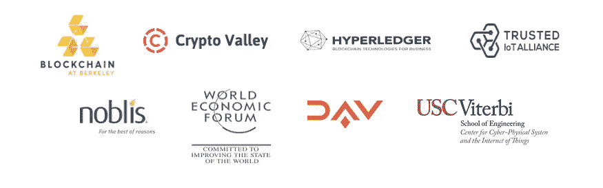

# 敏比特刚刚加入 MOBI！

> 原文：<https://medium.com/hackernoon/mintbit-just-joined-mobi-bfbb754430d2>

## MintBit 很高兴地宣布我们的移动开放区块链倡议(MOBI)的新成员！

## 作为 MOBI 的一员，我们将加入由 100 多家成员公司组成的全球联盟，其中包括许多世界上最大的汽车制造商和移动生态系统参与者，以及移动和区块链领域的众多参与者。

我们支持 MOBI 的使命，促进和推进标准，并加快采用区块链和分布式账本技术。MintBit 的存在是为了给大众带来区块链的好处。与 MOBI 财团一起，我们将改变移动行业。

我们希望共同努力，让移动服务更高效、更实惠、更环保、更安全、更少拥堵。敬请期待 MOBI 全体员工的更多更新！

> “运输和移动行业正变得越来越复杂，发展越来越快，相互联系也越来越紧密。在这种背景下，抓住孤立的、集中的价值创造不放不仅**不**有意义，实际上还会对行业的未来产生反作用。MOBI 正在寻求改变这种状况，我很自豪能为这种模式转变做出贡献。”—*mint bit 的区块链策略师阿尔温·斯密特*

## 关于 MOBI

MOBI 是一个非营利基金会，旨在加速采用和促进区块链的标准，为移动行业、消费者和社区的利益分发技术。

MOBI 和我们的合作伙伴正在创造简单、标准和数字化的方式来识别汽车、人和旅行，支付移动服务，并以保护产权和隐私的方式安全地交换和货币化数据。

MOBI 是一个开放、包容的机构，在新兴的按使用付费、按需、互联和日益自主的移动服务生态系统中充当实体的“可信召集人”和合作伙伴。MOBI 本身是技术和账本不可知论者。

**有关加入 MOBI 的更多信息，请联系** Erika Pingatore， [erika@dlt.mobi](mailto:erika@dlt.mobi) 或访问 [www.dlt.mobi](http://www.dlt.mobi) 。

**媒体联系人:** Adria Stauber，通讯
邮箱:[communication @ DLT . mobi](mailto:communication@dlt.mobi)| Twitter:[@ DLT](http://twitter.com/dlt)。摩比

## **关于 MintBit**

MintBit 于 2018 年在伦敦成立，旨在帮助公司和政策制定者在全球范围内导航去中心化技术。我们提供咨询服务，支持组织了解、优先考虑和执行区块链的战略潜力。对技术和市场的充分理解使公司能够识别将带来长期业务成果的机会。在 mintbit.io 了解更多信息。

**更多信息请联系:** 阿尔温·斯密特| [hello@mintbit.i](mailto:hello@mintbit.io) o

—

*想要更多见解？订阅每月* ***区块链字节*** *简讯* [*此处*](http://eepurl.com/ge9jNX) *或关注我们 Twitter 上的*[*@ mint bit _*](https://twitter.com/mintbit_)*。*