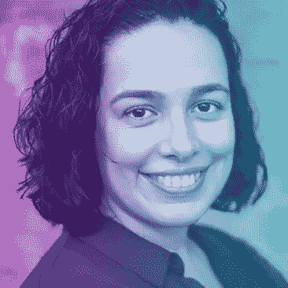
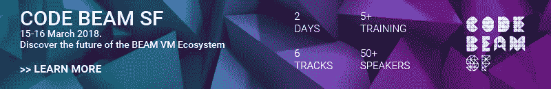

# 米丽娅姆·佩纳(Miriam Pena):如何成为“2018 年值得关注的 12 位鼓舞人心的女性员工工程师”之一

> 原文：<https://medium.com/hackernoon/miriam-pena-what-it-takes-to-make-it-as-one-of-12-inspiring-female-staff-engineers-to-watch-in-32fe3eeca0b5>

Miriam Pena 在可扩展、高性能、高并发性和高可用性系统方面拥有超过 10 年的经验。她是旧金山 AdRoll 公司的一名工程师，负责设计他们实时竞价基础设施的关键部分。

在加入 AdRoll 之前，她为 Erlang 提供专业咨询服务，并获得了西班牙拉科鲁尼亚大学的计算机科学硕士学位。被 Women 2.0 评选为 2018 年 12 位值得关注的[女性之一。](https://you.women2.com/12-inspiring-female-staff-engineers-to-watch-b487b39558e1)

下周，米里亚姆将在 [**Code BEAM SF**](http://www2.erlang-solutions.com/l/23452/2018-03-08/5c3gzy) 的主舞台上担任主题演讲人。在会议开始前，我们和 Miriam 坐在一起，询问她关于与 Erlang 合作的事情，Erlang 是开发人员中给她带来灵感的人，以及她为什么选择在 Code BEAM SF 上发表关于[**【BEAM 的无名英雄】**](https://codesync.global/speaker/miriam-pena/)**——他们都是女性的演讲！**

****

**Code BEAM SF: [https://codesync.global/conferences/code-beam-sf-2018/](https://codesync.global/conferences/code-beam-sf-2018/)**

****你是如何开始与 Erlang 合作的，作为一名开发人员，这对你有什么好处？****

**回到我在西班牙拉科鲁尼亚大学的时候，我受到了 MADS 研究小组负责人 Victor Gulias 和我的计算机科学家同事的启发。我的硕士论文是在 Erlang 中优化一个 VLAN 交换机，我非常喜欢它，于是我将整个职业生涯都奉献给了在 Erlang 中部署极其复杂的系统。**

**我个人喜欢 Erlang，因为它的实现时间很短，我喜欢它让并发分布式系统和通信协议变得如此简单。它不像其他语言那样冗长，因此不容易出错。凭借其稳定的 API，它的维护成本也很低。事实上，它的需求量很大，而且你经常可以远程工作，这也是一个额外的收获。**

****参加去年的大会对你来说意味着什么，有没有什么演讲或演讲者给了你灵感？****

**在个人层面上，我喜欢 Peer Stritzinger 关于 Grisp 硬件板的演讲，以及 Hannah Howard 关于该演讲的编排。我也是通过安娜·奈兹伯格才知道长生桥集团的。对于我工作的公司 AdRoll 来说，去年参加的 [Erlang 和 Elixir Factory 会议](http://www.erlang-factory.com/sfbay2017/)是他们雇佣两名一流 Erlang 开发人员的关键。**

****是什么激发了你在 Code BEAM SF 发表演讲——“光束的无名英雄”****

**我总是避免曝光，我从不写博客，但是我创建了像[梅罗](http://github.com/adroll/mero)这样的开源库。去年 11 月，我被《女性 2.0》(Women 2.0)选为 2018 年 12 名鼓舞人心的硅谷员工工程师之一。这个被媒体发现了，然后就爆炸了！我在西班牙和其他拉美国家的电视、广播和印刷媒体上出现了超过 12 条新闻。我提倡将 Erlang 作为一种技术，用于有趣且具有挑战性的项目。使我能够环游世界并建立成功的事业。**

**经过媒体的关注，我受到了公众的热烈欢迎。母亲们说，“他们的女儿在电视上看到了我，现在想学习计算机科学。”也有人跟我说，Erlang 听起来真的很酷，他们准备去学！这让我意识到为她们出头是多么重要，所以我决定采取行动，让其他女性看到自己，为她们做出贡献。**

**然后我看了看我们的社区，那里的女性比例低于科技行业 20%的平均水平。一些人说，尽管我们努力改善这一状况，但可能只有 7%左右。然后我有了一个想法，谈论那些曾经帮助过并且仍然在帮助塑造 Erlang 社区的女性。如果没有这些女性，我们甚至不会在这里阅读这篇文章。重要的是要让这些女性受到关注，为下一代树立榜样。我希望这个演讲本身能引发某种蝴蝶效应，帮助创造下一代科技女性。**

***最初发布于*[*codesync . global*](http://www2.erlang-solutions.com/l/23452/2018-03-08/5c3h11)*。***

****