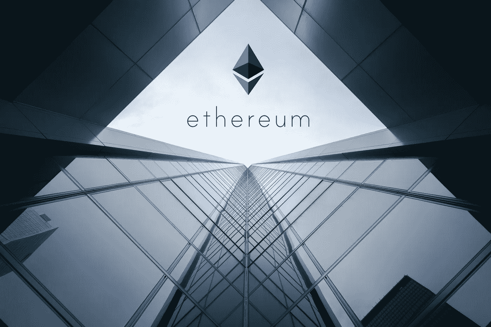
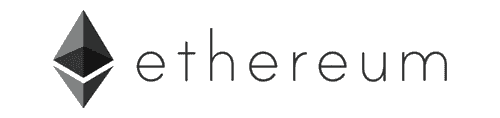
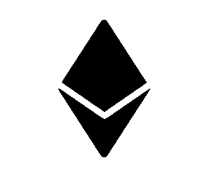

# 以太(eum)市场的误解

> 原文：<https://medium.com/hackernoon/misconceptions-in-the-ether-eum-market-5a7042ca5fc>

*重整以太&以太坊市场争论*

> [**萨姆·卡萨特**](/@samcassatt) **&** [**埃弗雷特·穆兹**](/@everett.muzzy) **、孔森斯**

围绕区块链技术、以太坊网络和加密资产的持续对话对于这一新生领域的发展和改进至关重要。我们鼓励人们讨论他们关于平台、资产和技术的想法、顾虑和解决方案。然而，随着如此多的全球讨论，误解可能会在社区中获得牵引力。

我们写这篇文章是为了解决生态系统中一些更常见的误解，这些误解错误地描述、理解或定位了以太和以太坊。为了确保关于区块链技术的对话尽可能真实，并确保团体将技术客观性置于经济利益之上，我们已经确定并解决了一些反复出现的反对以太和以太坊的论点。对于截然不同的技术论点，我们已经尽可能具体、客观地做出了回应。对于以太和以太坊网络方向的更大的理论争论，我们提供我们的教育思想和最好的判断。

# 部分:

**【1】监管误解
【2】价值储存误解
【3】可扩展性误解
【4】块大小误解
【5】安全性误解
【6】集中化误解
【7】价格不稳定误解
【8】结论**

## [1]误解:即将出台的代币发行法规将减少以太坊区块链的开发者活动，从而影响人们的兴趣并降低以太的价值。由于监管力度加大，以太坊将不会是一个很好的融资平台。

在全球范围内，随着对加密市场、加密交易所和加密资本的监管措施或禁令，令牌发行、交易活动和加密投资的频率已经下降。我们欣然承认，即将出台的法规*可能会*总体上减少继续发生的令牌发射的数量(并且推而广之，发生在以太坊上)，但是我们不同意这种法规会*负面地*影响以太或以太坊的强度的持续结论。

**事实是，** ***缺乏* o** **f 监管和合规明确性将对未来的加密市场产生负面影响**。没有监管标准，投资者和创新者对推出、交易或使用代币会相当谨慎。规避风险的个人不会在不确定税收影响、资产分类和合法性的情况下投资一个平台或资产。如果以太坊平台上的令牌数量在短期内减少(我们仍然认为以太坊仍将是使用最多的分散化应用平台，并支持更多的令牌)，这将是因为监管已经识别并消除了欺诈性或剥削性的令牌和平台。监管不仅通过法律的明确性提供投资者信心，还通过确保以太坊平台上的未来代币遵守保护老用户和新用户的原则。

随着对加密市场的明确监管以及随之而来的开发者和投资者参与度的增加，我们将很快见证以太坊的象征性流动性潜力。作为现有最通用的平台，以太坊将促进世界上许多资产的令牌化(想象一下 Meridio 正在对房地产进行的操作，但适用于全球越来越多的资产)，创造深度流动性市场和革命性的经济互操作性。这意味着经济交易的成本和延迟将变得微不足道，可供交易的资产类型在理论上将是无限的，资本的获取将随着进入壁垒的降低而民主化。**目前还没有其他具有适当治理、安全性和灵活性的公共区块链平台作为这些资产的基础。**

**监管带来清晰。清晰带来了开发者的参与和投资者的信心。随着开发商的参与和投资者的信心而来的是资本。**因此，以太坊将继续作为一个优秀的(事实上，可以说是最好的)区块链融资平台。在[2]中进一步展示了说明这一点的数据。

## [2]误解:密码的下一个牛市将由价值储存(SOV)资产主导。以太不能充当 SOV，因此比特币等其他资产将引领下一轮牛市，以太将遭受损失。

批评者认为以太不能作为一个 SOV，因为以太坊不能成功地作为一个分散的应用平台或资本筹集平台。我们认为这两个假设都是不真实的:

**去中心化应用平台:**以太坊，不考虑远程，是现有最健壮的去中心化应用平台。迄今为止，已有超过 1500 个 dapps 在该平台上推出。举几个例子，像 FunFair、Augur、Ujo 和 Loom Network 这样的平台都有功能强大、可扩展的平台，拥有强大的用户基础。有些人认为技术问题(如可伸缩性)会影响应用程序的构建，本文的第[3]点对此进行了阐述。有些人认为会损害 dapp 开发的“架构问题”(即集中化)在第[6]点中得到了解决。

**融资平台:**此外，以太坊毫无疑问是现存最成功的区块链融资平台。[市值排名前 100 的代币](https://coinmarketcap.com/)，94%都建立在以太坊之上。迄今为止，以太坊已经筹集了 130 亿美元的集体资本。[市值排名前 700 的代币](https://coinmarketcap.com/)，87%都是建立在以太坊之上的。这些代币筹集了 190 亿美元，其中有 150 亿美元。我们相信数字本身就证明了以太坊作为融资平台的优越性。第[1]点阐述了即将出台的法规将阻止资本流向网络的相关论点。

事实上，我们相信以太证明了自己是一个强大的 SOV。一个资产作为一个强大的 SOV，它必须提供:安全性，分散性，网络效应，年龄，流动性和效用。本质上，以太具备比特币所具备的安全性和去中心化的所有品质。年龄、流动性、网络效应和效用是平台不同的地方，也是以太(eum)具有可比性或处于领先地位的地方。

**安全&去中心化:**比特币和以太坊都是带着对安全和去中心化的相同承诺发展起来的。两个区块链平台都确保，作为一个创始原则，参与者可以使用平台而不用担心资金损失(由于基础技术的缺陷)或集中操纵。以太网被黑客攻击而比特币没有的论点在第[5]点得到了解决。

**网络效应:**一个 SOV 的优势部分在于它作为一个 SOV 被普遍采用。如果只有一小部分人认为某样东西有价值，那么该群体价值的损失或变化将影响该资产作为 SOV 的地位。我们认为以太已经达到了与比特币相似的不同网络效应水平，从无处不在的采用和作为有价值资产的认可的角度来看，以太被认为是不可否认的 SOV。事实上，以太已经达到如此程度的分散和广泛采用，以至于 [SEC 官员威廉·希曼断言它不是一种安全](https://www.sec.gov/news/speech/speech-hinman-061418)。然而，当谈到互补或间接网络效应的概念时，以太和以太坊在加密市场上占有优势。互补或间接网络效应是一种现象，其中一种产品使用量的增加增加了另一种产品的价值，导致原始产品的价值和使用量增加，等等。随着基于以太坊的平台使用的增加，以太将经历更高的需求，很可能导致价值的增加，并吸引更多成功的项目到区块链。

**年龄:**我们公开承认，比特币在区块链行业的资历赋予了其作为 SOV 的强烈身份，但我们相信以太的可比年龄(2014 年)也使其稳固地处于 SOV 的地位。

**流动性:**流动性对于资产的 SOV 身份至关重要。个人没有动力持有他们不能轻易、快速或廉价交易的资产或其他资产。相比比特币，以太的交易速度更快，成本更低。更重要的是，我们认为未来的以太会比现在更具流动性——很可能会提升它作为 SOV 的地位。在未来，成百上千的代币建立在以太坊之上(记住，前 100 名中的 94%已经建立在该平台上)，我们设想深度流动市场，在该市场中，以太和代币之间以及代币和代币之间的交易可以即时、分钟和廉价地发生。随着平台上每个额外令牌的建立，以太将变得越来越液态。

**效用:**SOV 资产具有实际效用的需求是有争议的——特别是在加密领域。相反的观点认为,“有用的”平台所经历的创新、变化和不确定性的数量与人们希望在 SOV 中看到的稳定性和可预测性直接矛盾。然而，一个真正的 SOV 必须为人们提供某种潜在的效用——它不能仅仅通过网络效应来实现稳定，或者这样的论点。让我们不要忘记黄金——历史上历史最悠久、最普遍的主权财富基金——其核心是一种非常有用的*元素。也就是说，其市场价值远远超过其效用，其 SOV 特征似乎源于效用和市场行为的结合。*

以太网的行为受制于市场压力，就像买家将菲亚特移动到以太网以购买令牌一样，同时也为开发人员和用户提供了一种实际用途，即作为给网络加油和与 dapps 互动的气体。一个被称为“[速度论题](/blockchannel/on-value-velocity-and-monetary-theory-a-new-approach-to-cryptoasset-valuations-32c9b22e3b6f)的代币经济理论可以表明，为特定用途开发的代币不太可能作为 SOV 获得价值，因为它们的“速度”太高，即用户不愿意长期持有它们。然而，当以太坊切换到 PoS 时，额外的潜在效用将来自为了经济回报而对未决块下注以太。一个可能的结果是，用户将有动力持有比以前更多的乙醚，以便从赌注中获得回报。

总之，在数字和网络健康面前，反对以太网不作为 SOV 的两个持久论点是站不住脚的。Dapp 开发势头强劲，可伸缩性问题正在得到解决并投入使用(参见[3])，随着新平台的发布，用户也开始使用新平台。以太坊是现存的最大的区块链资本筹集平台，它已经筹集了数十亿资金。该平台将继续吸引资本，甚至可能受益于阻止弱势或掠夺性代币发行并授权强势代币发行的监管(见[1])。当我们分析以太网以及 SOV 资产的关键特征时，我们发现以太网非常适合在未来继续充当 SOV。

## [3]误解:以太坊当前的扩展缺点将会驱使开发者、企业家和投资者远离该平台。因此，乙醚的价值会降低。

在整个区块链生态系统中，缩放是一个备受关注的问题。作为一个托管大量面向消费者的产品的去中心化应用程序，以太坊在 CryptoKitties 等广受报道的事件之后尤其受到关注。这个问题一直是以太坊开发人员最关心的问题，许多扩展解决方案已经在开发中，或者已经投入使用。

怀疑者声称，第 1 层和第 2 层扩展解决方案将在几年内不可用，或者暗示与竞争对手相比，扩展方面的任何重大发展都将为时过晚。事实上，我们发现平台已经在当今的产品中有效地使用第 2 层扩展解决方案。Loom Network 的 SDK 允许开发者创建高度可扩展的游戏和社交区块链。他们还提供 ZombieChain，这是一个第 2 层侧链，使用 DPoS 作为共识算法，同时仍然依赖第 1 层以太坊作为基础安全层。 [FunFair Technologies](https://media.consensys.net/scaling-shoutout-funfair-technologies-c0b0281ce137) 已经成功实现了国家频道技术，创造了高度可扩展、即时、廉价和用户友好的在线游戏体验。等离子体正在开发中，并被诸如[奥米赛戈](https://omisego.network/)等项目所应用。其他正在开发的扩展解决方案，包括 Casper/PoS、sharding 和 Raiden，预计将于 2018 年或 2019 年初推出。

我们也希望读者研究一下为什么以太坊社区选择依赖核心以太坊作为基础安全层，而只在第二层应用 dpo 和其他共识方法的原因。事实上，我们甚至可以说，在基础层应用这些技术是不负责任和危险的。一如既往，我们鼓励社区进行自己的研究。然而，从上一段中的织布机和游乐场开始，希望这种观点的合理性将进入视野。我们认为市场的智慧最终会达成一致。

## [4]误解:以太坊唯一可用的扩展解决方案是增加块大小，这不是一个可行的长期解决方案，并将导致令人担忧的集中化。

我们不认为这一论点需要特别详细的答复。**简而言之，增加块大小从来都不是以太坊社区真诚提出的扩展解决方案。**以太坊的创建首先考虑的是去中心化和安全性，而增加块大小的集中化含义与这些核心原则是对立的。相反，以太坊社区正在投资不涉及去中心化或安全性的第 1 层和第 2 层扩展解决方案。有关缩放解决方案的更多详细信息，请参见[3]。[6]中概述了对以太坊区块链中心化问题的回应。此外，块大小将直接增加([而不是通过气体限制](/@VitalikButerin/because-of-ethereums-exponentially-growing-blocksize-the-bottleneck-is-not-regulated-8c0acd77b3a2))的概念代表了对以太坊交易如何包含在块中的基本误解。

## 【5】误区:投资者会更愿意把钱投给从未被黑过的比特币，而不是被黑过无数次的以太。

那些怀疑以太短期和长期市场价值的人认为，投资者更愿意将资金存储在比特币区块链上，而不是以太坊区块链上，他们认为比特币经受住了无数次攻击，而以太在历史上已经屈服。

以太和以太坊都没有被黑过。我们必须假设这些参数指的是诸如 multisig 奇偶校验攻击和 DAO 攻击之类的事件。这两起事件都是建立在以太坊之上的*平台*的安全问题，**类似于互联网上的一个网站被黑客攻击，而不是互联网被黑客攻击。**以太和以太坊本身都没有被黑。服务于区块链或建立在其上的平台的弱点并不局限于以太坊。比特币有很多 Mt. Gox 交易所[被黑了两次](https://venturebeat.com/2011/06/19/popular-bitcoin-exchange-mt-gox-hacked-prices-drop-to-pennies/)。然而，比特币货币本身已经被黑客攻击——不像以太网。2010 年，[有人黑了比特币区块链](https://www.coindesk.com/9-biggest-screwups-bitcoin-history/)，凭空创造了 1.84 亿个比特币。区块链经历了一个艰难的分叉，以修补允许利用的错误。总之，安全论点是错误的(或者说，措辞不当)。这两个区块链都存在相关交易所和项目的安全问题，都经受住了对核心技术的多次攻击，但只有比特币的核心代码暴露了一个漏洞。

## [6]误解:以太坊的生态系统已经相当集中，有了像 Infura 这样的项目。in fura——因为它是有补贴的，而且是免费提供的——也人为地保持了较低的交易成本。

Infura 是一个 ConsenSys 组织，为不能或不想自己运行完整节点的开发人员和技术人员提供节点访问。Infura 允许这些用户“外包”运行节点的计算能力——本质上充当网络的 devops 提供商。Infura 目前为大约 [35，000 名开发者和 dapps 提供服务，每天处理 100 亿个请求](https://www.trustnodes.com/2018/07/25/ethereums-node-infrastructure-provider-infura-handling-10-billion-requests-per-day)。Infura 提供了处理“读”事务所需的可伸缩性，这大大超过了“写”请求。

然而，Infura 在基础设施层的存在并没有内在的集中化。没有什么可以阻止其他 devops 提供商进入市场，只是还不存在那些竞争对手进入市场的市场压力。形成 devops 服务以提供更多节点来处理规模并不是一个新概念——in fura 恰好是市场上最突出的参与者。如果 Infura 最终确实带来了集中化风险，这将成为足够的市场压力，允许更多的参与者进入该行业。

人们还担心，由于 Infura 得到了 ConsenSys 的补贴，它正在人为压低在以太坊区块链交易的实际成本。我们已经看到一个(未经证实的)估计，Infura 每年的运营成本超过 1000 万美元。虽然我们选择目前不透露 Infura 业务的细节，但让我们调查一下如果我们把这个 1000 万美元/年的估计值当真的话*会是什么样子。大约需要 83 万美元/月的运营费用。分摊到 35，000 个客户身上(如上所述)，每个客户每月的费用是 23.80 美元——对于 B2B 服务来说，这几乎不是一个大的成本，就其对天然气成本的影响而言，这也是微不足道的。*

鉴于这一分析，以及即使是以太坊应用的微妙市场需求也能支持每家公司每月 23.80 美元的烧钱率这一事实，我们认为这是无可争议的。

## [7]误解:以太价格的波动表明，与比特币相比，以太是一种不稳定的投资资产。

区块链生态系统将以太网在头四年(2014 年 7 月众筹——2018 年 7 月)的约 1700 倍回报率与比特币在同一时间段的 10 倍回报率进行了比较。这种观点认为，1，700 倍与 10 倍相比表明以太的不稳定性，使其成为一种危险的投资和贬值的主要原因。然而，如果我们比较*相对时间框架，*我们会发现以太网在其存在的前四年的 1700 倍回报率几乎接近比特币。在 2010 年 7 月 17 日(雅虎财经，约 0.05 美元/BTC)和 2014 年 7 月 17 日(约 623 美元/BTC)之间，比特币的最早报告估值为 12500 倍。**事实上，如果我们从 2010 年 5 月 22 日比特币最早的货币交换(**[**【25 美元的披萨换一万个 BTC**](https://www.businessinsider.com/bitcoin-pizza-10000-100-million-2017-11)**= 0.0025 美元/BTC)到 2014 年 5 月 22 日的价值(～526 美元/BTC)，回报率超过 21 万倍。以太网前四年 1，700 倍的回报率表明，与比特币前四年的极端回报率相比，这种加密资产太不稳定，不适合长期投资的观点并不完全成立。**

## [8]结论

我们希望这份出版物有助于澄清区块链生态系统中的争论，这些争论错误地描述了以太和以太坊的效用、力量和未来。概括地说，许多误解似乎源于这样一种信念，即在市场上取得成功的空间是有限的；一种区块链或资产必然脱颖而出，而另一种必然遭受损失。相反，我们认为“馅饼足够大”，并将继续增长，允许比特币和以太坊等传统区块链和加密市场继续增长，同时为其他平台和资产进入市场提供空间。我们有，我们有，我们将永远承认以太坊网络需要的成长和改进。然而，我们过去、现在和将来都会一直对以太坊社区中致力于开发和集成该平台的无数成员保持信心。我们毫不掩饰地看好以太和以太坊的未来。

