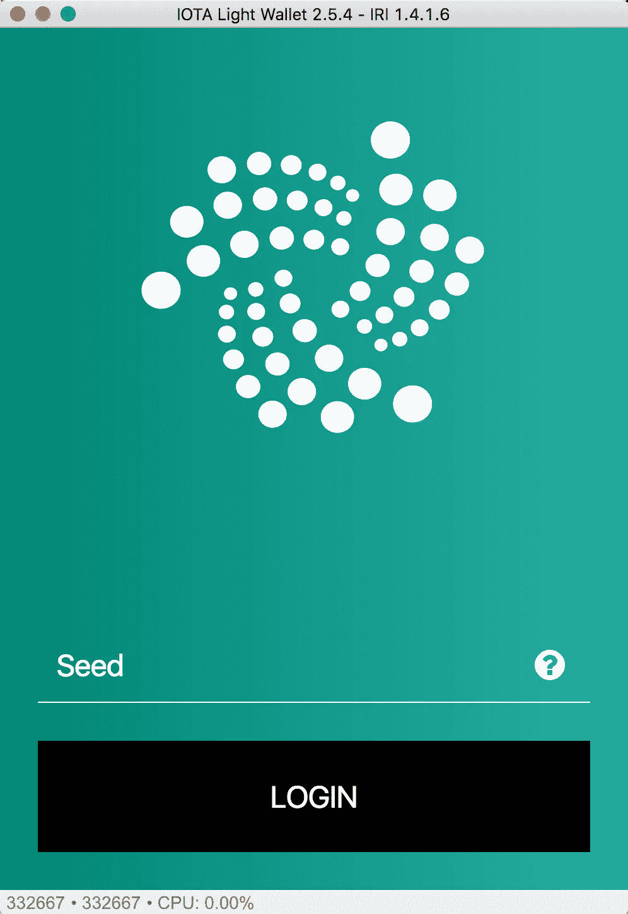

# 钱包里少了一点？现在就看这个！

> 原文：<https://medium.com/hackernoon/missing-iota-desktop-wallet-hack-seed-generator-fcf99ce10872>

## 如果您使用了一些随机的在线种子生成器，您很可能会受到这种攻击。现在检查您的余额！

TL；DR:如果您的余额显示为 0，并且您的历史记录中有已确认的交易。那你被抢了！

似乎一些诈骗犯用一个毫无防备的网站[绊倒了许多人](http://iotaseed.io/)

众所周知，要创建 IOTA wallet，我们需要创建一个 81 字符的种子。因为那些对计算机和隐私有很好了解的人在本地以一种安全的方式创造了他们的种子。然而，许多想要创建种子的初学者去谷歌搜索“生成 IOTA 种子”，结果是一个不可信的网站 [http://iotaseed.io](http://iotaseed.io/)

当你访问那个网站时，你需要随机移动你的鼠标指针，它会为你生成一个种子，你可以备份它，也可以用它来登录你的钱包。一件重要的事情，每个人都错过了是那些 buggers 开始存储密钥生成的所有时间。

现在从 1 月 18 日开始，他们已经对所有储存的种子发起了有计划的攻击，并从这些初学者中的大多数人那里窃取了资金。

来源:[给所有用被盗余额发帖的人](https://forum.helloiota.com/9100/To-everyone-posting-with-stolen-balances)

Nic Carter giving a walk through of events happened