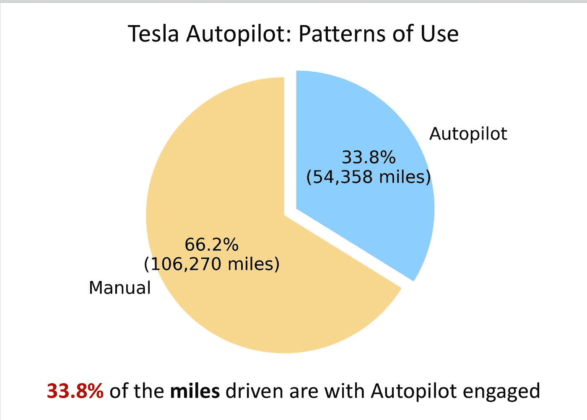
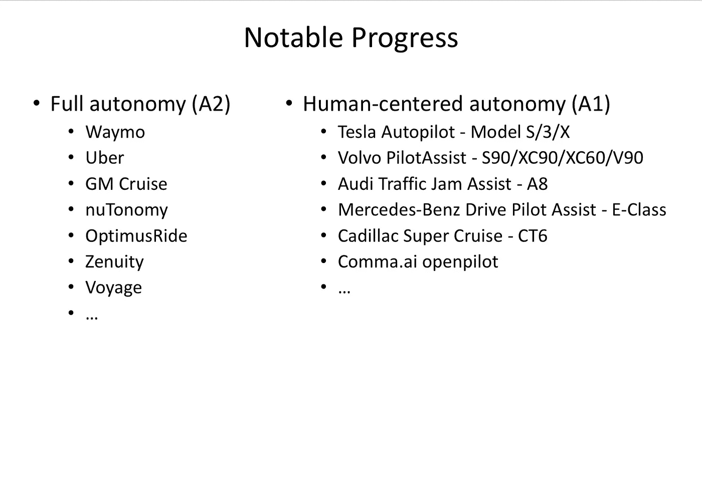

# 麻省理工 6。S094:自动驾驶汽车的深度学习 2018 讲座 2 笔记

> 原文：<https://medium.com/hackernoon/mit-6-s094-deep-learning-for-self-driving-cars-2018-lecture-2-notes-e283b9ec10a0>

> [你可以在 Twitter @bhutanisanyam1](http://twitter.com/bhutanisanyam1) 找到我，在 [Linkedin 这里](https://www.linkedin.com/in/sanyambhutani/)
> 这里[这里](https://becominghuman.ai/a-self-driving-new-year-33284e592f35)和[这里](https://hackernoon.com/a-self-driving-new-year-2-d1bbc5a83570)是我学习[自动驾驶汽车](https://hackernoon.com/tagged/self-driving-cars)道路上的两篇文章
> 
> [你可以在这里找到降价文件](https://github.com/init27/MIT-6.S094-Deep-Learning-for-Self-Driving-Cars)
> 
> [你可以在这里找到讲座 1 的笔记](/init27-labs/mit-6-s094-deep-learning-for-self-driving-cars-2018-lecture-1-notes-807be1a50893)
> [讲座 3 的笔记可以在这里找到](https://hackernoon.com/mit-6-s094-deep-learning-for-self-driving-cars-2018-lecture-3-notes-deep-reinforcement-learning-fe9a8592e14a)
> [讲座 4 的笔记可以在这里找到](https://hackernoon.com/mit-6-s094-deep-learning-for-self-driving-cars-2018-lecture-4-notes-computer-vision-f591f14b3b99)
> [讲座 5 的笔记可以在这里找到](/@init_27/mit-6-s094-deep-learning-for-self-driving-cars-2018-lecture-5-notes-deep-learning-for-human-5cb0f53e4f15)
> 
> 这些是麻省理工学院六年级第二讲的笔记。S094:自动驾驶汽车深度学习课程(2018)，由[莱克斯·弗里德曼](https://twitter.com/lexfridman)教授。

所有图片均来自讲座幻灯片。

# 自动驾驶汽车

(或无人驾驶汽车或自动驾驶汽车或机器人汽车)

# 乌托邦观点:

*   SDC 如何有机会改变我们的生活:

1.  世界各地有 130 万人死于车祸。
2.  仅在美国就有 35-40，000 人。
3.  机会:设计拯救生命的人工智能系统。
4.  自动驾驶汽车有能力消除醉酒、吸毒、注意力分散、昏昏欲睡的驾驶。

*   消除所有权:

1.  增加共享移动性。
2.  省钱。
3.  降低成本，通过将旅行成本降低一个数量级，使它们更容易获得。

*   在车辆中嵌入软件使体验更加个性化。

# 反乌托邦观点:

*   消除工作岗位:更新的技术总是让人害怕，因为它可能会夺走依赖现有技术的工作岗位。交通行业的专业人士。
*   智能系统失败的可能性是我们必须在哲学、技术和伦理层面与之斗争的。
*   流行文化中的人工智能(不在工程师中)可能有偏见或基于伦理。“黑箱”的伦理基础是什么？它遵循我们社会的规则吗？
*   安全性:使用代码工作的车辆可能会被“黑客攻击”

一个工程师的观点:我们想找到最好的方法来改造我们的社会和改善生活。

# 怀疑论

*   我们对于深度[学习](https://hackernoon.com/tagged/learning)什么是难什么是容易的直觉，AI 是有缺陷的。
*   人类擅长驾驶。我们的直觉应该基于数据的来源、注释和算法
*   无论是对乌托邦还是反乌托邦的观点做出预测和承诺，我们都必须小心谨慎。
*   对未来两年内[未来](https://hackernoon.com/tagged/future)车辆的承诺令人怀疑。
*   一年后对未来汽车的承诺令人怀疑
*   一个好的测试是在公共道路上大规模测试车辆。
*   另一个很好的挑战是让他们可供购买。
*   罗德尼·布鲁克斯的一个(令人满意的)预言:

1.  > 2032 年:美国主要城市的无人驾驶出租车服务，可以随意接送乘客，甚至在地理限制区也可以。
2.  > 2045 年:美国大多数城市将强制执行这些规定。

技术采用率与年数的关系图:

*   作为一个社会，我们更善于接受更新的技术。
*   一切都可能在一夜之间改变。

# 概述:

# 不同的自动化方法

## 自主水平(SAE J3016):

*   对初始讨论、政策制定和媒体发布有用的分类。
*   毫无疑问，对于设计底层系统和整体系统性能没有用处。

## 超越传统层次:两种类型的人工智能系统。

*   起点:每个系统在某种程度上都需要人。人类控制车辆并启动系统。
*   A1:以人为中心的自主性:定义:当 AI 不完全负责时。人类对行为负责。

1.  多久有一次？
2.  是基于传感器的吗？
3.  提供给驾驶员接管的秒数，目前几乎为 0 秒。(是时候清醒过来并掌握控制权了)
4.  由不在车内的人远程接管控制。对于以人为中心的自治，人类将负责任。假设是系统会失败，人类将需要接管控制。

*   A2: AI 全责。从法律上讲，汽车设计师要对这种行为负责。

1.  不涉及遥控操作。
2.  不应该有 10 秒规则。这还不够好。
3.  必须找到安全的港湾。
4.  允许人类根据自己的选择来接管。人工智能只在危险(例如:撞车)临近时强制超越。

L0:起点。L2 L1，L3: A1:以人为本。L4，L5: A2:完全自主。

以人为中心的方法:批评:当人类被给予这个系统时，他们会“过度信任”这个系统。系统变得越好，人类就越不会注意。

公众对自动驾驶汽车内部情况的看法:

工程师的看法:

*   道路上的大量车辆都配备了自动驾驶仪，这相当于数据，大量的数据。

## 麻省理工学院-AVT 自然驾驶数据集

*   该数据集包括来自 3 台高清摄像机的视频
*   所有数据来自 GPS、IMU
*   CAN 总线的数据
*   来自车内的数据、对话、注意力水平、睡意、情绪状态、身体姿势、活动等。
*   5B+帧，主动注释。
*   来自公路旅行的数据:
*   利用这些数据来理解人类内部的行为。
*   利用数据来训练感知和控制。

*   GPS 地图:红色-人类驾驶英里。蓝色-自主里程。

*   33%英里自动驾驶！(使用自动驾驶仪)

*   扫视分类:自动驾驶与手动驾驶时人类注意力的划分。承诺:以人为本的方法，系统不会被过度信任。

## 特斯拉自动驾驶:

*   用法:密集(英里/小时的高百分比)
*   道路类型:多为高速公路。
*   精神投入:当人类不舒服时，8000 次控制转移。外卖:有风险。
*   身体接触:两种情况下的注意力保持不变。
*   外卖:

1.  要信任系统，就让系统暴露它的缺陷。知道哪里管用，哪里不管用。
2.  检查系统的极限:在具有挑战性的环境中。

## 自动驾驶汽车:机器人观点。

*   范围广:车辆数量巨大。
*   深远:控制权转移给人工智能。
*   个人:建立关系，其中人机交互是关键问题。
*   这个系统应该更像一个“个人机器人”而不是一个“感知-控制”系统。
*   人类和机器的缺陷必须是透明的，并在两者之间进行沟通。
*   要点:在 90%的情况下启用该系统。通过揭示这些缺陷，我们为人类在需要时控制局面提供了空间。

# 传感器

可以处理的原始数据的来源。

*   摄像机:视觉系统-RGB，红外线。
*   雷达:超声波。
*   激光雷达

# 超声波:

1.  在附近工作良好。
2.  便宜。
3.  传感器尺寸可以很小。
4.  在恶劣天气和能见度下工作。
5.  射程很短。
6.  可怕的决心。
7.  无法检测速度。

**雷达:**

1.  通常在具有一定程度自主性的车辆中提供。
2.  便宜-电子和超声波都很便宜。
3.  在恶劣天气下表现出色。
4.  低分辨率。
5.  当今最可靠且广泛使用的。

*   雷达:

1.  超声波的所有优点以及检测速度的能力。
2.  低分辨率。
3.  无纹理，色彩分辨率。

# 激光雷达:

*   价格昂贵。
*   极其精确的信息深度-具有非常高的分辨率。
*   360 度的能见度。
*   可靠，数据密度更高。
*   激光雷达图:蓝色半径越大，性能越好。

1.  范围不错，不是很大。
2.  在黑暗和明亮的照明条件下工作。
3.  在恶劣天气条件下无效。
4.  没有关于颜色、质地的信息。
5.  能够检测速度。
6.  巨大的传感器尺寸。
7.  价格昂贵。
8.  对超声波无效。

# 摄像机:

*   便宜。
*   最高分辨率:最高的信息密度-信息可以被学习和推断。
*   与其他传感器相比，可以获得多得多的数据。
*   人类以类似的方式粗糙地工作。
*   缺点:深度估计不好，在极端天气下不可靠。

*   距离与灵敏度的关系图。条件:清晰、光线充足的条件。

1.  摄像头的范围最大。
2.  超声波分辨率高，但范围很小。

*   条件 2:晴朗、黑暗的条件 Vs 条件 3:大雨、大雾或大雪:
*   两者都不可靠。
*   雷达保持不变。
*   激光雷达在夜间工作良好，但在恶劣的天气条件下则不然。
*   摄像机:

1.  便宜。
2.  传感器尺寸小。
3.  近距离性能不佳。
4.  范围最大。
5.  在明亮的光线下工作良好，对光照条件敏感(并非总是如此)。
6.  在黑暗条件下不工作。
7.  在能见度差(恶劣天气)时无效。
8.  提供丰富的纹理信息(深度[学习](https://hackernoon.com/tagged/learning)所需)。

# 传感器融合:

廉价传感器:超声波+摄像机+雷达。

# 传感器的未来

## 相机与激光雷达

*   激光雷达。
*   融合廉价传感器:注释数据正在增长。DL 算法正在改进。
*   两者表现同样出色。激光雷达的挑战:成本、范围、尺寸。

Cheap Sensor Fusion Vs LIDAR

# 公司

# Waymo

*   2017 年 4 月:结束测试，允许第一个公共骑手。
*   2017 年 11 月:“自动”驾驶 400 多万英里。(注:自主的定义是有争议的)
*   2017 年 12 月:无安全驱动。

# 优步

*   2017 年 12 月:2M+自动驾驶里程

# 特斯拉

*   2014 年 9 月:发布自动驾驶仪。
*   2016 年 10 月:从零开始启动自动驾驶 2。
*   2018 年 1 月:1B·迈尔斯在自动驾驶中行驶。
*   2018 年 1 月:约 30 万辆配备自动驾驶仪的车辆。

# 奥迪 A8 系统(将于 2018 年底发布):

*   承诺‘L3’。
*   托尔斯滕·莱恩哈特:将 L3 定义为:在 60 公里/小时的速度下，在交通堵塞时的预期功能。
*   汽车将在撞车事故中承担法律责任(在自动模式下)。

值得注意的提及。

# 人工智能和深度学习的机遇。

# 本地化和映射:

能够在空间定位自己。

## 视觉里程计:

*   使用摄像传感器了解环境并定位车辆。
*   同步定位和地图绘制。

*   检测场景中的特征，并不时或逐帧跟踪它们，估计摄像机的位置和方向。

传统方法:

*   获取传感器馈送
*   (立体声)不失真，校正
*   (立体)视差图计算
*   特征检测(例如，SIFT、FAST)
*   特征跟踪(例如，KLT:卡纳德-卢卡斯-托马西)
*   轨迹估计
*   使用场景的刚性部分(需要异常/内部检测)
*   对于单声道，需要更多像相机的方位和离地高度

**深度学习方法——端到端方法:**

*   使用 CNN 从视频中提取特征。
*   使用 RNNs 跟踪一段时间内的轨迹。
*   估计姿势。
*   教授:有了数据会更好。
*   教授:它是可训练的。

# 场景理解

*   用相机了解环境。
*   使用摄像头作为主要传感器来驱动。

*   物体检测:传统的哈尔级联。

*   DL 以更高的识别、分类和检测精度在该领域占据主导地位。

*   来自音频的道路纹理和条件:使用 RNNs。赞成:改善车辆的牵引力控制系统。

# 运动规划

了解场景后，如何从 A 到 B？

*   传统的:基于优化的控制:确定最优控制，将问题形式化，使之适应基于优化的方法。
*   深度 RL 方法。

# 驱动状态

*   检测驾驶员状态。
*   与司机互动。

*   这些度量对于检测困倦、情绪状态、检测扫视(确定驾驶员的注意力在哪里)是重要的。

*   “蜥蜴-猫头鹰效应”:与头部运动相比，蜥蜴(大多数)更多地移动眼睛，而猫头鹰(一小部分)更多地移动头部。
*   估计驾驶员的认知负荷。

*   身体姿态估计。

*   基于语音交互的驾驶员情绪。

*   认知负荷:从眼部区域评估，眨眼动力学评估一个人的思考深度，0-2 分。

# 回复:通往自主未来的两条道路:

辩君:A1 系统在最近几年更受欢迎。

A2 系统面临的挑战:

*   复杂的情况。

*   在“繁忙区域”显示自己。

> [你可以在 Twitter @bhutanisanyam1](http://twitter.com/bhutanisanyam1) 上找到我，在 [Linkedin 上联系我这里](https://www.linkedin.com/in/sanyambhutani/)
> T5 这里和[这里](https://hackernoon.com/a-self-driving-new-year-2-d1bbc5a83570)是我学习自动驾驶汽车的两篇文章
> 
> [订阅我的时事通讯，获取深度学习、计算机视觉文章的每周精选列表](https://tinyletter.com/sanyambhutani)