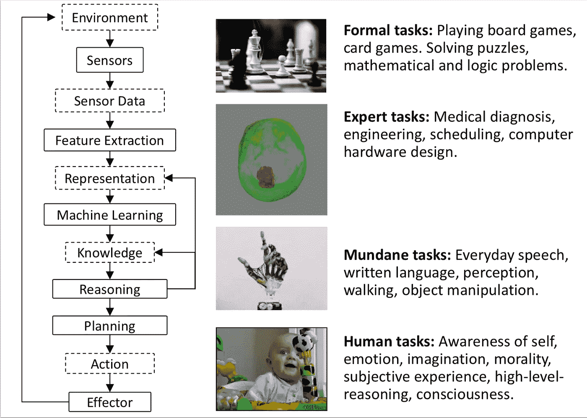
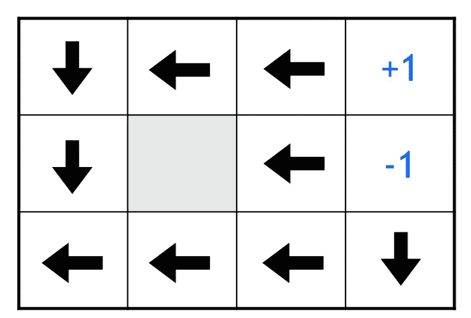
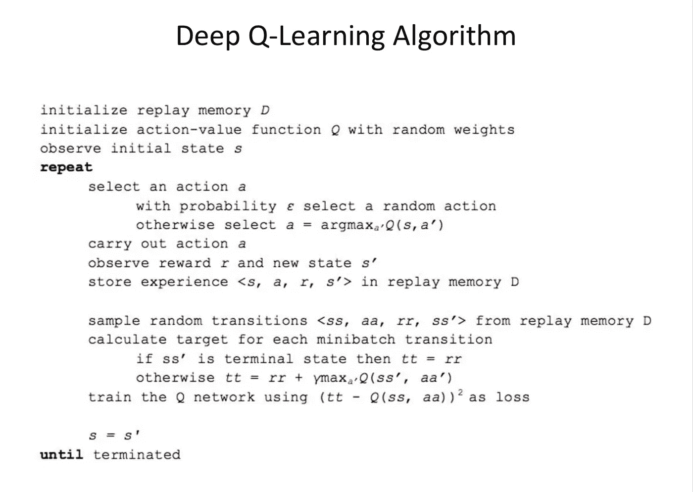

# 麻省理工 6。S094:自动驾驶汽车的深度学习 2018 讲座 3 笔记:深度强化学习

> 原文：<https://medium.com/hackernoon/mit-6-s094-deep-learning-for-self-driving-cars-2018-lecture-3-notes-deep-reinforcement-learning-fe9a8592e14a>

> [你可以在 Twitter @bhutanisanyam1](http://twitter.com/bhutanisanyam1) 找到我，在 [Linkedin 这里](https://www.linkedin.com/in/sanyambhutani/)
> 这里[这里](https://becominghuman.ai/a-self-driving-new-year-33284e592f35)和[这里](https://hackernoon.com/a-self-driving-new-year-2-d1bbc5a83570)是两篇关于我[学习](https://hackernoon.com/tagged/learning)通往[自动驾驶汽车](https://hackernoon.com/tagged/self-driving-cars)的文章
> 
> [你可以在这里找到降价文件](https://github.com/init27/MIT-6.S094-Deep-Learning-for-Self-Driving-Cars)
> 
> [你可以在这里找到讲座 1 的笔记](/init27-labs/mit-6-s094-deep-learning-for-self-driving-cars-2018-lecture-1-notes-807be1a50893)
> [讲座 2 的笔记可以在这里找到](https://hackernoon.com/mit-6-s094-deep-learning-for-self-driving-cars-2018-lecture-2-notes-e283b9ec10a0)
> [讲座 4 的笔记可以在这里找到](https://hackernoon.com/mit-6-s094-deep-learning-for-self-driving-cars-2018-lecture-4-notes-computer-vision-f591f14b3b99)
> [讲座 5 的笔记可以在这里找到](/@init_27/mit-6-s094-deep-learning-for-self-driving-cars-2018-lecture-5-notes-deep-learning-for-human-5cb0f53e4f15)
> 
> 这些是麻省理工学院六年级第三讲的笔记。S094:自动驾驶汽车深度学习课程(2018)，由[莱克斯·弗里德曼](https://twitter.com/lexfridman)授课。

所有图片均来自讲座幻灯片。

如果你想简单了解强化学习，这里有一个快速入门

# **我们能在多大程度上教会系统从数据中感知和行动这个世界？**

人工智能系统需要执行的任务堆栈

*   环境:系统运行的环境。

*   传感器:通过传感器感知世界，并将其转换为机器可以感知的原始数据。世界上运行的机器人的输入。

*   传感器数据:由传感器提取的原始数据。

*   特征提取:从传感器数据中提取特征。[结构](https://hackernoon.com/tagged/structure)是从数据中提取出来的，这样你就可以输入、辨别、分离和理解数据。
    原始的感官数据经过多重高阶抽象处理。深度学习自动化了这项先前由人类专家执行的任务。
*   我们形成更高阶的表示，基于这些表示可以应用 ML 技术。

*   一旦 ML 技术将数据转换成简单的可操作信息，我们就将这些信息聚集成知识。深度学习网络能够执行监督学习任务、生成任务和非监督技术。知识，是简单而干净的有用的价值。这些可以是单一值、语音、图像等等。
*   我们建立了一个分类法，一个知识库。我们把想法联系起来。
*   基于分类的代理推理:连接过去的数据和感知世界，根据目标定义计划。(目标，这里可能是奖励函数)。
    规划:融合传感器信息，做出更有利于 DL 方法的行动。

*   既然它在现实世界中表演，它就必须有可以在现实世界中表演的效应器。

人工智能堆栈中有多少是可以“学习”的？

我们可以学习表象和知识。神经网络将数据映射为信息，核方法在这里也是有效的。

将正确的传感器数据映射为知识是 DL 的亮点。

开放式问题:我们能否将此扩展到端到端的推理和可操作信息？

Q2，我们能把这个扩展到 SDC 和机器人的真实世界吗？

# **深度学习的类型**

*   监督:每个数据点都由人类标记。
*   无监督:数据未标记。
*   半监督学习:一些数据由人类标注。
*   强化学习:RL 是半监督学习的一个子类。
    目标:从稀疏的奖励/监督数据中学习，并利用从一个状态到另一个状态遵循时间动态的事实，这可以通过时间传播，以基于先前的数据推断关于现实的知识。我们可以概括现实世界中稀疏的学习信息。

# 强化学习的哲学动机

监督学习:记忆基础事实数据，以形成从基础事实中概括出来的表述。

强化学习:蛮力通过时间传播稀疏信息，以将质量奖励分配给没有直接奖励的状态。当数据/回报很少，但通过时间联系在一起时，理解这个世界。这相当于推理。

## 代理和环境

通过时间的连接被建模为:

有一个代理，在环境中执行一个动作，接收一个新的状态和一个奖励。这个过程一遍又一遍地继续。

示例:

*   雅达利突围:代理人是桨。主体采取的每一个行动都对环境的演变产生影响。成功是通过总奖励机制来衡量的。这里的分数是由游戏给出的。该方案必须以系统可解释的方式规范化。目标是最大化目标。

*   大车-杆子平衡:
    目标:移动大车顶部平衡杆连续问题。
    状态:角度，角速度，大车的水平速度。
    动作:对推车施加水平力。
    奖励:1 在每一个时间步如果杆子是直立的。

*   所有第一人称射击游戏
    毁灭战士:目标:消灭所有对手。
    状态:来自游戏的原始像素

*   工业机器人:
    用机器人装箱。
    目标:挑选一个盒子，放入容器中。
    状态:世界的原始像素。

*   马尔可夫决策过程:行动-回报-状态，直到收到终端状态。

**RL 代理的主要组件**

以下一项或多项:

*   政策:在每个州执行何种行动的计划。
*   价值功能:意识到什么是好的状态，什么是可以执行的好的行动。
*   模型:代理对世界的表示。

房间里的机器人

确定性方法:选择最短路径。

非确定性

关键观察:空间中的每一个状态都必须有一个控制非确定性环境的计划。

如果奖励函数被设计成每一步都受到惩罚，那么在这种情况下的最优策略将是选择最短的路径。

如果我们减少惩罚，运动的随机性是允许的。

如果我们把奖励从+ve 变成了运动，那就有更多的激励让我们留在板上不完成。

**价值函数:**

环境状态的价值是我们将来可能得到的回报。这是通过贴现未来的贴现来确定的。

伽玛:降低未来目标的重要性。

一个好的策略是最大化贴现的未来目标的总和。

**Q-学习:**

我们使用任何政策来评估最大化未来回报的状态。

这允许我们考虑更大的状态空间和动作空间。
我们模拟采取行动，并更新我们对行动效果的评估。

**勘探与开采:**

随着对 Q 函数形成更好的估计，我们对可以执行的更好的动作形成更好的感觉。这还不完美，所以探索是有价值的。随着评估的改进，勘探的价值越低。

因此，最初我们希望进行更多探索，并随着时间的推移，随着我们的估计变得更加准确，减少探索。

因此，最终系统应该按照 Q 函数贪婪地运行。

用于 Q 函数的表格表示。

y 轴是状态，X 轴是动作。

该表以随机方式初始化，并使用贝尔曼方程进行更新，随着时间的推移，近似值成为合适的表。

问题:当 Q 表呈指数级增长时。使用现实世界/游戏中的像素输入。潜在的状态空间和可能的组合状态比系统内存所能容纳的要大，比用贝尔曼方程所能估计的要大。

**深 RL:**

神经网络真的很擅长估计。

DL:与 ML 相比，它允许我们在更大的状态空间上逼近数值。这使我们能够处理原始值的感官数据，它更有能力处理现实世界的应用；这是可以概括的。

这种理解来自于将原始感官信息转化为简单有用的信息，并在此基础上采取行动。

代替 Q 函数，我们插入了一个神经网络。
输入:状态空间。
输出:各状态可具有的函数值。
DQN:深度 Q 网络。

DQN 是如何训练的？

bellman 方程输入奖励并对未来的奖励进行折扣。

神经网络的损失函数:获取当前状态下收到的奖励，通过神经网络向前传递，计算未来状态的值，并从当前动作状态的向前传递中减去该值。

我们取 Q 函数估计器(NN)所估计的未来价值和基于可能行为的可能价值之间的差值。

**算法:**

输入:运行状态

输出:Q-每个动作的值。

给定一个转换 S，一个动作 a 产生一个奖励 r’并改变到状态 S’。

更新是对当前状态的网络进行前馈传递，对下一状态的所有可能动作进行前馈传递，并使用反向传播更新权重。

# **DQN 小窍门:**

**经验重演:**
游戏通过模拟进行，观察结果被收集到经验库中，通过分批随机抽取先前的经验进行训练。这样，系统就不会对模拟的特定发展过程进行过度建模。

**固定目标网络:**
我们用一个 NN 来估计动作对中当前状态和下一个状态的值，从而多次使用。当我们运行网络时，我们也在更新网络。所以损失函数中的目标函数改变了，这就导致了稳定性的问题。所以我们修复了网络，只是每 1000 步更新一次。
当我们训练网络时，用于估计目标函数的网络保持固定，从而产生稳定的损失函数。

**奖励剪裁:**
对以一般化方式操作的系统来说是真的。这些简化了奖励函数，无论是正面的还是负面的。

**跳帧:**
每 4 帧执行 1 个动作。

圆:使用技巧时。
交叉:未使用的技术。
数字越高，获得的奖励越多。

结论:重放目标能显著提高奖励。

# **深度 Q 学习算法:**

注意:循环不是训练的一部分，它是将观察、状态、动作、奖励和下一个状态保存到重放记忆中的部分。

接下来，我们从内存中随机取样，根据损失函数训练网络。概率:ε，是探索的概率——随着时间的推移而降低。

2015:雅达利突围
DQN 在许多雅达利游戏上表现优异。

AlphaGo (2016):

注意:任何时候可能的法定董事会条件= 2.8x10^(170)

使用人类专家的立场发挥，以监督的方式播种，RL 方法击败人类专家。

(偏颇)观点:人工智能十年成就，AlphaGo Zero (2017):

*   它是在没有任何训练数据的情况下开发的。
*   击败 AlphaGo。

**AlphaGo 方法:**

使用 MTCS:蒙特卡罗树搜索。

给定一个大的状态空间。我们从一个棋盘开始，在探索和利用的平衡中选择棋步，直到得出一些结论。这个信息是反向传播的，然后我们知道棋盘位置的价值。

AlphGo 使用神经网络的“直觉”来估计状态的质量。

窍门:

*   使用基于神经网络预测的 MCTS 来估计未来状态有多好。它执行简单的前瞻动作，进行目标校正以产生损失函数。
*   多任务学习:网络是“双头的”，

1.  它输出最优移动的概率。
2.  它还估计了获胜的概率。

*   我们希望在短期内结合最佳举措，并以高概率获胜。
*   更新的架构:Resnet(ImageNet 的赢家)

# 深层交通

[点击这里查看官方教程](https://selfdrivingcars.mit.edu/deeptraffic-about)

v2 功能:

*   我们可以进行多代理培训(最多 10 辆车)
*   (很酷的附加功能)定制汽车图片。

目标:随着时间的推移达到最高的平均速度。

道路:网格空间，一个占用网格:当空的时候，它被设置为 ab-网格值是可以达到的任何速度。

网格中的其他汽车:网格中的值是速度较慢的汽车的速度。

我们可以决定将哪一部分用作网络的输入。

安全系统可以被认为是基本 MPC 的等价物:允许防止碰撞的基本传感器。

任务:在安全系统的约束下在空间内移动。红色:不可到达的空间。

目标:不堵车。

输入:状态空间。
输出:不同动作的值。
基于ε值并通过训练、推理评估:我们选择勘探程度。

5 行动空间

“大脑”将状态作为输入。奖励执行向前传递并计算奖励。“大脑”是包含用于训练和评估的神经网络的地方。

新增加:可以被 NN 控制的代理数量，范围从 1 到 10。评估以相同的方式进行。
注意:代理不知道其他代理的优先权。每个个体代理的动作都是贪婪的，并且不是以优化的分布式方式。

评估:

*   每次运行收集 45 秒的模拟时间。
*   计算 500 次运行的中值。
*   服务器端评估。
*   随机性已经大大降低。

# **RL 方法适用于人类在回路中的学习吗？**

*   我们可以探索驾驶员数据。
*   真实世界测试是不可行的。

# **大多数成功的 RL 都不涉及深度 RL:**

*   波士顿机器人公司

*   Waymo:
    DL 用于感知。
    大部分工作都是用传感器完成的。
    使用基于模型的方法。

# **回复:意想不到的本地高额奖励**

当应用到现实世界时，这些在所有的例子中都出现了。

# 人工智能安全:

*   探索 RL 规划算法如何以意想不到的方式发展。
*   怎么才能约束他们呢？以强制它们以安全的方式运行。

> [你可以在 Twitter @bhutanisanyam1](http://twitter.com/bhutanisanyam1) 上找到我，在 [Linkedin 上联系我这里](https://www.linkedin.com/in/sanyambhutani/)
> [这里](https://becominghuman.ai/a-self-driving-new-year-33284e592f35)和[这里](https://hackernoon.com/a-self-driving-new-year-2-d1bbc5a83570)是我学习自动驾驶汽车的两篇文章
> 
> [订阅我的时事通讯，获取深度学习、计算机视觉文章的每周精选列表](https://tinyletter.com/sanyambhutani)