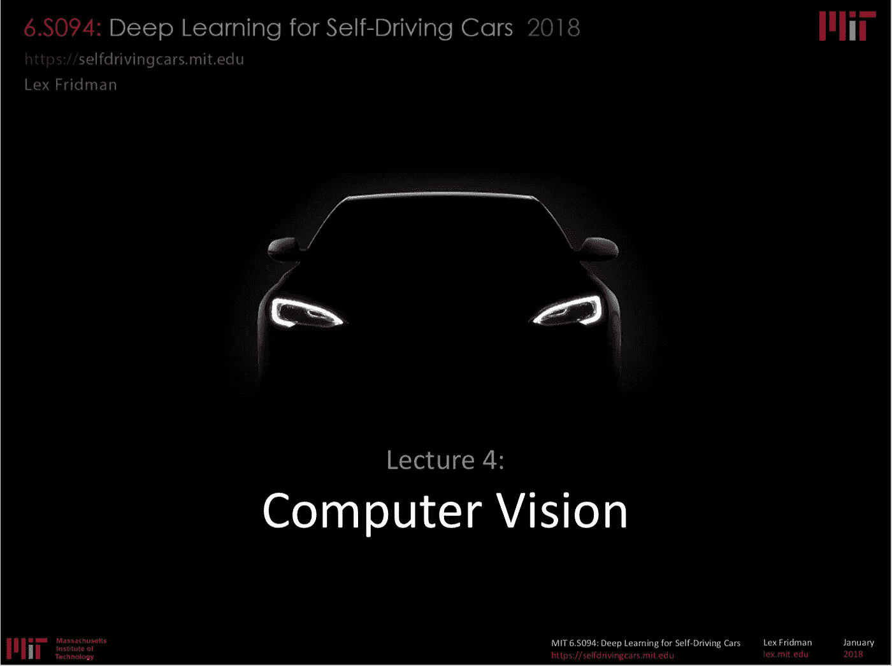
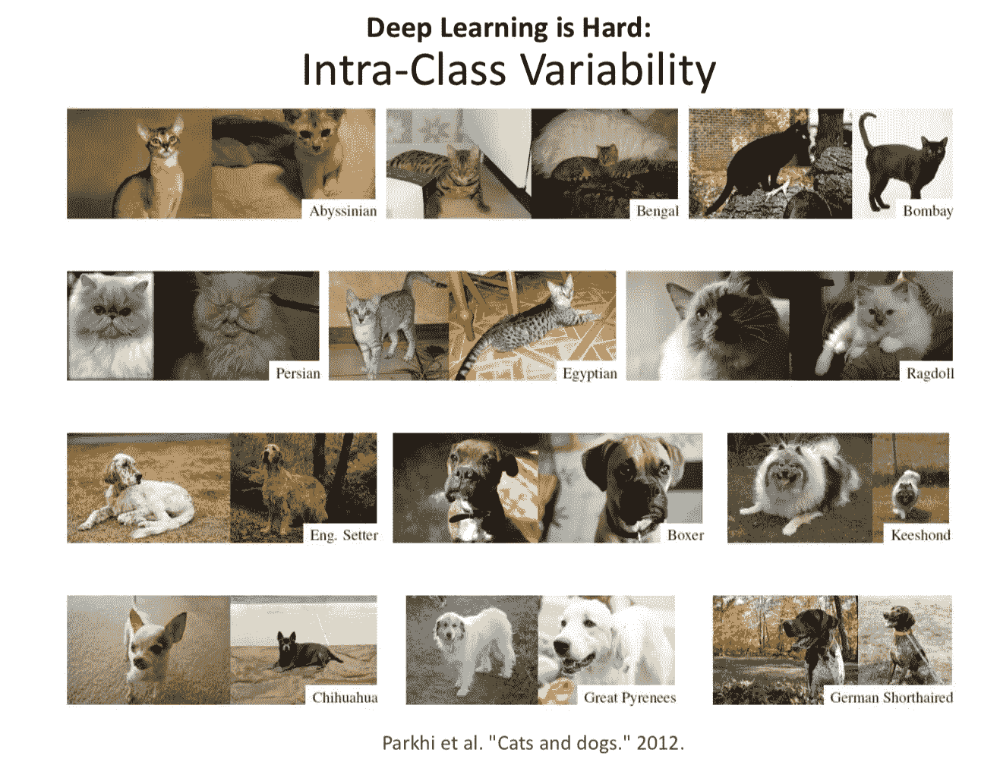
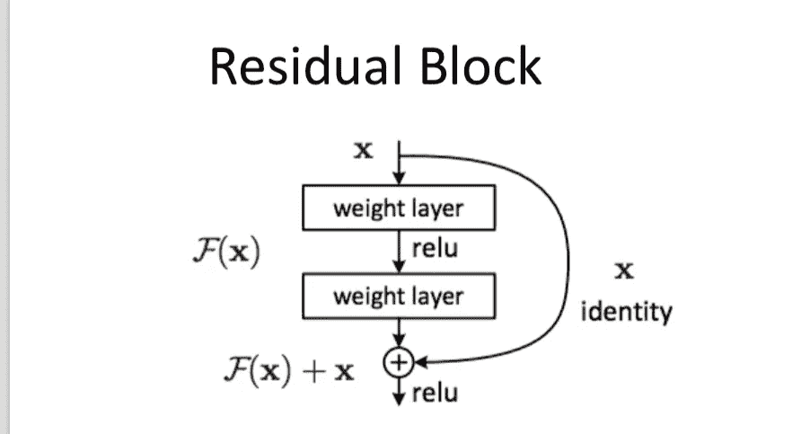
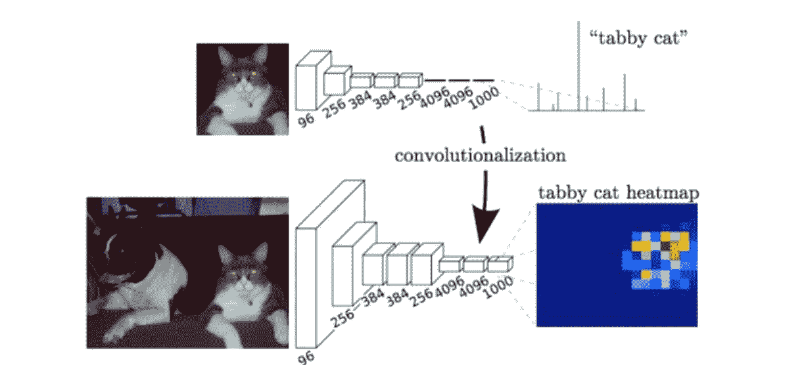
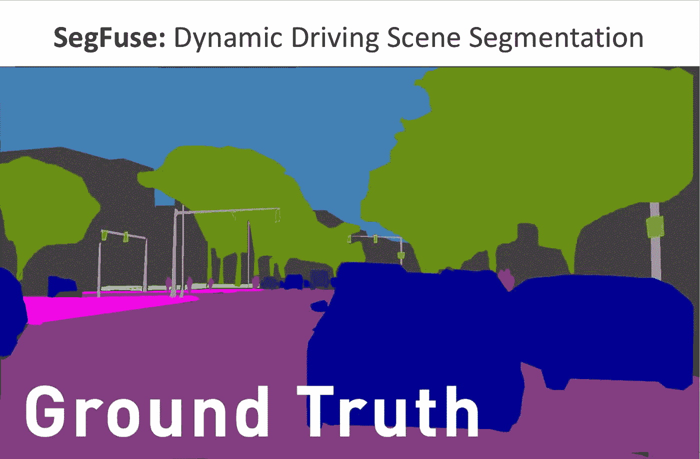

# 麻省理工 6。S094:自动驾驶汽车的深度学习 2018 第 4 讲笔记:计算机视觉

> 原文：<https://medium.com/hackernoon/mit-6-s094-deep-learning-for-self-driving-cars-2018-lecture-4-notes-computer-vision-f591f14b3b99>

> [你可以在 Twitter @bhutanisanyam1](http://twitter.com/bhutanisanyam1) 找到我，在 [Linkedin 这里](https://www.linkedin.com/in/sanyambhutani/)
> 这里[这里](https://becominghuman.ai/a-self-driving-new-year-33284e592f35)和[这里](https://hackernoon.com/a-self-driving-new-year-2-d1bbc5a83570)是我学习[自动驾驶汽车](https://hackernoon.com/tagged/self-driving-cars)道路上的两篇文章
> 
> [你可以在这里找到降价文件](https://github.com/init27/MIT-6.S094-Deep-Learning-for-Self-Driving-Cars)
> 
> [你可以在这里找到讲座 1 的笔记](/init27-labs/mit-6-s094-deep-learning-for-self-driving-cars-2018-lecture-1-notes-807be1a50893)
> [讲座 2 的笔记可以在这里找到](https://hackernoon.com/mit-6-s094-deep-learning-for-self-driving-cars-2018-lecture-2-notes-e283b9ec10a0)
> [讲座 3 的笔记可以在这里找到](https://hackernoon.com/mit-6-s094-deep-learning-for-self-driving-cars-2018-lecture-3-notes-deep-reinforcement-learning-fe9a8592e14a)
> [讲座 5 的笔记可以在这里找到](/@init_27/mit-6-s094-deep-learning-for-self-driving-cars-2018-lecture-5-notes-deep-learning-for-human-5cb0f53e4f15)
> 
> 这些是麻省理工学院六年级第四讲的笔记。S094:自动驾驶汽车深度学习课程(2018)，由[莱克斯·弗里德曼](https://twitter.com/lexfridman)教授。

所有图片均来自讲座幻灯片。

# 计算机视觉:教计算机看东西。

计算机视觉，到今天为止是深度[学习](https://hackernoon.com/tagged/learning)。我们对图像理解的大部分成功都是利用了神经网络。

*   受监督的[学习](https://hackernoon.com/tagged/learning):注释数据由人类提供。神经网络通过从原始感官数据到图像类别的数据映射进行分析，并且对于健全性检查，它应该在测试集上表现良好。

原始感官数据:对于机器来说，图像是数字的形式。

1 通道或 3 通道数字阵列形式的图像被神经网络作为输入，通过回归或通过将图像分类成各种类别来产生输出。

我们必须小心我们对于感知的容易和困难的假设。

人类视觉与计算机视觉。

1.  视觉皮层的结构是分层的。随着信息从我们的眼睛传递到大脑，越来越高级的表征就形成了。这就是 Deep NN 对于图像背后的启发。通过这些层形成越来越高的表示。
    早期图层，获取原始像素，寻找边缘。通过连接这些边进一步发现更多的抽象特征。最后，寻找高阶语义。
2.  深度学习对计算机视觉来说很难:

*   照明可变性是驾驶中最大的挑战之一。

*   姿态可变性:神经网络不擅长表现姿态。当物体旋转时，2D 平面中的物体在颜色和纹理上看起来非常不同。

*   类间可变性:对于分类问题，类内可变性很大，类间可变性很小。

*   遮挡:对象的一部分被另一个对象遮挡，我们的任务是识别被遮挡的对象。

*   哲学歧义:图像分类！=理解。
*   无监督学习
*   强化学习。

# 图像分类管道:

每个类中都有一个包含不同类别的箱子。这些箱子里都有很多这样的例子。任务:将新图像绑定到其中一个类中。

著名数据集:

*   MNIST
*   ImageNet

*   CIFAR-10
    最简单的一个，包含 10 个类别，常用于探索 CNN。

琐碎的例子:

*   通过减去像素强度矩阵来比较图像，然后求和每个元素的差异。如果总和高，则图像不同。
    如果我们使用这种方法，使用 L2 差分法我们可以得到 35%的准确度，使用 L1 差分法可以得到 38%的准确度，这些都比 10%的随机准确度要好。

*   k-最近邻:
    我们试图找到 k-最近邻的图像并将它们归入 k 个类，而不是找到最接近我们数据集的 1 个图像。我们从 1 到 5 改变 k，看看它如何改变问题。

*   当 k=7 时，我们达到 30%的精度。
    人类等级准确率为 95%。使用 CNN，我们得到了 97.75%的准确率。

## 神经网络的工作:

*   对每个输入信号进行加权、偏置和相加。
*   这些然后被输入到非线性激活函数。
*   越来越多的层放在一起，这些就形成了一个很深的 NN。

*   神经网络的训练方式是向前传递，评估实例与基本事实的接近程度，然后惩罚导致错误决策的权重，奖励导致正确决策的权重。

*   例如:MNIST-对于 10 个案例，输出是 10 个不同的值。
*   每个神经元基于它所代表的类别而兴奋。
*   输出被分配给显示最高激活值的类。

[**卷积神经网络**](https://hackernoon.com/convolutional-neural-network-in-5-minutes-8f867eb9ca39)

当神经网络的任务是学习具有大量数据和大量对象的复杂任务时，细胞神经网络有效地工作。

技巧-空间不变“:
一个图像左上角的物体和右下角的物体是一样的。所以我们在图像中学习相同的特征。

卷积运算:代替完全连接的层；这里存在深度的第三维。因此，该模块采用 3 个输入体积，并产生 3D 输出体积

他们截取图像的一部分，即“一个窗口”，并将其滑过图像。它们将相同的权重应用于图像的切片/窗口以生成输出。我们可以制造许多这样的过滤器。

每个过滤器上的参数是共享的。(如果一个特性在一个地方有用，那么它在任何地方都有用)这允许参数显著减少。空间特征的再利用。

*   深度:过滤器的数量。
*   步幅:应用滤镜时跳过的像素
*   填充:在卷积层的输入边界上添加 0 值。

示例:

*   左栏:3 个输入通道。
*   滤波器 W0:滤波器的 2 个通道，每个通道的尺寸为 3x3。
*   3x3 过滤器将被“学习”
*   这些在图像上滑动以产生输出。
*   应用这些操作来产生输出。

**卷积**

*   图像被输入。
*   我们执行身份滤波器来生成卷积图像。
*   我们执行不同的其他过滤器来生成边缘。
*   我们可以检测任何类型的模式并产生输出。
*   根据过滤器的不同，您会得到相同数量的输出，每个输出都显示了在哪里找到了模式。

*   任务:学习分类任务所需的有用模式。
*   滤波器具有越来越高的表示阶数。
*   从边缘开始，最后到跨越图像的高级语义。

*   跨越图像:池化。
    获取卷积运算的输出，并通过压缩信息降低其分辨率，例如考虑最大池中的最大值。
*   注意:当涉及场景分割时,“空间分辨率的降低”具有不利的影响，但是在寻找图像中的高阶表示用于分类方面更好。
*   许多这样的卷积层形成了 CNN。

*   完全连接的层允许我们将其应用于特定的领域。

**ImageNet 案例研究**

*   任务:对最大的图像数据集之一进行分类。
    14M+图像
    21k+类别
    有许多子类
*   这些为检查姿势、类内可变性、照明提供了很好的挑战。
*   **网络:**

*   AlexNet 2012:首次重大改进。
*   ZFNet 2013
*   VGGNet 2014

*   GoogLeNet 2014
    引入了初始模块。
    想法:它使用了不同大小的卷积为[网络](https://hackernoon.com/tagged/network)提供不同值的想法，进行不同的卷积并连接。
    较小的卷积:纹理上非常局部/高分辨率的特征。
    更大的卷积:更高/更抽象的特征。结果:更少的参数和更好的性能。

*   ResNet 2015
    灵感:(不一定成立)网络深度增加表征力。
    “残余块”允许创建更“深”的网络。
    残差块:
    -重复一个简单的网络块，类似于 RNNs。
    -传递输入而不进行转换，以及学习权重的能力。
    -每一层接受前一层的输入和原始的、未转换的数据，以学习新的东西。
*   CUImage 2016

*   SENet 2017
    挤压和激励网络:
    -为卷积块的每个通道添加了一个参数，以便网络可以根据每个特征映射/网络输入自适应地调整每个通道的权重。
    -技巧:允许网络学习每个单独信道上的权重。
    -注意:这适用于任何架构。因为，它只是根据内容参数化选择哪个过滤器。

*   分类的 ILSVRC 挑战评估
    前 5 名猜测。
    人为误差 5.1%
    2015 年超越。

*   胶囊网络:
    ——启发:考虑网络做了哪些假设，扔掉了哪些信息。
    ——CNN，由于其空间不变性——抛开简单与复杂物体之间的等级关系。
    -未来的挑战:设计与旋转工作的神经网络。

*   我们用 CNN，改变最后的图层来应用它们。

# 目标检测

注意:CNN 基于卷积生成了激活的像素级热图

**场景理解**

*   目标:为真实的 3D 世界对 2D 投影中的每一个像素进行分类。
*   挑战:在像素级标记边界。
*   用例:
    -医疗、驾驶中物体的精确边界。
    -在驾驶中，标出环境的确切界限。融合传感器的数据。因此将语义知识与现实世界中的三维定位相融合。

*   FCN 2014:
    -重新调整 ImageNet 预训练网络的用途
    -用解码器取代了完全连接的层，解码器对图像进行上采样以产生热图。
    -跳过连接以提高上采样的粗糙度。

*   SegNet 2015:
    -将此应用于驾驶情境。

*   扩张卷积 2015:
    -卷积运算作为汇集运算，显著降低了分辨率。
    —“网格化”保持局部高分辨率纹理，同时仍然捕捉必要的空间窗口。

*   DeepLab v1，v2 2016:
    -增加了条件随机场(CRF):通过查看底层图像强度来平滑分割的后处理。

**细分的关键方面**

*   全卷积网络。
*   条件随机森林。
*   扩张的脑回。

ResNet-DUC 2017:

*   密集上采样卷积，而不是双线性上采样来学习上缩放特性。
*   混合扩张卷积:
    卷积是从输入到输出的扩散。
*   技巧:升级特征的参数化。

**流量网络**

这里讨论的方法忽略了与机器人相关的时间动力学。

*   流有助于近似输入图像中的每个像素如何在输出图像中移动。
*   光流产生像素移动的方向和移动的幅度。
    这允许我们获取从第一帧检测到的信息，并将其向前传播。
*   这对于“涂色书注释”(1 张图片 90 分钟)来说非常慢。
*   堆叠两个图像作为输入。
*   单独卷积，与相关层结合。

挑战:通过时间分割图像。

FlowNet 2 2016:

*   将 FlowNetC 和 FlowNetS 结合在一起
*   产生更平滑的流场。
*   保留精细的运动细节。
*   以 8–140 fps 的速度运行。
*   过程:
    -堆叠网络作为一种方法。
    -数据集的排序很重要

# SegFuse

**数据集:**

*   8k 360 度视频中 1080p 的行车原始视频。

*   训练集的基本事实，每一帧。

*   SOTA 分段的输出
*   光流

**任务:**

*   使用来自 SOTA 网络的原始视频、地面实况、分段并改进分段。
*   使用网络的输出来帮助更好地传播信息。我们能找到使用时态信息的方法吗？

> [你可以在 Twitter @bhutanisanyam1](http://twitter.com/bhutanisanyam1) 上找到我，在 [Linkedin 上联系我这里](https://www.linkedin.com/in/sanyambhutani/)
> [这里](https://becominghuman.ai/a-self-driving-new-year-33284e592f35)和[这里](https://hackernoon.com/a-self-driving-new-year-2-d1bbc5a83570)是我学习自动驾驶汽车的两篇文章
> 
> [订阅我的时事通讯，获取深度学习、计算机视觉文章的每周精选列表](https://tinyletter.com/sanyambhutani)