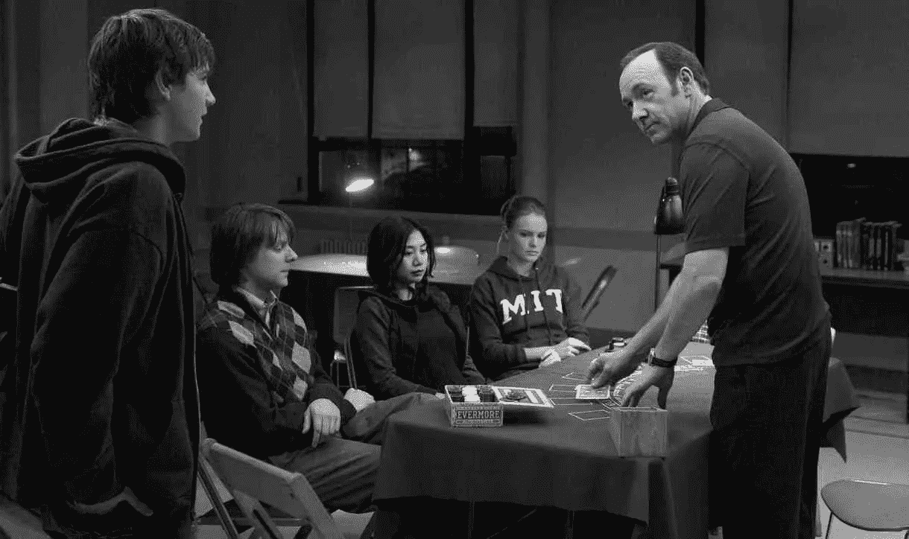

# 麻省理工学院关于更稳定金融体系的有趣提议

> 原文：<https://medium.com/hackernoon/mits-interesting-proposal-for-a-more-stable-financial-system-c45c6dbf5d04>

## 麻省理工学院的数字贸易币

【2018 年 1 月 16 日，三家钻石公司与旁遮普国家银行接洽，要求获得 LOUs。(承诺书是一种银行担保形式，根据这种形式，其客户可以以短期信贷的形式从任何其他印度银行的外国分行筹集资金)。旁遮普国家银行要求 100%的现金保证金(盈利能力)作为发行 LOUs 的一般要求。但是，这些公司回应称，自 2010 年以来，他们收到的前一份 Lou 没有强制执行这一要求。

*这时旁遮普国家银行起了疑心。很少有银行员工通过 SWIFT 系统(银行间的信息系统)发布假 Lou。PNB 使用的软件没有记录这样的交易。因此，PNB 不知道有这种活动。2018 年 2 月 12 日晚些时候，PNB 发现了一个价值约 18 亿美元的骗局。*

我们当前的银行系统缺乏问责性和透明度。如果我们的银行更加透明，2008 年的金融萧条本来是可以被发现和预防的。

## 加密货币

比特币在 2009 年被发明出来并非巧合。比特币是一种数字货币，它发行货币并促进人与人之间的直接交易，无需中介的帮助。每笔交易都记录在区块链上(一个共享的数字分类账，其记录不能被更改)。

尽管比特币系统具有创新性，并给系统带来了透明度。很多人对以下问题表示关注。

1.  比特币没有资产支持，因此没有内在价值。
2.  它对每秒可以处理的事务数量有限制。
3.  系统用来确保自身安全和不可改变的工作机制证明需要疯狂的电量(一年内比特币需要的能量相当于整个美国所需的能量)。

继比特币之后，以太坊、Ripple 等其他几种加密货币也出现了。他们创新了比特币的架构。尽管它解决了比特币面临的几个问题，但这些货币仍被怀疑保持高度波动。因为它们没有内在价值。

这些加密货币的重要创新是其不可改变的分布式账本。央行可以废除纸币，使用分布式账本引入央行数字货币。虽然它是分布式的，但中央政府必须创建一个受控的区块链来增加反洗钱功能。这给了他们太多的隐私和经济权力，这些权力可能会被滥用。

## 公用事业结算硬币

公用事业结算硬币是由一个银行协会提出的。USC 是一种由法定货币(例如:美元)支持的加密货币，在参与银行中以电子现金余额的形式出现。问题是执行了解你的客户(KYC)和反洗钱职能。

## 数字贸易币

因此，麻省理工学院提出了数字贸易硬币(DTC)。DTC 类似于 USC，但它不是法定货币，而是由资产支持，以确保稳定性。在 DTC 中，我们有赞助商、管理者、专门银行和用户。

发起人将资产池引入系统。石油、黄金、贱金属等资产。管理员将这些资产数字化，并将数字交易币发放给赞助商。想购买 DTC 的用户用法定货币(美元)与银行联系。银行把钱交给管理员，管理员再把钱寄给赞助人。管理员向银行发放 DTC 令牌，银行通过分布式分类帐向用户发送 DTC。

为了发展壮大，他们需要解决以下问题。

1.  了解客户问题的解决方案。
2.  应实施反洗钱职能。
3.  它应该每秒处理大量事务。
4.  DTC 的发行必须透明且具有经济意义。
5.  必须实现确保 DTC 稳定性的机制。

DTC 提出了一种半私有的分布式分类账，以解决了解您的客户和洗钱问题。这意味着系统中的赞助商是公开可见的和经过验证的。然而，用户保持匿名。

DTC 使用类似于 ripple 的协议来确保高速交易。与比特币相比，它需要更少的能量和时间。因为它是由记录在不变的分类账上的资产支持的，所以这种方法是透明的，并且在经济上有意义。

DTC 具有稳定机制。如果与资产的内在价值相比，市场价值开始向上偏离，发起人将向资金池贡献更多资产，并在公开市场上出售。因此压低了价格。如果与资产池相比价值下降，经济代理人会将 DTC 卖回给管理员以获得现金。管理人将出售部分资金池资产以获得现金，并将获得的资金转给代理人。

麻省理工学院的提议在理论上听起来不错。我希望他们能成功。你可以在研究论文[数字贸易币(DTC):迈向更稳定的数字货币](https://hardjono.mit.edu/sites/default/files/documents/Digital-Trade-Coin.pdf)中了解更多关于 DTC 的内容。

**请鼓掌👏，谢谢你😊。关注我们 Hackernoon 和我(**[**Febin John James**](https://medium.com/u/75a616711f4e?source=post_page-----c45c6dbf5d04--------------------------------)**)了解更多故事。**