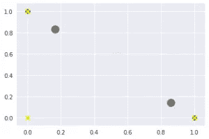

# ML 实验&史诗般的失败

> 原文：<https://medium.com/hackernoon/ml-experiment-epic-failure-fe0940f0bb51>

> 我总是喜欢写下我失败的实验，这样做的人会知道他们并不孤单。这个博客是那些展示如何不做某些事情的 ML 实验之一。

从 ML 大肆宣传的那一刻起，我们中的许多人就开始学习它。从[吴恩达](https://www.coursera.org/learn/machine-learning)穿越到[西拉杰·拉瓦尔](https://www.youtube.com/channel/UCWN3xxRkmTPmbKwht9FuE5A)，从线性代数到深度学习和神经网络，我都看过了，但却毫无收获。即使在浏览了一系列教程和装满 ML 项目的文件夹后，我也没有找到灵感。

对于你来说，要达到对你来说一切都有意义的神奇时刻，你必须看到它在你面前发挥神奇的作用，这从来没有真正发生在我创造的 ML 模型上，也没有发生在我身上。

# **ML 的垫脚石**

1.  获取数据集
2.  预处理—清洗、填充、标签编码、一个酒店编码
3.  找出它是否是一个回归/分类/聚类问题
4.  列车测试分离
5.  适合—预测/分类
6.  准确度分数、混淆矩阵

我在不同的数据集上一遍又一遍地这样做。结果？ML 项目的文件夹的巨大列表不能让我去任何地方。

> 专家会告诉我称自己为专家，但我有其他想法😛

我遇到的主要问题是数据集不够直观，因为它们不是来自我密切合作的领域。我一直在等待一个我完全理解的实时数据集，我得到了一个。

从现在开始的每一步都是我走向失败的垫脚石。正是我一路上做的那些小决定让我走向了死胡同，给了我最大的启示。

# **获取数据集**

我在哥印拜陀的 Forge accelerator 举办了这个为期两天的 Python 研讨会。两天后，我收集了他们的反馈。当我看到收集的数据时，我在心里将它们分为好工作/坏工作，我知道我得到了我的第一个直觉 ML 项目。

**错误 1**

我的工作室只有 26 名学生。这意味着我的数据集非常非常小，无法与任何极简 ML 算法一起工作。

**实现**

对于 ML 实验，任何数据集的大小都应该是 50。

# **了解数据集**

第二天，我打开 CSV 文件，从左到右滚动，我可以将它分为好、坏、平均。现在我想看看 ML 模型是否能做到这一点。

**错误 2**

我认为这是一个聚类问题。我在这里完全忽略的事实是，我已经通过了足够多的好的和坏的评论样本来对它进行分类，这使得它成为一个分类问题。

**实现**

学习 ML 时，将用例分类为聚类、分类或回归是一个巨大的问题。我现在明白了为什么所有的 ML 课程都花了这么多精力来解释这些概念。

# **预处理**

反馈数据由两部分组成。一个是数字评分，另一个是文本中的评论。对于任何基于文本的数据集，预处理步骤包括将它们转换成数字数据。

**错误三**

我把所有的数字评级输入到一个 labelEncoder，然后输入到 OneHotEncoder，认为它们代表了从非常差到非常好的一系列数据类别。

**实现**

它应该仍然是一个数值，因为它没有定义一个类别，而是一个评价的权重。没有必要对这些值进行一次性编码。

**错误 4**

对于评论文本，我将其输入 TextBlob 情感分类器，并根据评论的好坏将其转换为 0 和 1。

**实现**

我知道为了处理基于文本的数据，你必须把它转换成数字数据。在这种情况下，数字数据应该是代表评论陈述的向量，而不是好或坏的分类分数。

# **聚类**

这一步绝对不会错。现在数据已经准备好了，我把它放入一个有两个仓的 KNN 聚类算法中。聚类后，我得到了 0 和 1 的输出。将它与现有的情绪分析数据进行匹配，我不能得出结论，它工作得很好。所以我决定继续前进，想象一下到底发生了什么。

# **可视化**

这就是我上面提到的每一个错误暴露出来的地方。我画了一些特征和质心，我得到了一个类似这样的图像。

visualized results

从这张图中，您可以看到 X 值累积在落在 0 或 1 的图形末端，对它们进行聚类是没有意义的。

因此，我对机器学习的概念有了最直观的理解:

> [*不能对分类数据进行 KMeans 聚类*](https://datascience.stackexchange.com/questions/22/k-means-clustering-for-mixed-numeric-and-categorical-data?utm_medium=organic&utm_source=google_rich_qa&utm_campaign=google_rich_qa)

*原载于 2018 年 4 月 22 日*[*www . the geekette . me*](http://www.thegeekette.me/mlexperiment/)*。*