# 孟加拉国的糖尿病 ML

> 原文：<https://medium.com/hackernoon/ml-for-diabetes-from-bangladesh-d99d1d058d82>

## “你可以带着糖尿病生活。这不是最糟糕的事情，但你必须管理自己，并有一些自我控制。”


# 🌐代码库、样式和链接

有用的`LINKS`:

📡[皮马印第安人和糖尿病视频](https://www.youtube.com/watch?v=pN4HqWRybwk)

📡[皮马印第安人和糖尿病研究论文](https://pdfs.semanticscholar.org/ef31/2e378325707b371c4727f6b1f9225fc03a9f.pdf)

📡[熊猫可视化](https://pandas.pydata.org/pandas-docs/stable/visualization.html)

📡[熊猫造型](https://pandas.pydata.org/pandas-docs/stable/style.html)

# 📘皮马印第安人与糖尿病简介


[***糖尿病***](https://www.kaggle.com/uciml/pima-indians-diabetes-database) *，是一组长期存在高血糖水平的代谢紊乱。高血糖的症状包括尿频、口渴和饥饿。如果不治疗，糖尿病会导致许多并发症。急性并发症包括糖尿病酮症酸中毒、高渗性高血糖状态或死亡。严重的长期并发症包括心血管疾病、中风、慢性肾病、足部溃疡和眼睛损伤。*

*该数据集最初来自国家糖尿病、消化和肾脏疾病研究所。数据集的目的是基于数据集中包含的某些诊断测量结果，诊断性地预测患者是否患有糖尿病。从一个较大的数据库中选择这些实例有几个限制。特别是，这里的所有患者都是至少 21 岁的皮马印第安血统的女性。*

# 📘目标

我们将尝试建立一个机器学习模型，以准确预测数据集中的患者是否患有糖尿病？

# 🌐数据

数据集包括几个医学预测变量和一个目标变量，结果。预测变量包括患者的怀孕次数、身体质量指数、胰岛素水平、年龄等。

*   怀孕次数:怀孕次数
*   葡萄糖:口服葡萄糖耐量试验中 2 小时的血浆葡萄糖浓度
*   血压:舒张压(毫米汞柱)
*   皮肤厚度:三头肌皮褶厚度(毫米)
*   胰岛素:2 小时血清胰岛素(μU/ml)
*   身体质量指数:体重指数(体重公斤/(身高米) )
*   糖尿病谱系功能:糖尿病谱系功能
*   年龄:年龄(岁)
*   结果:类变量(0 或 1)

```
%%html
<style> 
@import url('https://fonts.googleapis.com/css?family=Orbitron|Roboto');
body {background-color: gainsboro;} 
a {color: #37c9e1; font-family: 'Roboto';} 
h1 {color: #37c9e1; font-family: 'Orbitron'; text-shadow: 4px 4px 4px #aaa;} 
h2, h3 {color: slategray; font-family: 'Orbitron'; text-shadow: 4px 4px 4px #aaa;}
h4 {color: #818286; font-family: 'Roboto';}
span {text-shadow: 4px 4px 4px #aaa;}
div.output_prompt, div.output_area pre {color: slategray;}
div.input_prompt, div.output_subarea {color: #37c9e1;}      
div.output_stderr pre {background-color: gainsboro;}  
div.output_stderr {background-color: slategrey;}       
</style>
```

# 🌐加载库

```
import numpy as np 
import pandas as pd 
import matplotlib.pyplot as plt
%matplotlib inline
import itertools
plt.style.use('fivethirtyeight')

import warnings
warnings.filterwarnings("ignore", category=**UserWarning**)style_dict = {'background-color':'slategray',
              'color':'#37c9e1',
              'border-color': 'white',
              'font-family':'Roboto'}
```

# 🌐加载数据

```
diabetes = pd.read_csv('../input/diabetes.csv')
print(diabetes.columns)diabetes.head().style.set_properties(**style_dict)
```

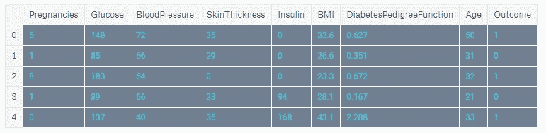

Dataset Head output

## 🌐糖尿病数据集由 768 个数据点组成，每个数据点有 9 个特征

```
print("dimension of diabetes data: **{}**".format(diabetes.shape))output:
dimension of diabetes data: (768, 9)
```

## 🌐结果 0 表示没有糖尿病，结果 1 表示有糖尿病

在这 768 个数据点中，500 个被标记为 0，268 个被标记为 1:

```
print(diabetes.groupby('Outcome').size())Outcome
0    500
1    268
dtype: int64
```

# 🌐基础 EDA

```
import seaborn as sns
sns.countplot(diabetes['Outcome'],label="Count")
```

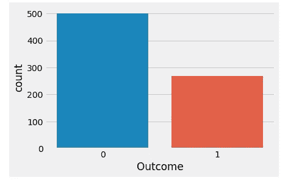

# 🌐数据的简要分析

```
diabetes.info()#Output:
<class 'pandas.core.frame.DataFrame'>
RangeIndex: 768 entries, 0 to 767
Data columns (total 9 columns):
Pregnancies                 768 non-null int64
Glucose                     768 non-null int64
BloodPressure               768 non-null int64
SkinThickness               768 non-null int64
Insulin                     768 non-null int64
BMI                         768 non-null float64
DiabetesPedigreeFunction    768 non-null float64
Age                         768 non-null int64
Outcome                     768 non-null int64
dtypes: float64(2), int64(7)
memory usage: 54.1 KB
```

现在显示情节:

```
columns=diabetes.columns[:8]
plt.subplots(figsize=(18,15))
length=len(columns)
for i,j **in** itertools.zip_longest(columns,range(length)):
    plt.subplot((length/2),3,j+1)
    plt.subplots_adjust(wspace=0.2,hspace=0.5)
    diabetes[i].hist(bins=20,edgecolor='black')
    plt.title(i)
plt.show()
```

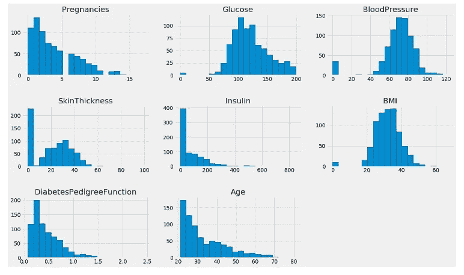

# 🌐配对图:

```
sns.pairplot(data=diabetes,hue='Outcome',diag_kind='kde')
plt.show()
```

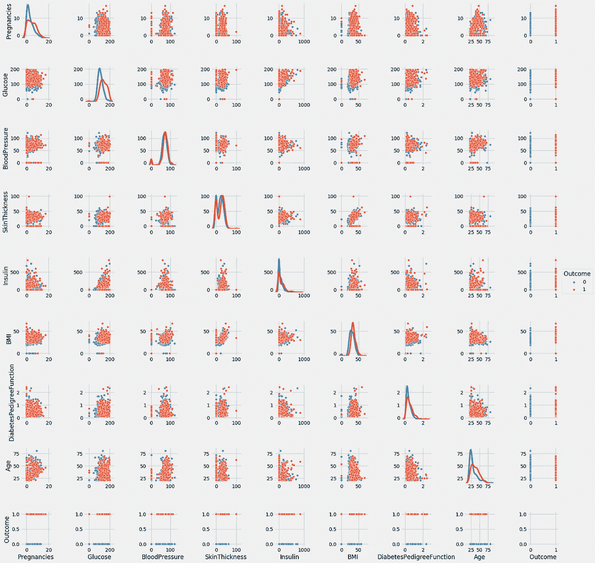

## 🌐观察结果:

1)对角线显示了具有核密度图的数据集的分布。

2)散点图显示了成对获取的每个属性或特征之间的关系。查看散点图，我们可以说没有两个属性能够清楚地区分两种结果

# 🌐可视化的预测 ML 建模

# 🌐1.k-最近邻

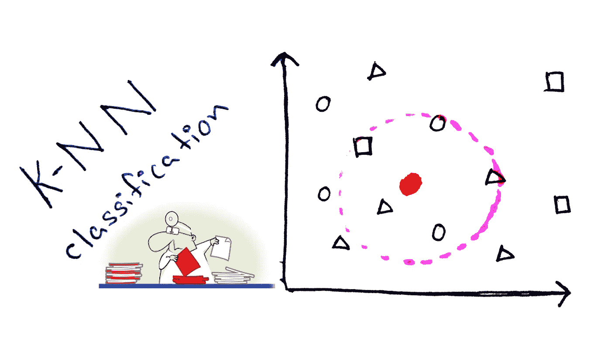

k-NN 算法可以说是最简单的机器学习算法。构建模型只包括存储训练数据集。为了对新的数据点进行预测，该算法会在训练数据集中查找最近的数据点，即它的“最近邻居”

## 🌐让我们调查一下我们是否能确认模型复杂性和准确性之间的联系

```
from sklearn.model_selection import train_test_split
X_train, X_test, y_train, y_test = train_test_split(diabetes.loc[:, diabetes.columns != 'Outcome'], 
                                                    diabetes['Outcome'], stratify=diabetes['Outcome'], random_state=66)
```

## 🌐模型的可视化和准确性

```
from sklearn.neighbors import KNeighborsClassifier
training_accuracy = []
test_accuracy = []
*# try n_neighbors from 1 to 10*
neighbors_settings = range(1, 11)
for n_neighbors **in** neighbors_settings:
    *# build the model*
    knn = KNeighborsClassifier(n_neighbors=n_neighbors)
    knn.fit(X_train, y_train)
    *# record training set accuracy*
    training_accuracy.append(knn.score(X_train, y_train))
    *# record test set accuracy*
    test_accuracy.append(knn.score(X_test, y_test))

plt.plot(neighbors_settings, training_accuracy, label="training accuracy")
plt.plot(neighbors_settings, test_accuracy, label="test accuracy")
plt.ylabel("Accuracy")
plt.xlabel("n_neighbors")
plt.legend()
```

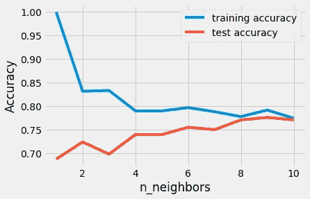

该图显示了 y 轴上的训练和测试集精度与 x 轴上的 n_neighbors 设置的对比。

上面的情节建议我们选择 n_neighbors=9。我们到了:

```
knn = KNeighborsClassifier(n_neighbors=9)
knn.fit(X_train, y_train)

print('Accuracy of K-NN classifier on training set: **{:.2f}**'.format(knn.score(X_train, y_train)))
print('Accuracy of K-NN classifier on test set: **{:.2f}**'.format(knn.score(X_test, y_test)))
```

## 🌐输出:

```
Accuracy of K-NN classifier on training set: 0.79
Accuracy of K-NN classifier on test set: 0.78
```

# 🌐2.逻辑回归

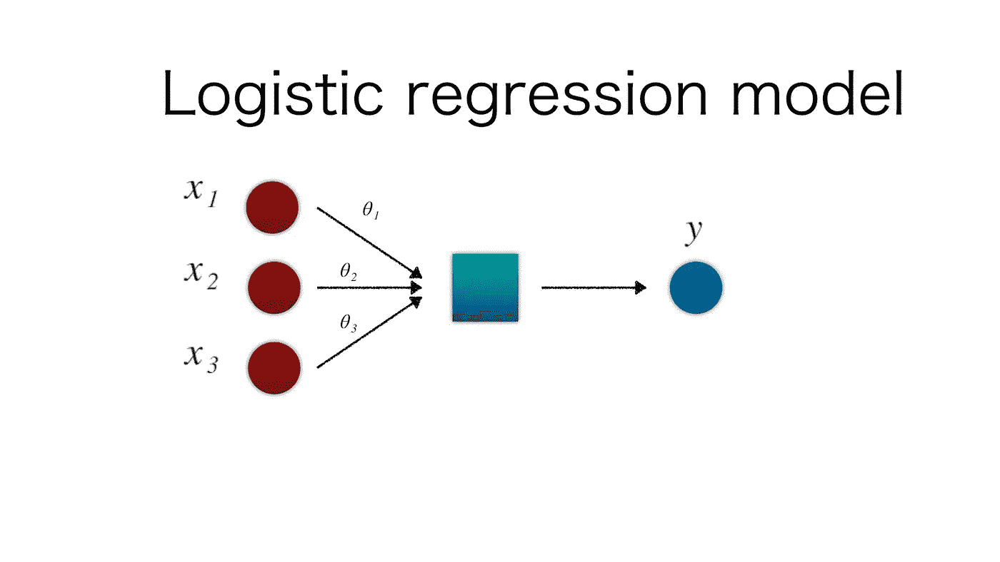

🌐**逻辑回归是最常见的分类算法之一。**

```
from sklearn.linear_model import LogisticRegression

logreg = LogisticRegression().fit(X_train, y_train)
print("Training set accuracy: **{:.3f}**".format(logreg.score(X_train, y_train)))
print("Test set accuracy: **{:.3f}**".format(logreg.score(X_test, y_test)))
```

## 🌐输出:

```
Training set accuracy: 0.781
Test set accuracy: 0.771
```

🌐**C = 1 的默认值在训练集上提供了 78%的准确率，在测试集上提供了 77%的准确率。**

```
**logreg1** = **LogisticRegression(C**=**0.01)**.**fit(X_train, y_train)
print("Training set accuracy: {:.3f}"**.**format(logreg1**.**score(X_train, y_train)))
print("Test set accuracy: {:.3f}"**.**format(logreg1**.**score(X_test, y_test)))**
```

## 🌐输出:

```
**Training set accuracy: 0.700
Test set accuracy: 0.703**
```

**🌐使用 C=0.01 会导致训练集和测试集的精确度都较低。**

```
**logreg100** = **LogisticRegression(C**=**100)**.**fit(X_train, y_train)
print("Training set accuracy: {:.3f}"**.**format(logreg100**.**score(X_train, y_train)))
print("Test set accuracy: {:.3f}"**.**format(logreg100**.**score(X_test, y_test)))**
```

## 🌐输出:

```
**Training set accuracy: 0.785
Test set accuracy: 0.766**
```

# 🌐逻辑回归的可视化

```
**diabetes_features** = **[x** for **i,x in enumerate(diabetes**.**columns)** if **i**!=**8]
plt**.**figure(figsize**=**(8,6))
plt**.**plot(logreg**.**coef_**.**T, 'o', label**=**"C=1")
plt**.**plot(logreg100**.**coef_**.**T, '^', label**=**"C=100")
plt**.**plot(logreg1**.**coef_**.**T, 'v', label**=**"C=0.001")
plt**.**xticks(range(diabetes**.**shape[1]), diabetes_features, rotation**=**90)
plt**.**hlines(0, 0, diabetes**.**shape[1])
plt**.**ylim(**-**5, 5)
plt**.**xlabel("Feature")
plt**.**ylabel("Coefficient magnitude")
plt**.**legend()**
```


# 🌐3.决策图表

**决策树**是一种决策支持工具，它使用决策及其可能结果的树状图形或模型，包括偶然事件结果、资源成本和效用。这是显示只包含条件控制语句的算法的一种方式。

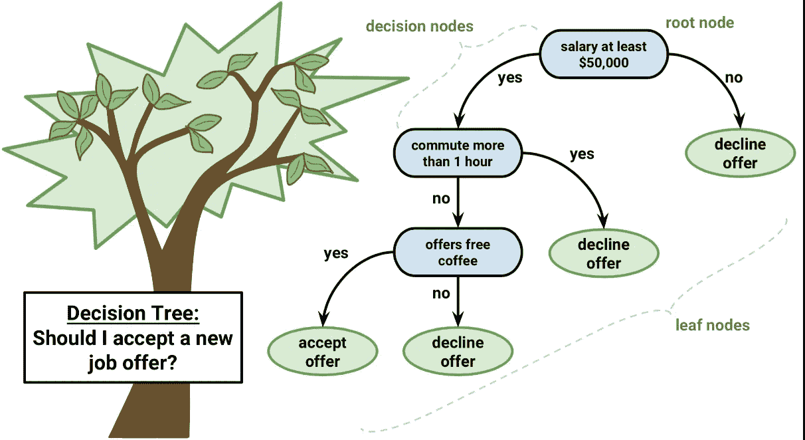

```
fromsklearn.treeimport **DecisionTreeClassifier

tree** = **DecisionTreeClassifier(random_state**=**0)
tree**.**fit(X_train, y_train)
print("Accuracy on training set: {:.3f}"**.**format(tree**.**score(X_train, y_train)))
print("Accuracy on test set: {:.3f}"**.**format(tree**.**score(X_test, y_test)))**
```

## 🌐输出:

```
**Accuracy on training set: 1.000
Accuracy on test set: 0.714**
```

## 🌐观察结果:

训练集的准确率为 100%，而测试集的准确率要差得多。这表明该树过拟合，不能很好地推广到新数据。因此，我们需要对树进行预修剪。

我们设置 max_depth=3，限制树的深度可以减少过度拟合。这导致训练集的精确度较低，但测试集的精确度有所提高。

```
**tree** = **DecisionTreeClassifier(max_depth**=**3, random_state**=**0)
tree**.**fit(X_train, y_train)
print("Accuracy on training set: {:.3f}"**.**format(tree**.**score(X_train, y_train)))
print("Accuracy on test set: {:.3f}"**.**format(tree**.**score(X_test, y_test)))**
```

## 🌐输出:

```
**Accuracy on training set: 0.773
Accuracy on test set: 0.740**
```

## 🌐决策树中的特征重要性


特征重要性评定每个特征对于树所做决策的重要性。对于每个特性，它是一个介于 0 和 1 之间的数字，其中 0 表示“根本没有使用”，1 表示“完美地预测了目标”特征重要性的总和总是 1:

```
**print("Feature importances:\n{}"**.**format(tree**.**feature_importances_))**
```

## 🌐输出:

```
**Feature importances:
[0.04554275 0.6830362  0\.         0\.         0\.         0.27142106
 0\.         0\.        ]**
```

## 🌐特征重要性的可视化

```
def **plot_feature_importances_diabetes(model):
    plt**.**figure(figsize**=**(8,6))
    n_features** = **8
    plt**.**barh(range(n_features), model**.**feature_importances_, align**=**'center')
    plt**.**yticks(np**.**arange(n_features), diabetes_features)
    plt**.**xlabel("Feature importance")
    plt**.**ylabel("Feature")
    plt**.**ylim(**-**1, n_features)

plot_feature_importances_diabetes(tree)**
```

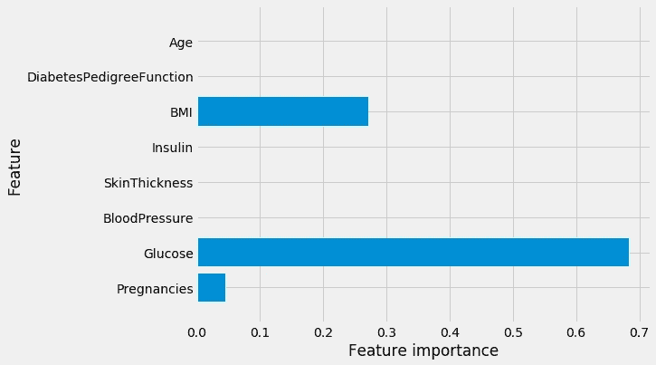

🌐观察:特性“葡萄糖”是迄今为止最重要的特性。

# 🌐4.随机森林


随机森林是一种灵活、易于使用的机器学习算法，即使没有超参数调整，在大多数情况下也能产生很好的结果。它也是最常用的算法之一，因为它简单，而且可以用于分类和回归任务。

**让我们在糖尿病数据集上应用一个由 100 棵树组成的随机森林:**

```
fromsklearn.ensembleimport **RandomForestClassifier
rf** = **RandomForestClassifier(n_estimators**=**100, random_state**=**0)
rf**.**fit(X_train, y_train)
print("Accuracy on training set: {:.3f}"**.**format(rf**.**score(X_train, y_train)))
print("Accuracy on test set: {:.3f}"**.**format(rf**.**score(X_test, y_test)))**
```

## 🌐输出:

```
**Accuracy on training set: 1.000
Accuracy on test set: 0.786**
```

观察:随机森林给了我们 78.6%的准确率，比逻辑回归模型或单一决策树要好。

```
**rf1** = **RandomForestClassifier(max_depth**=**3, n_estimators**=**100, random_state**=**0)
rf1**.**fit(X_train, y_train)
print("Accuracy on training set: {:.3f}"**.**format(rf1**.**score(X_train, y_train)))
print("Accuracy on test set: {:.3f}"**.**format(rf1**.**score(X_test, y_test)))**
```

## 🌐输出:

```
**Accuracy on training set: 0.800
Accuracy on test set: 0.755**
```

## 🌐随机森林中特征重要性的可视化

```
**plot_feature_importances_diabetes(rf)**
```

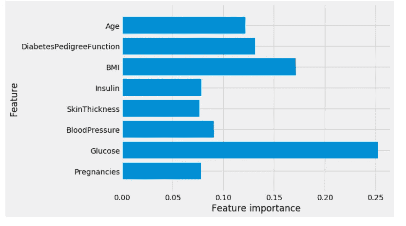

**🌐观察:**与单一决策树类似，随机森林也非常重视“葡萄糖”特征，但它也选择“身体质量指数”作为第二大信息特征。构建随机森林的随机性迫使算法考虑许多可能的解释，结果是随机森林比单棵树捕捉到更广泛的数据图像。

# 🌐5.梯度推进


**梯度推进**是一种用于回归和分类问题的机器学习技术，它以弱预测模型集合的形式产生预测模型，通常是决策树。它像其他 boosting 方法一样以分阶段的方式构建模型，并通过允许优化任意可微分损失函数来概括它们。

让我们应用梯度增强:

```
fromsklearn.ensembleimport **GradientBoostingClassifier
gb** = **GradientBoostingClassifier(random_state**=**0)
gb**.**fit(X_train, y_train)
print("Accuracy on training set: {:.3f}"**.**format(gb**.**score(X_train, y_train)))
print("Accuracy on test set: {:.3f}"**.**format(gb**.**score(X_test, y_test)))**
```

## 🌐输出:

```
**Accuracy on training set: 0.917
Accuracy on test set: 0.792**
```

再次使用**最大深度** = **1:** 应用梯度推进

```
**gb1** = **GradientBoostingClassifier(random_state**=**0, max_depth**=**1)
gb1**.**fit(X_train, y_train)
print("Accuracy on training set: {:.3f}"**.**format(gb1**.**score(X_train, y_train)))
print("Accuracy on test set: {:.3f}"**.**format(gb1**.**score(X_test, y_test)))**
```

## 🌐输出:

```
**Accuracy on training set: 0.804
Accuracy on test set: 0.781**
```

再次使用**learning _ rate**=**0.01:**应用梯度增强

```
**gb2** = **GradientBoostingClassifier(random_state**=**0, learning_rate**=**0.01)
gb2**.**fit(X_train, y_train)
print("Accuracy on training set: {:.3f}"**.**format(gb2**.**score(X_train, y_train)))
print("Accuracy on test set: {:.3f}"**.**format(gb2**.**score(X_test, y_test)))**
```

## 🌐输出:

```
**Accuracy on training set: 0.802
Accuracy on test set: 0.776**
```

🌐观察:降低模型复杂性的两种方法都降低了训练集的准确性，正如预期的那样。在这种情况下，这些方法都没有提高测试集的泛化性能。

## 🌐梯度增强中特征重要性的可视化

简短说明:即使我们对模型并不满意，我们也可以可视化特性的重要性，以便更深入地了解我们的模型。

```
**plot_feature_importances_diabetes(gb1)**
```

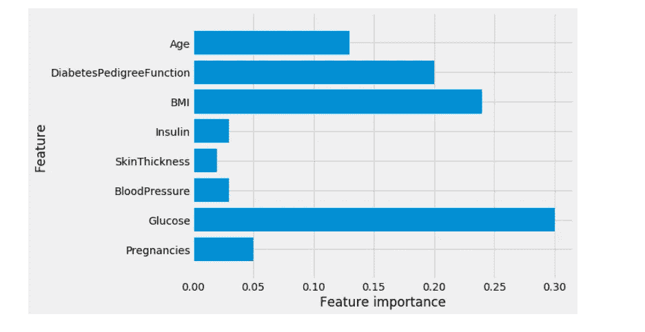

# 🌐可视化预测深度学习建模

# 🌐神经网络


神经网络使用大脑的处理作为基础来开发可用于模拟复杂模式和预测问题的算法。

让我们开始申请:

```
fromsklearn.neural_networkimport **MLPClassifier
mlp** = **MLPClassifier(random_state**=**42)
mlp**.**fit(X_train, y_train)
print("Accuracy on training set: {:.2f}"**.**format(mlp**.**score(X_train, y_train)))
print("Accuracy on test set: {:.2f}"**.**format(mlp**.**score(X_test, y_test)))**
```

## 🌐输出:

```
**Accuracy on training set: 0.71
Accuracy on test set: 0.67**
```

🌐观察:MLP 的准确性不如其他模型，这可能是由于数据的缩放。神经网络也期望所有输入特征以相似的方式变化，并且理想地具有 0 的平均值和 1 的方差。

现在应用来自神经网络的'**标准定标器'**:

```
fromsklearn.preprocessingimport **StandardScaler
scaler** = **StandardScaler()
X_train_scaled** = **scaler**.**fit_transform(X_train)
X_test_scaled** = **scaler**.**fit_transform(X_test)
mlp** = **MLPClassifier(random_state**=**0)
mlp**.**fit(X_train_scaled, y_train)
print("Accuracy on training set: {:.3f}"**.**format(
    mlp**.**score(X_train_scaled, y_train)))
print("Accuracy on test set: {:.3f}"**.**format(mlp**.**score(X_test_scaled, y_test)))**
```

## 🌐输出:

```
**Accuracy on training set: 0.823
Accuracy on test set: 0.802**
```

现在再次将**MLP classifier**与**“max _ ITER**=**1000”:**

```
**mlp** = **MLPClassifier(max_iter**=**1000, random_state**=**0)
mlp**.**fit(X_train_scaled, y_train)
print("Accuracy on training set: {:.3f}"**.**format(
    mlp**.**score(X_train_scaled, y_train)))
print("Accuracy on test set: {:.3f}"**.**format(mlp**.**score(X_test_scaled, y_test)))**
```

## 🌐输出:

```
**Accuracy on training set: 0.877
Accuracy on test set: 0.755**
```

再次应用“**MLP classifier”**与“**alpha**=**1”:**

```
**mlp** = **MLPClassifier(max_iter**=**1000, alpha**=**1, random_state**=**0)
mlp**.**fit(X_train_scaled, y_train)
print("Accuracy on training set: {:.3f}"**.**format(
    mlp**.**score(X_train_scaled, y_train)))
print("Accuracy on test set: {:.3f}"**.**format(mlp**.**score(X_test_scaled, y_test)))**
```

## 🌐输出:

```
**Accuracy on training set: 0.795
Accuracy on test set: 0.792**
```

# 🌐神经网络的虚拟化


## 🌐代码:

```
**plt**.**figure(figsize**=**(20, 5))
plt**.**imshow(mlp**.**coefs_[0], interpolation**=**'none', cmap**=**'viridis')
plt**.**yticks(range(8), diabetes_features)
plt**.**xlabel("Columns in weight matrix")
plt**.**ylabel("Input feature")
plt**.**colorbar()**
```

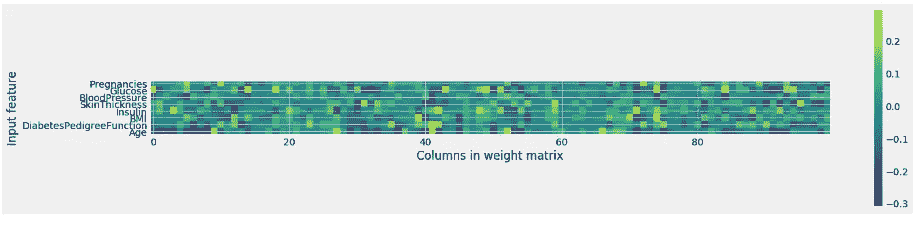

观察结果:

从热点图中，很难快速指出哪些要素与其他要素相比权重相对较低。

# 📘摘要


就这些。感谢阅读。:)

完整代码请访问 [Kaggle](https://www.kaggle.com/harunshimanto/ml-for-diabetes-from-bangladesh/notebook) 。

如果你喜欢这篇文章，然后给👏鼓掌。开心分析！