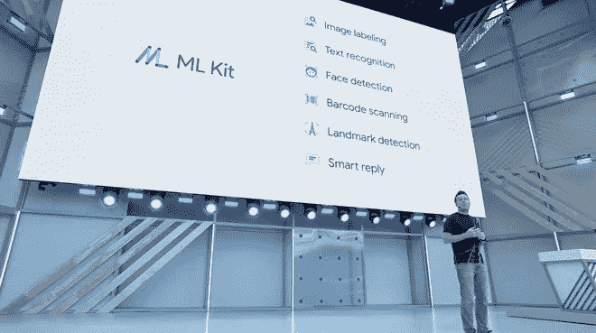

# ML 工具包:增强 Android 或 iOS 应用程序的功能

> 原文：<https://medium.com/hackernoon/ml-kit-boosting-capabilities-of-an-android-or-ios-app-45805f72a239>

在这个快速发展的世界中，构建智能的应用程序来处理基于用户的信息变得越来越有必要。机器学习按照提供给它的数据的方式工作，因此，它正在迅速成为应用程序开发中的一个重要工具。

谷歌在其 I/O 开发者大会上推出了 ML Kit(机器学习套件)。随着所有新的软件包，它是一个新的软件开发工具包(SDK)，适用于 iOS 和 Android 的应用程序开发人员。

因此，它允许开发人员将他们的应用程序与许多预先构建的谷歌提供的机器学习模型相集成。谈到这些型号，它们支持条形码扫描、文本识别、图像标记、人脸检测和地标识别。

需要注意的是，根据网络可用性和开发人员的偏好，这些模型有在线和离线两种选择。真正的游戏规则改变者是离线模式，允许开发者将它们集成到他们的应用程序中，并且他们可以免费使用。

**ML 套件重要性背后的原因**

ML 套件的重要性原因如下。从客户端来看，移动开发的知识会超过机器学习的知识。这意味着这是每个玩过 Firebase 的移动开发者的优势。

另一个原因是，当涉及到为常见任务预先构建的模型时，谷歌正在让机器学习更容易产生价值。由于这些原因，在未来几年，企业中将会有更多的机器学习开发。

除此之外，开发人员将更少依赖第三方框架来完成基本任务，如条形码读取等。

**特色**

ML Kit SDK 是一个全新的软件开发工具包，可以很容易地将 ML 模型集成到移动应用程序中。

不管你是新手还是有经验的程序员，你都应该知道 ML Kit 的基本特性，包括 5 个现成的 API。

ML 工具包的 API 为应用程序提供了以下能力:

识别文本

扫描条形码

识别地标

检测人脸

标签图像。

让我们了解更多关于 ML Kit 的信息。

**1。简化的**

与以前的流程相比，使用新的 ML Kit SDK，该流程得到了显著简化。重要的是，您应该知道如何将数据传递给 API，并等待 SDK 发送响应。

正如谷歌团队所说，实现他们的 API 不需要深入了解神经网络。开发人员只需要添加几行代码，就可以在你的应用中享受新功能。

**2。定制型号**

定制模型的这个选项对有经验的开发人员很有用。如果“基础”ML 工具包 API 不能满足开发者的需求，那么他们可以引入自己的 ML 模型。

因此，新的 ML Kit SDK 可以与 Tensor Flow、iOS 和 Android 机器学习库一起工作。因此，它为移动开发者提供了将他们自己的模型下载到 Firebase 控制台的可能性。

**3。云和设备上的 API**

开发者可以在基于云的 API 和基于设备的 API 之间进行选择。因此，考虑这两个选项之间的一些差异很重要。

谈到云 API，它在谷歌云平台上处理数据时，可以更准确地识别对象。但是，另一方面，与设备上的模型相比，云模型更大。

此外，脱机模型可以脱机工作，因为它们需要较少的可用空间。这就是为什么他们处理数据的速度更快，但准确性更低。

**4。跨平台**

谷歌在他们的会议上表示，他们的新 SDK 是跨平台的。这意味着开发人员可以在 iOS 和 Android 应用程序中添加 API。

因此，苹果核心产品 ML 的强劲竞争对手已经到来。但是可以体验到 CoreML 相对于 ML 套件还是有优势的。

ML Kit 最好的一点是，应用程序甚至可以在 Android 的旧版本(冰淇淋三明治)中运行。谷歌为搭载 Android 8.1 Oreo 等的设备提供了更好的性能。

**结束…**

虽然开始机器学习可能很难。但很容易想象机器学习在移动应用程序开发中有意义的场景。

随着技术的发展，世界变成了用户的输入设备。在许多零售和商业网点，条形码和文本识别之类的东西可以取代冗长、易错和烦人的文本输入表单。

机器学习是[增强现实](http://www.quytech.com/augmented-reality.php)背后的基础。因此，苹果和谷歌都将继续为与用户体验相关的最常见用例提供更好的解决方案。