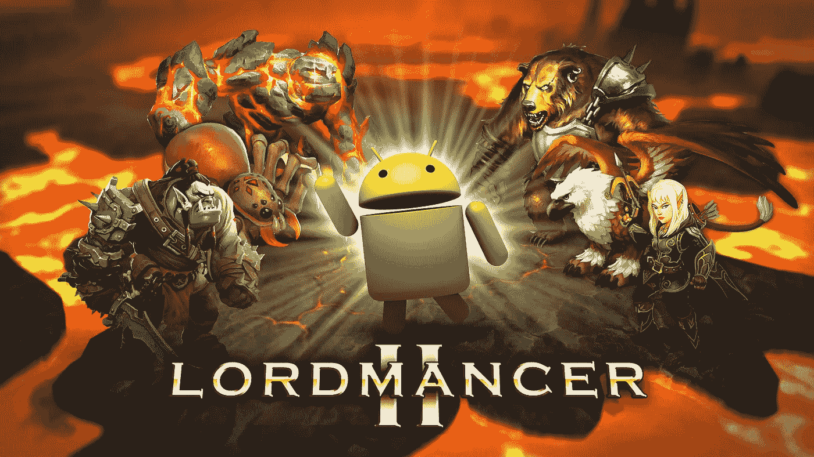
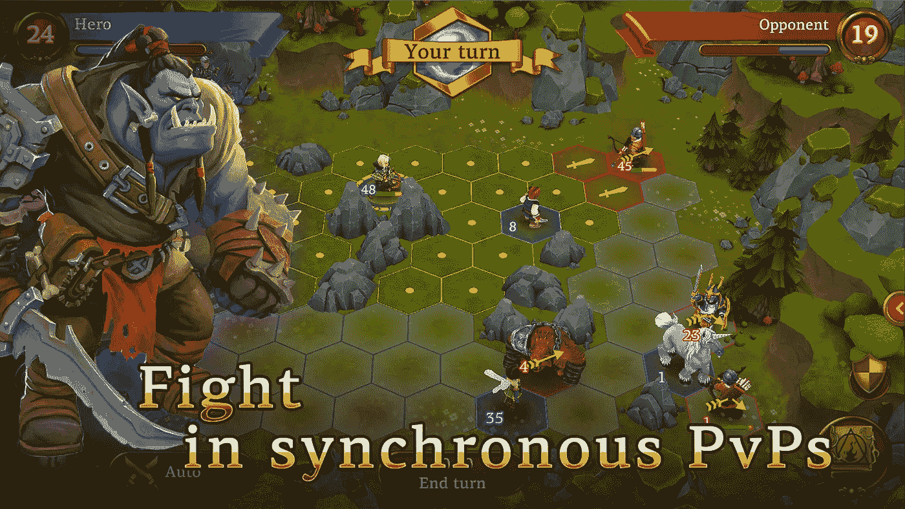
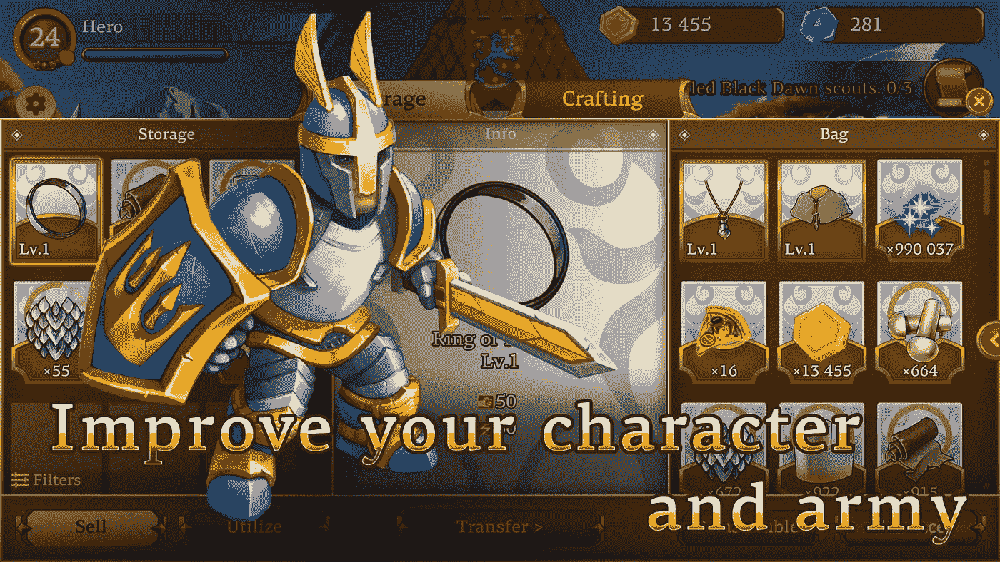
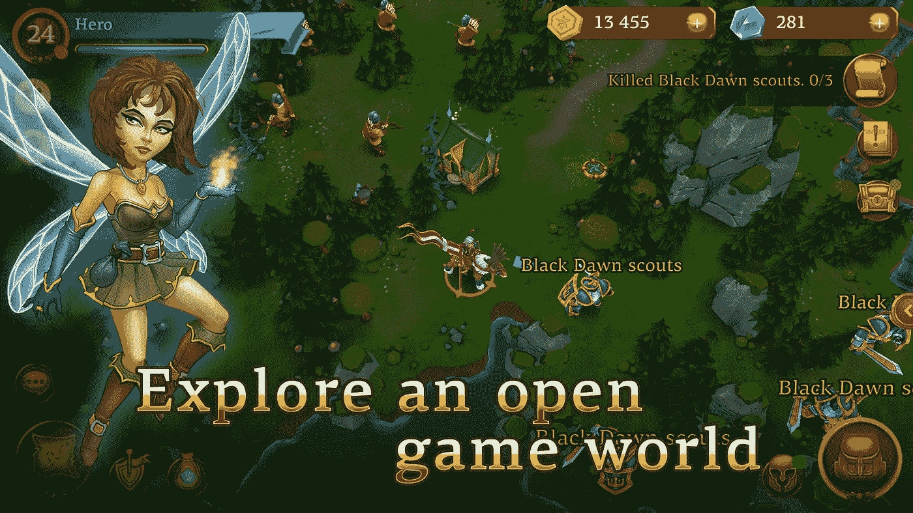

# 手机 MMORPG Lordmancer II 正式在安卓系统上推出

> 原文：<https://medium.com/hackernoon/mobile-mmorpg-lordmancer-ii-is-officially-launched-on-android-9c8dd1e91b42>

Lordmancer II 是一个功能齐全的开放世界游戏，在一个幻想的环境中，一个真实的 MMORPG，有多人 PvP 战术战斗，争夺领土和排名的氏族冲突。

Lordmancer II 有两个主要特点使其与众不同:

*   这是一个经典意义上的 MMORPG——同步 PvP 互动、开放的游戏世界、任务和部落；
*   它有一个开放的游戏市场，玩家可以使用游戏中的货币黄金或加密货币领主硬币作为支付方式。

意味着玩家甚至可以从游戏中赚到一些钱。玩家想在玩游戏的同时赚钱的愿望并不新鲜。

游戏中的真实货币交易一直是非法的，或者至少是被大多数游戏开发者强烈反对的，尤其是在 MMORPGs 中。巧合的是，在 MMORPG 真实货币交易是最常见的，因为这些游戏总是有虚拟经济，其中游戏“黄金”和其他资源有一些真实的价值。真钱交易可能是一笔大交易，已知最昂贵的交易是在一个名为“宇宙熵”的游戏中花费 600 万美元！

Lordmancer II 试图通过引入加密货币令牌作为第二种“硬通货”，使通常“非法”的游戏项目市场合法化。这款游戏有两种“硬通货”，称为主币(LC)和水晶，还有一种软货币，“黄金”。最稀有珍贵的武器和物品只能用领主币购买，领主币本质上是一种基于以太坊的加密货币代币。

Lordmancer II 鼓励其玩家在游戏中“耕种”稀有珍贵的武器和神器，并出售给其他玩家，在此过程中赚取 LC。这些信用证随后将在一个密码交易所为 BTC 或瑞士联邦理工学院出售。此外，玩家将被鼓励“培养”出售的角色。

不喜欢其他加密游戏，如加密猫，Lordmancer II 是一个真正的 MMORPG 第一。为了使这个过程更容易，玩家不需要在开始游戏前创建一个区块链钱包或购买加密货币。你可以下载游戏并开始玩。你甚至可以用主币卖掉一些东西，然后拿到你的游戏账户上。只有在万一你想提取主币，你会被要求做一个 KYC 程序，并创建一个以太坊钱包。

在 Lordmancer II 中，您可以免费与朋友一起玩，在战术回合制 PvP 和 PvE 战斗中战斗，探索开放的游戏世界，搜索稀有资源，制作和增强设备，与其他玩家进行交易！

阅读更多关于 https://lordmancer2.com 的信息

**下载 Lordmancer II 上** [**Google Play**](http://play.google.com/store/apps/details?id=ru.mobak.lordmancer2)

要使用主币，您需要前往[https://market.lordmancer2.com](https://market.lordmancer2.com)并使用您的游戏凭证进行授权。目前，你可以从任何以太坊钱包向你的游戏账户发送主币，几天后就可以提取主币了。你可以在以下密码交易所购买主币:[莱克](http://lykke.com/)、[以太德尔塔](https://etherdelta.com/#0xd7f82e36ef04c9543ce18e6d1072354a1b9d629c-ETH)和 [DEEX](https://www.deex.exchange/) 。

**加入我们的社区:**

*   不和谐服务器:[https://discord.gg/mCBJYvy](https://discord.gg/mCBJYvy)
*   电报:[https://t.me/lm2ico](https://t.me/lm2ico)
*   https://www.facebook.com/Lordmancer2/[脸书页面](https://www.facebook.com/Lordmancer2/)
*   https://twitter.com/LordmancerI