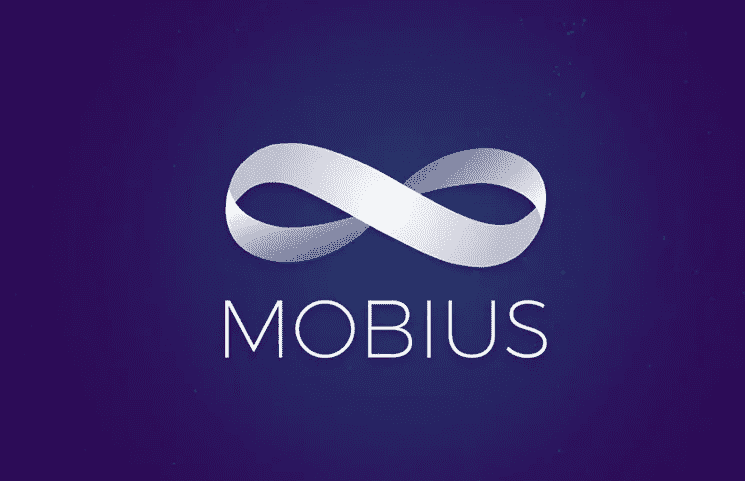

# Mobius Network 将帮助任何开发者成为区块链开发者

> 原文：<https://medium.com/hackernoon/mobius-network-will-help-any-developer-become-a-blockchain-developer-b39fd5f3837f>

**什么是莫比乌斯网络**

Mobius 是一个总部位于区块链的网络，旨在通过为开发人员提供创建自己的分散式应用程序(DApps)和 oracle 系统的能力，将数据流和日常应用程序连接到区块链，从而推动该技术成为主流。

区块链距离被广泛采用还有很长的路要走。这主要是由于缺乏与该技术相关的用户友好的应用程序和工具。另一个原因是，技术本身和用于设计和部署集成应用程序的开发工具都处于初级阶段，当前的技术不适合在全球范围内扩展。

然而，就像互联网在直观的图形用户界面出现之前没有起飞一样，在 Stripe 创建了接受在线信用卡支付的标准化协议之前，电子商务仍是一个未来的概念，区块链科技认为自己正处于同样的阶段，它也需要新一轮的工具和功能，使其更容易使用。

Mobius 允许任何软件开发人员成为区块链开发人员，为他们提供工具来创建新一代易于使用的应用程序，帮助弥合区块链技术与对新技术知之甚少的非技术专家用户之间的差距

通过这样做，Mobius 将通过发布一系列 API 来弥合 40 多亿互联网用户和区块链革命 150 亿美元的估计市场价值之间的差距，这些 API 有效地使任何开发人员能够轻松设计基于区块链的应用程序，这些应用程序可用于日常生活，而无需开发区块链专业知识。

# 关于莫比乌斯的有用的 DYOR 信息

**研究日期:** 15.05.18

**CoinMarketCap 网址:**[https://coinmarketcap.com/currencies/mobius/](https://coinmarketcap.com/currencies/mobius/)

**硬币名称:**莫比乌斯(MOBI)

总供应量: 887，990，859 MOBI

**流通供应量:** 376，657，502 MOBI

市值:41，733，275 美元

**Ico 价格:** $0.16 美元

通过 ICO 筹集的代币/资金:3900 万美元

**时区:**世界协调时 08:00

**白皮书:**https://docsend.com/view/ru9kz86

**令牌类型:**恒星

**莫比乌斯是如何工作的？**

Mobius 网络由几个不同的组件组成，每个组件都有能力破坏或至少进化出区块链固有的特定过程以及由此产生的加密市场。这些组件包括 Mobius 开发工具、DApp 商店、智能市场和促进系统内交易的 MOBI 令牌。

此外，Mobius 协议还采用了跨区块链标准，通过简单的 API 和开发人员框架来促进支付、登录和 oracle 管理。

**开发者工具和 API**

Mobius APIs 和工具旨在为开发人员提供创建自己的应用程序的能力，无需大量培训，有效地支持他们将任何应用程序设备或 oracle 数据流连接到区块链。

**活跃的 DApp 商店**
目前仍没有广泛使用的 DApp 商店，很像 Google Play 或苹果应用商店，用户可以在那里浏览和购买世界上大多数应用程序。Mobius 将通过开发一个通用的 DApp 商店来解决这个问题，该商店允许每个开发人员安全地分发和扩展跨区块链的应用程序，以便用户大量采用各种现实世界的应用程序。MVP 用例是该公司已经在运营的实时 DApp 商店，这是为开发者创造一种简化方法以接受应用内加密货币支付的第一步。

**区块链智能市场协议**

智能市场协议是 Mobius 的一项倡议，旨在创建一个无缝、分布式、超高效的市场，在这个市场中，各种数据提供商可以汇编数据，通过区块链的安全性进行传播和货币化。这将增加许多 rational 程序代理之间的微服务；换句话说，莫比乌斯区块链将提供一个分散的物联网市场，这是第一个此类市场，不仅为市场研究，也为人工智能应用的未来提供必要的数据。

**通用(MOBI)令牌协议**

该平台的 MOBI 令牌将为生态系统中的多个流程提供担保。令牌可用于表示成员资格，仅允许持有足够数量令牌的人访问特定级别的成员资格。这是通过一个简单的 REST API 完成的，该 API 需要令牌所有权验证以方便登录。这有几个好处，即增加匿名性，降低交易费用，以及发展二级市场的潜力，这可能为早期采用者提供额外的价值。

**全球治理协议**

该系统使用利益证明模型，该模型要求参与者投入一定数量的令牌以被授予对网络的维护和发展做出贡献的特权。

早期采用者和开发者将获得代币作为补偿，以鼓励网络的增长，并避免鸡生蛋的情况，即用户在更多应用程序可用之前不会访问商店，但如果没有用户购买，开发者就不太可能花时间开发这些应用程序。

授予的奖励金额取决于许多与社区反馈相关的因素。该团队(在他们的白皮书中)列出了深入的公式，精确地计算出参与的价值，以及在系统继续有机增长之前需要多少人参与。使用这些公式，团队可以根据需要增加/减少多少开发人员来充分推动平台的增长，从而调整奖励金额。

同样，那些向平台提供不充分、不正确或腐败信息的人将受到惩罚。该系统减少了垃圾邮件，并确保所有参与者以积极的方式做出贡献。

**现实世界应用**

就像 Stripe 系统通过创建一个接受所有信用卡和借记卡支付的通用接口来彻底改变在线支付一样，Mobius 的全球接口将使开发者能够使用任何区块链令牌进行交易，其中至少有 850 个(在发布时)，同时受益于大幅降低的交易。

除了在不同加密代币之间创建更流畅的交易的明显优势之外，该系统还促进了用户可以在 ERC20 游戏代币中交换的更简化的过程，该过程目前是复杂的，并且通常比它的价值更麻烦。

此外，基于 Mobius 网络构建的 DApps 将允许用户创建自己的 oracle 数据馈送，并将此馈送货币化。例如，位于特定区域的农民可以创建一个 oracle，该 Oracle 汇编来自每个农民地块的天气数据，并与希望购买这些信息的用户共享这些数据。

简而言之，该团队的大部分努力都是为了开发一个可以逐步分散整个全球应用经济的网络，同时将开发这些 dapp 的权力赋予那些以前从未面临机会的人。

# **社交媒体信息:**

**T5【脸书】T6**

网址:[https://www.facebook.com/mobiusnet](https://www.facebook.com/mobiusnet)

喜欢:2091

过去 7 天有多少帖子/更新:5 条最近更新

***推特***

网址:https://Twitter . com/Mobius _ network

追随者:9863 名追随者

过去 7 天有多少条推文/转发:12 条最近的转发/推文

***电报***

网址:https://t.me/mobius_network

用户:11624 名成员

***电报管理员***

用户名:Cyrus Khajvandi

用户名:@dgobaud

***Reddit***

网址:【https://www.reddit.com/r/MobiusNetwork/ 

读者:942 名读者

***中等***

网址:[https://medium.com/mobius-network](https://medium.com/mobius-network)

追随者:1500 名追随者

过去 7 天有多少次更新:3 次最近更新

***LinkedIn***

网址:[https://www.linkedin.com/company/mobiusnetwork/](https://www.linkedin.com/company/mobiusnetwork/)

关注者:148 人

***GitHub***

网址:[https://www.linkedin.com/company/mobiusnetwork/](https://www.linkedin.com/company/mobiusnetwork/)

过去 7 天有多少更新:最近没有更新

# **莫比乌斯团队信息:**

姓名:赛勒斯·s·哈杰万迪

生物:斯坦福大学生物科学荣誉学士

过去:Incentru 联合创始人兼首席执行官

Credo & BitBounce.io 的顾问

BTC 的早期采用者，ETH/C

国家科学基金会和 HHMI 研究员

姓名:大卫·s·戈博

生物:斯坦福大学，计算机科学学士

哈佛法学院法学博士

过去:联合创始人 Yoshi

白宫

y 组合

额外链接:https://Mobius . network/David _ go baud _ resume . pdf

姓名:莫尼斯·拉赫曼

生物:斯坦福大学计算与数学工程博士(休假中)

拍卖和市场设计、深度学习、大数据

过去:首席技术官，下一个 2%

普渡大学，计算机工程学士

姓名:李杰明

头衔:顾问

简历:HCM 资本(富士康科技集团)创始管理合伙人

连锁金融董事

FNConn 董事会董事

凯西董事会董事

姓名:杰德·麦卡勒

头衔:顾问

简历:Stellar.org 的联合创始人

Ripple 的联合创始人

电驴 2000 的创造者

姓名:钱德勒·郭

头衔:顾问

生物:比特币和区块链创业天使

中国最大的比特币矿商之一

40 多家交易所组成的网络

姓名:杰克逊·帕尔默

头衔:顾问

生物:Dogecoin 的创造者

姓名:丹尼尔·考瑞

头衔:顾问

简历:Pactum Capital 联合创始人兼首席执行官

公司地址:美国加州旧金山