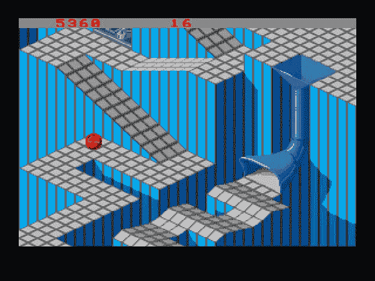
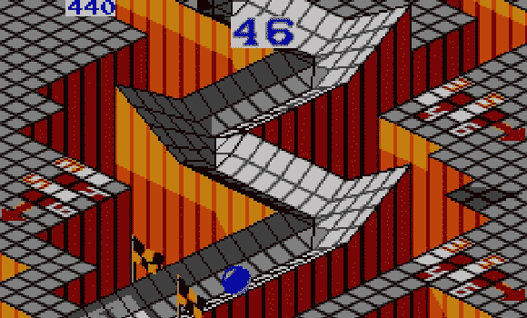

# MobX 可观察不等于 Rx 可观察

> 原文：<https://medium.com/hackernoon/mobx-observable-is-not-rx-observable-3cc9d17556>

以下两个表格显示了 MobX 可观察值和 Rx 可观察值之间的异同:

# 类似

Similarities

# 差异

Differences

# 另外:

[marble](http://rxmarbles.com/)

*   Vue.js 内部:计算属性如何工作:这是关于 [MobX](https://hackernoon.com/tagged/mobx) 、Vue 和 Meteor 如何工作的——它们都使用相同的巧妙技巧。
*   [你错过的反应式编程介绍](https://gist.github.com/staltz/868e7e9bc2a7b8c1f754):它实际上是关于如何使用[类似 Rx 的](https://hackernoon.com/tagged/rx-like)库。